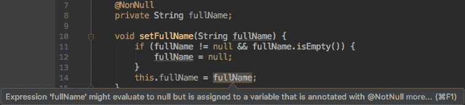
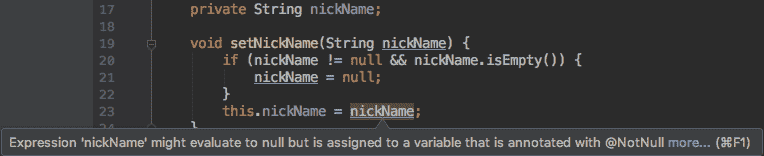
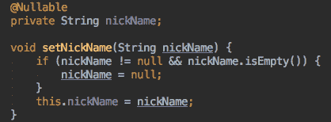
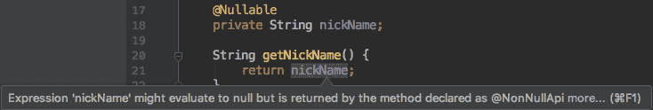

# Spring 空-安全注释

> 原文:[https://web . archive . org/web/20220930061024/https://www . bael dung . com/spring-null-safety-annotations](https://web.archive.org/web/20220930061024/https://www.baeldung.com/spring-null-safety-annotations)

## **1。概述**

从 Spring 5 开始，我们现在可以使用一个有趣的特性来帮助我们编写更安全的代码。这个特性被称为空安全，一组注释就像一种安全措施，监视潜在的空引用。

空安全特性并没有让我们逃脱不安全的代码，而是在编译时产生警告。这样的警告可以防止运行时灾难性的空指针异常(npe)。

## **2。`@NonNull`注解**

在空安全特性的所有注释中，`@NonNull`注释是最重要的。**我们可以使用这个注释在任何需要对象引用的地方声明非空约束:**字段、方法参数或方法返回值。

假设我们有一个名为`Person`的类:

```
public class Person {
    private String fullName;

    void setFullName(String fullName) {
        if (fullName != null && fullName.isEmpty()) {
            fullName = null;
        }
        this.fullName = fullName;
    }

    // getter
}
```

这个类定义是有效的，但是有一个缺陷——`fullName`字段可能被设置为`null`。如果发生这种情况，我们在与`fullName`合作时可能会以 NPE 告终。

弹簧零安全特性使工具能够报告这种危险。例如，如果我们在 IntelliJ IDEA 中编写代码并用`@NonNull`注释来修饰`fullName`字段，我们将会看到一个警告:

[](/web/20220827110142/https://www.baeldung.com/wp-content/uploads/2018/11/nonnul-annotation.png)

由于这个指示，我们提前意识到了问题，并能够采取适当的措施来避免运行时故障。

## **3。`@NonNullFields`注解**

`@NonNull`注释有助于保证空安全。然而，如果用这个注释修饰所有非空字段，我们将污染整个代码库。

我们可以用另一个注释——`@NonNullFields`来避免滥用`@NonNull`。**这个注释适用于包级别，通知我们的开发工具，带注释的包中的所有字段在默认情况下都是非空的。**

为了让`@NonNullFields`注释生效，我们需要在包的根目录下创建一个名为`package-info.java`的文件，并用`@NonNullFields`对包进行注释:

```
@NonNullFields
package org.baeldung.nullibility;
```

让我们在`Person`类中声明另一个名为`nickName`的属性:

```
package org.baeldung.nullibility;

// import statements

public class Person {
    private String nickName;

    void setNickName(@Nullable String nickName) {
        if (nickName != null && nickName.isEmpty()) {
            nickName = null;
        }
        this.nickName = nickName;
    }

    // other declarations
}
```

这一次，我们没有用`@NonNull`来修饰`nickName`字段，但是仍然可以看到类似的警告:

[](/web/20220827110142/https://www.baeldung.com/wp-content/uploads/2018/11/nonnullfields-annotation-3.png)

`@NonNullFields`注释使我们的代码不那么冗长，同时确保了与`@NonNull`相同的安全级别。

## **4。`@Nullable`注解**

`@NonNullFields`注释通常比`@NonNull`更可取，因为它有助于减少样板文件。有时，我们希望将一些字段排除在包级别指定的非空约束之外。

让我们回到中的`nickName`字段，并用`@Nullable`注释对其进行修饰:

```
@Nullable
private String nickName;
```

我们之前看到的警告现在消失了:

[](/web/20220827110142/https://www.baeldung.com/wp-content/uploads/2018/11/nullable-annotation.png)

在这种情况下，**我们使用了`@Nullable`注释来覆盖字段上`@NonNullFields`的语义。**

## **5。`@NonNullApi`注解**

顾名思义，`@NonNullFields`注释只适用于字段。**如果我们想对方法的参数和返回值产生同样的影响，我们需要`@NonNullApi`。**

与`@NonNullFields`一样，我们必须在`package-info.java`文件中指定`@NonNullApi`注释:

```
@NonNullApi
package org.baeldung.nullibility;
```

让我们为`nickName`字段定义一个 getter:

```
package org.baeldung.nullibility;

// import statements

public class Person {
    @Nullable
    private String nickName;

    String getNickName() {
        return nickName;
    }

    // other declarations
}
```

随着`@NonNullApi`注释的生效，发出一个关于由`getNickName`方法产生的可能的`null`值的警告:

[](/web/20220827110142/https://www.baeldung.com/wp-content/uploads/2018/11/nonnullapi-annotation.png)

注意，就像`@NonNullFields`注释一样，我们可以用`@Nullable`注释在方法级别覆盖`@NonNullApi`。

## **6。结论**

Spring 空安全是一个很好的特性，有助于减少 NPEs 的可能性。但是，在使用此功能时，有两点需要注意:

*   它只能在支持开发工具中使用，比如 IntelliJ IDEA
*   它不会在运行时强制执行`null`检查——我们仍然需要自己编写代码来避免 NPEs

本教程的源代码可以在 GitHub 上找到[。](https://web.archive.org/web/20220827110142/https://github.com/eugenp/tutorials/tree/master/spring-core-2)