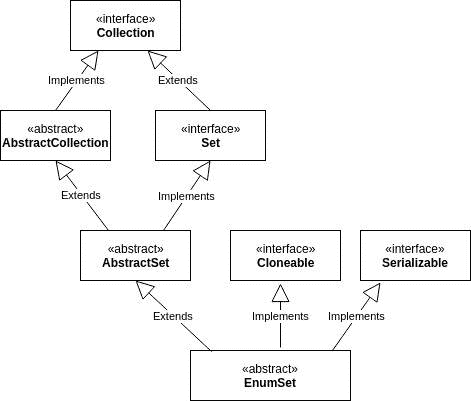
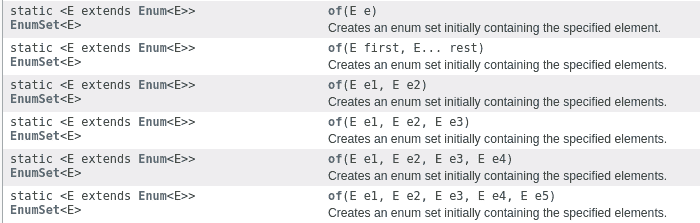

# 枚举集指南

> 原文：<https://web.archive.org/web/20220930061024/https://www.baeldung.com/java-enumset>

## ****1。**简介**

在本教程中，我们将探索来自`java.util` 包的`EnumSet`集合，并讨论它的特性。

我们将首先展示这个集合的主要特性，之后，我们将浏览这个类的内部结构，以便理解它的好处。

最后，我们将介绍它提供的主要操作，并实现一些基本示例。

## **2。什么是`EnumSet`**

**An `EnumSet`是一个专门的`Set`集合，与`enum`类**一起工作。它实现了`Set`接口，并从`AbstractSet`扩展而来:

[](/web/20221001012132/https://www.baeldung.com/wp-content/uploads/2018/10/EnumSet-1-2.jpg)

尽管`AbstractSet`和`AbstractCollection`为`Set`和`Collection`接口的几乎所有方法提供了实现，`EnumSet`覆盖了它们中的大部分。

当我们计划使用`EnumSet` 时，我们必须考虑一些要点:

*   **它只能包含`enum`个值**，并且所有值必须属于同一个`enum`
*   **它不允许添加空值**，抛出一个`NullPointerException`试图这样做
*   它不是线程安全的，所以如果需要，我们需要在外部同步它
*   **元素按照在`enum`** 中声明的顺序存储
*   **它使用一个失效保护迭代器**，它作用于一个副本，所以如果集合在迭代时被修改，它不会抛出一个`ConcurrentModificationException`

## **3。为什么用`EnumSet`**

根据经验，当我们存储`enum`值时， **`EnumSet`应该总是优先于任何其他的`Set`实现。**

在接下来的部分中，我们将看到是什么使这个集合比其他集合更好。为了做到这一点，我们将简要展示该类的内部结构，以便更好地理解。

### **3.1。实施细节**

`EnumSet`是一个`public` `abstract`类，包含多个静态工厂方法，允许我们创建实例。JDK 提供了两种不同的实现——分别是`package-private`,并由一个位向量支持:

*   `RegularEnumSet`和
*   `JumboEnumSet`

**`RegularEnumSet`用单个`long`来表示位向量。**`long`元素的每一位代表`enum`的一个值。枚举的第 I 个值将存储在第 I 位，因此很容易知道某个值是否存在。**因为`long`是 64 位数据类型，这个实现可以存储多达 64 个元素。**

另一方面， **`JumboEnumSet`使用`long`元素的数组作为位向量。** **这让这个实现存储超过 64 个元素。**它的工作方式与`RegularEnumSet`非常相似，但是做了一些额外的计算来寻找存储值的数组索引。

不出所料，数组的第一个长元素将存储`enum`的前 64 个值，第二个元素存储下一个 64 个值，依此类推。

`EnumSet`工厂方法根据`enum`的元素数量创建一个或另一个实现的实例:

```
if (universe.length <= 64)
    return new RegularEnumSet<>(elementType, universe);
else
    return new JumboEnumSet<>(elementType, universe);
```

请记住，它只考虑了`enum`类的大小，而没有考虑将存储在集合中的元素数量。

### **3.2。使用`EnumSet`** 的好处

由于我们上面描述的`EnumSet`的实现，**enum set 中的所有方法都是使用算术位运算实现的。**这些计算非常快，因此所有的基本操作都在恒定的时间内执行。

如果我们将`EnumSet`与其他`Set`实现如`HashSet`进行比较，第一个实现通常更快，因为值以可预测的顺序存储，并且每次计算只需要检查一位。与`HashSet`不同，不需要计算`hashcode`来找到合适的铲斗。

此外，由于位向量的性质，`EnumSet`非常紧凑和高效。因此，它使用更少的内存，并带来所有的好处。

## **4。主要操作**

除了创建实例的方法之外，`EnumSet`的大多数方法都像其他`Set`一样工作。

在接下来的部分中，我们将详细展示所有的创建方法，并简要介绍其余的方法。

在我们的例子中，我们将使用一个`Color` `enum`:

```
public enum Color {
    RED, YELLOW, GREEN, BLUE, BLACK, WHITE
}
```

### 4.1.创造方法

**创建`EnumSet`最简单的方法是`allOf()`和`noneOf()`。**这样我们可以很容易地创建一个包含所有`Color`枚举元素的`EnumSet`:

```
EnumSet.allOf(Color.class);
```

同样，我们可以使用`noneOf()`做相反的事情，创建一个空的`Color`集合:

```
EnumSet.noneOf(Color.class);
```

**如果我们想用`enum`元素的子集创建一个`EnumSet`，我们可以使用重载的`of()`方法**。区分具有固定数量参数(最多 5 个)的方法和使用`varargs`的方法很重要:

[](/web/20221001012132/https://www.baeldung.com/wp-content/uploads/2018/10/of-1.png)

Javadoc 声明由于数组的创建，`varargs`版本的性能可能比其他版本慢。因此，只有当我们最初需要添加 5 个以上的元素时，才应该使用它。

**创建`enum`子集的另一种方法是使用`range()`方法:**

```
EnumSet.range(Color.YELLOW, Color.BLUE);
```

在上面的例子中，`EnumSet`包含了从`Yellow`到`Blue.`的所有元素，它们遵循`enum`中定义的顺序:

```
[YELLOW, GREEN, BLUE]
```

请注意，它包括指定的第一个和最后一个元素。

**另一个有用的工厂方法是`complementOf()`，它允许我们排除作为参数**传递的元素。让我们用所有的`Color`元素创建一个`EnumSet`，除了黑色和白色:

```
EnumSet.complementOf(EnumSet.of(Color.BLACK, Color.WHITE));
```

如果我们打印这个集合，我们可以看到它包含所有其他元素:

```
[RED, YELLOW, GREEN, BLUE]
```

最后，**我们可以通过复制另一个`EnumSet` :** 中的所有元素来创建一个`EnumSet`

```
EnumSet.copyOf(EnumSet.of(Color.BLACK, Color.WHITE));
```

在内部，它调用`clone`方法。

此外，**我们还可以从任何包含`enum`元素**的`Collection`中复制所有元素。让我们用它来复制一个列表的所有元素:

```
List<Color> colorsList = new ArrayList<>();
colorsList.add(Color.RED);
EnumSet<Color> listCopy = EnumSet.copyOf(colorsList);
```

在这种情况下，`listCopy`只包含红色。

### **4.2。其他操作**

其余操作的工作方式与任何其他`Set`实现完全相同，在如何使用它们方面没有区别。

因此，我们可以很容易地创建一个空的`EnumSet`并添加一些元素:

```
EnumSet<Color> set = EnumSet.noneOf(Color.class);
set.add(Color.RED);
set.add(Color.YELLOW)
```

检查集合是否包含特定元素:

```
set.contains(Color.RED);
```

迭代元素:

```
set.forEach(System.out::println);
```

或者简单地删除元素:

```
set.remove(Color.RED);
```

当然，这是 a `Set`支持的所有其他操作中的一个。

## **5。结论**

在本文中，我们展示了`EnumSet`的主要特性、它的内部实现以及我们如何从使用它中获益。

我们还介绍了它提供的主要方法，并实现了一些示例来展示我们如何使用它们。

与往常一样，GitHub 上的[提供了示例的完整源代码。](https://web.archive.org/web/20221001012132/https://github.com/eugenp/tutorials/tree/master/core-java-modules/core-java-collections-set)