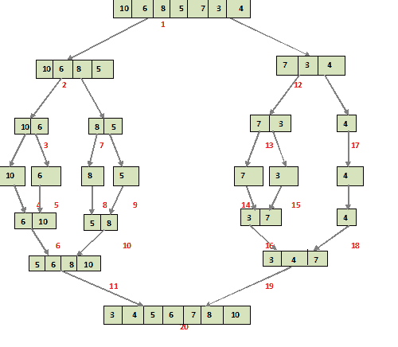

# Java 中的合并排序

> 原文：<https://web.archive.org/web/20220930061024/https://www.baeldung.com/java-merge-sort>

## 1.介绍

在本教程中，我们将看看**合并排序算法及其在 Java** 中的实现。

合并排序是最有效的排序技术之一，它基于[“分而治之”范式](/web/20220610033831/https://www.baeldung.com/cs/divide-and-conquer-strategy)。

## 2.该算法

合并排序是一种“分而治之”的算法，我们首先将问题分成子问题。当子问题的解准备好时，我们将它们组合在一起，以获得问题的最终解。

我们可以很容易地用递归实现这个算法，因为我们处理的是子问题而不是主问题。

我们可以将该算法描述为以下两步过程:

*   **Divide:在这一步，我们将输入数组分成两半**，轴心是数组的中点。对所有半数组递归地执行该步骤，直到不再有半数组要划分。
*   **征服:这一步，我们自下而上对划分后的数组**进行排序合并，得到排序后的数组。

下图显示了示例数组{10，6，8，5，7，3，4}的完整合并排序过程。

如果我们仔细看看这个图，我们可以看到数组被递归地分成两半，直到大小变为 1。一旦大小变为 1，合并进程就开始起作用，并在排序时开始合并数组:

## 3.履行

对于实现，**我们将编写一个`mergeSort`函数，它接受输入数组及其长度**作为参数。这将是一个递归函数，所以我们需要基底和递归条件。

基本条件检查数组长度是否为 1，它将返回。对于其余情况，将执行递归调用。

**对于递归情况，我们获取中间索引并创建两个临时数组`l[]`和`r[]`** 。然后我们为两个子数组递归调用`mergeSort`函数:

[PRE0]

**接下来，我们调用`merge`函数，它接受输入和两个子数组，以及两个子数组的开始和结束索引**。

**`merge`函数逐个比较两个子数组的元素，并将较小的元素放入输入数组。**

当我们到达其中一个子数组的末尾时，来自另一个数组的其余元素被复制到输入数组中，从而得到最终排序的数组:

[PRE1]

程序的单元测试是:

[PRE2]

## 4.复杂性

由于合并排序是一种递归算法，时间复杂度可以表示为以下递归关系:

[PRE3]

`2T(n/2)`对应于对子数组排序所需的时间，`O(n)`是合并整个数组的时间。

求解后，**的时间复杂度将达到`O(nLogn).`**

这适用于最坏、一般和最好的情况，因为它总是将数组一分为二，然后合并。

该算法的空间复杂度是`O(n),`,因为我们在每次递归调用中创建临时数组。

## 5.结论

在这篇简短的文章中，我们探讨了合并排序算法以及如何用 Java 实现它。

GitHub 上的[提供了完整的工作代码。](https://web.archive.org/web/20220610033831/https://github.com/eugenp/tutorials/tree/master/algorithms-modules/algorithms-sorting)