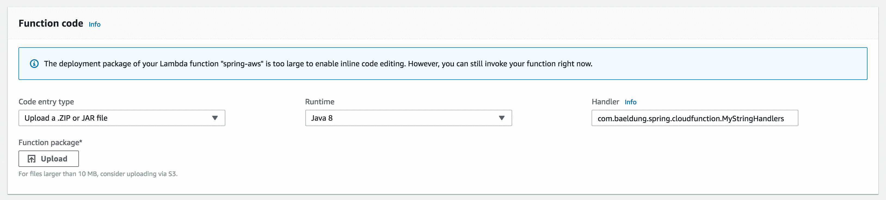
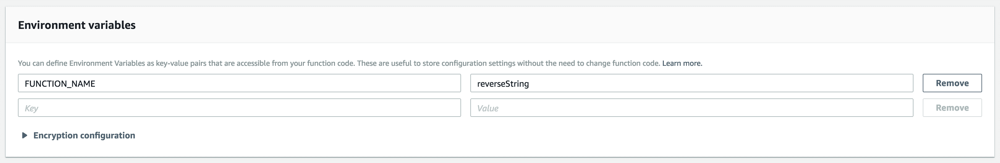
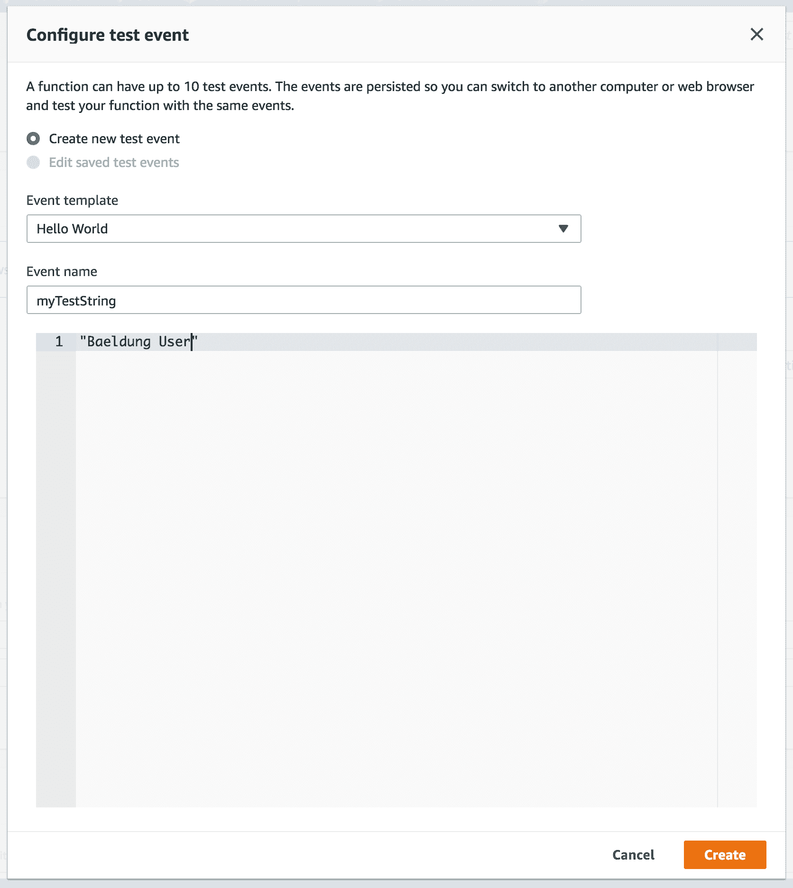
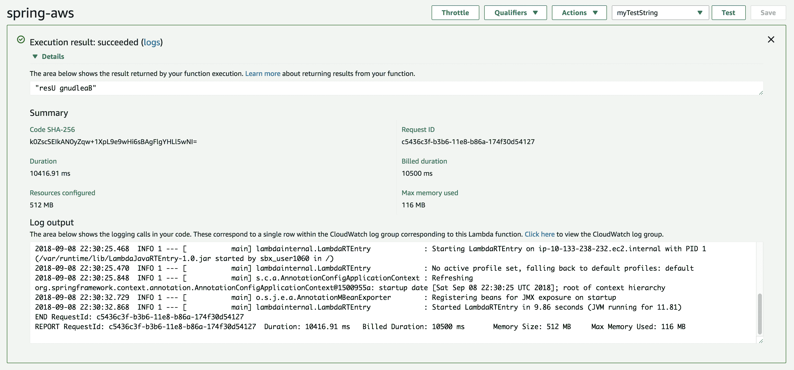
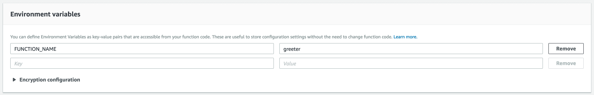

# 具有 Spring Cloud 功能的无服务器功能

> 原文：<https://web.archive.org/web/20220930061024/https://www.baeldung.com/spring-cloud-function>

## **1。简介**

在本教程中，我们将学习如何使用弹簧云函数。

我们将在本地构建并运行一个简单的 Spring Cloud 函数，然后将其部署到 AWS。

## **2。Spring Cloud 功能设置**

首先，让我们从头实现并使用不同的方法测试一个简单的项目，该项目有两个函数:

*   一个反向器，使用简单的方法
*   更好的是使用专用类

### **2.1。Maven 依赖关系**

我们首先需要做的是包含 [`spring-cloud-starter-function-web`](https://web.archive.org/web/20220525122810/https://search.maven.org/classic/#search%7Cga%7C1%7Cg%3A%22org.springframework.cloud%22%20AND%20a%3A%22spring-cloud-starter-function-web%22) 的依赖关系。这将充当我们的本地适配器，并带来在本地运行我们的功能所需的依赖关系:

[PRE0]

请继续关注，当我们部署到 AWS 时，我们会对此进行一些修改。

### **2.2。写弹簧云函数**

通过 Spring Cloud 函数，**我们可以将`Function`、`Consumer`或`Supplier` 类型的`@Bean`公开为单独的方法**:

[PRE1]

就像在这段代码中，我们可以将一个反向字符串特性公开为一个`Function`，我们的目标功能平台可以调用它。

### **2.3。本地测试反向字符串功能**

`spring-cloud-starter-function-web `将函数公开为 HTTP 端点。在我们运行了`CloudFunctionApplication`之后，我们可以卷曲我们的目标来本地测试它:

[PRE2]

**注意，端点是 bean 的名称。**

正如所料，我们得到了反转的字符串作为输出:

[PRE3]

### **2.4。扫描软件包中的 Spring Cloud 功能**

除了将我们的方法公开为一个`@Bean, `之外，我们还可以将我们的软件编写为实现函数接口`Function<T, R>`的类:

[PRE4]

然后我们可以在`application.properties`中指定要扫描相关 beans 的包:

[PRE5]

### **2.5。本地测试欢迎功能**

同样，我们可以启动应用程序并使用 curl 来测试`Greeter`函数:

[PRE6]

注意端点是实现函数接口的类的名字。

不出所料，我们得到了预期的问候:

[PRE7]

## **3。AWS 上的 Spring Cloud 功能**

Spring Cloud 功能如此强大的原因在于，我们可以构建与云无关的 Spring 功能。函数本身不需要知道它是如何被调用的，也不需要知道它被部署到哪个环境中。例如，**我们可以轻松地将这个欢迎器部署到 AWS、Azure 或 Google 云平台，而无需改变任何业务逻辑。**

由于 AWS Lambda 是流行的无服务器解决方案之一，让我们关注如何将我们的应用程序部署到其中。

所以，让我们不要再等了，把我们的功能部署到云上吧！

### **3.1。Maven 依赖关系**

还记得我们最初添加的`spring-cloud-starter-function-web`依赖项吗？现在是时候改变这种状况了。

看，根据我们要在哪里运行 Spring Cloud 函数，我们需要添加适当的依赖项。

对于 AWS，我们将使用 [`spring-cloud-function-adapter-aws`](https://web.archive.org/web/20220525122810/https://search.maven.org/classic/#search%7Cgav%7C1%7Cg%3A%22org.springframework.cloud%22%20AND%20a%3A%22spring-cloud-function-adapter-aws%22) :

[PRE8]

接下来，让我们添加处理 Lambda 事件所需的 AWS 依赖项:

[PRE9]

最后，因为我们要将 maven 构建生成的工件上传到 AWS Lambda，所以我们需要构建一个阴影工件，这意味着它将所有依赖项分解为单独的类文件，而不是 jar。

[`spring-boot-thin-layout`](https://web.archive.org/web/20220525122810/https://search.maven.org/classic/#search%7Cga%7C1%7Cg%3A%22org.springframework.boot.experimental%22%20AND%20a%3A%22spring-boot-thin-layout%22) 依赖项通过排除一些不需要的依赖项来帮助我们减少工件的大小:

[PRE10]

### **3.2。AWS 处理程序**

如果我们想通过 HTTP 请求再次暴露我们的字符串反向器，那么 Spring Cloud 函数 AWS 附带了`SpringBootRequestHandler.` ，它实现了 AWS 的`RequestHandler`，并负责将 AWS 请求分派给我们的函数。

[PRE11]

Spring Cloud Function AWS 还附带了`SpringBootStreamHandler`和`FunctionInvokingS3EventHandler`作为其他例子

**现在， `MyStringHandlers`只是一个空类，这似乎有点奇怪，但它在充当 Lambda 函数的入口点以及定义其输入和输出类型方面扮演着重要的角色**。

正如我们将在下面的截图中看到的，我们将在 AWS Lambda 配置页面的处理程序输入字段中提供该类的完全限定名称。

### **3.3。AWS 如何知道调用哪个云函数？**

事实证明，即使我们的应用程序中有多个 Spring Cloud 函数，AWS 也只能调用其中一个。

在下一节中，我们将在 AWS 控制台上名为`FUNCTION_NAME`的环境变量中指定云函数名称。

## **4。将功能上传至 AWS 并测试**

最后，让我们用 maven 构建我们的 jar，然后通过 AWS 控制台 UI 上传它。

### **4.1。在 AWS 控制台上创建一个 Lambda 函数并配置它**

在 AWS Lambda 控制台页面的 Function code 部分，我们可以选择一个 **Java 8** 运行时，然后简单地点击**上传**。

之后，我们需要在**处理程序**字段中指出实现`SpringBootRequestHandler`的类的全限定名，或者在我们的例子中是`com.baeldung.spring.cloudfunction.` `MyStringHandlers `:

然后在环境变量中，我们通过`FUNCTION_NAME `环境变量指出要调用哪个 Spring 函数 bean:

完成这些之后，是时候通过创建一个测试事件并提供一个示例字符串来测试 Lambda 函数了:

### **4.2。在 AWS 上测试功能**

现在，我们`Save`我们的测试，然后点击`Test`按钮。

正如所料，我们得到的输出与我们在本地测试该函数时得到的输出相同:

### **4.3。测试另一个功能**

记住，我们的应用程序中还有一个函数:`greeter`。让我们确保这也行得通。

我们将把`FUNCTION_NAME `环境变量改为`greeter`:

点击`Save`按钮，最后再次点击`Test`按钮:

## **5。结论**

总之，尽管还处于早期阶段，Spring Cloud Function 是一个强大的工具，可以将业务逻辑从任何特定的运行时目标中分离出来。

有了它，同样的代码可以作为 web 端点、在云平台上运行，或者作为流的一部分运行。它抽象出了所有的传输细节和基础设施，允许开发人员保留所有熟悉的工具和流程，并专注于业务逻辑。

像往常一样，在 GitHub 上查看本教程[的源代码。](https://web.archive.org/web/20220525122810/https://github.com/eugenp/tutorials/tree/master/spring-cloud/spring-cloud-functions)