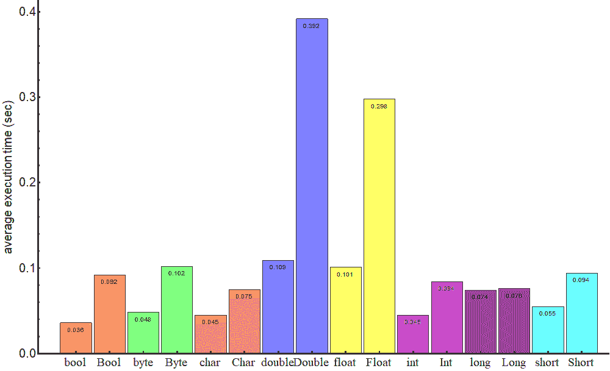

# Java 原语与对象

> 原文：<https://web.archive.org/web/20220930061024/https://www.baeldung.com/java-primitives-vs-objects>

## 1.概观

在本教程中，我们将展示使用 Java 原语类型及其包装副本的优缺点。

## 2.Java 类型系统

Java 有一个双重类型系统，由原语类型如`int`、`boolean`和引用类型如`Integer,`、`Boolean`组成。每个基本类型对应一个引用类型。

每个对象都包含一个相应原始类型的值。**包装类是不可变的**(因此一旦对象被构造，它们的状态就不能改变)并且是最终的(因此我们不能从它们继承)。

在幕后，如果实际类型与声明的类型不同，Java 会在基本类型和引用类型之间执行转换:

```
Integer j = 1;          // autoboxing
int i = new Integer(1); // unboxing 
```

将基元类型转换为引用类型的过程称为自动装箱，相反的过程称为取消装箱。

## 3.利弊

决定使用什么对象是基于我们试图达到的应用程序性能、我们有多少可用内存、可用内存的数量以及我们应该处理什么默认值。

如果我们没有面对这些，我们可能会忽略这些考虑，尽管了解它们是值得的。

### 3.1.单项内存占用

仅供参考，[原始类型变量](https://web.archive.org/web/20220816070645/https://docs.oracle.com/javase/tutorial/java/nutsandbolts/datatypes.html)对内存有以下影响:

*   布尔–1 位
*   字节–8 位
*   短字符–16 位
*   int，float–32 位
*   长型双 64 位

实际上，这些值可能会因虚拟机实施而异。在 Oracle 的 VM 中，例如 boolean 类型被映射到 int 值 0 和 1，所以它需要 32 位，如下所述:[原始类型和值](https://web.archive.org/web/20220816070645/https://docs.oracle.com/javase/specs/jvms/se7/html/jvms-2.html#jvms-2.3.4)。

这些类型的变量存在于堆栈中，因此可以快速访问。关于细节，我们推荐我们关于 Java 内存模型的教程。

引用类型是对象，它们位于堆上，访问起来相对较慢。相对于它们的原始对应物，它们有一定的开销。

开销的具体值通常是特定于 JVM 的。这里，我们展示了 64 位虚拟机的结果，参数如下:

```
java 10.0.1 2018-04-17
Java(TM) SE Runtime Environment 18.3 (build 10.0.1+10)
Java HotSpot(TM) 64-Bit Server VM 18.3 (build 10.0.1+10, mixed mode)
```

为了获得一个对象的内部结构，我们可以使用 [Java Object Layout](https://web.archive.org/web/20220816070645/https://openjdk.java.net/projects/code-tools/jol/) 工具(参见我们的另一个[教程](/web/20220816070645/https://www.baeldung.com/java-size-of-object)关于如何获得一个对象的大小)。

事实证明，除了`Long`和`Double`占用 192 位之外，这个 JVM 上引用类型的单个实例占用 128 位:

*   布尔–128 位
*   字节–128 位
*   短字符–128 位
*   整数，浮点–128 位
*   长型，双精度–192 位

我们可以看到一个`Boolean`类型的变量占用的空间多达 128 个本原变量，而一个`Integer`变量占用的空间多达四个`int`变量。

### 3.2.阵列的内存占用

如果我们比较一下所考虑类型的数组占用了多少内存，情况会变得更加有趣。

当我们用每种类型的不同数量的元素创建数组时，我们得到一个图:

[](/web/20220816070645/https://www.baeldung.com/wp-content/uploads/2018/08/plot-memory-bits.gif)

这表明，根据存储器`m(s)`如何依赖于数组元素 s 的数量，类型被分组为四类:

*   long，double: m(s) = 128 + 64 s
*   short，char: m(s) = 128 + 64 [s/4]
*   字节，布尔值:m(s) = 128 + 64 [s/8]
*   其余的:m(s) = 128 + 64 [s/2]

其中方括号表示标准上限函数。

令人惊讶的是，基本类型 long 和 double 的数组比它们的包装类`Long`和`Double`消耗更多的内存。

我们可以看到，**基元类型的单元素数组几乎总是比相应的引用类型**更昂贵(除了 long 和 double)。

### 3.3.表演

Java 代码的性能是一个非常微妙的问题，它在很大程度上取决于运行代码的硬件、可能执行某些优化的编译器、虚拟机的状态以及操作系统中其他进程的活动。

正如我们已经提到的，基本类型存在于栈中，而引用类型存在于堆中。这是决定对象访问速度的主要因素。

为了演示原始类型的操作比包装类的操作快多少，让我们创建一个 500 万元素的数组，其中除了最后一个元素，所有元素都是相等的；然后，我们对该元素执行查找:

```
while (!pivot.equals(elements[index])) {
    index++;
}
```

和比较当数组包含基元类型的变量时和当数组包含引用类型的对象时该操作的性能。

我们使用众所周知的 [JMH](https://web.archive.org/web/20220816070645/https://openjdk.java.net/projects/code-tools/jmh/) 基准测试工具(参见我们的[教程](/web/20220816070645/https://www.baeldung.com/java-microbenchmark-harness)关于如何使用它)，查找操作的结果可以总结在这个图表中:

[](/web/20220816070645/https://www.baeldung.com/wp-content/uploads/2018/08/plot-benchmark-primitive-wrapper-3.gif)

即使对于这样一个简单的操作，我们可以看到它需要更多的时间来执行包装类的操作。

在更复杂的运算中，如加法、乘法或除法，速度的差异可能会急剧上升。

### 3.4.默认值

原始类型的缺省值是数字类型的`0`(在相应的表示中，即`0`、`0.0d`等)，布尔类型的`false`，字符类型的`\u0000`。对于包装类，默认值是`null`。

这意味着基本类型可能只从它们的域中获取值，而引用类型可能获取某种意义上不属于它们的域的值(`null`)。

尽管不初始化变量被认为是一种好的做法，但有时我们可能会在变量创建后赋值。

在这种情况下，当一个原始类型变量的值等于它的类型默认值时，我们应该找出该变量是否已经真正初始化。

包装类变量不存在这样的问题，因为`null`值非常明显地表明变量还没有初始化。

## 4.使用

正如我们所见，基本类型要快得多，需要的内存也少得多。因此，我们可能更愿意使用它们。

另一方面，当前的 Java 语言规范不允许在参数化类型(泛型)、Java 集合或反射 API 中使用基元类型。

当我们的应用程序需要包含大量元素的集合时，我们应该考虑使用尽可能“经济”类型的数组，正如上面的图表所示。

## 5.结论

在本教程中，我们说明了 Java 中的对象比它们的原始类似物速度更慢，内存影响更大。

和往常一样，代码片段可以在 GitHub 的[库中找到。](https://web.archive.org/web/20220816070645/https://github.com/eugenp/tutorials/tree/master/core-java-modules/core-java-lang-2)