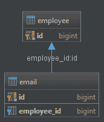
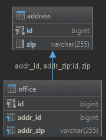

# @JoinColumn 批注已解释

> 原文：<https://web.archive.org/web/20220930061024/https://www.baeldung.com/jpa-join-column>

## 1。概述

注释`javax.persistence.JoinColumn`将一列标记为实体关联或元素集合的连接列。

在这个快速教程中，我们将展示一些基本`@JoinColumn`用法的例子。

## 2。`@OneToOne`映射示例

结合了`@OneToOne`映射的`@JoinColumn`注释表示所有者实体中的给定列引用了引用实体中的主键:

```
@Entity
public class Office {
    @OneToOne(fetch = FetchType.LAZY)
    @JoinColumn(name = "addressId")
    private Address address;
}
```

上面的代码示例将创建一个外键，将`Office`实体与来自`Address`实体的主键链接起来。`Office`实体中的外键列的名称由`name`属性指定。

## 3。`@OneToMany`映射示例

当使用`@OneToMany`映射时，我们可以使用`mappedBy`参数来指示给定的列属于另一个实体:

```
@Entity
public class Employee {

    @Id
    private Long id;

    @OneToMany(fetch = FetchType.LAZY, mappedBy = "employee")
    private List<Email> emails;
}

@Entity
public class Email {

    @ManyToOne(fetch = FetchType.LAZY)
    @JoinColumn(name = "employee_id")
    private Employee employee;
}
```

在上面的例子中，`Email`(所有者实体)有一个存储 id 值的连接列`employee_id`，并有一个指向`Employee`实体的外键。

[](/web/20220626073216/https://www.baeldung.com/wp-content/uploads/2018/08/joincol1.png)

## 4。`@JoinColumns`

当我们想要创建多个连接列时，我们可以使用`@JoinColumns`注释:

```
@Entity
public class Office {
    @ManyToOne(fetch = FetchType.LAZY)
    @JoinColumns({
        @JoinColumn(name="ADDR_ID", referencedColumnName="ID"),
        @JoinColumn(name="ADDR_ZIP", referencedColumnName="ZIP")
    })
    private Address address;
} 
```

上面的例子将创建两个外键，分别指向`Address`实体中的`ID`和`ZIP`列:

[](/web/20220626073216/https://www.baeldung.com/wp-content/uploads/2018/08/joincol2.png)

## 5。结论

在本文中，我们学习了如何使用`@JoinColumn`注释。我们研究了如何创建单个实体关联和元素集合。

和往常一样，GitHub 上的所有源代码[都是可用的。](https://web.archive.org/web/20220626073216/https://github.com/eugenp/tutorials/tree/master/persistence-modules/hibernate-annotations)