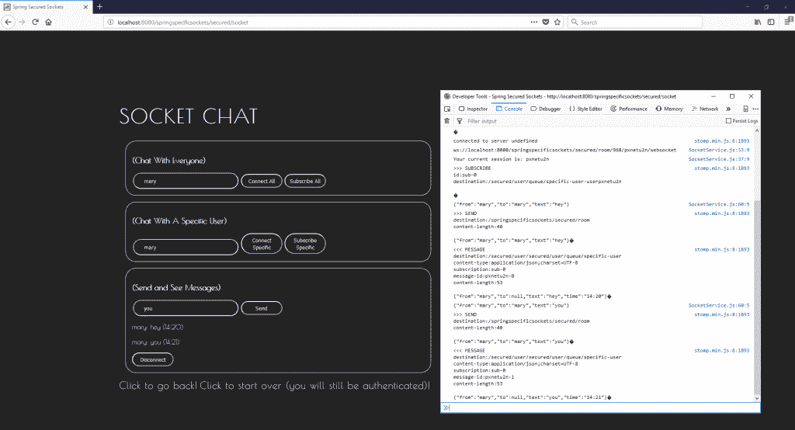
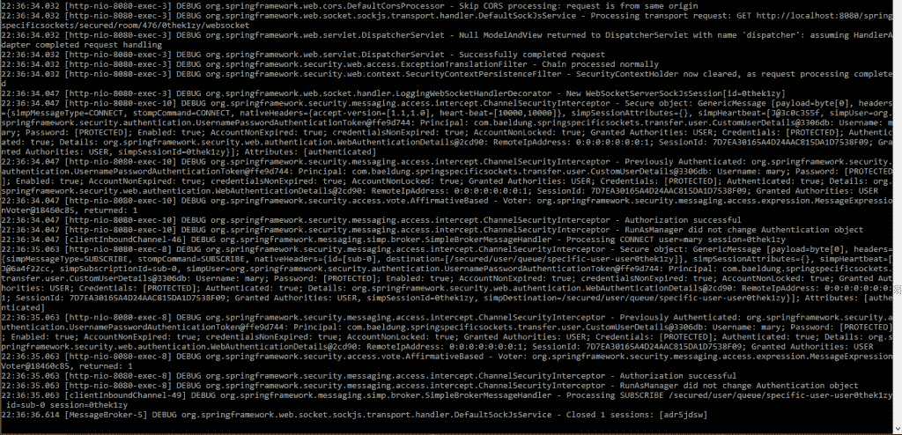

# Spring WebSockets:向特定用户发送消息

> 原文：<https://web.archive.org/web/20220930061024/https://www.baeldung.com/spring-websockets-send-message-to-user>

## **1。简介**

在本教程中，我们将描述如何使用 Spring WebSockets 向单个用户发送 STOMP 消息。这很重要，因为我们有时不想向每个用户广播每条消息。除此之外，我们将演示如何以安全的方式发送这些消息。

关于 WebSockets 的介绍，请查看[这篇](/web/20220617075807/https://www.baeldung.com/websockets-spring)很棒的教程，了解如何启动和运行。为了更深入地了解安全性，请查看[这篇](/web/20220617075807/https://www.baeldung.com/spring-security-websockets)文章来保护您的 WebSockets 实现。

## **2。队列、主题和端点**

使用 Spring WebSockets 和 STOMP，有三种主要方式来说明消息被发送到哪里以及它们如何订阅到:

1.  **话题**–对任何客户端或用户开放的常见对话或聊天话题
2.  **队列**–为特定用户及其当前会话保留
3.  **端点**–通用端点

现在，让我们快速看一下每个示例的上下文路径:

*   "/主题/电影"
*   "/用户/队列/特定用户"
*   "/安全/聊天"

需要注意的是**我们必须使用队列向特定用户发送消息，因为主题和端点不支持这种功能**。

## **3。配置**

现在，让我们学习如何配置我们的应用程序，以便我们可以向特定用户发送消息:

[PRE0]

**让我们确保包含一个用户目的地，因为它决定了哪些端点是为单个用户保留的。**

我们还为所有的队列和用户目的地加上前缀 `“/secured”` ,使它们需要认证。对于未受保护的端点，我们可以丢弃`“/secured”`前缀(作为我们其他安全设置的结果)。

从`pom.xml`的角度来看，不需要额外的依赖。

## **4。URL 映射**

我们希望我们的客户端使用符合以下模式的 URL 映射来订阅队列:

[PRE1]

这个映射将由`UserDestinationMessageHandler`自动转换成用户会话特定的地址。

例如，如果我们有一个名为`“user123”`的用户，对应的地址应该是:

[PRE2]

在服务器端，我们将使用以下 URL 映射模式发送特定于用户的响应:

[PRE3]

这也将被转换成正确的 URL 映射，我们已经订阅了客户端。

因此，我们看到**这里的基本成分是双重的:**

1.  前置我们指定的用户目的地前缀(在`AbstractWebSocketMessageBrokerConfigurer`中配置)。
2.  在映射中的某处使用`“/queue”`。

在下一节中，我们将看看具体如何做到这一点。

## **5。援引`convertAndSendToUser()`**

我们可以从`SimpMessagingTemplate` 或`SimpMessageSendingOperations`非静态地调用 `convertAndSendToUser()`:

[PRE4]

你可能已经注意到了:

[PRE5]

**`@Header`注释允许访问入站消息公开的头。**例如，我们可以抓取当前的`sessionId`而不需要复杂的拦截器。同样，**我们可以通过`Principal`访问当前用户。**

重要的是，我们在本文中采用的方法在 URL 映射方面提供了比`@sendToUser`注释更好的定制。关于这个注解的更多信息，请查看[这篇](/web/20220617075807/https://www.baeldung.com/spring-websockets-sendtouser)的伟大文章。

在客户端，我们将使用 JavaScript 中的`connect()`来**初始化 SockJS 实例，并使用 STOMP:** 连接到我们的 WebSocket 服务器

[PRE6]

我们还访问提供的`sessionId`，并将其附加到“ `secured/room` `“` URL 映射中。**这使我们能够动态和手动地提供特定于用户的订阅队列:**

[PRE7]

一旦一切就绪，我们应该会看到:

在我们的服务器控制台中:

## **6。结论**

查看官方 Spring [博客](https://web.archive.org/web/20220617075807/https://assets.spring.io/wp/WebSocketBlogPost.html)和[官方文档](https://web.archive.org/web/20220617075807/https://docs.spring.io/spring-framework/docs/4.3.x/spring-framework-reference/html/websocket.html)以获得关于这个话题的更多信息。

和往常一样，本文中使用的代码示例可以从 GitHub 上的[处获得。](https://web.archive.org/web/20220617075807/https://github.com/eugenp/tutorials/tree/master/spring-security-modules/spring-security-web-sockets)