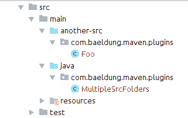

# 具有多个源目录的 Maven 项目

> 原文:[https://web . archive . org/web/20220930061024/https://www . bael dung . com/maven-project-multiple-src-directory](https://web.archive.org/web/20220930061024/https://www.baeldung.com/maven-project-multiple-src-directories)

## **1。简介**

我们有时需要在一个 Java 项目中使用多个源目录。一个常见的例子是自动生成的类放在不同的目录中。

在这篇短文中，我们将展示如何**设置 Maven 来使用额外的源目录**。

## **2。添加另一个源目录**

假设我们已经创建了一个 Maven 项目，让我们在`src/main`文件夹中添加一个名为`another-src`的新的源目录。

之后，让我们在这个文件夹中创建一个简单的 Java 类:

```
public class Foo {
    public static String foo() {
        return "foo";
    }
}
```

现在让我们在我们的`src/main/java`目录中创建另一个类，它使用我们刚刚创建的`Foo`类:

```
public class MultipleSrcFolders {
    public static void callFoo() {
        Foo.foo();
    }    
}
```

我们的项目结构现在看起来像这样:

[](/web/20221206130230/https://www.baeldung.com/wp-content/uploads/2018/08/maven.png)

**如果我们试图用 Maven 编译这个项目，我们会得到一个编译错误**,因为项目中没有包含`Foo`类:

```
[ERROR] .../MultipleSrcFolders.java:[6,9] cannot find symbol
[ERROR]   symbol:   variable Foo
[ERROR]   location: class com.baeldung.maven.plugins.MultipleSrcFolders
```

## **3。使用`Builder Helper`插件**

有了 Maven，我们可以使用`Builder Helper`插件来添加更多的源目录。这个插件让我们以不同的方式定制构建生命周期。

**它的目标之一是`add-sources`，目的是在`generate-sources`阶段向项目添加更多的 src 目录。**

通过将它添加到我们的`pom.xml`中，我们可以在我们的项目中使用它:

```
<plugin>
    <groupId>org.codehaus.mojo</groupId>
    <artifactId>build-helper-maven-plugin</artifactId>
    <version>3.0.0</version>
    <executions>
        <execution>
            <phase>generate-sources</phase>
            <goals>
                <goal>add-source</goal>
            </goals>
            <configuration>
                <sources>
                    <source>src/main/another-src</source>
                </sources>
            </configuration>
        </execution>
    </executions>
</plugin>
```

最新版本的插件可以在 [Maven Central](https://web.archive.org/web/20221206130230/https://search.maven.org/classic/#search%7Cgav%7C1%7Ca%3A%22build-helper-maven-plugin%22) 中找到。

如果我们现在编译我们的项目，构建就会成功。

## **4。结论**

在本文中，我们已经看到了如何设置`Builder Helper` Maven 插件，以便在一个 Maven 项目中使用多个 src 目录。

与往常一样，GitHub 上的[提供了示例的完整源代码。](https://web.archive.org/web/20221206130230/https://github.com/eugenp/tutorials/tree/master/maven-modules/maven-multi-source)