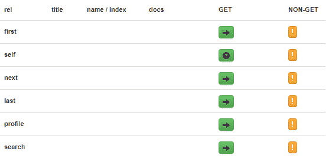
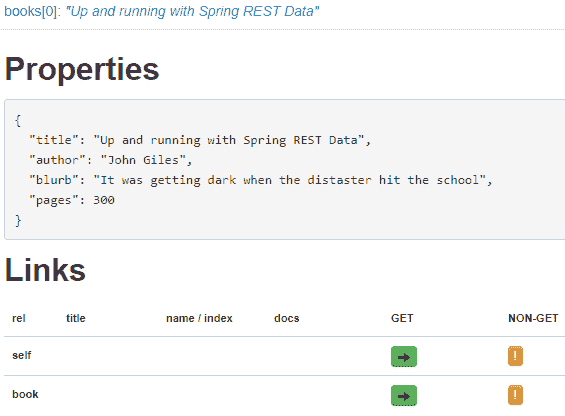
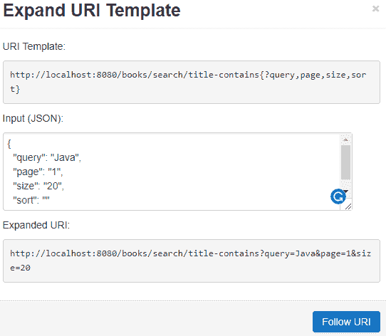

# Spring REST 和 HAL 浏览器

> 原文：<https://web.archive.org/web/20220930061024/https://www.baeldung.com/spring-rest-hal>

## 1.概观

在本教程中，在介绍 HAL 浏览器之前，我们将讨论**什么是 HAL 以及它为什么有用。**

然后，我们将使用 Spring 构建一个带有一些有趣端点的简单 REST API，并用一些测试数据填充我们的数据库。

最后，使用 HAL 浏览器，我们将探索 REST API 并发现如何遍历其中包含的数据。

## 2.哈尔和哈尔浏览器

JSON 超文本应用语言或 HAL 是一种简单的格式，**为我们的 API** 中的资源之间的超链接提供了一种一致且简单的方式。在我们的 REST API 中包含 HAL 使得用户更容易探索，并且本质上是自文档化的。

它的工作原理是以 JSON 格式返回数据，概述 API 的相关信息。

HAL 模型围绕着两个简单的概念。

`Resources,`其中包含:

*   相关 URIs 的链接
*   嵌入式资源
*   状态

`Links:`

*   目标 URI
*   与链接的关系或相对关系
*   其他一些可选属性有助于折旧、内容协商等

HAL 浏览器是由开发 HAL 的同一个人创建的，**提供了一个浏览器内 GUI 来遍历 REST API** 。

我们现在将构建一个简单的 REST API，插入 HAL 浏览器并探索其特性。

## 3.属国

下面是将 HAL 浏览器集成到我们的 REST API 中所需的单一依赖项。您可以在 [GitHub 代码](https://web.archive.org/web/20220630011921/https://github.com/eugenp/tutorials/blob/master/persistence-modules/spring-data-rest/pom.xml)中找到 API 的其余依赖项。

首先，[基于 Maven 的项目的依赖关系](https://web.archive.org/web/20220630011921/https://search.maven.org/classic/#search%7Cgav%7C1%7Cg%3A%22org.springframework.data%22%20AND%20a%3A%22spring-data-rest-hal-browser%22):

```
<dependency>
    <groupId>org.springframework.data</groupId>
    <artifactId>spring-data-rest-hal-explorer</artifactId>
    <version>3.4.1.RELEASE</version>
</dependency>
```

如果您使用 Gradle 进行构建，您可以将这一行添加到您的`build.gradle `文件中:

```
compile group: 'org.springframework.data', name: 'spring-data-rest-hal-explorer', version: '3.4.1.RELEASE'
```

## 4.构建一个简单的 REST API

### 4.1.简单数据模型

在我们的例子中，我们将建立一个简单的 REST API 来浏览图书馆中的不同书籍。

这里，我们定义了一个简单的 book 实体，它包含适当的注释，这样我们就可以用 Hibernate 持久化数据:

```
@Entity
public class Book {

  @Id
  @GeneratedValue(strategy = GenerationType.IDENTITY)
  private long id;

  @NotNull
  @Column(columnDefinition = "VARCHAR", length = 100)
  private String title;

  @NotNull
  @Column(columnDefinition = "VARCHAR", length = 100)
  private String author;

  @Column(columnDefinition = "VARCHAR", length = 1000)
  private String blurb;

  private int pages;

  // usual getters, setters and constructors

}
```

### 4.2.介绍 CRUD 存储库

接下来，我们需要一些端点。为此，我们可以**利用** `**PagingAndSortingRepository** `并指定我们想要从我们的`Book `实体获取数据。

这个类**提供了简单的 CRUD 命令，以及开箱即用的分页和排序功能**:

```
@Repository
public interface BookRepository extends PagingAndSortingRepository<Book, Long> {

    @RestResource(rel = "title-contains", path="title-contains")
    Page<Book> findByTitleContaining(@Param("query") String query, Pageable page);

    @RestResource(rel = "author-contains", path="author-contains", exported = false)
    Page<Book> findByAuthorContaining(@Param("query") String query, Pageable page);
}
```

如果这看起来有点奇怪，或者如果你想了解更多关于 Spring 仓库的信息，你可以在这里阅读更多的。

我们通过添加两个新的端点来扩展存储库:

*   `findByTitleContaining – `返回标题中包含查询的书籍
*   `findByAuthorContaining –`从图书作者包含查询的数据库中返回图书

注意，我们的**第二个端点包含了`export = false `属性**。这个属性**停止为这个端点**生成 HAL 链接，并且不能通过 HAL 浏览器使用。

最后，当 Spring 启动时，我们将通过定义一个实现`ApplicationRunner`接口的类来加载我们的数据。你可以在 [GitHub](https://web.archive.org/web/20220630011921/https://github.com/eugenp/tutorials/blob/master/persistence-modules/spring-data-rest-2/src/main/java/com/baeldung/halbrowser/config/DBLoader.java) 上找到代码。

## 5.安装 HAL 浏览器

用 Spring 构建 REST API 时，HAL 浏览器的设置非常简单。只要我们有依赖关系，Spring 就会自动配置浏览器，并通过默认端点使其可用。

我们现在需要做的就是点击运行，切换到浏览器。HAL 浏览器将于`http://localhost:8080/`可用

## 6.用 HAL 浏览器探索 REST API

HAL 浏览器分为两部分——浏览器和检查员。我们将分解并分别探索每个部分。

### 6.1.哈尔探索者

听起来，浏览器致力于探索与当前端点相关的 API 的新部分。它包含一个搜索栏，以及显示当前端点的**定制请求头和属性**的文本框。

在这些下面，我们有链接部分和一个可点击的嵌入式资源列表。

### 6.2.使用链接

如果我们导航到我们的`/books `端点，我们可以查看现有链接:



这些**链接由相邻部分的 HAL** 生成:

```
"_links": {
    "first": {
      "href": "http://localhost:8080/books?page=0&size;=20"
    },
    "self": {
      "href": "http://localhost:8080/books{?page,size,sort}",
      "templated": true
    },
    "next": {
      "href": "http://localhost:8080/books?page=1&size;=20"
    },
    "last": {
      "href": "http://localhost:8080/books?page=4&size;=20"
    },
    "profile": {
      "href": "http://localhost:8080/profile/books"
    },
    "search": {
      "href": "http://localhost:8080/books/search"
    }
  },
```

如果我们转到搜索端点，我们还可以查看我们使用`PagingAndSortingRepository:`创建的定制端点

```
{
  "_links": {
    "title-contains": {
      "href": "http://localhost:8080/books/search/title-contains{?query,page,size,sort}",
      "templated": true
    },
    "self": {
      "href": "http://localhost:8080/books/search"
    }
  }
} 
```

上面的 HAL 显示了我们的 **`title-contains`端点显示合适的搜索标准。**注意`author-contains`端点是如何丢失的，因为我们定义了它不应该被导出。

### 6.3.查看嵌入式资源

嵌入式资源在我们的`/books`端点上显示了单个图书记录的**细节。每个资源还包含自己的`Properties `和`Links `部分:**



### 6.4.使用表单

“链接”部分的“获取”列中的问号按钮表示表单模式可用于输入自定义搜索条件。

下面是我们的`title-contains `端点的表单:



我们的自定义 URI 返回标题包含单词“Java”的 20 本书的第**页。**

### 6.5.哈尔检查员

检查器位于浏览器的右侧，包含**响应头和响应体。**这个 **HAL 数据用于呈现我们之前在教程中看到的链接和嵌入式资源**。

## 7.结论

在本文中，我们总结了什么是 HAL，为什么它有用，为什么它可以帮助我们创建优秀的自文档化 REST APIs。

我们用 Spring 构建了一个简单的 REST API，它实现了`PagingAndSortingRepository`，并定义了我们自己的端点。我们还看到了如何**从 HAL 浏览器**中排除某些端点。

在定义了我们的 API 之后，我们用测试数据填充它，并在 HAL 浏览器的帮助下详细研究它。我们看到了 HAL 浏览器是如何构建的，以及允许我们单步执行 API 并浏览其数据的 UI 控件。

和往常一样，代码可以在 GitHub 上获得。