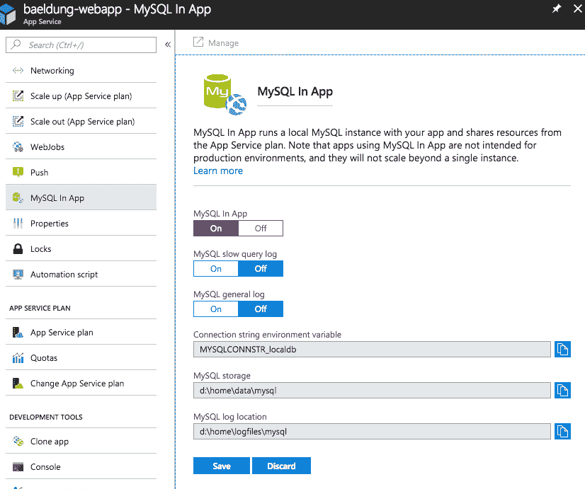
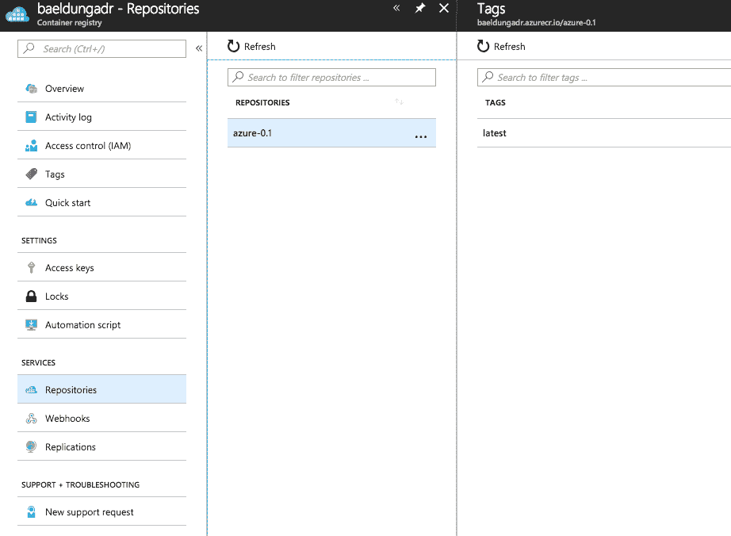
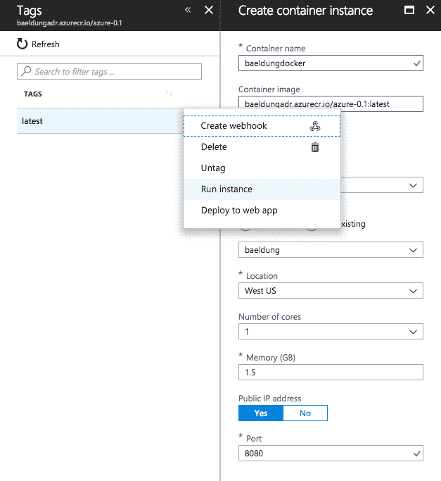

# 将 Spring Boot 应用部署到 Azure

> 原文:[https://web . archive . org/web/20220930061024/https://www . bael dung . com/spring-boot-azure](https://web.archive.org/web/20220930061024/https://www.baeldung.com/spring-boot-azure)

## 1.介绍

微软 Azure 现在提供了非常可靠的 Java 支持。

在本教程中，我们将逐步演示如何让我们的 Spring Boot 应用程序在 Azure 平台上工作。

## 2.Maven 依赖性和配置

首先，**我们确实需要一个 Azure 订阅来使用那里的云服务**；目前，我们可以在这里注册一个免费账户[。](https://web.archive.org/web/20220630130149/https://azure.microsoft.com/en-us/free/)

接下来，登录平台并使用 [Azure CLI](https://web.archive.org/web/20220630130149/https://docs.microsoft.com/en-us/cli/azure/index?view=azure-cli-latest) 创建服务主体:

```
> az login
To sign in, use a web browser to open the page \
https://microsoft.com/devicelogin and enter the code XXXXXXXX to authenticate.
```

```
> az ad sp create-for-rbac --name "app-name" --password "password"
{
    "appId": "aaaaaaaa-aaaa-aaaa-aaaa-aaaaaaaaaaaa",
    "displayName": "app-name",
    "name": "http://app-name",
    "password": "password",
    "tenant": "tttttttt-tttt-tttt-tttt-tttttttttttt"
}
```

现在**我们在我们的 Maven [`settings.xml`](https://web.archive.org/web/20220630130149/https://maven.apache.org/settings.html)** 中配置 Azure 服务主体认证设置，借助于`<servers>`下的以下部分:

```
<server>
    <id>azure-auth</id>
    <configuration>
        <client>aaaaaaaa-aaaa-aaaa-aaaa-aaaaaaaaaaaa</client>
        <tenant>tttttttt-tttt-tttt-tttt-tttttttttttt</tenant>
        <key>password</key>
        <environment>AZURE</environment>
    </configuration>
</server>
```

**当使用`azure-webapp-maven-plugin`将我们的 Spring Boot 应用程序上传到微软平台时，我们将依赖上面的认证配置。**

让我们将下面的 Maven 插件添加到`pom.xml`中:

```
<plugin>
    <groupId>com.microsoft.azure</groupId>
    <artifactId>azure-webapp-maven-plugin</artifactId>
    <version>1.1.0</version>
    <configuration>
        <!-- ... -->
    </configuration>
</plugin>
```

我们可以在这里查看最新发布版本[。](https://web.archive.org/web/20220630130149/https://search.maven.org/classic/#search%7Cgav%7C1%7Cg%3A%22com.microsoft.azure%22%20AND%20a%3A%22azure-webapp-maven-plugin%22)

这个插件有许多可配置的属性，将在下面的介绍中介绍。

## 3.将 Spring Boot 应用部署到 Azure

现在我们已经设置好了环境，让我们试着将我们的 Spring Boot 应用程序部署到 Azure。

当我们访问“`/hello`”时，我们的应用程序回复“`hello azure!`”:

```
@GetMapping("/hello")
public String hello() {
    return "hello azure!";
}
```

该平台现在允许为 Tomcat 和 Jetty 部署 Java Web App。使用`azure-webapp-maven-plugin`，我们可以将我们的应用程序作为默认(根)应用程序直接部署到受支持的 web 容器，或者通过 FTP 部署。

注意，由于我们要将应用程序部署到 web 容器，我们应该将其打包为 WAR 档案。快速提醒一下，我们有一篇文章介绍了如何在 Tomcat 中部署 Spring Boot 战争。

### 3.1.Web 容器部署

如果我们打算在 Windows 实例上部署 Tomcat，我们将对`azure-webapp-maven-plugin`使用以下配置:

```
<configuration>
    <javaVersion>1.8</javaVersion>
    <javaWebContainer>tomcat 8.5</javaWebContainer>
    <!-- ... -->
</configuration>
```

对于 Linux 实例，请尝试以下配置:

```
<configuration>
    <linuxRuntime>tomcat 8.5-jre8</linuxRuntime>
    <!-- ... -->
</configuration>
```

我们不要忘记 Azure 身份验证:

```
<configuration>
    <authentication>
        <serverId>azure-auth</serverId>
    </authentication>
    <appName>spring-azure</appName>
    <resourceGroup>baeldung</resourceGroup>
    <!-- ... -->
</configuration>
```

当我们将应用程序部署到 Azure 时，我们会看到它以应用服务的形式出现。所以这里我们指定属性`<appName>`来命名应用服务。还有，App 服务作为一个资源，需要由一个[资源组容器](https://web.archive.org/web/20220630130149/https://docs.microsoft.com/en-us/azure/azure-resource-manager/resource-group-overview)持有，所以也需要`<resourceGroup>`。

**现在我们准备使用 azure-web app:deploy Maven target**扣动扳机，我们将看到输出:

```
> mvn clean package azure-webapp:deploy
...
[INFO] Start deploying to Web App spring-baeldung...
[INFO] Authenticate with ServerId: azure-auth
[INFO] [Correlation ID: cccccccc-cccc-cccc-cccc-cccccccccccc] \
Instance discovery was successful
[INFO] Target Web App doesn't exist. Creating a new one...
[INFO] Creating App Service Plan 'ServicePlanssssssss-bbbb-0000'...
[INFO] Successfully created App Service Plan.
[INFO] Successfully created Web App.
[INFO] Starting to deploy the war file...
[INFO] Successfully deployed Web App at \
https://spring-baeldung.azurewebsites.net
...
```

**现在我们可以访问`https://spring-baeldung.azurewebsites.net/hello`** 并看到响应:“你好 azure！”。

在部署过程中，Azure 自动为我们创建了一个应用服务计划。查看官方文件了解 Azure 应用服务计划的详细信息。如果我们已经有一个应用服务计划，我们可以设置属性`<appServicePlanName>`以避免创建新的:

```
<configuration>
    <!-- ... -->
    <appServicePlanName>ServicePlanssssssss-bbbb-0000</appServicePlanName>
</configuration>
```

### 3.2.FTP 部署

要通过 FTP 进行部署，我们可以使用以下配置:

```
<configuration>
    <authentication>
        <serverId>azure-auth</serverId>
    </authentication>
    <appName>spring-baeldung</appName>
    <resourceGroup>baeldung</resourceGroup>
    <javaVersion>1.8</javaVersion>

    <deploymentType>ftp</deploymentType>
    <resources>
        <resource>
            <directory>${project.basedir}/target</directory>
            <targetPath>webapps</targetPath>
            <includes>
                <include>*.war</include>
            </includes>
        </resource>
    </resources>
</configuration>
```

在上面的配置中，我们让插件定位目录`${project.basedir}/target`中的 WAR 文件，并将其部署到 Tomcat 容器的`webapps`目录中。

假设我们的最终工件被命名为`azure-0.1.war,`，一旦我们开始部署，我们将看到如下输出:

```
> mvn clean package azure-webapp:deploy
...
[INFO] Start deploying to Web App spring-baeldung...
[INFO] Authenticate with ServerId: azure-auth
[INFO] [Correlation ID: cccccccc-cccc-cccc-cccc-cccccccccccc] \
Instance discovery was successful
[INFO] Target Web App doesn't exist. Creating a new one...
[INFO] Creating App Service Plan 'ServicePlanxxxxxxxx-xxxx-xxxx'...
[INFO] Successfully created App Service Plan.
[INFO] Successfully created Web App.
...
[INFO] Finished uploading directory: \
/xxx/.../target/azure-webapps/spring-baeldung --> /site/wwwroot
[INFO] Successfully uploaded files to FTP server: \
xxxx-xxxx-xxx-xxx.ftp.azurewebsites.windows.net
[INFO] Successfully deployed Web App at \
https://spring-baeldung.azurewebsites.net
```

请注意，这里我们没有将我们的应用程序部署为 Tomcat 的默认 Web 应用程序，因此我们只能通过“https://spring-bael dung . azure websites . net/azure-0.1/hello”来访问它。服务器将响应“你好 azure！”不出所料。

## 4.使用自定义应用程序设置进行部署

大多数时候，我们的 Spring Boot 应用程序需要数据访问来提供服务。Azure 现在支持 SQL Server、MySQL、PostgreSQL 等数据库。

为了简单起见，我们将使用它的应用内 MySQL 作为我们的数据源，因为它的配置与其他 Azure 数据库服务非常相似。

### 4.1.在 Azure 上启用应用内 MySQL

由于没有一行程序可以创建启用了应用内 MySQL 的 web 应用，我们必须首先使用 CLI 创建 web 应用:

```
az group create --location japanwest --name bealdung-group
az appservice plan create --name baeldung-plan --resource-group bealdung-group --sku B1
az webapp create --name baeldung-webapp --resource-group baeldung-group \
  --plan baeldung-plan --runtime java|1.8|Tomcat|8.5
```

然后**在** **门户**的 App 中启用 MySQL:

[](/web/20220630130149/https://www.baeldung.com/wp-content/uploads/2018/05/azure1.png)

在应用内 MySQL 启用后，我们可以在文件系统的`/home/data/mysql`目录下的一个名为`MYSQLCONNSTR_xxx.txt`的文件中找到默认数据库、数据源 URL 和默认账户信息。

### 4.2.使用 Azure 应用内 MySQL 的 Spring Boot 应用

这里，为了演示的需要，我们创建了一个`User`实体和两个端点用于`register`和`list`

```
@PostMapping("/user")
public String register(@RequestParam String name) {
    userRepository.save(userNamed(name));
    return "registered";
}

@GetMapping("/user")
public Iterable<User> userlist() {
    return userRepository.findAll();
}
```

我们将在本地环境中使用 H2 数据库，并将其切换到 Azure 上的 MySQL。通常，我们在`application.properties`文件中配置数据源属性:

```
spring.datasource.url=jdbc:h2:file:~/test
spring.datasource.username=sa
spring.datasource.password=
```

而对于 Azure 部署，**我们需要在** `**<appSettings>**:`中配置`azure-webapp-maven-plugin`

```
<configuration>
    <authentication>
        <serverId>azure-auth</serverId>
    </authentication>
    <javaVersion>1.8</javaVersion>
    <resourceGroup>baeldung-group</resourceGroup>
    <appName>baeldung-webapp</appName>
    <appServicePlanName>bealdung-plan</appServicePlanName>
    <appSettings>
        <property>
            <name>spring.datasource.url</name>
            <value>jdbc:mysql://127.0.0.1:55738/localdb</value>
        </property>
        <property>
            <name>spring.datasource.username</name>
            <value>uuuuuu</value>
        </property>
        <property>
            <name>spring.datasource.password</name>
            <value>pppppp</value>
        </property>
    </appSettings>
</configuration>
```

现在我们可以开始部署了:

```
> mvn clean package azure-webapp:deploy
...
[INFO] Start deploying to Web App custom-webapp...
[INFO] Authenticate with ServerId: azure-auth
[INFO] [Correlation ID: cccccccc-cccc-cccc-cccc-cccccccccccc] \
Instance discovery was successful
[INFO] Updating target Web App...
[INFO] Successfully updated Web App.
[INFO] Starting to deploy the war file...
[INFO] Successfully deployed Web App at \
https://baeldung-webapp.azurewebsites.net
```

我们可以从日志中看到部署已经完成。

让我们测试我们的新端点:

```
> curl -d "" -X POST https://baeldung-webapp.azurewebsites.net/user\?name\=baeldung
registered

> curl https://baeldung-webapp.azurewebsites.net/user
[{"id":1,"name":"baeldung"}]
```

服务器的响应说明了一切。有用！

## 5.将容器化的 Spring Boot 应用部署到 Azure

在前面的章节中，我们已经展示了如何将应用程序部署到 servlet 容器(在本例中是 Tomcat)。作为独立的可运行 jar 部署怎么样？

现在，我们可能需要将我们的 Spring Boot 应用程序容器化。具体来说，我们可以对其进行 dockerize，并将图像上传到 Azure。

我们已经有一篇关于[如何停靠 Spring Boot 应用](/web/20220630130149/https://www.baeldung.com/dockerizing-spring-boot-application)的文章，但是在这里**我们将使用另一个 maven 插件:`docker-maven-plugin`，为我们自动停靠:**

```
<plugin>
    <groupId>com.spotify</groupId>
    <artifactId>docker-maven-plugin</artifactId>
    <version>1.1.0</version>
    <configuration>
        <!-- ... -->
    </configuration>
</plugin>
```

最新版本可以在这里找到[。](https://web.archive.org/web/20220630130149/https://search.maven.org/classic/#search%7Cgav%7C1%7Cg%3A%22com.spotify%22%20AND%20a%3A%22docker-maven-plugin%22)

### 5.1.Azure 容器注册表

首先，**我们需要 Azure 上的容器注册中心来上传我们的 docker 图像。**

所以让我们创建一个:

```
az acr create --admin-enabled --resource-group baeldung-group \
  --location japanwest --name baeldungadr --sku Basic
```

我们还需要容器注册中心的认证信息，这可以通过以下方式查询:

```
> az acr credential show --name baeldungadr --query passwords[0]
{
  "additionalProperties": {},
  "name": "password",
  "value": "xxxxxxxxxxxxxxxxxxxxxxxxxxxxxxxx"
}
```

然后在 Maven 的`settings.xml`中添加以下服务器认证配置:

```
<server>
    <id>baeldungadr</id>
    <username>baeldungadr</username>
    <password>xxxxxxxxxxxxxxxxxxxxxxxxxxxxxxxx</password>
</server>
```

### 5.2.Maven 插件配置

让我们将下面的 Maven 插件配置添加到`pom.xml`中:

```
<properties>
    <!-- ... -->
    <azure.containerRegistry>baeldungadr</azure.containerRegistry>
    <docker.image.prefix>${azure.containerRegistry}.azurecr.io</docker.image.prefix>
</properties>

<build>
    <plugins>
        <plugin>
            <groupId>com.spotify</groupId>
            <artifactId>docker-maven-plugin</artifactId>
            <version>1.0.0</version>
            <configuration>
                <imageName>${docker.image.prefix}/${project.artifactId}</imageName>
                <registryUrl>https://${docker.image.prefix}</registryUrl>
                <serverId>${azure.containerRegistry}</serverId>
                <dockerDirectory>docker</dockerDirectory>
                <resources>
                    <resource>
                        <targetPath>/</targetPath>
                        <directory>${project.build.directory}</directory>
                        <include>${project.build.finalName}.jar</include>
                    </resource>
                </resources>
            </configuration>
        </plugin>
        <!-- ... -->
    </plugins>
</build>
```

在上面的配置中，我们指定了 docker 映像名称、注册表 URL 和一些类似于 FTP 部署的属性。

注意，插件将使用`<dockerDirectory>`中的值来定位`Dockerfile`。我们将`Dockerfile`放在`docker`目录中，其内容是:

```
FROM frolvlad/alpine-oraclejdk8:slim
VOLUME /tmp
ADD azure-0.1.jar app.jar
RUN sh -c 'touch /app.jar'
EXPOSE 8080
ENTRYPOINT [ "sh", "-c", "java -Djava.security.egd=file:/dev/./urandom -jar /app.jar" ]
```

### 5.3.在 Docker 实例中运行 Spring Boot 应用程序

现在我们可以构建一个 Docker 映像并将其推送到 Azure 注册表:

```
> mvn docker:build -DpushImage
...
[INFO] Building image baeldungadr.azurecr.io/azure-0.1
...
Successfully built aaaaaaaaaaaa
Successfully tagged baeldungadr.azurecr.io/azure-0.1:latest
[INFO] Built baeldungadr.azurecr.io/azure-0.1
[INFO] Pushing baeldungadr.azurecr.io/azure-0.1
The push refers to repository [baeldungadr.azurecr.io/azure-0.1]
...
latest: digest: sha256:0f0f... size: 1375
```

上传完成后，让我们检查一下`baeldungadr`注册表。我们将在存储库列表中看到该图像:

[](/web/20220630130149/https://www.baeldung.com/wp-content/uploads/2018/05/azure2.png)

现在，我们准备运行图像的实例:

[](/web/20220630130149/https://www.baeldung.com/wp-content/uploads/2018/05/azure3.png)

一旦实例启动，我们就可以通过它的公共 IP 地址访问应用程序提供的服务:

```
> curl http://a.x.y.z:8080/hello
hello azure!
```

### 5.4.码头集装箱部署

假设我们有一个容器注册中心，无论它来自 Azure、Docker Hub 还是我们的私有注册中心。

借助下面的`azure-webapp-maven-plugin`配置，我们还可以将我们的 Spring Boot web 应用程序部署到容器中:

```
<configuration>
    <containerSettings>
        <imageName>${docker.image.prefix}/${project.artifactId}</imageName>
        <registryUrl>https://${docker.image.prefix}</registryUrl>
        <serverId>${azure.containerRegistry}</serverId>
    </containerSettings>
    <!-- ... -->
</configuration>
```

一旦我们运行`mvn azure-webapp:deploy`，插件将帮助我们将 web 应用程序归档部署到指定图像的实例中。

然后，我们可以通过实例的 IP 地址或 Azure 应用服务的 URL 来访问 web 服务。

## 6.结论

在本文中，我们介绍了如何将 Spring Boot 应用程序部署到 Azure，作为容器中可部署的 WAR 或可运行的 JAR。虽然我们已经介绍了`azure-webapp-maven-plugin`的大部分特性，但是还有一些丰富的特性有待探索。更多详情请点击查看[。](https://web.archive.org/web/20220630130149/https://github.com/Microsoft/azure-maven-plugins/tree/master/azure-webapp-maven-plugin)

与往常一样，代码示例的完整实现可以在 Github 上的[中找到。](https://web.archive.org/web/20220630130149/https://github.com/eugenp/tutorials/tree/master/azure)