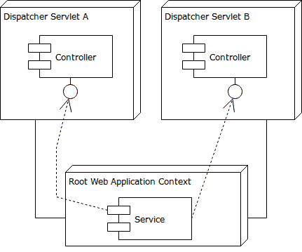

# Spring Web 上下文

> 原文:[https://web . archive . org/web/20220930061024/https://www . bael dung . com/spring-we B- contexts](https://web.archive.org/web/20220930061024/https://www.baeldung.com/spring-web-contexts)

## **1。简介**

当在 web 应用程序中使用 Spring 时，我们有几个选项来组织连接它们的应用程序上下文。

在本文中，我们将分析和解释 Spring 提供的最常见的选项。

## 2.根 Web 应用程序上下文

每个 Spring webapp 都有一个与其生命周期相关联的应用程序上下文:根 web 应用程序上下文。

这是一个比 Spring Web MVC 更早的老特性，所以它并不特别依赖于任何 Web 框架技术。

由于 servlet 上下文侦听器，上下文在应用程序启动时启动，在应用程序停止时销毁。最常见类型的上下文也可以在运行时刷新，尽管不是所有的`ApplicationContext`实现都有这个能力。

web 应用程序中的上下文总是`WebApplicationContext`的一个实例。这是一个用访问`ServletContext`的契约扩展`ApplicationContext` 的接口。

无论如何，应用程序通常不应该关心那些实现细节:**根 web 应用程序上下文只是一个定义共享 beans 的集中位置。**

### **2.1。`ContextLoaderListener`**

上一节描述的根 web 应用程序上下文由类`org.springframework.web.context.ContextLoaderListener`的监听器管理，它是`spring-web`模块的一部分。

**默认情况下，监听器将从`/WEB-INF/applicationContext.xml` `.`** 加载 XML 应用程序上下文，但是，这些默认值可以更改。例如，我们可以使用 Java 注释来代替 XML。

我们可以在 webapp 描述符(`web.xml`文件)中或者在 Servlet 3.x 环境中以编程方式配置这个监听器。

在接下来的几节中，我们将详细讨论这些选项。

### **2.2。使用`web.xml`和一个 XML 应用上下文**

使用`web.xml`时，我们像往常一样配置监听器:

```
<listener>
    <listener-class>
        org.springframework.web.context.ContextLoaderListener
    </listener-class>
</listener>
```

我们可以用参数`contextConfigLocation` 指定 XML 上下文配置的备用位置:

```
<context-param>
    <param-name>contextConfigLocation</param-name>
    <param-value>/WEB-INF/rootApplicationContext.xml</param-value>
</context-param>
```

或者多个位置，用逗号分隔:

```
<context-param>
    <param-name>contextConfigLocation</param-name>
    <param-value>/WEB-INF/context1.xml, /WEB-INF/context2.xml</param-value>
</context-param>
```

我们甚至可以使用模式:

```
<context-param>
    <param-name>contextConfigLocation</param-name>
    <param-value>/WEB-INF/*-context.xml</param-value>
</context-param>
```

在任何情况下，**只定义了一个上下文，**通过组合从指定位置加载的所有 bean 定义。

### **2.3。使用`web.xml`和一个 Java 应用上下文**

除了默认的基于 XML 的上下文之外，我们还可以指定其他类型的上下文。例如，让我们看看如何使用 Java 注释配置。

我们使用`contextClass` 参数告诉监听器要实例化哪种类型的上下文:

```
<context-param>
    <param-name>contextClass</param-name>
    <param-value>
        org.springframework.web.context.support.AnnotationConfigWebApplicationContext
    </param-value>
</context-param>
```

**每种类型的上下文都有一个默认的配置位置。**在我们的例子中，`AnnotationConfigWebApplicationContext` 没有，所以我们必须提供它。

因此，我们可以列出一个或多个带注释的类:

```
<context-param>
    <param-name>contextConfigLocation</param-name>
    <param-value>
        com.baeldung.contexts.config.RootApplicationConfig,
        com.baeldung.contexts.config.NormalWebAppConfig
    </param-value>
</context-param>
```

或者我们可以告诉上下文扫描一个或多个包:

```
<context-param>
    <param-name>contextConfigLocation</param-name>
    <param-value>com.baeldung.bean.config</param-value>
</context-param>
```

当然，我们可以混合搭配这两种选项。

### **2.4。** **程序化配置同** **Servlet 3.x**

**Servlet API 的第 3 版使得通过`web.xml`文件进行配置变得完全可选。**库可以提供它们的 web 片段，这些片段是 XML 配置的片段，可以注册监听器、过滤器、servlets 等等。

此外，用户可以访问一个 API，该 API 允许以编程方式定义基于 servlet 的应用程序的每个元素。

`spring-web`模块利用这些特性，并在应用程序启动时提供其 API 来注册应用程序的组件。

Spring 扫描应用程序的类路径，寻找`org.springframework.web.WebApplicationInitializer`类的实例。这是一个只有一个方法`void onStartup(ServletContext servletContext) throws ServletException`的接口，它在应用程序启动时被调用。

现在让我们看看如何使用这个工具来创建与我们前面看到的相同类型的根 web 应用程序上下文。

### **2.5。使用 Servlet 3.x 和 XML 应用程序上下文**

让我们从 XML 上下文开始，就像 2.2 节一样。

我们将实现前面提到的`onStartup` 方法:

```
public class ApplicationInitializer implements WebApplicationInitializer {

    @Override
    public void onStartup(ServletContext servletContext) 
      throws ServletException {
        //...
    }
}
```

让我们一行一行地分解实现。

我们首先创建一个根上下文。因为我们想要使用 XML，所以它必须是基于 XML 的应用程序上下文，并且因为我们在 web 环境中，所以它也必须实现`WebApplicationContext`。

因此，第一行是我们前面遇到的`contextClass` 参数的显式版本，通过它我们决定使用哪个特定的上下文实现:

```
XmlWebApplicationContext rootContext = new XmlWebApplicationContext();
```

然后，在第二行，我们告诉上下文从哪里加载它的 bean 定义。同样，`setConfigLocations` 是`web.xml`中`contextConfigLocation` 参数的编程类比:

```
rootContext.setConfigLocations("/WEB-INF/rootApplicationContext.xml");
```

最后，我们用根上下文创建一个`ContextLoaderListener` ,并用 servlet 容器注册它。正如我们所见，`ContextLoaderListener`有一个合适的构造函数，它接受一个`WebApplicationContext` ，并使其对应用程序可用:

```
servletContext.addListener(new ContextLoaderListener(rootContext));
```

### 2.6。使用 Servlet 3.x 和 Java 应用程序上下文

如果我们想使用基于注释的上下文，我们可以更改上一节中的代码片段，使其实例化一个`AnnotationConfigWebApplicationContext`。

然而，让我们看一个更专业的方法来获得同样的结果。

**我们之前看到的`WebApplicationInitializer` 类是一个通用接口。**原来 Spring 提供了一些更具体的实现，包括一个名为`AbstractContextLoaderInitializer`的抽象类。

顾名思义，它的工作是创建一个`ContextLoaderListener`并向 servlet 容器注册它。

我们只需要告诉它如何构建根上下文:

```
public class AnnotationsBasedApplicationInitializer 
  extends AbstractContextLoaderInitializer {

    @Override
    protected WebApplicationContext createRootApplicationContext() {
        AnnotationConfigWebApplicationContext rootContext
          = new AnnotationConfigWebApplicationContext();
        rootContext.register(RootApplicationConfig.class);
        return rootContext;
    }
}
```

这里我们可以看到，我们不再需要注册`ContextLoaderListener`，这让我们免于一点样板代码。

还要注意特定于`AnnotationConfigWebApplicationContext` 的`register` 方法的使用，而不是更通用的`setConfigLocations`:通过调用它，我们可以在上下文中注册单独的`@Configuration`注释类，从而避免包扫描。

## **3。调度程序 Servlet 上下文**

现在让我们关注另一种类型的应用程序上下文。这一次，我们将提到一个 Spring MVC 特有的特性，而不是 Spring 通用 web 应用程序支持的一部分。

Spring MVC 应用程序至少配置了一个 Dispatcher Servlet】(但可能不止一个，我们将在后面讨论这种情况)。这个 servlet 接收传入的请求，将它们分派给适当的控制器方法，并返回视图。

**每个`DispatcherServlet` 都有一个关联的应用程序上下文。**在这样的上下文中定义的 Beans 配置 servlet 并定义 MVC 对象，如控制器和视图解析器。

让我们先看看如何配置 servlet 的上下文。稍后我们将深入了解一些细节。

### **3.1。使用`web.xml`和一个 XML 应用上下文**

`DispatcherServlet`通常在`web.xml`中用名称和映射来声明:

```
<servlet>
    <servlet-name>normal-webapp</servlet-name>
    <servlet-class>
        org.springframework.web.servlet.DispatcherServlet
    </servlet-class>
    <load-on-startup>1</load-on-startup>
</servlet>
<servlet-mapping>
    <servlet-name>normal-webapp</servlet-name>
    <url-pattern>/api/*</url-pattern>
</servlet-mapping>
```

如果没有另外指定，servlet 的名称用于确定要加载的 XML 文件。在我们的例子中，我们将使用文件`WEB-INF/normal-webapp-servlet.xml`。

我们还可以指定一个或多个 XML 文件的路径，类似于`ContextLoaderListener`:

```
<servlet>
    ...
    <init-param>
        <param-name>contextConfigLocation</param-name>
        <param-value>/WEB-INF/normal/*.xml</param-value>
    </init-param>
</servlet>
```

### **3.2。使用`web.xml`和一个 Java 应用上下文**

当我们想要使用不同类型的上下文时，我们再次使用`ContextLoaderListener`。也就是说，我们指定了一个`contextClass` 参数和一个合适的`contextConfigLocation`:

```
<servlet>
    <servlet-name>normal-webapp-annotations</servlet-name>
    <servlet-class>
        org.springframework.web.servlet.DispatcherServlet
    </servlet-class>
    <init-param>
        <param-name>contextClass</param-name>
        <param-value>
            org.springframework.web.context.support.AnnotationConfigWebApplicationContext
        </param-value>
    </init-param>
    <init-param>
        <param-name>contextConfigLocation</param-name>
        <param-value>com.baeldung.contexts.config.NormalWebAppConfig</param-value>
    </init-param>
    <load-on-startup>1</load-on-startup>
</servlet>
```

### **3.3。使用 Servlet 3.x 和 XML 应用程序上下文**

**同样，我们将研究两种不同的方法来编程声明一个`DispatcherServlet`，我们将把一个应用于 XML 上下文，另一个应用于 Java 上下文。**

所以，让我们从一个通用的`WebApplicationInitializer` 和一个 XML 应用程序上下文开始。

正如我们之前看到的，我们必须实现`onStartup` 方法。然而，这次我们也将创建并注册一个 dispatcher servlet:

```
XmlWebApplicationContext normalWebAppContext = new XmlWebApplicationContext();
normalWebAppContext.setConfigLocation("/WEB-INF/normal-webapp-servlet.xml");
ServletRegistration.Dynamic normal
  = servletContext.addServlet("normal-webapp", 
    new DispatcherServlet(normalWebAppContext));
normal.setLoadOnStartup(1);
normal.addMapping("/api/*");
```

我们可以很容易地在上面的代码和等价的`web.xml`配置元素之间画出一条平行线。

### **3.4。使用 Servlet 3.x 和 Java 应用程序上下文**

这一次，我们将使用`WebApplicationInitializer` : `AbstractDispatcherServletInitializer`的专门实现来配置基于注释的上下文。

这是一个抽象类，除了像前面看到的那样创建一个根 web 应用程序上下文之外，还允许我们用最少的样板文件注册一个 dispatcher servlet:

```
@Override
protected WebApplicationContext createServletApplicationContext() {

    AnnotationConfigWebApplicationContext secureWebAppContext
      = new AnnotationConfigWebApplicationContext();
    secureWebAppContext.register(SecureWebAppConfig.class);
    return secureWebAppContext;
}

@Override
protected String[] getServletMappings() {
    return new String[] { "/s/api/*" };
}
```

这里我们可以看到一种创建与 servlet 相关联的上下文的方法，就像我们之前看到的根上下文一样。此外，我们有一个方法来指定 servlet 的映射，如`web.xml`所示。

## **4。父上下文和子上下文**

到目前为止，我们已经看到了两种主要类型的上下文:根 web 应用程序上下文和 dispatcher servlet 上下文。那么，我们可能会有一个问题:**那些上下文有关联吗？**

事实证明，是的，他们是。事实上，**根上下文是每个 dispatcher servlet 上下文的父上下文。**因此，在根 web 应用程序上下文中定义的 beans 对每个 dispatcher servlet 上下文都是可见的，但反之亦然。

因此，通常情况下，根上下文用于定义服务 bean，而 dispatcher 上下文包含那些专门与 MVC 相关的 bean。

注意，我们还看到了以编程方式创建 dispatcher servlet 上下文的方法。如果我们手动设置它的父级，那么 Spring 不会覆盖我们的决定，并且这一部分不再适用。

在更简单的 MVC 应用程序中，有一个与唯一的 dispatcher servlet 相关联的上下文就足够了。不需要过于复杂的解决方案！

尽管如此，当我们配置了多个 dispatcher servlets 时，父子关系还是很有用的。但是我们什么时候应该费心去拥有一个以上的孩子呢？

一般来说，当我们需要多套 MVC 配置时，**我们声明多个 dispatcher servlet****。**例如，我们可能有一个 REST API 和一个传统的 MVC 应用程序，或者一个网站的不安全和安全部分:

[](/web/20220824102300/https://www.baeldung.com/wp-content/uploads/2018/05/contexts.png)

注意:当我们扩展`AbstractDispatcherServletInitializer` (参见 3.4 节)时，我们注册了一个根 web 应用程序上下文和一个 dispatcher servlet。

因此，如果我们想要不止一个 servlet，我们需要多个`AbstractDispatcherServletInitializer` 实现。但是，我们只能定义一个根上下文，否则应用程序不会启动。

幸运的是，`createRootApplicationContext` 方法可以返回`null`。因此，我们可以有一个`AbstractContextLoaderInitializer` 和许多不创建根上下文的`AbstractDispatcherServletInitializer` 实现。在这种情况下，建议用`@Order`对初始化器进行显式排序。

另外，注意`AbstractDispatcherServletInitializer`用给定的名称(`dispatcher`)注册 servlet，当然，我们不能有多个同名的 servlet。所以，我们需要覆盖`getServletName`:

```
@Override
protected String getServletName() {
    return "another-dispatcher";
}
```

## **5。一个** **父子语境** **例子**

假设我们的应用程序有两个区域，例如，一个是全球可访问的公共区域，另一个是安全区域，具有不同的 MVC 配置。这里，我们将只定义两个输出不同消息的控制器。

此外，假设一些控制器需要一个拥有大量资源的服务；一个普遍的例子是持久性。然后，我们将希望只实例化该服务一次，以避免加倍其资源使用，因为我们相信不要重复自己的原则！

现在让我们继续这个例子。

### 5.1.共享服务

在我们的 hello world 示例中，我们满足于更简单的欢迎服务，而不是持久性:

```
package com.baeldung.contexts.services;

@Service
public class GreeterService {
    @Resource
    private Greeting greeting;

    public String greet() {
        return greeting.getMessage();
    }
}
```

我们将使用组件扫描在根 web 应用程序上下文中声明服务:

```
@Configuration
@ComponentScan(basePackages = { "com.baeldung.contexts.services" })
public class RootApplicationConfig {
    //...
}
```

我们可能更喜欢 XML:

```
<context:component-scan base-package="com.baeldung.contexts.services" />
```

### 5.2。控制器

让我们定义两个简单的控制器，它们使用服务并输出问候:

```
package com.baeldung.contexts.normal;

@Controller
public class HelloWorldController {

    @Autowired
    private GreeterService greeterService;

    @RequestMapping(path = "/welcome")
    public ModelAndView helloWorld() {
        String message = "<h3>Normal " + greeterService.greet() + "</h3>";
        return new ModelAndView("welcome", "message", message);
    }
}

//"Secure" Controller
package com.baeldung.contexts.secure;

String message = "<h3>Secure " + greeterService.greet() + "</h3>";
```

正如我们所看到的，控制器位于两个不同的包中，并打印不同的信息:一个说“正常”，另一个说“安全”。

### 5.3。调度程序 Servlet 上下文

如前所述，我们将有两个不同的 dispatcher servlet 上下文，每个控制器一个。所以，让我们用 Java 来定义它们:

```
//Normal context
@Configuration
@EnableWebMvc
@ComponentScan(basePackages = { "com.baeldung.contexts.normal" })
public class NormalWebAppConfig implements WebMvcConfigurer {
    //...
}

//"Secure" context
@Configuration
@EnableWebMvc
@ComponentScan(basePackages = { "com.baeldung.contexts.secure" })
public class SecureWebAppConfig implements WebMvcConfigurer {
    //...
}
```

或者，如果我们喜欢，用 XML:

```
<!-- normal-webapp-servlet.xml -->
<context:component-scan base-package="com.baeldung.contexts.normal" />

<!-- secure-webapp-servlet.xml -->
<context:component-scan base-package="com.baeldung.contexts.secure" />
```

### 5.4。将所有这些放在一起

现在我们有了所有的片段，我们只需要告诉 Spring 把它们连接起来。回想一下，我们需要加载根上下文并定义两个 dispatcher servlets。尽管我们已经看到了实现这一点的多种方法，但我们现在将重点关注两种场景，一种是 Java 场景，另一种是 XML 场景。**先说 Java。**

我们将定义一个`AbstractContextLoaderInitializer` 来加载根上下文:

```
@Override
protected WebApplicationContext createRootApplicationContext() {
    AnnotationConfigWebApplicationContext rootContext
      = new AnnotationConfigWebApplicationContext();
    rootContext.register(RootApplicationConfig.class);
    return rootContext;
} 
```

然后，我们需要创建两个 servlets，因此我们将定义`AbstractDispatcherServletInitializer`的两个子类。首先是“正常”的:

```
@Override
protected WebApplicationContext createServletApplicationContext() {
    AnnotationConfigWebApplicationContext normalWebAppContext
      = new AnnotationConfigWebApplicationContext();
    normalWebAppContext.register(NormalWebAppConfig.class);
    return normalWebAppContext;
}

@Override
protected String[] getServletMappings() {
    return new String[] { "/api/*" };
}

@Override
protected String getServletName() {
    return "normal-dispatcher";
} 
```

然后是“安全”的，它加载不同的上下文并映射到不同的路径:

```
@Override
protected WebApplicationContext createServletApplicationContext() {
    AnnotationConfigWebApplicationContext secureWebAppContext
      = new AnnotationConfigWebApplicationContext();
    secureWebAppContext.register(SecureWebAppConfig.class);
    return secureWebAppContext;
}

@Override
protected String[] getServletMappings() {
    return new String[] { "/s/api/*" };
}

@Override
protected String getServletName() {
    return "secure-dispatcher";
}
```

我们完事了。我们只是应用了我们在前面章节中接触到的内容。

**我们可以用`web.xml`** 做同样的事情，同样只是通过组合我们到目前为止讨论过的片段。

定义根应用程序上下文:

```
<listener>
    <listener-class>
        org.springframework.web.context.ContextLoaderListener
    </listener-class>
</listener> 
```

“正常”调度程序上下文:

```
<servlet>
    <servlet-name>normal-webapp</servlet-name>
    <servlet-class>
        org.springframework.web.servlet.DispatcherServlet
    </servlet-class>
    <load-on-startup>1</load-on-startup>
</servlet>
<servlet-mapping>
    <servlet-name>normal-webapp</servlet-name>
    <url-pattern>/api/*</url-pattern>
</servlet-mapping> 
```

最后，一个“安全”的环境:

```
<servlet>
    <servlet-name>secure-webapp</servlet-name>
    <servlet-class>
        org.springframework.web.servlet.DispatcherServlet
    </servlet-class>
    <load-on-startup>1</load-on-startup>
</servlet>
<servlet-mapping>
    <servlet-name>secure-webapp</servlet-name>
    <url-pattern>/s/api/*</url-pattern>
</servlet-mapping>
```

## **6。组合多个上下文**

除了父子组合多个配置位置，还有其他方法，**拆分大的上下文，更好的分离不同的关注点。**我们已经看到了一个例子:当我们用多个路径或包指定`contextConfigLocation` 时，Spring 通过组合所有的 bean 定义来构建一个上下文，就好像它们是按顺序写在一个 XML 文件或 Java 类中一样。

然而，我们可以用其他方法达到类似的效果，甚至可以一起使用不同的方法。让我们检查一下我们的选择。

一种可能性是组件扫描，我们在另一篇文章中解释了[。](/web/20220824102300/https://www.baeldung.com/spring-bean-annotations#scanning)

### 6.1.将上下文导入另一个上下文

或者，我们可以让一个上下文定义导入另一个。根据不同的场景，我们有不同类型的导入。

在 Java 中导入一个`@Configuration` 类:

```
@Configuration
@Import(SomeOtherConfiguration.class)
public class Config { ... }
```

在 Java 中加载一些其他类型的资源，例如 XML 上下文定义:

```
@Configuration
@ImportResource("classpath:basicConfigForPropertiesTwo.xml")
public class Config { ... }
```

最后，将一个 XML 文件包含在另一个文件中:

```
<import resource="greeting.xml" />
```

因此，我们有许多方法来组织服务、组件、控制器等。，他们合作创建了我们出色的应用程序。好的一面是我理解他们所有人！

## **7。Spring Boot 网络应用**

**Spring Boot 自动配置应用程序的组件，**因此，一般来说，不太需要考虑如何组织它们。

尽管如此，在引擎盖下，Boot 使用了 Spring 特性，包括我们目前已经看到的那些特性。让我们来看几个值得注意的区别。

在嵌入式容器[中运行的 Spring Boot web 应用程序按照设计不运行任何`WebApplicationInitializer`](https://web.archive.org/web/20220824102300/https://docs.spring.io/spring-boot/docs/current/reference/htmlsingle/#boot-features-embedded-container-context-initializer) 。

如果有必要，我们可以在`SpringBootServletInitializer `或`ServletContextInitializer` 中编写相同的逻辑，这取决于所选择的部署策略。

然而，对于本文中提到的添加 servlets、过滤器和监听器，没有必要这样做。**事实上，Spring Boot 自动将每个与 servlet 相关的 bean 注册到容器:**

```
@Bean
public Servlet myServlet() { ... }
```

这样定义的对象按照约定进行映射:过滤器自动映射到/*，也就是说，映射到每个请求。如果我们注册了单个 servlet，它将被映射到/，否则，每个 servlet 将被映射到它的 bean 名称。

如果以上约定对我们不起作用，我们可以定义一个`FilterRegistrationBean`、`ServletRegistrationBean, `或`ServletListenerRegistrationBean` 来代替。这些类允许我们控制注册的细节。

## **8。结论**

在本文中，我们深入介绍了用于构建和组织 Spring web 应用程序的各种选项。

我们已经忽略了一些特性，特别是在企业应用程序中对共享上下文的[支持，在撰写本文时，Spring 5](https://web.archive.org/web/20220824102300/https://spring.io/blog/2007/06/11/using-a-shared-parent-application-context-in-a-multi-war-spring-application/) 中仍然没有[。](https://web.archive.org/web/20220824102300/https://jira.spring.io/browse/SPR-16258)

所有这些例子和代码片段的实现都可以在 GitHub 项目中找到。