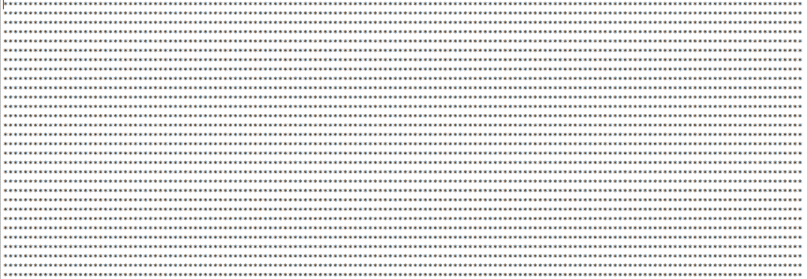
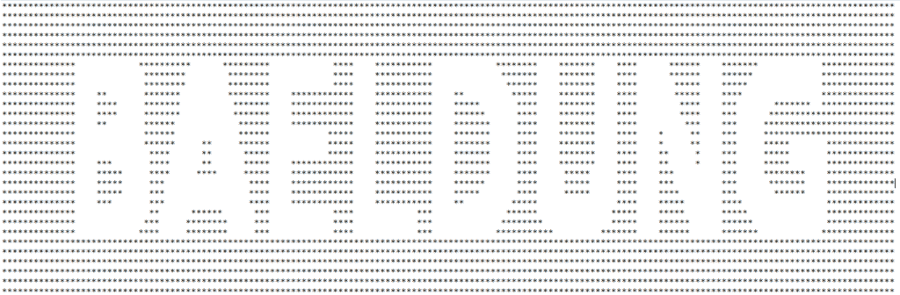

# Java 中的 ASCII 艺术

> 原文：<https://web.archive.org/web/20220930061024/https://www.baeldung.com/ascii-art-in-java>

## **1。概述**

在本文中，我们将讨论使用 Java 语言的 2D 图形支持的概念，创建 Java 中的 [ASCII](/web/20221207214400/https://www.baeldung.com/cs/ascii-code) 字符或`Strings`的图形打印。

## **2。用 2D 图形绘制字符串**

在`Graphics2D`类的帮助下，通过调用`drawString()`方法，可以将`String`绘制成图像。

因为`Graphics2D`是抽象的，我们可以通过扩展它并实现与`Graphics`类相关的各种方法来创建一个实例。

虽然这是一项繁琐的任务，但通常是通过在 Java 中创建一个`BufferedImage`实例并从中检索其底层`Graphics`实例来完成的:

[PRE0]

### **2.1。用 ASCII 字符替换图像矩阵索引**

当绘制`Strings,`时，`Graphics2D` 类使用一种简单的类似矩阵的技术，其中分割出设计好的`Strings`的区域被赋予一个特定的值，而其他区域被赋予一个零值。

为了能够用所需的 ASCII 字符替换雕刻区域，我们需要将雕刻区域的值检测为单个数据点(例如整数)，而不是 RGB 颜色值。

为了将图像的 RGB 颜色表示为整数，我们将图像类型设置为整数模式:

[PRE1]

基本思想是用期望的艺术特征替换分配给图像矩阵的非零索引的值。

而代表零值的矩阵的索引将被分配单个空格字符。整数模式的零等价物是-16777216。

## **3。ASCII 艺术生成器**

让我们考虑这样一种情况，我们需要对“BAELDUNG”字符串进行 ASCII 处理。

我们首先创建一个具有期望宽度/高度的空白图像，图像类型设置为整数模式，如 2.1 节所述。

为了能够在 Java 中使用 2D 图形的高级渲染选项，我们将我们的`Graphics`对象转换为一个`Graphics2D`实例`.`，然后在使用“bael dung”`String:`调用`drawString()`方法之前设置所需的渲染参数

[PRE2]

在上面，12 和 24 分别代表图像上文本打印应该开始的点的 x 和 y 坐标。

现在，我们有一个 2D 图形，它的底层矩阵包含两种不同的值；非零和零索引。

但是为了让我们理解这个概念，我们将遍历二维数组(或矩阵),并将所有带有 ASCII 字符“*”的值替换为:

[PRE3]

上面的输出只显示了一组星号(*)，如下所示:

如果我们通过仅将等于-16777216 的整数值替换为“*”，而将其余的替换为“”，来区分带“*”的替换:

[PRE4]

我们获得了与我们的字符串“BAELDUNG”相对应的另一种 ASCII 艺术，但是是这样的反向雕刻:

最后，我们通过将等于-16777216 的整数值替换为“”并将其余的替换为“*”来反转判别:

[PRE5]

这给了我们所需的 ASCII 艺术`String:`

## **4。结论**

在这个快速教程中，我们看了如何使用内置的 2D 图形库在 Java 中创建 ASCII 艺术。

虽然我们已经专门为正文作了说明；Github 上的源代码“BAELDUNG”提供了一个接受任何`String.`的实用函数

源代码一如既往地可以在 GitHub 上找到[。](https://web.archive.org/web/20221207214400/https://github.com/eugenp/tutorials/tree/master/core-java-modules/core-java-console)