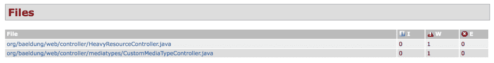
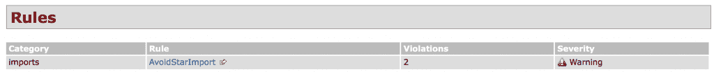
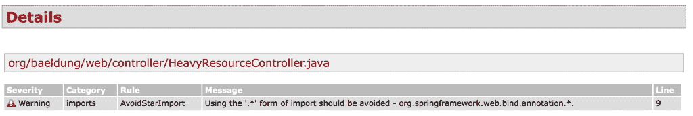
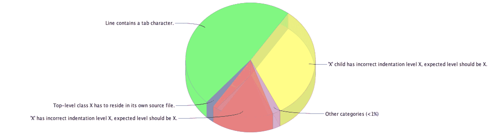
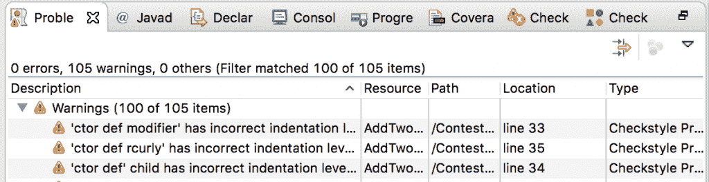
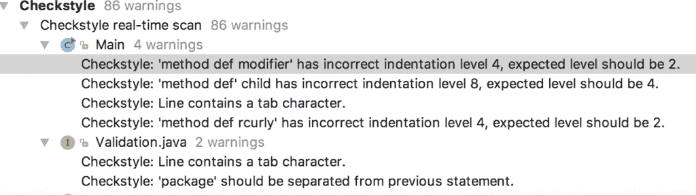
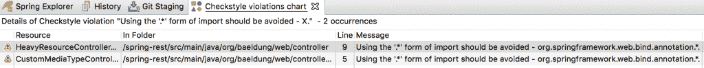
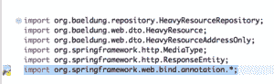

# CheckStyle 简介

> 原文：<https://web.archive.org/web/20220930061024/https://www.baeldung.com/checkstyle-java>

## 1。概述

Checkstyle 是一个开源工具，它根据一组可配置的规则检查代码。

在本教程中，我们将看看**如何通过 Maven 和使用 IDE 插件将 [Checkstyle](https://web.archive.org/web/20221012154036/http://checkstyle.sourceforge.net/) 集成到 Java 项目中。**

下面提到的插件并不相互依赖，可以单独集成到我们的构建或 ide 中。例如，在我们的`pom.xml` 中不需要 Maven 插件来运行 Eclipse IDE 中的验证。

## 2。Checkstyle Maven 插件

### 2.1。Maven 配置

要将 Checkstyle 添加到项目中，我们需要在`pom.xml`的报告部分添加插件:

```
<reporting>
    <plugins>
        <plugin>
            <groupId>org.apache.maven.plugins</groupId>
            <artifactId>maven-checkstyle-plugin</artifactId>
            <version>3.0.0</version>
            <configuration>
                <configLocation>checkstyle.xml</configLocation>
            </configuration>
        </plugin>
    </plugins>
</reporting>
```

这个插件有两个预定义的检查，一个是 Sun 风格的检查，一个是 Google 风格的检查。项目的默认检查是`sun_checks.xml.`

要使用我们的自定义配置，我们可以指定我们的配置文件，如上面的示例所示。使用这个配置，插件现在将读取我们的自定义配置，而不是提供的默认配置。

插件的最新版本可以在 [Maven Central](https://web.archive.org/web/20221012154036/https://search.maven.org/classic/#search%7Cga%7C1%7Cg%3A%22org.apache.maven.plugins%22%20AND%20a%3A%22maven-checkstyle-plugin%22) 上找到。

### 2.2。报告生成

现在我们的 Maven 插件已经配置好了，我们可以通过运行`mvn site` 命令为我们的代码生成一个报告。**一旦构建完成，该报告就可以在`target/site`文件夹中的`checkstyle.html.`** 下找到

Checkstyle 报告有三个主要部分:

**文件:**报告的这一部分为我们提供了**发生违规的文件列表**。它还向我们显示了违规的严重程度。报告的文件部分如下所示:

[](/web/20221012154036/https://www.baeldung.com/wp-content/uploads/2018/03/Screen-Shot-2018-03-02-at-1.19.15-AM-1024x132.png)

**规则:**报告的这一部分为我们提供了用于检查违规的规则的**概述**。它显示规则的类别、违规的数量以及违规的严重程度。以下是显示规则部分的报告示例:

[](/web/20221012154036/https://www.baeldung.com/wp-content/uploads/2018/03/Screen-Shot-2018-03-03-at-9.30.20-PM-1024x104.png)

**细节:**最后，报告的细节部分为我们提供了已经发生的违规的**细节。提供的详细信息是行号级别的。以下是报告的详细信息部分示例:**

[](/web/20221012154036/https://www.baeldung.com/wp-content/uploads/2018/03/Screen-Shot-2018-03-03-at-9.33.51-PM-1024x173.png)

### 2.3。构建集成

如果需要对编码风格进行严格的检查，我们可以这样配置插件，当代码不符合标准时，构建就会失败。

我们通过在插件定义中添加一个执行目标来做到这一点:

```
<plugin>
    <groupId>org.apache.maven.plugins</groupId>
    <artifactId>maven-checkstyle-plugin</artifactId>
    <version>${checkstyle-maven-plugin.version}</version>
    <configuration>
        <configLocation>checkstyle.xml</configLocation>
    </configuration>
    <executions>
        <execution>
            <goals>
                <goal>check</goal>
            </goals>
        </execution>
    </executions>
</plugin>
```

`configLocation`属性定义了验证引用哪个配置文件。

在我们的例子中，配置文件是`checkstyle.xml.`。执行部分提到的目标`check` 要求插件在构建的验证阶段运行，并在违反编码标准时强制构建失败。

现在，如果我们运行`mvn clean install`命令，它将扫描文件是否违规，如果发现任何违规，构建将会失败。

我们也可以使用`mvn checkstyle:check,`只运行插件的`check`目标，而不配置执行目标。如果存在任何验证错误，运行此步骤也会导致构建失败。

## 3。Eclipse 插件

### 3.1。配置

就像 Maven 集成一样，Eclipse 使我们能够使用我们的定制配置。

要导入我们的配置，请转到`Global Check Configurations`部分的`Window -> Preferences -> Checkstyle.`，点击`New.`

这将打开一个对话框，为用户提供指定自定义配置文件选项。

### 3.2。报告浏览

现在我们的插件已经配置好了，我们可以用它来分析我们的代码。

要检查项目的编码风格，右击`Eclipse Project Explorer`中的项目并选择`CheckStyle -> Check Code with Checkstyle.`

该插件将在 Eclipse 的文本编辑器中为我们的 Java 代码提供反馈。它还将生成项目的违规报告，该报告在 Eclipse 中作为视图提供。

要查看违规报告，请转至`Window -> Show View -> Other`，并搜索 Checkstyle。应显示 `Violations`和 `Violations Chart`的选项。

选择任一选项都会显示按类型分组的违规情况。下面是一个示例项目的违规饼图:

[](/web/20221012154036/https://www.baeldung.com/wp-content/uploads/2018/03/Pie_Chart_Checkstyle-e1518286529674.png)

点击饼图的一部分，我们将看到代码中实际违规的列表。

或者，我们可以打开 Eclipse IDE 的`Problem`视图，检查插件报告的问题。

下面是 Eclipse IDE 的一个示例问题视图:

[](/web/20221012154036/https://www.baeldung.com/wp-content/uploads/2018/03/Screen-Shot-2018-02-24-at-4.15.23-PM-1024x264.png)

单击任何警告都会将我们带到发生违规的代码。

## 4。IntelliJ IDEA 插件

### 4.1。配置

像 Eclipse 一样，IntelliJ IDEA 也使我们能够在项目中使用我们自己的定制配置。

在 IDE 中打开设置并搜索 Checkstyle。显示一个窗口，可以选择我们的检查。点击 **+** 按钮，将会打开一个窗口，让我们指定要使用的文件的位置。

现在，我们选择一个配置 XML 文件，然后单击 Next。这将打开前一个窗口，并显示我们新添加的自定义配置选项。我们选择新的配置并点击 OK 开始在我们的项目中使用它。

### 4.2。报告浏览

现在我们的插件已经配置好了，让我们用它来检查违规情况。要检查特定项目的违规情况，请转到`Analyze -> Inspect Code.`

检查结果将让我们看到 Checkstyle 部分下的违规情况。以下是一份报告样本:

[](/web/20221012154036/https://www.baeldung.com/wp-content/uploads/2018/03/Screen-Shot-2018-02-19-at-3.00.07-PM-1024x287.png)

单击违规会将我们带到文件中发生违规的确切行。

## 5。自定义检查样式配置

在 Maven 报告生成部分(2.2 节)，我们使用了一个定制的配置文件来执行我们自己的编码标准检查。

如果我们不想使用打包的 Google 或 Sun 支票，我们有办法创建自己的定制配置 XML 文件。

以下是用于上述检查的自定义配置文件:

```
<!DOCTYPE module PUBLIC
  "-//Puppy Crawl//DTD Check Configuration 1.3//EN"
  "http://www.puppycrawl.com/dtds/configuration_1_3.dtd">
<module name="Checker">
    <module name="TreeWalker">
        <module name="AvoidStarImport">
            <property name="severity" value="warning" />
        </module>
    </module>
</module>
```

### 5.1。文档类型定义

即 DOCTYPE 定义的第一行是文件的重要部分，它告诉从哪里下载 DTD，以便系统可以理解配置。

如果我们不在我们的配置文件中包含这个定义，它将不是一个有效的配置文件。

### 5.2。模块

配置文件主要由模块组成。**一个模块有一个属性`name`，代表这个模块做什么。**`name` 属性的值对应于插件代码中的一个类，该类在插件运行时被执行。

让我们了解一下上面配置中的不同模块。

### 5.3。模块详情

*   **Checker:** 模块被构建在一个树中，该树以 Checker 模块为根。该模块定义由配置的所有其他模块继承的属性。
*   **TreeWalker:** 该模块检查各个 Java 源文件，并定义适用于检查这些文件的属性。
*   这个模块为在我们的 Java 代码中不使用 StarImport 设置了一个标准。它还有一个属性，要求插件报告此类问题的严重性作为警告。因此，无论何时在代码中发现这种违反，都将对它们发出警告。

点击此[链接](https://web.archive.org/web/20221012154036/http://checkstyle.sourceforge.net/config.html)阅读更多关于定制配置的信息。

## 6。春歇项目报告分析

在这一节中，我们将以 GitHub 上可用的 [spring-rest 项目为例，使用上面第 5 节中创建的定制配置，来阐明 Checkstyle 所做的分析。](https://web.archive.org/web/20221012154036/https://github.com/eugenp/tutorials/tree/master/testing-modules/testing-libraries)

### 6.1。违规报告生成

我们已经将配置导入 Eclipse IDE，下面是为项目生成的违规报告:

[](/web/20221012154036/https://www.baeldung.com/wp-content/uploads/2018/03/Screen-Shot-2018-02-27-at-12.23.58-AM-1024x101.png)

这里报告的警告指出，应该在代码中避免通配符导入。我们有两个文件不符合这个标准。当我们单击警告时，它会将我们带到有违规的 Java 文件。

下面是`HeavyResourceController.java` 文件如何显示报告的警告:

[](/web/20221012154036/https://www.baeldung.com/wp-content/uploads/2018/03/Screen-Shot-2018-02-27-at-12.31.46-AM.png)

### 6.2。问题解决方案

使用 Star imports 通常不是一个好的实践，因为当两个或更多的包包含相同的类时，它会产生冲突。

作为一个例子，考虑在包`java.util`和`java.awt`中都有的 `is` 类`List,`。如果我们同时使用进口的`java.util`。*和`java.awt.*`我们的编译器将无法编译代码，因为`List` 在两个包中都可用。

为了解决上述问题，我们在两个文件中组织导入并保存它们。现在，当我们再次运行插件时，我们看不到违规，我们的代码现在遵循我们的自定义配置中设置的标准。

## 7。结论

在本文中，我们介绍了在 Java 项目中集成 Checkstyle 的基础知识。

我们知道这是一个简单而强大的工具，用于确保开发人员遵守组织制定的编码标准。

我们用于静态分析的示例代码可以从 GitHub 上的[处获得。](https://web.archive.org/web/20221012154036/https://github.com/eugenp/tutorials/tree/master/testing-modules/testing-libraries)