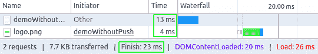
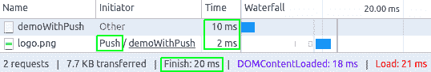

# Spring 5 和 Servlet 4——推构建器

> 原文：<https://web.archive.org/web/20220930061024/https://www.baeldung.com/spring-5-push>

## 1。简介

服务器推送技术是 HTTP/2 ( [RFC 7540](https://web.archive.org/web/20220628051605/https://tools.ietf.org/html/rfc7540#section-8.2) )的一部分，它允许我们从服务器端主动向客户端发送资源。这是 HTTP/1 的一个重大变化。x 基于拉动的方法。

Spring 5 带来的新特性之一是 Jakarta EE 8 Servlet 4.0 API 附带的服务器推送支持。在本文中，我们将探索**如何使用服务器推送并将其与 Spring MVC 控制器**集成。

## 2。Maven 依赖关系

让我们从定义将要使用的依赖关系开始:

```
<dependency>
    <groupId>org.springframework</groupId>
    <artifactId>spring-webmvc</artifactId>
    <version>5.2.8.RELEASE</version>
</dependency>
<dependency>
    <groupId>javax.servlet</groupId>
    <artifactId>javax.servlet-api</artifactId>
    <version>4.0.0</version>
    <scope>provided</scope>
</dependency>
```

最新版本的 spring-mvc 和 T2 servlet-API 可以在 Maven Central 上找到。

## 3。HTTP/2 需求

要使用服务器推送，我们需要在一个支持 HTTP/2 和 Servlet 4.0 API 的容器中运行我们的应用程序。各种容器的配置需求可以在这里找到，在 [Spring wiki](https://web.archive.org/web/20220628051605/https://github.com/spring-projects/spring-framework/wiki/HTTP-2-support) 中。

此外，我们将**需要客户端**的 HTTP/2 支持；当然，目前大多数[浏览器](https://web.archive.org/web/20220628051605/https://caniuse.com/#feat=http2)都有这种支持。

## 4。`PushBuilder`特色

`PushBuilder`接口负责实现服务器推送。在 Spring MVC 中，我们可以注入一个`PushBuilder`作为用`@RequestMapping`标注的方法的参数。

此时，重要的是要考虑到—**如果客户端不支持 HTTP/2——引用将作为`null`** 发送。

下面是由`PushBuilder` 接口提供的核心 API:

*   `path (String path) –`表示我们将要发送的资源
*   `push() –`将资源发送给客户端
*   `addHeader (String name, String value) –`表示我们将用于推送资源的头

## 5。快速示例

为了演示集成，我们将使用一个资源`logo.png`创建`demo.jsp`页面:

```
<%@ page language="java" contentType="text/html; charset=UTF-8"
  pageEncoding="UTF-8"%>
<%@ taglib uri="http://java.sun.com/jsp/jstl/core" prefix="c"%>
<html>
<head>
<meta http-equiv="Content-Type" content="text/html; charset=UTF-8">
<title>PushBuilder demo</title>
</head>
<body>
    <span>PushBuilder demo</span>
    <br>
    " alt="Logo" 
      height="126" width="411">
    <br>
    <!--Content-->
</body>
</html>
```

我们还将使用`PushController`控制器公开两个端点——一个使用服务器推送，另一个不使用:

```
@Controller
public class PushController {

    @GetMapping(path = "/demoWithPush")
    public String demoWithPush(PushBuilder pushBuilder) {
        if (null != pushBuilder) {
            pushBuilder.path("resources/logo.png").push();
        }
        return "demo";
    }

    @GetMapping(path = "/demoWithoutPush")
    public String demoWithoutPush() {
        return "demo";
    }
}
```

使用 Chrome 开发工具，我们可以通过调用两个端点来了解不同之处。

当我们调用`demoWithoutPush`方法时，视图和资源由客户端使用拉技术发布和消费:

[](/web/20220628051605/https://www.baeldung.com/wp-content/uploads/2018/01/Demo-without-Push.png) 
当我们调用`demoWithPush`方法时，我们可以看到推送服务器的使用以及服务器如何提前交付资源，从而导致更低的加载时间:

[](/web/20220628051605/https://www.baeldung.com/wp-content/uploads/2018/01/Demo-with-Push.png) 
服务器推送技术可以在很多场景下提高我们应用的页面加载时间。也就是说，我们确实需要考虑，虽然我们减少了延迟，但我们可以增加带宽——这取决于我们服务的资源数量。

将这项技术与其他策略(如[缓存](/web/20220628051605/https://www.baeldung.com/cachable-static-assets-with-spring-mvc)、[资源缩减](/web/20220628051605/https://www.baeldung.com/maven-minification-of-js-and-css-assets)和 CDN)结合起来，并在我们的应用上运行性能测试，以确定使用服务器推送的理想端点，这也是一个好主意。

## 6。结论

在这个快速教程中，我们看到了一个如何通过使用`PushBuilder`接口将服务器推送技术与 Spring MVC 结合使用的例子，并且我们比较了使用它与标准拉取技术的加载时间。

和往常一样，源代码可以在 GitHub 上的[处获得。](https://web.archive.org/web/20220628051605/https://github.com/eugenp/tutorials/tree/master/spring-web-modules/spring-mvc-basics-2)