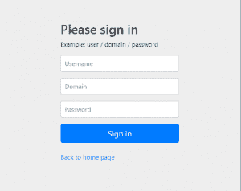

# Spring Security 的额外登录字段

> 原文：<https://web.archive.org/web/20220930061024/https://www.baeldung.com/spring-security-extra-login-fields>

## **1。简介**

在本文中，我们将通过**向标准登录表单**添加一个额外的字段，用 [Spring Security](https://web.archive.org/web/20220625170540/https://projects.spring.io/spring-security/) 实现一个定制认证场景。

我们将关注 **2 种不同的方法**，以展示该框架的多功能性以及我们可以灵活使用它的方式。

**我们的第一个方法**将是一个简单的解决方案，侧重于重用现有的核心 Spring 安全实现。

**我们的第二种方法**将是更加定制的解决方案，可能更适合高级用例。

我们将建立在之前关于 Spring 安全登录的文章中讨论的概念之上。

## **2。Maven 设置**

我们将使用 Spring Boot 启动器来引导我们的项目，并引入所有必要的依赖项。

我们将使用的设置需要一个父声明、web starter 和 security starter。我们还将包括百里香叶:

```
<parent>
    <groupId>org.springframework.boot</groupId>
    <artifactId>spring-boot-starter-parent</artifactId>
    <version>2.6.1</version>
    <relativePath/>
</parent>

<dependencies>
    <dependency>
        <groupId>org.springframework.boot</groupId>
        <artifactId>spring-boot-starter-web</artifactId>
    </dependency>
    <dependency>
        <groupId>org.springframework.boot</groupId>
        <artifactId>spring-boot-starter-security</artifactId>
    </dependency>
    <dependency>
        <groupId>org.springframework.boot</groupId>
        <artifactId>spring-boot-starter-thymeleaf</artifactId>
     </dependency>
     <dependency>
        <groupId>org.thymeleaf.extras</groupId>
        <artifactId>thymeleaf-extras-springsecurity5</artifactId>
    </dependency>
</dependencies>
```

最新版本的 Spring Boot 安全入门可以在 Maven Central 找到[。](https://web.archive.org/web/20220625170540/https://search.maven.org/classic/#search%7Cga%7C1%7Cg%3A%22org.springframework.boot%22%20AND%20a%3A%22spring-boot-starter-security%22)

## **3。简单的项目设置**

在我们的第一种方法中，我们将关注重用 Spring Security 提供的实现。特别是，我们将重用`DaoAuthenticationProvider` 和`UsernamePasswordToken`，因为它们“开箱即用”。

关键组成部分将包括:

*   **`SimpleAuthenticationFilter`–**`UsernamePasswordAuthenticationFilter`的延伸
*   **`SimpleUserDetailsService`–**`UserDetailsService`的一个实现
*   **`Us``er`–**Spring Security 提供的`User`类的扩展，声明了我们额外的`domain`字段
*   **`Securi``tyConfig`–**我们的 Spring 安全配置将我们的`SimpleAuthenticationFilter`插入过滤器链，声明安全规则并连接依赖项
*   **login.html**T5—集合了`username`、`password`和`domain`的登录页面

### **3.1。简单认证过滤器**

在我们的`SimpleAuthenticationFilter`、**中，域和用户名字段是从请求**中提取的。我们连接这些值，并用它们创建一个`UsernamePasswordAuthenticationToken`的实例。

**令牌随后被传递给`AuthenticationProvider`** 进行认证 *:*

```
public class SimpleAuthenticationFilter
  extends UsernamePasswordAuthenticationFilter {

    @Override
    public Authentication attemptAuthentication(
      HttpServletRequest request, 
      HttpServletResponse response) 
        throws AuthenticationException {

        // ...

        UsernamePasswordAuthenticationToken authRequest
          = getAuthRequest(request);
        setDetails(request, authRequest);

        return this.getAuthenticationManager()
          .authenticate(authRequest);
    }

    private UsernamePasswordAuthenticationToken getAuthRequest(
      HttpServletRequest request) {

        String username = obtainUsername(request);
        String password = obtainPassword(request);
        String domain = obtainDomain(request);

        // ...

        String usernameDomain = String.format("%s%s%s", username.trim(), 
          String.valueOf(Character.LINE_SEPARATOR), domain);
        return new UsernamePasswordAuthenticationToken(
          usernameDomain, password);
    }

    // other methods
}
```

### **3.2。简单的`UserDetails`服务**

`UserDetailsService`契约定义了一个名为`loadUserByUsername.` **的方法，我们的实现提取了`username`和`domain.`** ，然后将值传递给我们的 U `serRepository`以获得`User`:

```
public class SimpleUserDetailsService implements UserDetailsService {

    // ...

    @Override
    public UserDetails loadUserByUsername(String username) throws UsernameNotFoundException {
        String[] usernameAndDomain = StringUtils.split(
          username, String.valueOf(Character.LINE_SEPARATOR));
        if (usernameAndDomain == null || usernameAndDomain.length != 2) {
            throw new UsernameNotFoundException("Username and domain must be provided");
        }
        User user = userRepository.findUser(usernameAndDomain[0], usernameAndDomain[1]);
        if (user == null) {
            throw new UsernameNotFoundException(
              String.format("Username not found for domain, username=%s, domain=%s", 
                usernameAndDomain[0], usernameAndDomain[1]));
        }
        return user;
    }
} 
```

### **3.3。Spring 安全配置**

我们的设置不同于标准的 Spring 安全配置，因为**我们通过调用`addFilterBefore`将`SimpleAuthenticationFilter`插入到默认**之前的过滤器链中:

```
@Override
protected void configure(HttpSecurity http) throws Exception {

    http
      .addFilterBefore(authenticationFilter(), 
        UsernamePasswordAuthenticationFilter.class)
      .authorizeRequests()
        .antMatchers("/css/**", "/index").permitAll()
        .antMatchers("/user/**").authenticated()
      .and()
      .formLogin().loginPage("/login")
      .and()
      .logout()
      .logoutUrl("/logout");
}
```

我们能够使用提供的`DaoAuthenticationProvider`，因为我们用我们的`SimpleUserDetailsService`配置了它。回想一下**我们的`SimpleUserDetailsService`知道如何解析出我们的`username`和`domain`字段**并返回适当的`User`以在认证时使用:

```
public AuthenticationProvider authProvider() {
    DaoAuthenticationProvider provider = new DaoAuthenticationProvider();
    provider.setUserDetailsService(userDetailsService);
    provider.setPasswordEncoder(passwordEncoder());
    return provider;
} 
```

由于我们使用的是`SimpleAuthenticationFilter`，我们配置了自己的`AuthenticationFailureHandler`来确保失败的登录尝试得到适当的处理:

```
public SimpleAuthenticationFilter authenticationFilter() throws Exception {
    SimpleAuthenticationFilter filter = new SimpleAuthenticationFilter();
    filter.setAuthenticationManager(authenticationManagerBean());
    filter.setAuthenticationFailureHandler(failureHandler());
    return filter;
}
```

### **3.4。登录页面**

我们使用的登录页面收集由我们的`SimpleAuthenticationFilter:`提取的额外的`domain`字段

```
<form class="form-signin" th:action="@{/login}" method="post">
 <h2 class="form-signin-heading">Please sign in</h2>
 <p>Example: user / domain / password</p>
 <p th:if="${param.error}" class="error">Invalid user, password, or domain</p>
 <p>
   <label for="username" class="sr-only">Username</label>
   <input type="text" id="username" name="username" class="form-control" 
     placeholder="Username" required autofocus/>
 </p>
 <p>
   <label for="domain" class="sr-only">Domain</label>
   <input type="text" id="domain" name="domain" class="form-control" 
     placeholder="Domain" required autofocus/>
 </p>
 <p>
   <label for="password" class="sr-only">Password</label>
   <input type="password" id="password" name="password" class="form-control" 
     placeholder="Password" required autofocus/>
 </p>
 <button class="btn btn-lg btn-primary btn-block" type="submit">Sign in</button><br/>
 <p><a href="/index" th:href="@{/index}">Back to home page</a></p>
</form>
```

当我们运行应用程序并访问位于 [http://localhost:8081](https://web.archive.org/web/20220625170540/http://localhost:8081/) 的上下文时，我们会看到一个访问安全页面的链接。单击该链接将显示登录页面。不出所料，**我们看到了附加域字段**:

[](/web/20220625170540/https://www.baeldung.com/wp-content/uploads/2018/01/Spring_Security_Extra_Fields_Login_page-300x238.png)

### **3.5。总结**

在我们的第一个例子中，我们能够通过“伪造”用户名字段来重用`DaoAuthenticationProvider`和`UsernamePasswordAuthenticationToken`。

因此，我们能够用最少的配置和额外的代码为额外的登录字段添加支持。

## **4。自定义项目设置**

我们的第二种方法将与第一种非常相似，但可能更适合非平凡的用例。

我们第二种方法的关键组成部分将包括:

*   **`CustomAuthenticationFilter`–**`UsernamePasswordAuthenticationFilter`的延伸
*   **`CustomUserDetailsService`–**声明`loadUserbyUsernameAndDomain`方法的自定义接口
*   **`CustomUserDetailsServiceImpl`–**我们`CustomUserDetailsService`的一个实现
*   **`CustomUserDetailsAuthenticationProvider`–**`AbstractUserDetailsAuthenticationProvider`的延伸
*   **`CustomAuthenticationToken`–**`UsernamePasswordAuthenticationToken`的延伸
*   **`Us``er`–**Spring Security 提供的`User`类的扩展，声明了我们额外的`domain`字段
*   **`Securi``tyConfig`–**我们的 Spring 安全配置将我们的`CustomAuthenticationFilter`插入过滤器链，声明安全规则并连接依赖项
*   **login.html**T5—集合了`username`、`password`和`domain`的登录页面

### **4.1。自定义认证过滤器**

在我们的`CustomAuthenticationFilter`中，我们**从请求**中提取用户名、密码和域字段。这些值用于创建我们的自定义`AuthenticationToken`的实例，该实例被传递给`AuthenticationProvider`进行身份验证:

```
public class CustomAuthenticationFilter 
  extends UsernamePasswordAuthenticationFilter {

    public static final String SPRING_SECURITY_FORM_DOMAIN_KEY = "domain";

    @Override
    public Authentication attemptAuthentication(
        HttpServletRequest request,
        HttpServletResponse response) 
          throws AuthenticationException {

        // ...

        CustomAuthenticationToken authRequest = getAuthRequest(request);
        setDetails(request, authRequest);
        return this.getAuthenticationManager().authenticate(authRequest);
    }

    private CustomAuthenticationToken getAuthRequest(HttpServletRequest request) {
        String username = obtainUsername(request);
        String password = obtainPassword(request);
        String domain = obtainDomain(request);

        // ...

        return new CustomAuthenticationToken(username, password, domain);
    }
```

### **4.2。顾客服务**

我们的`CustomUserDetailsService` 契约定义了一个名为`loadUserByUsernameAndDomain.` 的方法

我们创建的`CustomUserDetailsServiceImpl`类简单地实现了契约，并委托给我们的`CustomUserRepository`来获得`User`:

```
 public UserDetails loadUserByUsernameAndDomain(String username, String domain) 
     throws UsernameNotFoundException {
     if (StringUtils.isAnyBlank(username, domain)) {
         throw new UsernameNotFoundException("Username and domain must be provided");
     }
     User user = userRepository.findUser(username, domain);
     if (user == null) {
         throw new UsernameNotFoundException(
           String.format("Username not found for domain, username=%s, domain=%s", 
             username, domain));
     }
     return user;
 }
```

### **4.3。`UserDetailsAuthenticationProvider`风俗**

我们的`CustomUserDetailsAuthenticationProvider`扩展`AbstractUserDetailsAuthenticationProvider` 并委托给我们的`CustomUserDetailService`来检索`User`。这个类最重要的特点是实现了`retrieveUser`方法。

请注意，我们必须将身份验证令牌转换为我们的`CustomAuthenticationToken` ,以便访问我们的自定义字段:

```
@Override
protected UserDetails retrieveUser(String username, 
  UsernamePasswordAuthenticationToken authentication) 
    throws AuthenticationException {

    CustomAuthenticationToken auth = (CustomAuthenticationToken) authentication;
    UserDetails loadedUser;

    try {
        loadedUser = this.userDetailsService
          .loadUserByUsernameAndDomain(auth.getPrincipal()
            .toString(), auth.getDomain());
    } catch (UsernameNotFoundException notFound) {

        if (authentication.getCredentials() != null) {
            String presentedPassword = authentication.getCredentials()
              .toString();
            passwordEncoder.matches(presentedPassword, userNotFoundEncodedPassword);
        }
        throw notFound;
    } catch (Exception repositoryProblem) {

        throw new InternalAuthenticationServiceException(
          repositoryProblem.getMessage(), repositoryProblem);
    }

    // ...

    return loadedUser;
}
```

### 4.4。总结

我们的第二种方法与我们第一次提出的简单方法几乎相同。通过实现我们自己的`AuthenticationProvider`和`CustomAuthenticationToken`，我们避免了用定制的解析逻辑来修改我们的用户名字段。

## **5。结论**

在本文中，我们在 Spring Security 中实现了一个表单登录，它利用了一个额外的登录字段。我们以两种不同的方式做到了这一点:

*   在我们的简单方法中，我们最小化了需要编写的代码量。通过使用自定义解析逻辑修改用户名,我们能够重用`DaoAuthenticationProvider`和用户名密码认证
*   在我们更加定制化的方法中，我们通过**扩展 AbstractUserDetailsAuthenticationProvider 并为我们自己的`CustomUserDetailsService`提供一个`CustomAuthenticationToken`** 来提供定制字段支持

和往常一样，所有源代码都可以在 GitHub 上找到[。](https://web.archive.org/web/20220625170540/https://github.com/eugenp/tutorials/tree/master/spring-security-modules/spring-security-web-login)