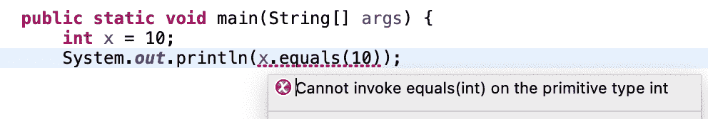

# Java“int/char 不能被取消引用”错误

> 原文：<https://web.archive.org/web/20220930061024/https://www.baeldung.com/java-int-char-cannot-be-dereferenced>

## 1.概观

在本教程中，我们将仔细研究 Java 错误“int 不能被解引用”。首先，我们将创建一个如何生成它的示例。接下来，我们将解释异常的主要原因。最后，我们将看到如何修复它。

## 2.实际例子

现在，让我们看一个产生编译错误的例子，“X 不能被解引用”。

这里，`X`代表八个 [Java 原语](/web/20220712150220/https://www.baeldung.com/java-primitives)中的一个，即`int`、`byte`、`short`、`long`、`float`、`double`、`boolean`、`char`。

首先，让我们创建一个类`Test`和**比较一个`int`和其他值**:

[PRE0]

当从终端编译代码时，我们会得到错误:

[PRE1]

此外，像 Eclipse 和 IntelliJ 这样的现代 ide 甚至在没有编译的情况下就会显示错误:

## 3.原因

在 Java 中，引用是某个对象/变量的地址。解引用意味着通过引用来访问对象特性的行为。**对一个原语执行任何解引用都会导致错误“X 不能被解引用”，这里 X 是一个原语类型。**原因是[原语不被视为对象](/web/20220712150220/https://www.baeldung.com/java-primitives-vs-objects)——它们代表原始值:

[PRE2]

当从终端构建代码时，我们会得到错误"`int cannot be dereferenced”`。

然而，使用`Object`，它工作得很好:

[PRE3]

这里，`testObj`是一个对象，在用**调用`toString()`时发生解引用。**在`testObj.`上的操作符这不会给出任何错误，因为`testObj`是一个对象，因此，解引用将起作用。

## 4.解决办法

在我们的例子中，我们需要检查这两个值是否相等。

对于我们的问题，**的第一个解决方案是对原始类型**使用`==`而不是`equals()`:

[PRE4]

当我们运行代码时，它将打印“true”。

第二个解决方案是将原语更改为包装类。

Java 为每个原始类型提供了[包装类](/web/20220712150220/https://www.baeldung.com/java-wrapper-classes)对象。

例如，如果我们必须使用`equals()`，我们可以将基本类型转换为包装对象:

[PRE5]

这个错误没有一个通用的解决方案。根据使用案例，我们可以使用上述两种解决方案中的任何一种。

## 5.结论

我们已经解释了 Java 的`“int cannot be dereferenced”`错误。然后，我们讨论了如何产生错误和异常的原因。最后，我们讨论了解决错误的方法。