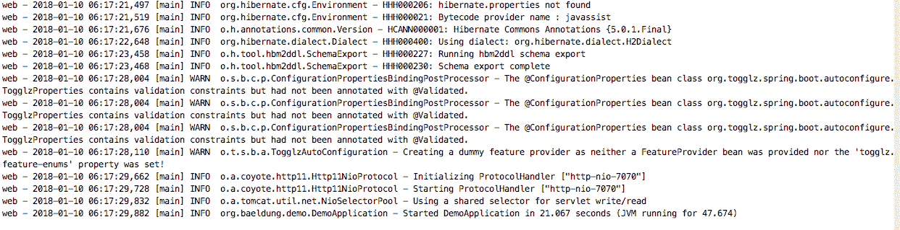

# Maven 包装器快速指南

> 原文：<https://web.archive.org/web/20220930061024/https://www.baeldung.com/maven-wrapper>

## **1。概述**

对于需要特定版本的 Maven 的项目来说, [Maven 包装器](https://web.archive.org/web/20220628054711/https://maven.apache.org/wrapper/)是一个极好的选择(或者对于根本不想安装 Maven 的用户来说)。**不用在操作系统中安装很多版本，我们可以直接使用特定于项目的包装脚本。**

在这篇简短的文章中，我们将展示如何为现有的 Maven 项目设置 Maven 包装器。

## **2。设置 Maven 包装器**

在一个项目中有两种方法来配置它，其中最简单的一种是使用一个合适的插件来自动完成或者通过手动安装。

### **2.1。插件**

让我们使用这个 [Maven 包装插件](https://web.archive.org/web/20220628054711/https://maven.apache.org/wrapper/maven-wrapper-plugin/)在一个简单的 Spring Boot 项目中进行自动安装。

首先，我们需要进入项目的主文件夹并运行以下命令:

[PRE0]

我们还可以指定 Maven 的版本:

[PRE1]

选项`-N`表示`–non-recursive`,这样包装器将只应用于当前目录的主项目，而不是任何子模块。

在执行目标之后，我们将在项目中有更多的文件和目录:

*   这是一个可执行的 Unix shell 脚本，用来代替完全安装的 Maven
*   `mvnw.cmd`:上面脚本的批量版本
*   `mvn`:保存 Maven 包装器 Java 库及其属性文件的隐藏文件夹

### **2.2。手动**

通过手动方式，我们可以将上面看到的文件和文件夹从另一个项目复制到当前项目的主文件夹中。

然后，我们需要在位于`.mvn/wrapper/maven-wrapper.properties`文件中的包装器属性文件中指定要使用的 Maven 版本。

例如，我们的属性文件包含以下行:

[PRE2]

因此，将下载并使用版本 3.5.2。

## **3。用例**

包装器应该可以与不同的操作系统一起工作，例如:

*   Linux 操作系统
*   OSX
*   Windows 操作系统
*   Solaris

之后，我们可以为 Unix 系统运行我们的目标，如下所示:

[PRE3]

以及以下用于 Windows 的命令:

[PRE4]

**如果我们在包装器属性中没有指定的 Maven，它将被下载并安装在系统的文件夹`$USER_HOME/.m2/wrapper/dists`中。**

让我们运行我们的春季启动项目:

[PRE5]

输出与完全安装的 Maven 相同:

注意:我们使用可执行文件`mvnw`来代替现在作为 Maven 命令行程序的`mvn,` 。

现在我们知道了 Maven wrapper 是什么，让我们来回答一个常见的问题:是否应该将`mvnw`文件添加到我们的项目中？

简而言之，编号为 **`mvnw`的文件不一定是我们项目**的一部分。然而，包括他们可能是有益的。例如，它将允许任何克隆我们项目的人在不安装 Maven 的情况下构建它。

## **4。结论**

在本教程中，我们看到了如何在 Maven 项目中设置和使用 Maven 包装器。

和往常一样，这篇文章的源代码可以在 GitHub 上找到[。](https://web.archive.org/web/20220628054711/https://github.com/eugenp/tutorials/tree/master/spring-boot-modules/spring-boot-artifacts)