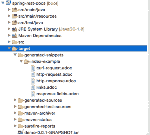
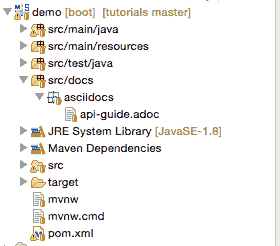
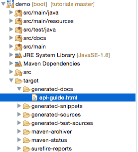
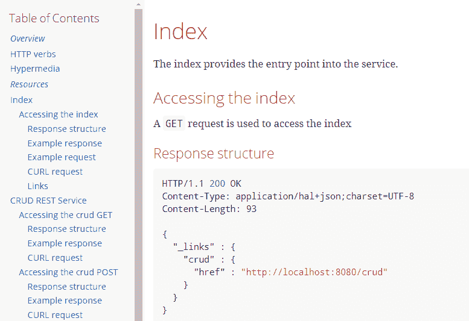

# Spring REST 文档介绍

> 原文:[https://web . archive . org/web/20220930061024/https://www . bael dung . com/spring-rest-docs](https://web.archive.org/web/20220930061024/https://www.baeldung.com/spring-rest-docs)

## **1。概述**

[Spring REST Docs](https://web.archive.org/web/20221208143841/https://spring.io/projects/spring-restdocs) 为 RESTful 服务生成准确可读的文档。它将手写文档与 Spring 测试生成的自动生成的文档片段结合起来。

## **2。优势**

项目背后的一个主要理念是使用测试来产生文档。这确保了生成的文档总是准确地匹配 API 的实际行为。此外，输出已经准备好由[asciidor](https://web.archive.org/web/20221208143841/http://asciidoctor.org/)处理，这是一个以 AsciiDoc 语法为中心的发布工具链。这是用于生成 Spring 框架文档的同一个工具。

这些方法减少了其他框架带来的限制。Spring REST Docs 生成准确、简洁、结构良好的文档。然后，这个文档允许 web 服务消费者毫不费力地获得他们需要的信息。

该工具还有其他一些优点，例如:

*   生成 curl 和 http 请求片段
*   易于将文档打包到项目 jar 文件中
*   很容易向代码片段添加额外的信息
*   支持 JSON 和 XML

产生代码片段的测试可以使用 Spring MVC 测试支持、Spring Webflux 的`WebTestClient`或者放心地编写。

在我们的例子中，我们将使用 Spring MVC 测试，但是使用其他框架非常相似。

## **3。依赖性**

开始在项目中使用 Spring REST 文档的理想方式是使用依赖管理系统。这里，我们使用 Maven 作为构建工具，所以下面的依赖项可以复制并粘贴到您的 POM 中:

```
<dependency>
    <groupId>org.springframework.restdocs</groupId>
    <artifactId>spring-restdocs-mockmvc</artifactId>
    <version>2.0.4.RELEASE</version>
</dependency>
```

您也可以在 Maven Central 上查看新版本的依赖关系[这里是](https://web.archive.org/web/20221208143841/https://search.maven.org/classic/#search|gav|1|g%3A%22org.springframework.restdocs%22%20AND%20a%3A%22spring-restdocs-mockmvc%22)。

在我们的例子中，我们需要`spring-restdocs-mockmvc`依赖项，因为我们使用 Spring MVC 测试支持来创建我们的测试。

如果我们想使用 WebTestClient 或放心地编写测试，我们将需要[spring-restdocs-webtest client](https://web.archive.org/web/20221208143841/https://search.maven.org/classic/#search%7Cga%7C1%7Ca%3A%22spring-restdocs-webtestclient%22)和[spring-restdocs-restassured](https://web.archive.org/web/20221208143841/https://search.maven.org/classic/#search%7Cga%7C1%7Ca%3A%22spring-restdocs-restassured%22)依赖项。

## **4。配置**

如前所述，我们将使用 Spring MVC 测试框架向 REST 服务发出请求，这些请求将被记录在案。运行测试会为请求和结果响应生成文档片段。

我们可以在 JUnit 4 和 JUnit 5 测试中使用这个库。让我们来看看每一个都需要什么样的配置。

### **4.1。JUnit 4 配置**

为 JUnit 4 测试生成文档片段的第一步是**声明一个公共`JUnitRestDocumentation`字段，该字段被注释为 JUnit`@Rule`T3。**

`JUnitRestDocumentation`规则配置有输出目录，生成的代码片段应该保存在该目录中。例如，该目录可以是 Maven 的构建目录:

```
@Rule
public JUnitRestDocumentation restDocumentation = new JUnitRestDocumentation("target/generated-snippets");
```

接下来，我们设置`MockMvc`上下文，这样它将被配置为生成文档:

```
@Autowired
private WebApplicationContext context;

private MockMvc mockMvc;

@Before
public void setUp(){
    this.mockMvc = MockMvcBuilders.webAppContextSetup(this.context)
      .apply(documentationConfiguration(this.restDocumentation))
      .build();
}
```

使用 MockMvc `RestDocumentationConfigurer`配置`MockMvc`对象。这个类的一个实例可以从`org.springframework.restdocs.mockmvc.MockMvcRestDocumentation`上的静态`documentationConfiguration()`方法中获得。

### **4.2。JUnit 5 配置**

**为了使用 JUnit 5 测试，我们必须使用`RestDocumentationExtension`类来扩展测试:**

```
@ExtendWith({RestDocumentationExtension.class, SpringExtension.class})
@SpringBootTest
public class ApiDocumentationJUnit5IntegrationTest { //... }
```

当使用 Maven 时，这个类自动配置有一个`/target/generated-snippets`输出目录，或者为 Gradle 配置一个`/build/generate-snippets`。

接下来，我们必须在一个`@BeforeEach`方法中设置`MockMvc`实例:

```
@BeforeEach
public void setUp(WebApplicationContext webApplicationContext,
  RestDocumentationContextProvider restDocumentation) {
    this.mockMvc = MockMvcBuilders.webAppContextSetup(webApplicationContext)
      .apply(documentationConfiguration(restDocumentation)).build();
}
```

**如果我们不使用 JUnit 进行测试，那么我们必须使用`ManualRestDocumentation`类。**

## **5。RESTful 服务**

让我们创建一个可以记录的 CRUD RESTful 服务:

```
@RestController
@RequestMapping("/crud")
public class CRUDController {

    @GetMapping
    public List<CrudInput> read(@RequestBody CrudInput crudInput) {
        List<CrudInput> returnList = new ArrayList<CrudInput>();
        returnList.add(crudInput);
        return returnList;
    }

    @ResponseStatus(HttpStatus.CREATED)
    @PostMapping
    public HttpHeaders save(@RequestBody CrudInput crudInput) {
        HttpHeaders httpHeaders = new HttpHeaders();
        httpHeaders.setLocation(
          linkTo(CRUDController.class).slash(crudInput.getTitle()).toUri());
        return httpHeaders;
    }

    @DeleteMapping("/{id}")
    public void delete(@PathVariable("id") long id) {
        // delete
    }
}
```

然后，让我们添加一个`IndexController`，它返回一个包含到`CRUDController`基本端点的链接的页面:

```
@RestController
@RequestMapping("/")
public class IndexController {

    static class CustomRepresentationModel extends RepresentationModel<CustomRepresentationModel> {
        public CustomRepresentationModel(Link initialLink) {
            super(initialLink);
        }
    }

    @GetMapping
    public CustomRepresentationModel index() {
        return new CustomRepresentationModel(linkTo(CRUDController.class).withRel("crud"));
    }
}
```

## **6。JUnit 测试**

回到测试中，我们可以使用`MockMvc`实例来调用我们的服务并记录请求和响应。

首先，**为了确保每个`MockMvc`调用都被自动记录下来，而不需要任何进一步的配置，我们可以使用`alwaysDo()`方法**:

```
this.mockMvc = MockMvcBuilders
  //...
  .alwaysDo(document("{method-name}", 
    preprocessRequest(prettyPrint()), preprocessResponse(prettyPrint())))
  .build();
```

这种设置确保了对于每个`MockMvc`调用，默认的代码片断被创建在一个带有测试方法名称的文件夹中。此外，应用`prettyPrint()`预处理程序以更容易阅读的方式显示代码片段。

让我们继续定制一些通话。

**为了记录包含链接的索引页面，我们可以使用静态的`links()`方法:**

```
@Test
public void indexExample() throws Exception {
    this.mockMvc.perform(get("/")).andExpect(status().isOk())
      .andDo(document("index", 
        links(linkWithRel("crud").description("The CRUD resource")), 
        responseFields(subsectionWithPath("_links")
          .description("Links to other resources"))
        responseHeaders(headerWithName("Content-Type")
          .description("The Content-Type of the payload"))));
}
```

这里，我们使用`linkWithRel()`方法来记录到`/crud.` 的链接

为了给响应添加一个`Content-Type`头，我们使用`headerWithName()`方法记录它，并将其添加到`responseHeaders()`方法中。

**我们还使用`responseFields()`方法记录响应负载。**这可用于使用 subsectionWithPath()或 fieldWithPath()方法记录响应的更复杂的子部分或单个字段。

类似于响应负载，**我们也可以使用`requestPayload():`** 来记录请求负载

```
@Test
public void crudCreateExample() throws Exception {
    Map<String, Object> crud = new HashMap<>();
    crud.put("title", "Sample Model");
    crud.put("body", "http://www.baeldung.com/");

    this.mockMvc.perform(post("/crud").contentType(MediaTypes.HAL_JSON)
      .content(this.objectMapper.writeValueAsString(crud)))
      .andExpect(status().isCreated())
      .andDo(document("create-crud-example", 
        requestFields(fieldWithPath("id").description("The id of the input"),
          fieldWithPath("title").description("The title of the input"),
          fieldWithPath("body").description("The body of the input"),
        ))));
}
```

在这个例子中，我们记录了我们的 POST 请求，该请求接收一个带有标题和正文字段的`CrudInput`模型，并发送一个创建状态。**使用`fieldWithPath()`方法记录每个字段。**

**为了记录请求和路径参数，我们可以使用`requestParameters()`和`pathParameters()`方法。**两种方法都使用一种`parameterWithName()`方法来描述每个参数:

```
@Test
public void crudDeleteExample() throws Exception {
    this.mockMvc.perform(delete("/crud/{id}", 10)).andExpect(status().isOk())
      .andDo(document("crud-delete-example", 
      pathParameters(
        parameterWithName("id").description("The id of the input to delete")
      )));
}
```

这里，我们记录了接收一个`id`路径参数的删除端点。

Spring REST Docs 项目包含了更加强大的文档功能，比如可以在[文档](https://web.archive.org/web/20221208143841/https://docs.spring.io/spring-restdocs/docs/2.0.5.RELEASE/reference/html5/)中找到的字段约束和请求部分。

## **7。输出**

一旦构建成功运行，将生成 REST docs 片段的输出，并保存到`target/generated-snippets`文件夹:

[](/web/20221208143841/https://www.baeldung.com/wp-content/uploads/2016/07/Screen-Shot-2016-04-04-at-11.48.52-PM-300x270.png)

生成的输出将包含有关服务的信息、如何调用 REST 服务(如“curl”调用)、来自 REST 服务的 HTTP 请求和响应，以及到服务的链接/端点:

**卷曲命令**

```
----
$ curl 'http://localhost:8080/' -i
----
```

**HTTP–REST 响应**

```
[source,http,options="nowrap"]
----
HTTP/1.1 200 OK
Content-Type: application/hal+json;charset=UTF-8
Content-Length: 93

{
  "_links" : {
    "crud" : {
      "href" : "http://localhost:8080/crud"
    }
  }
}
----
```

## **8。使用片段创建文档**

为了在更大的文档中使用代码片段，您可以使用 Asciidoc `includes.`引用它们。在我们的例子中，我们在`src/docs`中创建了一个名为`api-guide.adoc`的文档:

[](/web/20221208143841/https://www.baeldung.com/wp-content/uploads/2016/07/Screen-Shot-2016-05-01-at-8.51.48-PM.png)

在那个文档中，如果我们希望引用 links 片段，我们可以使用占位符`{snippets}` 来包含它，当 Maven 处理文档时，它将替换这个占位符:

```
==== Links

include::{snippets}/index-example/links.adoc[]
```

## **9。Asciidocs Maven 插件**

为了将 API 指南从 Asciidoc 转换成可读格式，我们可以在构建生命周期中添加一个 Maven 插件。实现这一点有几个步骤:

1.  将 Asciidoctor 插件应用到`pom.xml`
2.  在`testCompile`配置中添加对`spring-restdocs-mockmvc`的依赖，如依赖部分所述
3.  配置属性以定义生成的代码段的输出位置
4.  配置`test`任务以添加 snippets 目录作为输出
5.  配置`asciidoctor`任务
6.  定义一个名为`snippets`的属性，在文档中包含生成的代码片段时可以使用这个属性
7.  使任务依赖于`test`任务，以便在文档创建之前运行测试
8.  将`snippets`目录配置为输入。所有生成的代码片段都将在此目录下创建

将代码片段目录作为属性添加到`pom.xml`中，这样 Asciidoctor 插件就可以使用这个路径在这个文件夹下生成代码片段:

```
<properties>
    <snippetsDirectory>${project.build.directory}/generated-snippets</snippetsDirectory>
</properties>
```

用于从构建中生成 Asciidoc 片段的`pom.xml`中的 Maven 插件配置如下:

```
<plugin> 
    <groupId>org.asciidoctor</groupId>
    <artifactId>asciidoctor-maven-plugin</artifactId>
    <version>1.5.6</version>
    <executions>
        <execution>
            <id>generate-docs</id>
            <phase>package</phase> 
            <goals>
                <goal>process-asciidoc</goal>
            </goals>
            <configuration>
                <backend>html</backend>
                <doctype>book</doctype>
                <attributes>
                    <snippets>${snippetsDirectory}</snippets> 
                </attributes>
                <sourceDirectory>src/docs/asciidocs</sourceDirectory>
                <outputDirectory>target/generated-docs</outputDirectory>
             </configuration>
	 </execution>
    </executions>
</plugin>
```

## 10。API 单据生成流程

当 Maven 构建运行并执行测试时，所有的代码片段都将在已配置的`target/generated-snippets`目录下的 snippets 文件夹中生成。一旦生成了代码片段，构建过程就会生成 HTML 输出。

[](/web/20221208143841/https://www.baeldung.com/wp-content/uploads/2016/07/Screen-Shot-2016-05-08-at-11.32.25-PM.png)

生成的 HTML 文件是格式化的，可读的，所以 REST 文档已经可以使用了。每次 Maven 构建运行时，都会生成带有最新更新的文档。

[](/web/20221208143841/https://www.baeldung.com/wp-content/uploads/2016/05/docs.png)

## **11。结论**

没有文档总比错误的文档好，但是 Spring REST 文档将有助于为 RESTful 服务生成准确的文档。

作为一个官方的 Spring 项目，它通过使用三个测试库来完成它的目标:Spring MVC Test、`WebTestClient`和放心。这种生成文档的方法有助于支持开发和记录 RESTful APIs 的测试驱动方法。

您可以在[链接的 GitHub 资源库](https://web.archive.org/web/20221208143841/https://github.com/eugenp/tutorials/tree/master/spring-5)中找到基于本文代码的示例项目。