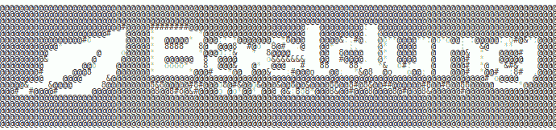

# 在 Spring Boot 使用自定义横幅

> 原文：<https://web.archive.org/web/20220930061024/https://www.baeldung.com/spring-boot-custom-banners>

## **1。概述**

默认情况下，Spring Boot 自带一个横幅，应用程序一启动就会显示出来。

在这篇文章中，我们将学习如何创建一个自定义横幅，并在 Spring Boot 应用程序中使用它。

## **2。创建横幅**

在开始之前，我们需要创建一个自定义的横幅，它将在应用程序启动时显示。我们可以从头开始创建自定义横幅，或者使用各种工具来完成这项工作。

在本例中，我们使用了 Baeldung 的官方标志:

然而，在某些情况下，我们可能喜欢使用纯文本格式的横幅，因为它相对更容易维护。

我们在本例中使用的纯文本自定义横幅在[这里](https://web.archive.org/web/20220626202546/https://github.com/eugenp/tutorials/blob/master/spring-boot-modules/spring-boot-basic-customization/src/main/resources/banner.txt)可用。

这里要注意的一点是，ANSI charset 能够在控制台中显示彩色文本。简单的纯文本格式无法做到这一点。

## **3。使用自定义横幅**

既然我们已经准备好了定制横幅，我们需要在`src/main/resources`目录中创建一个名为`banner.txt`的文件，并将横幅内容粘贴到其中。

这里要注意的一点是，`banner.txt`是默认的预期标题文件名，这是 Spring Boot 使用的。然而，如果我们想为横幅选择任何其他位置或其他名称，我们需要在`application.properties`文件中设置`spring.banner.location`属性:

[PRE0]

我们也可以使用图像作为横幅。与`banner.txt`相同，Spring Boot 希望横幅图像的名称为`banner.gif`。此外，我们可以设置不同的图像属性，如高度、宽度等。在`application.properties`:

[PRE1]

然而，使用文本格式总是更好，因为如果使用一些复杂的图像结构，应用程序的启动时间会急剧增加。

## **4。结论**

在这篇简短的文章中，我们展示了如何在 Spring Boot 应用程序中使用自定义横幅。

像往常一样，完整的源代码可以在 GitHub 上获得[。](https://web.archive.org/web/20220626202546/https://github.com/eugenp/tutorials/tree/master/spring-boot-modules/spring-boot-basic-customization)