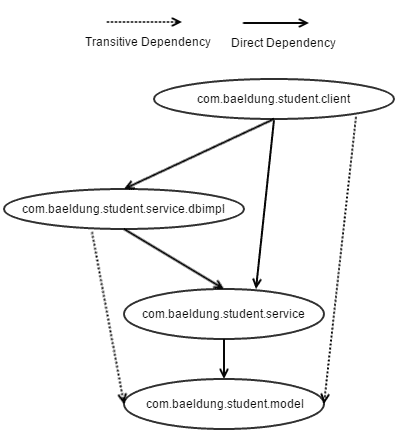
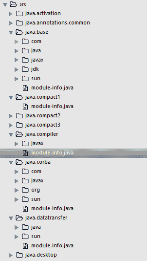
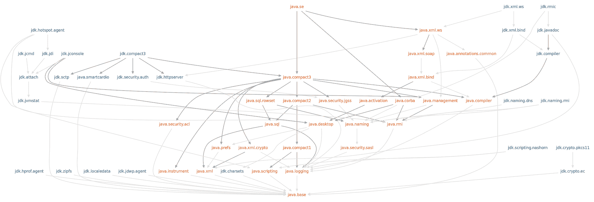

# 拼图项目简介

> 原文：<https://web.archive.org/web/20220930061024/https://www.baeldung.com/project-jigsaw-java-modularity>

## 1。简介

[拼图项目](https://web.archive.org/web/20221020130432/https://openjdk.java.net/projects/jigsaw/)是一个伞式项目，具有针对两个方面的新特性:

*   Java 语言中的模块系统介绍
*   及其在 JDK 源代码和 Java 运行时中的实现

在本文中，我们将向您介绍 Jigsaw 项目及其特性，最后用一个简单的模块化应用程序结束它。

## 2。模块化

简而言之，模块化是一种设计原则，可以帮助我们实现:

*   组件之间的松散耦合
*   明确组件之间的契约和依赖关系
*   使用强封装的隐藏实现

### 2.1。模块化单位

现在问题来了，模块化的单位是什么？在 Java 世界，尤其是 OSGi，jar 被认为是模块化的单元。

JARs 确实有助于将相关的组件组合在一起，但是它们也有一些限制:

*   jar 之间的显式契约和依赖关系
*   jar 中元素的弱封装

### 2.2。罐子地狱

罐子还有另一个问题——罐子地狱。类路径中有多个版本的 JAR，导致`ClassLoader`从 JAR 中加载第一个找到的类，结果出乎意料。

使用类路径的 JVM 的另一个问题是，应用程序的编译会成功，但是应用程序在运行时会因`ClassNotFoundException`而失败，因为运行时类路径上缺少 jar。

### 2.3。模块化的新单元

有了所有这些限制，当使用 JAR 作为模块化的单元时，Java 语言的创造者们提出了一种新的语言结构，称为模块。这样，Java 就有了一个全新的模块化系统。

## 3。拼图项目

该项目的主要动机是:

*   **创建语言**的模块系统——在 [JEP 261](https://web.archive.org/web/20221020130432/https://openjdk.java.net/jeps/261) 下实现
*   **应用于 JDK 源**——在 [JEP 201](https://web.archive.org/web/20221020130432/https://openjdk.java.net/jeps/201) 下实施
*   **模块化 JDK** **图书馆**—[JEP 200](https://web.archive.org/web/20221020130432/https://openjdk.java.net/jeps/200)下实施
*   **更新运行时以支持模块化**——在 [JEP 220](https://web.archive.org/web/20221020130432/https://openjdk.java.net/jeps/220) 下实施
*   **能够用 JDK** 的模块子集创建更小的运行时——在 [JEP 282](https://web.archive.org/web/20221020130432/https://openjdk.java.net/jeps/282) 下实现

另一个重要的举措是在 JDK 中封装内部 API，那些在`sun.*`包下的 API 和其他非标准 API。这些 API 从来没有打算供公众使用，也从来没有打算进行维护。但是这些 API 的强大功能使得 Java 开发人员在开发不同的库、框架和工具时可以利用它们。已经为少数内部 API 提供了替换，其他的已经移到了内部模块中。

## 4。模块化的新工具

*   **jdeps**–帮助分析代码库，确定对 JDK API 和第三方 jar 的依赖。它还提到了可以找到 JDK API 的模块的名称。这使得模块化代码库变得更加容易
*   **jdeprscan**–帮助分析代码库，了解任何已弃用的 API 的使用情况
*   jlink–通过结合应用程序和 JDK 的模块，帮助创建一个更小的运行时
*   **jmod**–帮助处理 jmod 文件。jmod 是一种封装模块的新格式。这种格式允许包含本机代码、配置文件和其他不适合 JAR 文件的数据

## 5。模块系统架构

用该语言实现的模块系统支持这些作为顶层结构，就像包一样。开发人员可以将他们的代码组织成模块，并在各自的模块定义文件中声明它们之间的依赖关系。

名为`module-info.java`的模块定义文件包含:

*   它的名字
*   它公开提供的包
*   它所依赖的模块
*   任何服务 it 消费者
*   它所提供的服务的任何实现

上面列表中的最后两项不常用。它们仅在通过`java.util.ServiceLoader`接口提供和消费服务时使用。

该模块的一般结构如下:

```
src
 |----com.baeldung.reader
 |     |----module-info.java
 |     |----com
 |          |----baeldung
 |               |----reader
 |                    |----Test.java
 |----com.baeldung.writer
      |----module-info.java
           |----com
                |----baeldung
                     |----writer
                          |----AnotherTest.java
```

上图定义了两个模块:`com.baeldung.reader` 和`com.baeldung.writer`。它们中的每一个都在`module-info.java`中有定义，代码文件分别放在`com/baeldung/reader`和`com/baeldung/writer`下。

### 5.1.模块定义术语

让我们看看一些术语；我们将在定义模块时使用(即在`module-info.java)`内:

*   `**module**`:模块定义文件以这个关键字开始，后面是它的名称和定义
*   `**requires**`:用于表示所依赖的模块；必须在该关键字后指定模块名
*   `**transitive**`:在`requires`关键字后指定；这意味着任何依赖于定义`requires transitive <modulename>`的模块的模块都会获得对<T3 的隐式依赖
*   `**exports**`:用于表示模块内公开可用的包；必须在该关键字后指定包名
*   `**opens**`:用于表示只在运行时可访问，也可通过反射 API 进行自省的包；这对于像 Spring 和 Hibernate 这样高度依赖反射 API 的库来说意义重大；`opens`也可以在模块级使用，在这种情况下，整个模块在运行时都是可访问的
*   `**uses**`:用于表示该模块正在使用的服务接口；必须在该关键字后指定类型名，即完整的类/接口名
*   **`provides … with ..`** 。:它们用于指示它为在`provides`关键字之后标识的服务接口提供了在`with`关键字之后标识的实现

## 6.简单的模块化应用

让我们创建一个简单的模块化应用程序，模块及其依赖关系如下图所示:

[](/web/20221020130432/https://www.baeldung.com/wp-content/uploads/2017/03/projectjigsaw_baeldun_modulegraph.png)

`com.baeldung.student.model`是根模块。它定义了模型类`com.baeldung.student.model.Student`，包含以下属性:

```
public class Student {
    private String registrationId;
    //other relevant fields, getters and setters
}
```

它为其他模块提供了在`com.baeldung.student.model`包中定义的类型。这是通过在文件`module-info.java`中定义它来实现的:

```
module com.baeldung.student.model {
    exports com.baeldung.student.model;
}
```

`com.baeldung.student.service`模块为抽象 CRUD 操作提供了一个接口`com.baeldung.student.service.StudentService`:

```
public interface StudentService {
    public String create(Student student);
    public Student read(String registrationId);
    public Student update(Student student);
    public String delete(String registrationId);
}
```

它依赖于`com.baeldung.student.model`模块，并使包`com.baeldung.student.service`中定义的类型可用于其他模块:

```
module com.baeldung.student.service {
    requires transitive com.baeldung.student.model;
    exports com.baeldung.student.service;
}
```

我们提供了另一个模块`com.baeldung.student.service.dbimpl`，它为上述模块提供了实现`com.baeldung.student.service.dbimpl.StudentDbService`:

```
public class StudentDbService implements StudentService {

    public String create(Student student) {
        // Creating student in DB
        return student.getRegistrationId();
    }

    public Student read(String registrationId) {
        // Reading student from DB
        return new Student();
    }

    public Student update(Student student) {
        // Updating student in DB
        return student;
    }

    public String delete(String registrationId) {
        // Deleting student in DB
        return registrationId;
    }
}
```

它直接依赖于`com.baeldung.student.service`和过渡依赖于`com.baeldung.student.model` ，其定义为:

```
module com.baeldung.student.service.dbimpl {
    requires transitive com.baeldung.student.service;
    requires java.logging;
    exports com.baeldung.student.service.dbimpl;
}
```

最后一个模块是客户端模块，它利用服务实现模块`com.baeldung.student.service.dbimpl`来执行其操作:

```
public class StudentClient {

    public static void main(String[] args) {
        StudentService service = new StudentDbService();
        service.create(new Student());
        service.read("17SS0001");
        service.update(new Student());
        service.delete("17SS0001");
    }
}
```

它的定义是:

```
module com.baeldung.student.client {
    requires com.baeldung.student.service.dbimpl;
}
```

## 7.编译和运行示例

我们已经为 Windows 和 Unix 平台提供了编译和运行上述模块的脚本。这些都可以在`core-java-9`项目下[这里](https://web.archive.org/web/20221020130432/https://github.com/eugenp/tutorials/tree/master/core-java-modules/core-java-9)找到。Windows 平台的执行顺序是:

1.  编译学生模型
2.  编译-学生-服务
3.  编译-学生-服务-dbimpl
4.  编译-学生-客户端
5.  运行-学生-客户端

Linux 平台的执行顺序非常简单:

1.  编译模块
2.  运行-学生-客户端

在上面的脚本中，将向您介绍以下两个命令行参数:

*   `–module-source-path`
*   `–module-path`

Java 9 抛弃了类路径的概念，转而引入了模块路径。该路径是可以发现模块的位置。

我们可以通过使用命令行参数:`–module-path`来进行设置。

为了一次编译多个模块，我们使用了`–module-source-path`。此参数用于提供模块源代码的位置。

## 8。应用于 JDK 源的模块系统

每个 JDK 装置都配有一个`src.zip`。这个档案包含 JDK Java API 的代码库。如果你解压文档，你会发现多个文件夹，少数以`java`开头，少数以`javafx`开头，其余以`jdk.` 开头。每个文件夹代表一个模块。

[](/web/20221020130432/https://www.baeldung.com/wp-content/uploads/2017/03/jdk9-src.png)

以`java`开头的模块是 JDK 模块，以`javafx`开头的是 JavaFX 模块，以`jdk`开头的是 JDK 工具模块。

所有 JDK 模块和所有用户定义的模块都隐式依赖于`java.base`模块。`java.base`模块包含常用的 JDK API，比如 Utils、Collections、IO、Concurrency 等等。JDK 模块的依赖图是:

[](/web/20221020130432/https://www.baeldung.com/wp-content/uploads/2017/03/jdk-tr1.png)

您还可以查看 JDK 模块的定义，以了解在`module-info.java`中定义它们的语法。

## 9。结论

在本文中，我们研究了创建、编译和运行一个简单的模块化应用程序。我们还看到了 JDK 源代码是如何模块化的。

还有一些更令人兴奋的特性，比如使用链接器工具 jlink 创建更小的运行时，以及创建模块化 jar 和其他特性。我们将在以后的文章中向您详细介绍这些特性。

Jigsaw 项目是一个巨大的变化，我们将不得不等待和观察它如何被开发者生态系统接受，特别是工具和库的创建者。

本文中使用的代码可以在 GitHub 上找到[。](https://web.archive.org/web/20221020130432/https://github.com/eugenp/tutorials/tree/master/core-java-modules/core-java-9-jigsaw)