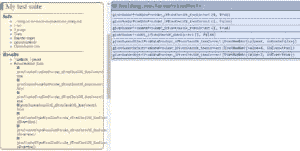
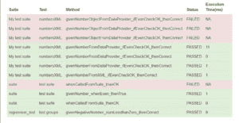

# 使用 TestNG 定制报告

> 原文:[https://web . archive . org/web/20220930061024/https://www . bael dung . com/TestNG-custom-reporting](https://web.archive.org/web/20220930061024/https://www.baeldung.com/testng-custom-reporting)

## **1。概述**

在本文中，我们将讨论使用 TestNG 生成定制日志和报告。

TestNG 提供了自己的报告特性——以 HTML/XML 格式生成报告。如果使用`maven-surefire-plugin,`运行测试，报告将采用插件定义的默认形式。除了内置的报告之外，它还提供了一种机制，可以轻松定制记录的信息和生成的报告。

如果您想从 TestNG 基础开始，请查看本文。

## **2。自定义日志记录**

在我们实现定制日志之前，让我们通过执行`mvn test` 命令`:`来查看默认日志

```
Tests run: 11, Failures: 1, Errors: 0, Skipped: 0, 
  Time elapsed: 1.21 sec <<< FAILURE! 
- in TestSuite
whenCalledFromSuite_thanOK(baeldung.com.RegistrationTest)  
Time elapsed: 0.01 sec  <<< FAILURE!
java.lang.AssertionError: Test Failed due to some reason
    at baeldung.com.RegistrationTest.whenCalledFromSuite_thanOK(
      RegistrationTest.java:15)

Results :

Failed tests:
  RegistrationTest.whenCalledFromSuite_thanOK:15 
    Test Failed due to some reason

Tests run: 11, Failures: 1, Errors: 0, Skipped: 0

[ERROR] There are test failures.
```

这些日志没有给我们任何关于执行顺序的信息，或者关于某个特定测试何时开始/完成的信息。

如果我们想知道每次运行的结果以及一些自定义数据，我们可以实现自己的日志和报告。TestNG 提供了一种实现定制报告和日志记录的方法。

**简单地说，我们可以实现用于日志记录的`org.testng.ITestListener` 接口或者用于报告的`org.testng.IReporter` 接口。**这些实现的类会收到关于测试和套件的开始、结束、失败等事件的通知。

让我们继续实现一些简单的自定义日志记录:

```
public class CustomisedListener implements ITestListener {

    // ...
    @Override
    public void onFinish(ITestContext testContext) {
        LOGGER.info("PASSED TEST CASES");
        testContext.getPassedTests().getAllResults()
          .forEach(result -> {LOGGER.info(result.getName());});

        LOGGER.info("FAILED TEST CASES");
        testContext.getFailedTests().getAllResults()
          .forEach(result -> {LOGGER.info(result.getName());});

        LOGGER.info(
          "Test completed on: " + testContext.getEndDate().toString());
    }  

    //...
} 
```

注意我们如何覆盖了`onFinish()` 方法，当所有的测试执行完成并且所有的配置完成时，该方法将被调用。类似地，我们可以覆盖其他方法——比如`onTestStart(), onTestFailure()` 等(在这里可以找到关于这些其他方法[的细节)。](https://web.archive.org/web/20220525132405/http://javadox.com/org.testng/testng/6.8/org/testng/ITestListener.html)

现在让我们在 XML 配置中包含这个监听器:

```
<suite name="My test suite">
    <listeners>
        <listener class-name="com.baeldung.reports.CustomisedListener" />
    </listeners>
    <test name="numbersXML">
        <parameter name="value" value="1" />
        <parameter name="isEven" value="false" />
        <classes>
            <class name="baeldung.com.ParametrizedTests" />
        </classes>
    </test>
</suite>
```

一旦执行，侦听器将在每个事件上被调用，并将在我们实现时记录信息。这对调试我们的测试执行可能是有用的。

输出日志:

```
...
INFO CUSTOM_LOGS - Started testing on: Sat Apr 22 14:39:43 IST 2017
INFO CUSTOM_LOGS - Testing: 
  givenNumberFromDataProvider_ifEvenCheckOK_thenCorrect
INFO CUSTOM_LOGS - Tested: 
  givenNumberFromDataProvider_ifEvenCheckOK_thenCorrect Time taken:6 ms
INFO CUSTOM_LOGS - Testing: 
  givenNumberObjectFromDataProvider_ifEvenCheckOK_thenCorrect
INFO CUSTOM_LOGS - Failed : 
  givenNumberObjectFromDataProvider_ifEvenCheckOK_thenCorrect
INFO CUSTOM_LOGS - PASSED TEST CASES
INFO CUSTOM_LOGS - givenNumberFromDataProvider_ifEvenCheckOK_thenCorrect
INFO CUSTOM_LOGS - FAILED TEST CASES
INFO CUSTOM_LOGS - 
  givenNumberObjectFromDataProvider_ifEvenCheckOK_thenCorrect
INFO CUSTOM_LOGS - Test completed on: Sat Apr 22 14:39:43 IST 2017
...
```

自定义日志为我们提供了默认日志中缺少的信息。

## **3。自定义报告**

当我们使用插件运行测试时，它会在`target/surefire-reports` 目录中生成 HTML/XML 格式的报告:

[](/web/20220525132405/https://www.baeldung.com/wp-content/uploads/2017/05/test-report.jpg)

如果我们想使用 TestNG XML 文件运行一个特定的测试套件，我们需要在 surefire-plugin `configuration` 标签中列出它:

```
<configuration>
    <suiteXmlFiles>
        <suiteXmlFile>
            src\test\resources\parametrized_testng.xml
        </suiteXmlFile>
    </suiteXmlFiles>
</configuration>
```

在定制日志之后，现在让我们尝试创建一些定制报告，其中我们实现了`org.testng.IReporter` 接口并覆盖了`generateReport()` 方法:

```
public void generateReport(
  List<XmlSuite> xmlSuites, 
  List<ISuite> suites, String outputDirectory) {

    String reportTemplate = initReportTemplate();

    String body = suites
      .stream()
      .flatMap(suiteToResults())
      .collect(Collectors.joining());

    String report
      = reportTemplate.replaceFirst("</tbody>", String.format("%s</tbody>", body));
    saveReportTemplate(outputDirectory, report);
}
```

被重写的方法有三个参数:

*   `xmlSuite –`包含 XML 文件中提到的所有套件的列表
*   一个列表对象，保存所有关于测试执行的信息
*   `outputDirectory –`生成报表的目录路径

我们使用`initReportTemplate()`方法加载一个 HTML 模板，`suiteToResults()`函数调用`resultsToRow()`函数来处理生成报告的内部过程:

```
private Function<ISuite, Stream<? extends String>> suiteToResults() {
    return suite -> suite.getResults().entrySet()
      .stream()
      .flatMap(resultsToRows(suite));
}

private Function<Map.Entry<String, ISuiteResult>, 
  Stream<? extends String>> resultsToRows(ISuite suite) {
    return e -> {
        ITestContext testContext = e.getValue().getTestContext();

        Set<ITestResult> failedTests 
          = testContext.getFailedTests().getAllResults();
        Set<ITestResult> passedTests 
          = testContext.getPassedTests().getAllResults();
        Set<ITestResult> skippedTests 
          = testContext.getSkippedTests().getAllResults();

        String suiteName = suite.getName();

        return Stream
          .of(failedTests, passedTests, skippedTests)
          .flatMap(results ->
            generateReportRows(e.getKey(), suiteName, results).stream());
    };
}
```

和用于保存完整结果的`saveReportTemplate()`。

在 XML 配置文件中包含报表程序:

```
<suite name="suite">
    <listeners>
        <listener class-name="com.baeldung.reports.CustomisedReports" />
    </listeners>
    <test name="test suite">
        <classes>
	    <class name="baeldung.com.RegistrationTest" />
            <class name="baeldung.com.SignInTest" />
        </classes>
    </test>
</suite> 
```

以下是我们报告的输出:

[](/web/20220525132405/https://www.baeldung.com/wp-content/uploads/2017/05/customReport.jpg)

与默认的万无一失的 HTML 报告相比，这个报告在一个表格中给出了清晰的结果。这样更方便，更容易阅读。

## 4.结论

在这个快速教程中，我们学习了如何用 Surefire Maven 插件生成测试报告。我们还研究了用 TestNG 定制日志和生成定制报告。更多关于 TestNG 的细节，比如如何编写测试用例、套件等等。参考我们的介绍

关于 TestNG 的更多细节，比如如何编写测试用例、套件，肯定要从我们的介绍性[文章](/web/20220525132405/https://www.baeldung.com/testng)开始。

像往常一样，片段的实现可以在 GitHub 上找到[。](https://web.archive.org/web/20220525132405/https://github.com/eugenp/tutorials/tree/master/testing-modules/testng)