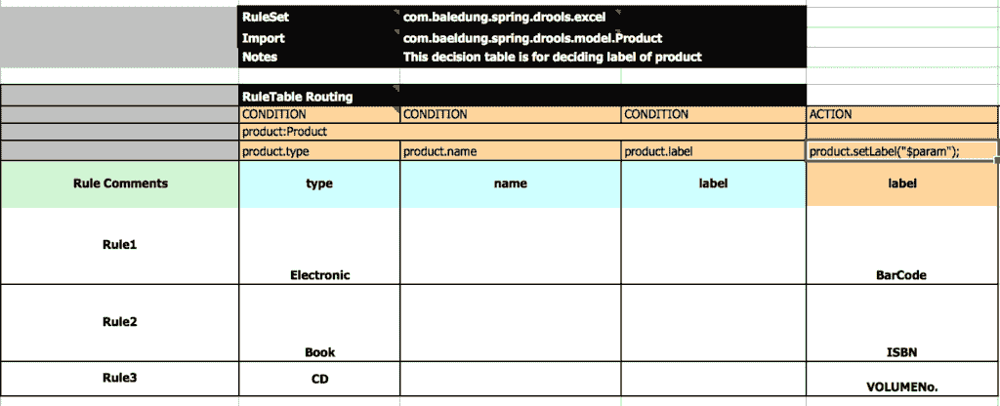

# Drools 简介

> 原文：<https://web.archive.org/web/20220930061024/https://www.baeldung.com/drools>

## 1。概述

Drools 是一个业务规则管理系统(BRMS)解决方案。它提供了一个规则引擎，用于处理事实并生成规则和事实处理的结果。业务逻辑的集中化使得快速、廉价地引入变化成为可能。

它还通过提供一种以易于理解的格式编写规则的工具，在业务和技术团队之间架起了一座桥梁。

## 2。Maven 依赖关系

为了开始使用 Drools，我们需要首先在我们的`pom.xml`中添加几个依赖项:

```
<dependency>
    <groupId>org.kie</groupId>
    <artifactId>kie-ci</artifactId>
    <version>7.1.0.Beta1</version>
</dependency>
<dependency>
    <groupId>org.drools</groupId>
    <artifactId>drools-decisiontables</artifactId>
    <version>7.1.0.Beta1</version>
</dependency>
```

这两个依赖项的最新版本在 Maven Central Repository 上以 [kie-ci](https://web.archive.org/web/20220524131516/https://search.maven.org/classic/#search%7Cga%7C1%7Cg%3A%22org.kie%22%20AND%20a%3A%22kie-ci%22) 和 [drools-decisiontables](https://web.archive.org/web/20220524131516/https://search.maven.org/classic/#search%7Cga%7C1%7Cg%3A%22org.drools%22%20AND%20a%3A%22drools-decisiontables%22) 的形式提供。

## 3。Drools 基础知识

我们要看看口水的基本概念:

*   `**Facts**`–表示作为规则输入的数据
*   **`Working Memory`–**带有`Facts,`的存储器，用于模式匹配，可以修改、插入和删除
*   `**Rule**`–表示将`Facts`与匹配动作相关联的单个规则。它可以用 Drools 规则语言写在`.drl` 文件中，或者作为 excel 电子表格中的`Decision Table`
*   `**Knowledge Session**`–它包含触发规则所需的所有资源；所有的`Facts`都被插入到会话中，然后匹配的规则被触发
*   `**Knowledge Base**`–代表 Drools 生态系统中的知识，它拥有关于`Rules`所在资源的信息，并且它还创建了`Knowledge Session`
*   `**Module** **–**` 一个模块拥有多个知识库，这些知识库可以容纳不同的会话

## 4。Java 配置

为了在给定的数据上触发规则，我们需要用规则文件和`Facts:`的位置信息实例化框架提供的类

### 4.1。`KieFileSystem`

首先，我们需要设置`KieFileSystem` bean；这是一个由框架提供的内存文件系统。以下代码提供了以编程方式定义 Drools 资源(如规则文件、决策表)的容器:

```
public KieFileSystem kieFileSystem() throws IOException {
    KieFileSystem kieFileSystem = getKieServices().newKieFileSystem();
        for (Resource file : getRuleFiles()) {
            kieFileSystem.write(
              ResourceFactory.newClassPathResource(
              RULES_PATH + file.getFilename(), "UTF-8"));
        }
        return kieFileSystem;
}
```

这里的`RULES_PATH` 表示规则文件在文件系统中的位置。在这里，我们从`classpath`中读取文件，在 Maven 项目中，T1 通常是`/src/main/resources`。

### 4.2。 `KieContainer`

接下来，我们需要设置`KieContainer` ，它是所有`KieBases`的占位符，因为`KieModule. KieContainer` 是在其他 beans 的帮助下构建的，包括`KieFileSystem, KieModule,` 和 `KieBuilder.`

在`KieBuilder` 上调用的`buildAll()` 方法构建所有资源并将它们绑定到`KieBase.` ，只有当它能够找到并验证所有规则文件时，它才成功执行:

```
public KieContainer kieContainer() throws IOException {
    KieRepository kieRepository = getKieServices().getRepository();

    kieRepository.addKieModule(new KieModule() {
        public ReleaseId getReleaseId() {
            return kieRepository.getDefaultReleaseId();
        }
    });

    KieBuilder kieBuilder = getKieServices()
      .newKieBuilder(kieFileSystem())
      .buildAll();

    return getKieServices().newKieContainer(kieRepository.getDefaultReleaseId());
}
```

### 4.3。`KieSession`

规则是通过打开一个`KieSession` bean 触发的——这个 bean 可以从`KieContainer:`中检索到

```
public KieSession kieSession() throws IOException {
    return kieContainer().newKieSession();
}
```

## 5。实施细则

现在我们已经完成了设置，让我们来看看创建规则的几个选项。

我们将通过一个例子来探索规则的实现，这个例子根据一个申请人当前的工资和他拥有的工作经验的年数来对他进行分类。

### 5.1。Drools 规则文件(`.drl` )

简单地说，Drools 规则文件包含所有业务规则。

**一个规则包括一个`When-Then` 结构**，这里的`When`部分列出了要检查的条件，`Then`部分列出了条件满足时要采取的行动:

```
package com.baeldung.drools.rules;

import com.baeldung.drools.model.Applicant;

global com.baeldung.drools.model.SuggestedRole suggestedRole;

dialect  "mvel"

rule "Suggest Manager Role"
    when
        Applicant(experienceInYears > 10)
        Applicant(currentSalary > 1000000 && currentSalary <= 
         2500000)
    then
        suggestedRole.setRole("Manager");
end
```

可以通过在`KieSession:`中插入`Applicant`和`SuggestedRole`事实来触发该规则

```
public SuggestedRole suggestARoleForApplicant(
    Applicant applicant,SuggestedRole suggestedRole){
    KieSession kieSession = kieContainer.newKieSession();
    kieSession.insert(applicant);
    kieSession.setGlobal("suggestedRole",suggestedRole);
    kieSession.fireAllRules();
    // ...
}
```

它在`Applicant`实例上测试两个条件，然后基于这两个条件的满足，它在`SuggestedRole` 对象中设置`Role`字段。

这可以通过执行测试来验证:

```
@Test
public void whenCriteriaMatching_ThenSuggestManagerRole(){
    Applicant applicant = new Applicant("David", 37, 1600000.0,11);
    SuggestedRole suggestedRole = new SuggestedRole();

    applicantService.suggestARoleForApplicant(applicant, suggestedRole);

    assertEquals("Manager", suggestedRole.getRole());
}
```

在这个例子中，我们使用了一些 Drools 提供的关键字。让我们了解它们的用途:

*   **`package –`** 这是我们在`kmodule.xml,` 中指定的包名，规则文件位于这个包内
*   `**import**` –这类似于 Java `import`语句，这里我们需要指定要插入到`KnowledgeSession`中的类
*   用于为一个会话定义一个全局级变量；这可用于传递输入参数或获取输出参数，以汇总会话信息
*   `**dialect**`–方言指定条件部分或操作部分的表达式中使用的语法。默认情况下，方言是 Java。口水也支持方言`mvel`；它是一种用于基于 Java 的应用程序的表达式语言。它支持字段和方法/getter 访问
*   `**rule**`–用规则名定义一个规则块
*   `**when**`–这指定了一个规则条件，在本例中，检查的条件是`experienceInYears`超过十年的`Applicant`和一定范围内的`currentSalary`
*   `**then –**` 当`when`块中的条件满足时，该块执行动作。在本例中，`Applicant` 角色被设置为经理

### 5.2。决策表

决策表提供了在预先格式化的 Excel 电子表格中定义规则的能力。Drools 提供的决策表的优点是，即使对于非技术人员来说，它们也很容易理解。

此外，当存在相似的规则但具有不同的值时，这也很有用，在这种情况下，在 excel 表中添加新行比在中编写新规则更容易。`drl`文件。让我们通过一个基于产品类型在产品上应用标签的示例来了解决策表的结构:

[](/web/20220524131516/https://www.baeldung.com/wp-content/uploads/2017/05/Screen-Shot-2017-04-26-at-12.26.59-PM-2.png)

决策表被分成不同的部分，最上面的部分就像一个标题部分，在这里我们指定了`RuleSet`(即规则文件所在的包)`Import`(要导入的 Java 类)和`Notes`(关于规则用途的注释)。

**我们定义规则的中心部分称为`RuleTable`，它将应用于同一个域对象的规则分组。**

在下一行中，我们有列类型`CONDITION`和`ACTION`。在这些列中，我们可以访问在一行中提到的域对象的属性以及它们在后续行中的值。

触发规则的机制类似于我们看到的`.drl`文件。

我们可以通过执行测试来验证应用这些规则的结果:

```
@Test
public void whenProductTypeElectronic_ThenLabelBarcode() {
    Product product = new Product("Microwave", "Electronic");
    product = productService.applyLabelToProduct(product);

    assertEquals("BarCode", product.getLabel());
}
```

## 6。结论

在这篇简短的文章中，我们探索了如何在应用程序中使用 Drools 作为业务规则引擎。我们还看到了用 Drools 规则语言编写规则的多种方法，以及在电子表格中使用易于理解的语言。

和往常一样，本文的完整代码可以在 GitHub 上的[处获得。](https://web.archive.org/web/20220524131516/https://github.com/eugenp/tutorials/tree/master/drools)