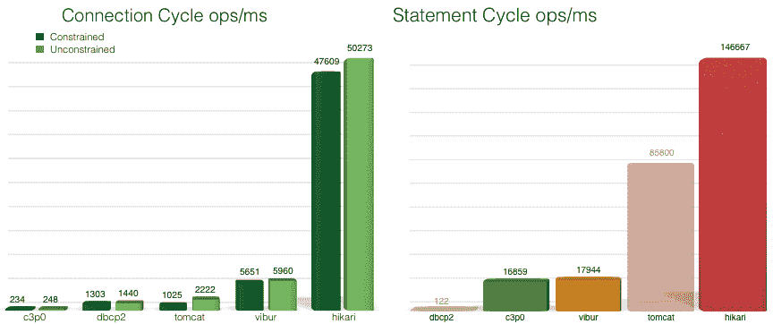

# HikariCP 简介

> 原文：<https://web.archive.org/web/20220930061024/https://www.baeldung.com/hikaricp>

## 1。概述

在这个介绍性教程中，我们将了解到 [HikariCP JDBC](https://web.archive.org/web/20221108124857/https://github.com/brettwooldridge/HikariCP) 连接池项目。**这是一个非常轻量级(大约 130Kb)和闪电般快速的 JDBC 连接池框架**，由 [Brett Wooldridge](https://web.archive.org/web/20221108124857/https://github.com/brettwooldridge) 在 2012 年左右开发。

## 延伸阅读:

## [Java 连接池的简单指南](/web/20221108124857/https://www.baeldung.com/java-connection-pooling)

A quick overview of several popular connection pooling solutions, plus a quick dive into a custom connection pool implementation[Read more](/web/20221108124857/https://www.baeldung.com/java-connection-pooling) →

## [使用 Spring Boot 配置光连接池](/web/20221108124857/https://www.baeldung.com/spring-boot-hikari)

Learn how you can configure Hikari CP in your Spring Boot (1 and 2) applications[Read more](/web/20221108124857/https://www.baeldung.com/spring-boot-hikari) →

## [使用带休眠功能的 c3p0】](/web/20221108124857/https://www.baeldung.com/hibernate-c3p0)

Learn how to add c3p0 to a Hibernate application and configure some common properties[Read more](/web/20221108124857/https://www.baeldung.com/hibernate-c3p0) →

## 2。简介

有几个基准测试结果可以用来比较 HikariCP 与其他连接池框架的性能，如`[c3p0](https://web.archive.org/web/20221108124857/http://www.mchange.com/projects/c3p0/)`、`[dbcp2](https://web.archive.org/web/20221108124857/https://commons.apache.org/proper/commons-dbcp/)`、`[tomcat](https://web.archive.org/web/20221108124857/https://people.apache.org/~fhanik/jdbc-pool/jdbc-pool.html)`和[、`vibur`、](https://web.archive.org/web/20221108124857/http://www.vibur.org/)。例如，HikariCP 团队发布了以下基准测试(原始结果见[此处](https://web.archive.org/web/20221108124857/https://github.com/brettwooldridge/HikariCP-benchmark)):



该框架如此之快是因为应用了以下技术:

*   一些极端的字节码级工程(包括汇编级原生编码)已经完成
*   **微优化–**尽管几乎无法测量，但这些优化结合起来提高了整体性能
*   **集合框架的智能使用——**`ArrayList<Statement>`被一个定制的类`FastList,`所取代，它消除了范围检查并从头到尾执行删除扫描

## 3。Maven 依赖关系

首先，让我们构建一个示例应用程序来强调它的用法。HikariCP 支持 JVM 的所有主要版本。每个版本都需要它的依赖关系。对于 Java 8 到 11，我们有:

```
<dependency>
    <groupId>com.zaxxer</groupId>
    <artifactId>HikariCP</artifactId>
    <version>3.4.5</version>
</dependency>
```

HikariCP 还支持较旧的 JDK 版本，如 6 和 7。相应的版本可以分别在[这里](https://web.archive.org/web/20221108124857/https://search.maven.org/classic/#search%7Cgav%7C1%7Cg%3A%22com.zaxxer%22%20AND%20a%3A%22HikariCP-java7%22)和[这里](https://web.archive.org/web/20221108124857/https://search.maven.org/classic/#search%7Cgav%7C1%7Cg%3A%22com.zaxxer%22%20AND%20a%3A%22HikariCP-java6%22)找到。我们还可以在[中央 Maven 资源库](https://web.archive.org/web/20221108124857/https://search.maven.org/classic/#search%7Cgav%7C1%7Cg%3A%22com.zaxxer%22%20AND%20a%3A%22HikariCP%22)查看最新版本。

## 4。用途

现在我们可以创建一个演示应用程序。请注意，我们需要在`pom.xml`中包含一个合适的 JDBC 驱动程序类依赖。如果没有提供依赖项，应用程序将抛出一个`ClassNotFoundException`。

### 4.1。创造一个`DataSource`

我们将使用 HikariCP 的`DataSource`为我们的应用程序创建一个数据源实例:

```
public class DataSource {

    private static HikariConfig config = new HikariConfig();
    private static HikariDataSource ds;

    static {
        config.setJdbcUrl( "jdbc_url" );
        config.setUsername( "database_username" );
        config.setPassword( "database_password" );
        config.addDataSourceProperty( "cachePrepStmts" , "true" );
        config.addDataSourceProperty( "prepStmtCacheSize" , "250" );
        config.addDataSourceProperty( "prepStmtCacheSqlLimit" , "2048" );
        ds = new HikariDataSource( config );
    }

    private DataSource() {}

    public static Connection getConnection() throws SQLException {
        return ds.getConnection();
    }
}
```

这里需要注意的一点是`static`块中的初始化。

[HikariConfig](https://web.archive.org/web/20221108124857/https://github.com/openbouquet/HikariCP/blob/master/src/main/java/com/zaxxer/hikari/HikariConfig.java) 是用于初始化数据源的配置类。它有四个众所周知的必须使用的参数:`username`、`password`、`jdbcUrl`和`dataSourceClassName`。

出了`jdbcUrl`和`dataSourceClassName`，我们一般一次用一个。但是，在旧的驱动程序中使用该属性时，我们可能需要同时设置这两个属性。

除了这些属性之外，还有其他一些我们可能发现其他池框架没有提供的属性:

*   `autoCommit`
*   `connectionTimeout`
*   `idleTimeout`
*   `maxLifetime`
*   `connectionTestQuery`
*   `connectionInitSql`
*   `validationTimeout`
*   `maximumPoolSize`
*   `poolName`
*   `allowPoolSuspension`
*   `readOnly`
*   `transactionIsolation`
*   `leakDetectionThreshold`

由于这些数据库属性，HikariCP 脱颖而出。它甚至先进到可以自己检测连接泄漏。

以上属性的详细描述可以在[这里](https://web.archive.org/web/20221108124857/https://github.com/brettwooldridge/HikariCP)找到。

我们还可以用放置在`resources`目录中的属性文件初始化`HikariConfig`:

```
private static HikariConfig config = new HikariConfig(
    "datasource.properties" );
```

属性文件应该如下所示:

```
dataSourceClassName= //TBD
dataSource.user= //TBD
//other properties name should start with dataSource as shown above
```

此外，我们可以使用基于`java.util.Properties-`的配置:

```
Properties props = new Properties();
props.setProperty( "dataSourceClassName" , //TBD );
props.setProperty( "dataSource.user" , //TBD );
//setter for other required properties
private static HikariConfig config = new HikariConfig( props );
```

或者，我们可以直接初始化数据源:

```
ds.setJdbcUrl( //TBD  );
ds.setUsername( //TBD );
ds.setPassword( //TBD );
```

### 4.2。使用数据源

现在我们已经定义了数据源，我们可以使用它从已配置的连接池中获取连接，并执行与 JDBC 相关的操作。

假设我们有两个名为`**dept**`和`**emp,**`的表来模拟一个雇员-部门用例。我们将编写一个类来使用 HikariCP 从数据库中获取这些细节。

下面我们将列出创建示例数据所需的 SQL 语句:

```
create table dept(
  deptno numeric,
  dname  varchar(14),
  loc    varchar(13),
  constraint pk_dept primary key ( deptno )
);

create table emp(
  empno    numeric,
  ename    varchar(10),
  job      varchar(9),
  mgr      numeric,
  hiredate date,
  sal      numeric,
  comm     numeric,
  deptno   numeric,
  constraint pk_emp primary key ( empno ),
  constraint fk_deptno foreign key ( deptno ) references dept ( deptno )
);

insert into dept values( 10, 'ACCOUNTING', 'NEW YORK' );
insert into dept values( 20, 'RESEARCH', 'DALLAS' );
insert into dept values( 30, 'SALES', 'CHICAGO' );
insert into dept values( 40, 'OPERATIONS', 'BOSTON' );

insert into emp values(
 7839, 'KING', 'PRESIDENT', null,
 to_date( '17-11-1981' , 'dd-mm-yyyy' ),
 7698, null, 10
);
insert into emp values(
 7698, 'BLAKE', 'MANAGER', 7839,
 to_date( '1-5-1981' , 'dd-mm-yyyy' ),
 7782, null, 20
);
insert into emp values(
 7782, 'CLARK', 'MANAGER', 7839,
 to_date( '9-6-1981' , 'dd-mm-yyyy' ),
 7566, null, 30
);
insert into emp values(
 7566, 'JONES', 'MANAGER', 7839,
 to_date( '2-4-1981' , 'dd-mm-yyyy' ),
 7839, null, 40
);
```

请注意，如果我们使用像 H2 这样的内存数据库，我们需要在运行实际代码获取数据之前自动加载数据库脚本。幸运的是，H2 附带了一个`INIT` 参数，可以在运行时从类路径加载数据库脚本。JDBC 的网址应该是这样的:

```
jdbc:h2:mem:test;DB_CLOSE_DELAY=-1;INIT=runscript from 'classpath:/db.sql'
```

我们需要创建一个方法来从数据库中获取这些数据:

```
public static List<Employee> fetchData() throws SQLException {
    String SQL_QUERY = "select * from emp";
    List<Employee> employees = null;
    try (Connection con = DataSource.getConnection();
        PreparedStatement pst = con.prepareStatement( SQL_QUERY );
        ResultSet rs = pst.executeQuery();) {
            employees = new ArrayList<>();
            Employee employee;
            while ( rs.next() ) {
                employee = new Employee();
                employee.setEmpNo( rs.getInt( "empno" ) );
                employee.setEname( rs.getString( "ename" ) );
                employee.setJob( rs.getString( "job" ) );
                employee.setMgr( rs.getInt( "mgr" ) );
                employee.setHiredate( rs.getDate( "hiredate" ) );
                employee.setSal( rs.getInt( "sal" ) );
                employee.setComm( rs.getInt( "comm" ) );
                employee.setDeptno( rs.getInt( "deptno" ) );
                employees.add( employee );
            }
	} 
    return employees;
}
```

然后我们需要创建一个 JUnit 方法来测试它。由于我们知道表`emp`中的行数，我们可以预期返回列表的大小应该等于行数:

```
@Test
public void givenConnection_thenFetchDbData() throws SQLException {
    HikariCPDemo.fetchData();

    assertEquals( 4, employees.size() );
}
```

## 5。结论

在这篇简短的文章中，我们了解了使用 HikariCP 的好处及其配置。

和往常一样，完整的源代码可以在 GitHub 上找到[。](https://web.archive.org/web/20221108124857/https://github.com/eugenp/tutorials/tree/master/libraries-data-db)