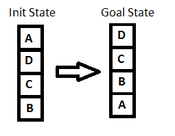
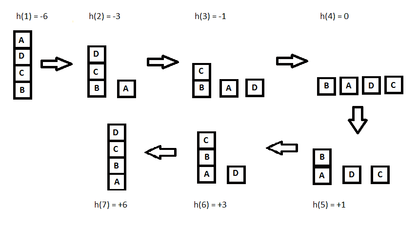

# Java 中爬山算法的例子

> 原文：<https://web.archive.org/web/20220930061024/https://www.baeldung.com/java-hill-climbing-algorithm>

## **1。概述**

在本教程中，我们将展示[爬山算法](/web/20220628160726/https://www.baeldung.com/cs/hill-climbing-algorithm)及其实现。我们还会看看它的优点和缺点。在直接进入之前，让我们简单地讨论一下生成和测试算法的方法。

## **2。生成和测试算法**

这是一个非常简单的技术，它允许我们用算法来寻找解决方案:

1.  将当前状态定义为初始状态
2.  对当前状态应用任何可能的操作，并生成可能的解决方案
3.  将新生成的解决方案与目标状态进行比较
4.  如果目标实现了，或者不能创建新的状态，退出。否则，返回步骤 2

它对简单的问题非常有效。因为这是一个穷举搜索，所以在处理大的问题空间时考虑它是不可行的。也被称为大英博物馆算法(试图通过随机探索在大英博物馆找到一件文物)。

这也是生物识别领域中爬山攻击背后的主要思想。这种方法可用于生成合成生物统计数据。

## **3。简单爬山算法简介**

在爬山技术中，从山脚开始，我们向上走，直到到达山顶。换句话说，我们从初始状态开始，不断改进解决方案，直到达到最优。

这是一种“生成-测试”算法的变体，它抛弃了所有看起来没有希望或似乎不可能引导我们到达目标状态的状态。为了做出这样的决定，它使用试探法(一个评估函数),该试探法指示当前状态与目标状态有多接近。

简单来说，**爬山=生成-测试+启发式**

让我们看看简单的爬山算法:

1.  将当前状态定义为初始状态
2.  循环，直到达到目标状态，或者没有更多操作符可以应用于当前状态:
    1.  将操作应用于当前状态**并获得新状态**
    2.  **将新状态与目标进行比较**
    3.  **如果达到目标状态，退出**
    4.  用启发式函数评估新状态，并**将其与当前状态**进行比较
    5.  **如果较新的状态与当前状态相比**更接近目标，**更新当前状态**

正如我们所看到的，它通过迭代改进达到目标状态。在爬山算法中，寻找目标相当于到达山顶。

## **4。示例**

爬山算法可以归类为一个知情搜索。因此，我们可以使用它实现任何基于节点的搜索或问题，如 n 皇后问题。为了容易理解这个概念，我们举一个非常简单的例子。

让我们看看下图:

[](/web/20220628160726/https://www.baeldung.com/wp-content/uploads/2017/06/init_goal.png)

解决任何爬山问题的关键是选择一个合适的[启发式函数](/web/20220628160726/https://www.baeldung.com/cs/heuristics)。

让我们定义这样的函数`h:`

**`h(x)` = +1 表示支撑结构中的所有块，如果该块定位正确，否则-1 表示支撑结构中的所有块。**

在这里，我们将调用任何正确定位的块，如果它具有与目标状态相同的支持结构。按照前面讨论的爬山过程，让我们看看所有的迭代及其达到目标状态的试探法:

## [ ](/web/20220628160726/https://www.baeldung.com/wp-content/uploads/2017/06/state_iterations.png) ** 5。实施**

现在，让我们用爬山算法实现同一个例子。

首先，我们需要一个`State`类，它将存储代表每个状态下块的位置的堆栈列表。它还将存储该特定状态的试探法:

```
public class State {
    private List<Stack<String>> state;
    private int heuristics;

    // copy constructor, setters, and getters
}
```

我们还需要一种方法来计算状态的启发值。

```
public int getHeuristicsValue(
  List<Stack<String>> currentState, Stack<String> goalStateStack) {

    Integer heuristicValue;
    heuristicValue = currentState.stream()
      .mapToInt(stack -> {
          return getHeuristicsValueForStack(
            stack, currentState, goalStateStack);
    }).sum();

    return heuristicValue;
}

public int getHeuristicsValueForStack(
  Stack<String> stack,
  List<Stack<String>> currentState,
  Stack<String> goalStateStack) {

    int stackHeuristics = 0;
    boolean isPositioneCorrect = true;
    int goalStartIndex = 0;
    for (String currentBlock : stack) {
        if (isPositioneCorrect 
          && currentBlock.equals(goalStateStack.get(goalStartIndex))) {
            stackHeuristics += goalStartIndex;
        } else {
            stackHeuristics -= goalStartIndex;
            isPositioneCorrect = false;
        }
        goalStartIndex++;
    }
    return stackHeuristics;
} 
```

此外，我们需要定义操作符方法，这将为我们带来一个新的状态。对于我们的示例，我们将定义其中的两种方法:

1.  从堆栈中弹出一个块，并将其压入新的堆栈
2.  从一个堆栈中弹出一个块，并将其推入另一个堆栈

```
private State pushElementToNewStack(
  List<Stack<String>> currentStackList,
  String block,
  int currentStateHeuristics,
  Stack<String> goalStateStack) {

    State newState = null;
    Stack<String> newStack = new Stack<>();
    newStack.push(block);
    currentStackList.add(newStack);
    int newStateHeuristics 
      = getHeuristicsValue(currentStackList, goalStateStack);
    if (newStateHeuristics > currentStateHeuristics) {
        newState = new State(currentStackList, newStateHeuristics);
    } else {
        currentStackList.remove(newStack);
    }
    return newState;
}
```

```
private State pushElementToExistingStacks(
  Stack currentStack,
  List<Stack<String>> currentStackList,
  String block,
  int currentStateHeuristics,
  Stack<String> goalStateStack) {

    return currentStackList.stream()
      .filter(stack -> stack != currentStack)
      .map(stack -> {
          return pushElementToStack(
            stack, block, currentStackList,
            currentStateHeuristics, goalStateStack);
        })
      .filter(Objects::nonNull)
      .findFirst()
      .orElse(null);
}

private State pushElementToStack(
  Stack stack,
  String block,
  List<Stack<String>> currentStackList,
  int currentStateHeuristics,
  Stack<String> goalStateStack) {

    stack.push(block);
    int newStateHeuristics 
      = getHeuristicsValue(currentStackList, goalStateStack);
    if (newStateHeuristics > currentStateHeuristics) {
        return new State(currentStackList, newStateHeuristics);
    }
    stack.pop();
    return null;
}
```

现在我们有了助手方法，让我们写一个实现爬山技术的方法。

在这里，我们不断计算新的状态，这些状态比它们的前身更接近目标。我们不断将它们添加到我们的道路上，直到我们达到目标。

如果我们找不到任何新的状态，算法将终止，并显示一条错误消息:

```
public List<State> getRouteWithHillClimbing(
  Stack<String> initStateStack, Stack<String> goalStateStack) throws Exception {
    // instantiate initState with initStateStack
    // ...
    List<State> resultPath = new ArrayList<>();
    resultPath.add(new State(initState));

    State currentState = initState;
    boolean noStateFound = false;

    while (
      !currentState.getState().get(0).equals(goalStateStack)
      || noStateFound) {
        noStateFound = true;
        State nextState = findNextState(currentState, goalStateStack);
        if (nextState != null) {
            noStateFound = false;
            currentState = nextState;
            resultPath.add(new State(nextState));
        }
    }
    return resultPath;
}
```

除此之外，我们还需要`findNextState` 方法，该方法对当前状态应用所有可能的操作，以获得下一个状态:

```
public State findNextState(State currentState, Stack<String> goalStateStack) {
    List<Stack<String>> listOfStacks = currentState.getState();
    int currentStateHeuristics = currentState.getHeuristics();

     return listOfStacks.stream()
      .map(stack -> {
          return applyOperationsOnState(
            listOfStacks, stack, currentStateHeuristics, goalStateStack);
      })
      .filter(Objects::nonNull)
      .findFirst()
      .orElse(null);
}

public State applyOperationsOnState(
  List<Stack<String>> listOfStacks,
  Stack<String> stack,
  int currentStateHeuristics,
  Stack<String> goalStateStack) {

    State tempState;
    List<Stack<String>> tempStackList 
      = new ArrayList<>(listOfStacks);
    String block = stack.pop();
    if (stack.size() == 0)
      tempStackList.remove(stack);
    tempState = pushElementToNewStack(
      tempStackList, block, currentStateHeuristics, goalStateStack);
    if (tempState == null) {
        tempState = pushElementToExistingStacks(
          stack, tempStackList, block,
          currentStateHeuristics, goalStateStack);
        stack.push(block);
    }
    return tempState;
}
```

## **6。最速上升爬山算法**

最速上升爬山算法(梯度搜索)是爬山算法的变体。我们可以在简单的算法中稍加修改来实现它。在这个算法中，我们**从当前状态中考虑所有可能的状态**，然后**挑选最好的一个作为继任者**，这与简单的爬山技术不同。

换句话说，在爬山技术的情况下，我们挑选比当前状态更接近目标的任何状态作为后继，而在最陡爬坡算法中，我们在所有可能的后继中选择最佳后继，然后更新当前状态。

## 7 .**。缺点**

爬山是一种短视的技术，因为它只评估眼前的可能性。因此，它可能会在一些情况下结束，在这些情况下，它不能选择任何进一步的状态。让我们来看看这些状态以及针对它们的一些解决方案:

1.  **局部最大值:**是一个比所有邻居都好的状态，但是存在一个比当前状态更好的状态；如果局部极大值出现在解的视线之内，则称为“山麓丘陵”
2.  **平台期:**在这种状态下，所有相邻的状态都具有相同的启发值，因此通过进行局部比较来选择下一个状态是不清楚的
3.  **山脊:**高出周边各州的区域，但不是一蹴而就的；例如，我们有四个可能的探索方向(N、E、W、S ),在东北方向有一个区域

克服这些情况的解决方案很少:

1.  我们可以**回溯**到先前的状态之一，并探索其他方向
2.  我们可以跳过几个州，在新的方向上进行**跳跃**
3.  我们可以**探索几个方向**来找出正确的路径

## 8.结论

尽管爬山技术比穷举搜索好得多，但它在大型问题空间中仍然不是最优的。

我们总是可以将全局信息编码到启发式函数中，以做出更明智的决策，但这样一来，计算复杂度将比以前高得多。

当与其他技术结合使用时，爬山算法是非常有益的。和往常一样，所有例子的完整代码都可以在 GitHub 上找到[。](https://web.archive.org/web/20220628160726/https://github.com/eugenp/tutorials/tree/master/algorithms-modules/algorithms-miscellaneous-1)