# Eclipse 和 IntelliJ IDEA 中的 Java 静态分析工具

> 原文：<https://web.archive.org/web/20220930061024/https://www.baeldung.com/java-static-analysis-tools>

## **1。概述**

在我们对 FindBugs 的[介绍中，我们看到了 FindBugs 作为静态分析工具的功能，以及它是如何直接集成到 Eclipse 和 IntelliJ Idea 等 ide 中的。](/web/20221128105659/https://www.baeldung.com/intro-to-findbugs)

在本文中，我们将研究 Java 的几种可选静态分析工具——以及这些工具如何与 Eclipse 和 IntelliJ IDEA 集成。

## **2。PMD**

让我们从 PMD 开始。

这个成熟且相当完善的工具分析源代码中可能的错误、次优代码和其他不良实践；它还关注更高级的指标，比如它所分析的代码库的圈复杂度。

### **2.1。与 Eclipse 的集成**

PMD 插件可以直接从 Eclipse Marketplace 安装。插件也可以在这里手动下载[。安装完成后，我们可以直接从 IDE 本身运行 PMD 检查:](https://web.archive.org/web/20221128105659/https://pmd.github.io/pmd-5.8.1/usage/integrations.html#Eclipse)

值得注意的是，我们可以在项目级别或个别班级级别运行 PMD。

结果如下所示——不同级别的发现用不同的颜色表示，从“警告”到“阻止”,按严重性的升序排列:

[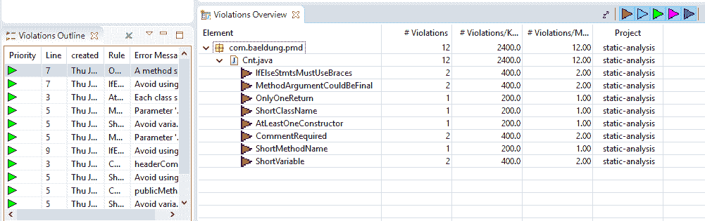](/web/20221128105659/https://www.baeldung.com/wp-content/uploads/2017/07/pmd_eclipse_result.png)

我们可以通过右键单击每个条目并从上下文菜单中选择“show details”来深入了解每个条目的详细信息。Eclipse 将显示该问题的简要描述以及可能的补救措施如何解决该问题:

[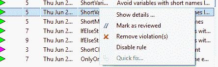](/web/20221128105659/https://www.baeldung.com/wp-content/uploads/2017/07/pmd_eclipse_options.png) [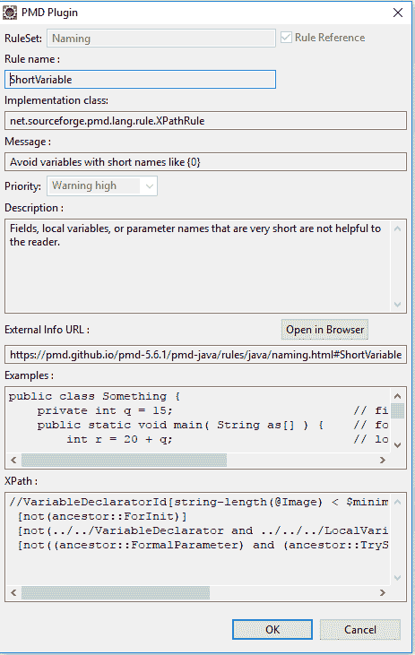](/web/20221128105659/https://www.baeldung.com/wp-content/uploads/2017/07/pmd_eclipse_details.png)

还可以更改 PMD 扫描的配置——我们可以在菜单中的窗口->首选项-> PMD 下启动配置页面。在这里，我们可以配置扫描参数、规则集、结果显示设置等。

如果我们需要停用项目的某些特定规则，我们可以简单地从扫描中删除它们:

[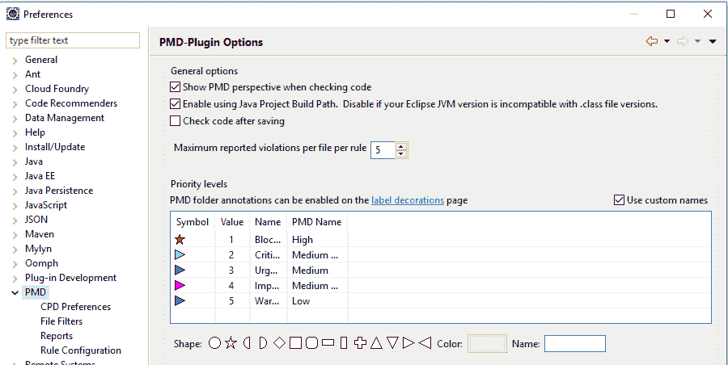](/web/20221128105659/https://www.baeldung.com/wp-content/uploads/2017/07/pmd_eclipse_config.png)

### **2.2。与 IntelliJ 集成**

当然，IntelliJ 有一个类似的 PMD 插件——可以从 [JetBrains 插件商店](https://web.archive.org/web/20221128105659/https://plugins.jetbrains.com/plugin/1137-pmdplugin)下载并安装。

我们同样可以在 IDE 中运行该插件——右键单击我们需要扫描的源，然后从上下文菜单中选择 PMD 扫描:

结果会立即显示出来，但是与 Eclipse 不同，如果我们尝试打开描述，它会打开一个浏览器，其中有一个关于查找信息的公共网页:

[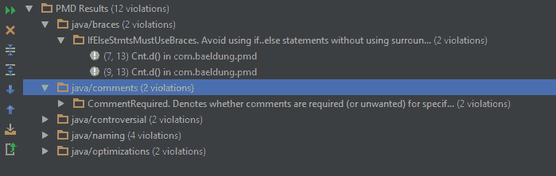](/web/20221128105659/https://www.baeldung.com/wp-content/uploads/2017/07/pmd_Intellij_result.png)

我们可以从设置页面设置 PMD 插件的行为，进入文件->设置->其他设置-> PMD 查看配置页面。从 settings 页面，我们可以通过加载带有我们自己的测试规则的自定义规则集来配置规则集。

## **3。雅各布**

继续——JaCoCo 是一个测试覆盖工具——用于跟踪代码库中的单元测试覆盖。简单地说，该工具使用许多策略来计算覆盖率，例如:行、类、方法等。

### **3.1。与 Eclipse 的集成**

JaCoCo 可以直接从市场安装[。官方网站上也有安装链接](https://web.archive.org/web/20221128105659/https://marketplace.eclipse.org/content/eclemma-java-code-coverage)[这里](https://web.archive.org/web/20221128105659/http://www.eclemma.org/installation.html)。

[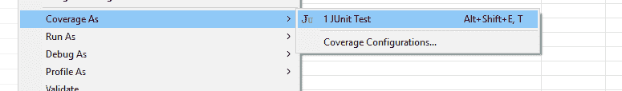](/web/20221128105659/https://www.baeldung.com/wp-content/uploads/2017/07/jacoco_eclipse_run.png)

该工具可以从项目级别执行到单独的方法级别。Eclipse 插件使用不同的配色方案来确定代码的哪一部分被测试用例覆盖，哪一部分没有被覆盖:

[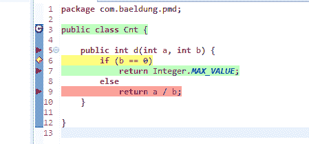](/web/20221128105659/https://www.baeldung.com/wp-content/uploads/2017/07/jacoco_eclise_coverage.png)

我们的方法是将两个提供的整数参数相除并返回结果。如果第二个参数为零，它将返回整数数据类型的最大值。

在我们的测试案例中，我们只测试第二个参数为零的场景:

[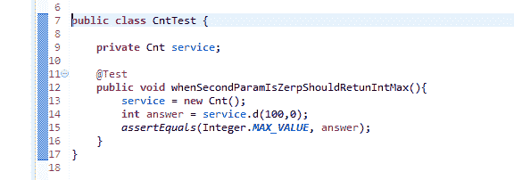](/web/20221128105659/https://www.baeldung.com/wp-content/uploads/2017/07/jacoco_eclise_coverage_test.png)

在这种情况下，我们可以看到第 6 行是黄色的。在我们的简单测试中，只测试和运行‘if’条件的一个分支。因此，它没有经过完全测试，并以黄色标记。

此外，第 7 行有绿色——这意味着它已经过全面测试。最后，第 9 行用红色突出显示，这意味着这一行根本没有经过我们的单元测试。

**我们可以看到测试覆盖率的总结**，它显示了在类级和包级的单元测试中覆盖了多少代码:

[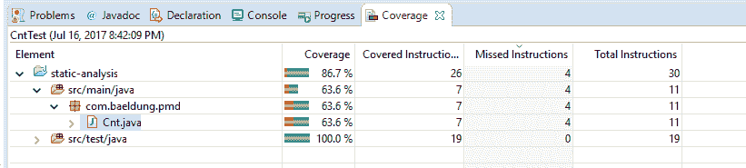](/web/20221128105659/https://www.baeldung.com/wp-content/uploads/2017/07/jacoco_eclise_coverage_summary.png)

### **3.2。与 IntelliJ IDEA 的集成**

默认情况下，JaCoCo 与最新的 IntelliJ IDEA 发行版捆绑在一起，因此不需要单独安装插件。

当执行单元测试时，我们可以选择我们需要使用的覆盖率运行器。我们可以在项目级别或者类级别运行测试用例:

[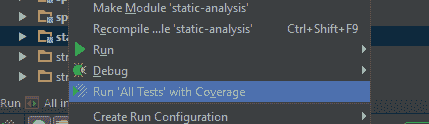](/web/20221128105659/https://www.baeldung.com/wp-content/uploads/2017/07/jacoco_intellij_run.png)

与 Eclipse 类似，JaCoCo 使用不同的颜色方案来显示结果。

[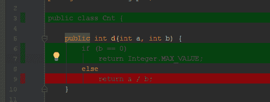](/web/20221128105659/https://www.baeldung.com/wp-content/uploads/2017/07/jacoco_intellij_coverage-2.png)

我们可以看到测试覆盖率的总结，其中显示了在类级别和包级别的单元测试中覆盖了多少代码。

[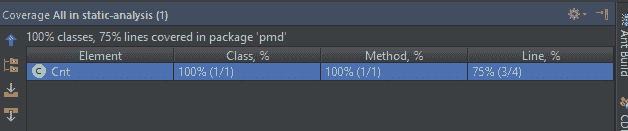](/web/20221128105659/https://www.baeldung.com/wp-content/uploads/2017/07/jacoco_intellij_coverage_summary.png)

## **4。科伯图拉**

最后，值得一提的是 Cobertura——它同样用于跟踪代码库中的单元测试覆盖率。

最新版本的 Eclipse 在编写时不支持 Cobertura 插件；该插件确实可以与早期的 Eclipse 版本一起工作。

类似地，IntelliJ IDEA 也没有官方插件来执行 Cobertura 覆盖率。

## **5。结论**

我们研究了三个广泛使用的静态分析工具与 Eclipse 和 IntelliJ IDEA 的集成。FindBug 在之前的 FindBugs 介绍中已经介绍过了。

本教程的源代码可以在[GitHub 项目](https://web.archive.org/web/20221128105659/https://github.com/eugenp/tutorials/tree/master/static-analysis "The Full Registration Example Project on Github ")中找到——这是一个基于 Maven 的项目，所以它应该很容易导入和运行。