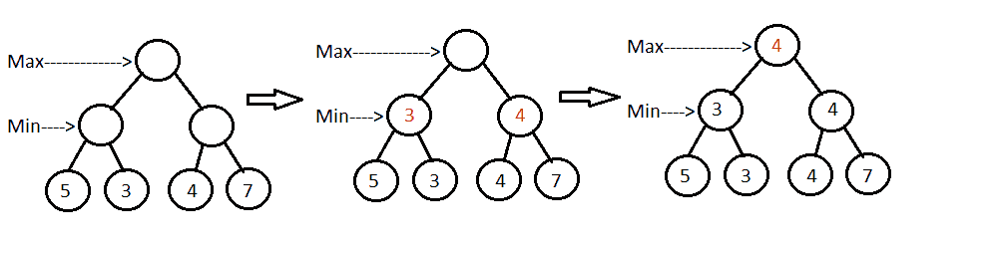

# 极大极小算法介绍及 Java 实现

> 原文:[https://web . archive . org/web/20220930061024/https://www . bael dung . com/Java-minimax-algorithm](https://web.archive.org/web/20220930061024/https://www.baeldung.com/java-minimax-algorithm)

## **1。概述**

在这篇文章中，我们将讨论[极大极小算法](/web/20221024034134/https://www.baeldung.com/cs/minimax-algorithm)及其在人工智能中的应用。因为它是一个博弈论算法，我们将使用它实现一个简单的游戏。

我们还将讨论使用该算法的优点，并看看如何改进它。

## **2。简介**

Minimax 是一种决策算法，**通常用于回合制双人游戏**。该算法的目标是找到最佳的下一步行动。

在算法中，一个玩家被称为最大化者，另一个玩家是最小化者。如果我们给游戏棋盘分配一个评估分数，一个玩家试图选择一个分数最高的游戏状态，而另一个玩家选择一个分数最低的状态。

换句话说，****最大化者努力获得最高分，而最小化者试图通过反击**获得最低分。**

 **它是基于[零和博弈](https://web.archive.org/web/20221024034134/https://en.wikipedia.org/wiki/Zero-sum_game)的概念。**在零和游戏中，总效用分数在玩家之间分配。一个玩家分数的增加会导致另一个玩家分数的减少。**所以，总分始终为零。一方赢了，另一方就得输。这类游戏的例子有国际象棋、扑克、跳棋、井字游戏。

一个有趣的事实——1997 年，IBM 的国际象棋计算机深蓝(用 Minimax 构建)打败了加里·卡斯帕罗夫(国际象棋世界冠军)。

## **3。极大极小算法**

我们的目标是为玩家找到最好的移动。为此，我们可以选择具有最佳评估分数的节点。为了让这个过程更聪明，我们还可以向前看，评估潜在对手的举动。

对于每一步棋，只要我们的计算能力允许，我们可以预测尽可能多的棋。该算法假设对手的打法是最优的。

从技术上讲，我们从根节点开始，选择可能的最佳节点。我们根据节点的评估分数来评估节点。在我们的例子中，评估函数可以只给结果节点(叶子)分配分数。因此，我们递归地到达具有分数的叶子，并且反向传播分数。

考虑下面的游戏树:

[](/web/20221024034134/https://www.baeldung.com/wp-content/uploads/2017/07/minimax.png)

**最大化器** **从根节点**开始，选择得分最高的招式。不幸的是，只有叶子具有评估分数，因此算法必须递归地到达叶子节点。在给定的博弈树中，现在轮到最小化者**从叶节点**中选择一步棋，因此得分最低的节点(这里是节点 3 和 4)将被选中。它继续以类似的方式挑选最佳节点，直到到达根节点。

现在，让我们正式定义算法的步骤:

1.  构建完整的博弈树
2.  使用评估函数评估叶子的分数
3.  从叶子到根的备份分数，考虑球员类型:
    *   对于“最大玩家”,选择得分最高的孩子
    *   对于最小玩家，选择分数最小的孩子
4.  在根节点，选择具有最大值的节点并执行相应的移动

## **4。实施**

现在，让我们实现一个游戏。

在游戏中，我们有一个**堆，里面有`n`个骨头**。两位玩家都必须**在他们的回合中捡起 1、2 或 3 根骨头**。拿不到骨头的玩家输掉游戏。每个玩家都发挥出最佳水平。给定`n`的值，我们来写一个 AI。

为了定义游戏规则，我们将实现`GameOfBones` 类:

```
class GameOfBones {
    static List<Integer> getPossibleStates(int noOfBonesInHeap) {
        return IntStream.rangeClosed(1, 3).boxed()
          .map(i -> noOfBonesInHeap - i)
          .filter(newHeapCount -> newHeapCount >= 0)
          .collect(Collectors.toList());
    }
}
```

此外，我们还需要实现`Node` 和`Tree` 类:

```
public class Node {
    int noOfBones;
    boolean isMaxPlayer;
    int score;
    List<Node> children;
    // setters and getters
}
public class Tree {
    Node root;
    // setters and getters
}
```

现在我们来实现算法。它需要一个博弈树来预测未来并找到最佳的行动。让我们来实现它:

```
public class MiniMax {
    Tree tree;

    public void constructTree(int noOfBones) {
        tree = new Tree();
        Node root = new Node(noOfBones, true);
        tree.setRoot(root);
        constructTree(root);
    }

    private void constructTree(Node parentNode) {
        List<Integer> listofPossibleHeaps 
          = GameOfBones.getPossibleStates(parentNode.getNoOfBones());
        boolean isChildMaxPlayer = !parentNode.isMaxPlayer();
        listofPossibleHeaps.forEach(n -> {
            Node newNode = new Node(n, isChildMaxPlayer);
            parentNode.addChild(newNode);
            if (newNode.getNoOfBones() > 0) {
                constructTree(newNode);
            }
        });
    }
}
```

现在，我们将实现`checkWin` 方法，通过为两个玩家选择最佳移动来模拟一场比赛。它将分数设置为:

*   +1，如果最大化者获胜
*   -1，如果最小化赢了

如果第一个玩家(在我们的例子中是最大化者)获胜,`checkWin`将返回 true:

```
public boolean checkWin() {
    Node root = tree.getRoot();
    checkWin(root);
    return root.getScore() == 1;
}

private void checkWin(Node node) {
    List<Node> children = node.getChildren();
    boolean isMaxPlayer = node.isMaxPlayer();
    children.forEach(child -> {
        if (child.getNoOfBones() == 0) {
            child.setScore(isMaxPlayer ? 1 : -1);
        } else {
            checkWin(child);
        }
    });
    Node bestChild = findBestChild(isMaxPlayer, children);
    node.setScore(bestChild.getScore());
}
```

在这里，如果一个玩家是最大化者，`findBestChild` 方法找到具有最大分数的节点。否则，它返回具有最低分数的子节点:

```
private Node findBestChild(boolean isMaxPlayer, List<Node> children) {
    Comparator<Node> byScoreComparator = Comparator.comparing(Node::getScore);
    return children.stream()
      .max(isMaxPlayer ? byScoreComparator : byScoreComparator.reversed())
      .orElseThrow(NoSuchElementException::new);
}
```

最后，让我们用一些值`n`(堆中骨头的数量)实现一个测试用例:

```
@Test
public void givenMiniMax_whenCheckWin_thenComputeOptimal() {
    miniMax.constructTree(6);
    boolean result = miniMax.checkWin();

    assertTrue(result);

    miniMax.constructTree(8);
    result = miniMax.checkWin();

    assertFalse(result);
}
```

## **5。改进**

对于大多数问题，构造一棵完整的博弈树是不可行的。**在实践中，我们可以开发一个部分树(构建树，直到预定义的层数为止)**。

然后，我们将不得不实现一个**评估函数，**，它应该能够决定玩家当前的状态有多好。

即使我们没有建立完整的博弈树，计算具有高分支因子的博弈的移动也是非常耗时的。

**幸运的是，有一个寻找最优走法的选项，不需要探索博弈树的每个节点**。我们可以按照一些规则跳过一些分支，也不会影响最后的结果。**这个过程叫做** **修剪**。[阿尔法-贝塔剪枝](https://web.archive.org/web/20221024034134/https://en.wikipedia.org/wiki/Alpha%E2%80%93beta_pruning)是极大极小算法的一种流行变体。

## **6。结论**

极大极小算法是计算机棋盘游戏中最流行的算法之一。它广泛应用于回合制游戏中。当玩家拥有关于游戏的完整信息时，这可能是一个不错的选择。

对于分支系数特别高的游戏(如围棋)，这可能不是最佳选择。尽管如此，如果实现得当，它可以是一个相当聪明的人工智能。

与往常一样，该算法的完整代码可以在 GitHub 上找到[。](https://web.archive.org/web/20221024034134/https://github.com/eugenp/tutorials/tree/master/algorithms-modules/algorithms-miscellaneous-1)**