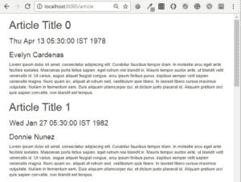

# Spring Boot 小胡子指南

> 原文：<https://web.archive.org/web/20220930061024/https://www.baeldung.com/spring-boot-mustache>

## **1。概述**

在本文中，我们将重点介绍如何使用 Mustache 模板在 Spring Boot 应用程序中生成 HTML 内容。

这是一个用于创建动态内容的**无逻辑模板引擎，由于其简单性而广受欢迎。**

如果你想发现基本原理，查看我们的[小胡子介绍](/web/20221206062259/http://www.baeldung.com/mustache)文章。

## **2。Maven 依赖关系**

为了能和 Spring Boot 一起使用小胡子，我们需要在我们的`pom.xml:`中添加[专用的 Spring Boot 首发](https://web.archive.org/web/20221206062259/https://search.maven.org/classic/#search%7Cga%7C1%7Cg%3A%22org.springframework.boot%22%20AND%20a%3A%22spring-boot-starter-mustache%22)

[PRE0]

此外，我们需要 [spring-boot-starter-web](https://web.archive.org/web/20221206062259/https://search.maven.org/search?q=a:spring-boot-starter-web) 依赖关系。

## **3。创建模板**

让我们展示一个例子，并使用 Spring-Boot 创建一个简单的 MVC 应用程序，它将在网页上提供文章。

让我们为文章内容编写第一个模板:

[PRE1]

我们将保存这个 HTML 文件，比如说`article.html, a`并在我们的`index.html:`中引用它

[PRE2]

这里，`layout` 是子目录， `article` 是模板文件的文件名。

注意，默认的 mustache 模板文件扩展名现在是。`mustache`。我们可以用一个属性覆盖这个配置:

[PRE3]

## **4。控制器**

现在让我们编写服务商品的控制器:

[PRE4]

控制器返回要在页面上呈现的文章列表。在文章模板中，以#开始并以/结束的标签`articles` 负责列表。

这将迭代传递的模型，并分别呈现每个元素，就像在 HTML 表中一样:

[PRE5]

`generateArticle()` 方法用一些随机数据创建一个`Article` 实例。

请注意，控制器返回的文章模型中的键应该与`article` 模板标签中的键相同。

现在，让我们测试我们的应用程序:

[PRE6]

我们还可以通过部署以下组件来测试应用程序:

[PRE7]

部署完成后，我们可以点击`localhost:8080/article,` ，然后我们会列出我们的文章:

## **5。处理默认值**

在 Mustache 环境中，如果我们没有为占位符提供值，那么`MustacheException`将会抛出一条消息`“No method or field with name ”variable-name …”.`

为了避免这种错误，最好为所有占位符提供一个默认的全局值:

[PRE8]

## **6。带弹簧 MVC 的小胡子**

现在，让我们讨论如果我们决定不使用 Spring Boot，如何与 Spring MVC 集成。首先，让我们添加依赖关系:

[PRE9]

最新的可以在这里找到[。](https://web.archive.org/web/20221206062259/https://search.maven.org/classic/#search%7Cga%7C1%7Cg%3A%22com.github.sps.mustache%22%20AND%20a%3A%22mustache-spring-view%22)

接下来，我们需要配置`MustacheViewResolver` 而不是 Spring 的`InternalResourceViewResolver`:

[PRE10]

我们只需要配置存储模板的`suffix,` 、模板的扩展`prefix`和负责加载模板的`templateLoader,` 。

## **7。结论**

在这个快速教程中，我们研究了如何将 Mustache 模板与 Spring Boot 一起使用，在 UI 中呈现一组元素，并为变量提供默认值以避免错误。

最后，我们讨论了如何使用`MustacheViewResolver.`将其与 Spring 集成

和往常一样，源代码可以在 GitHub 上找到[。](https://web.archive.org/web/20221206062259/https://github.com/eugenp/tutorials/tree/master/mustache)