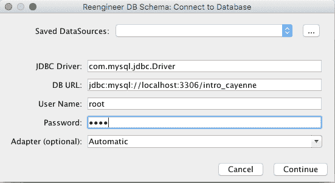
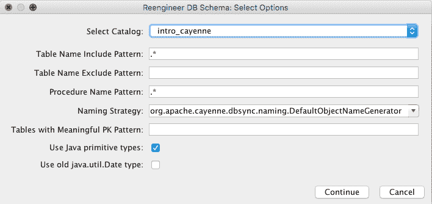
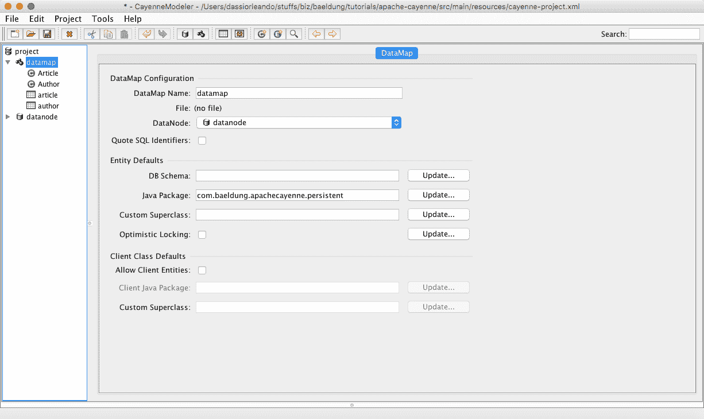
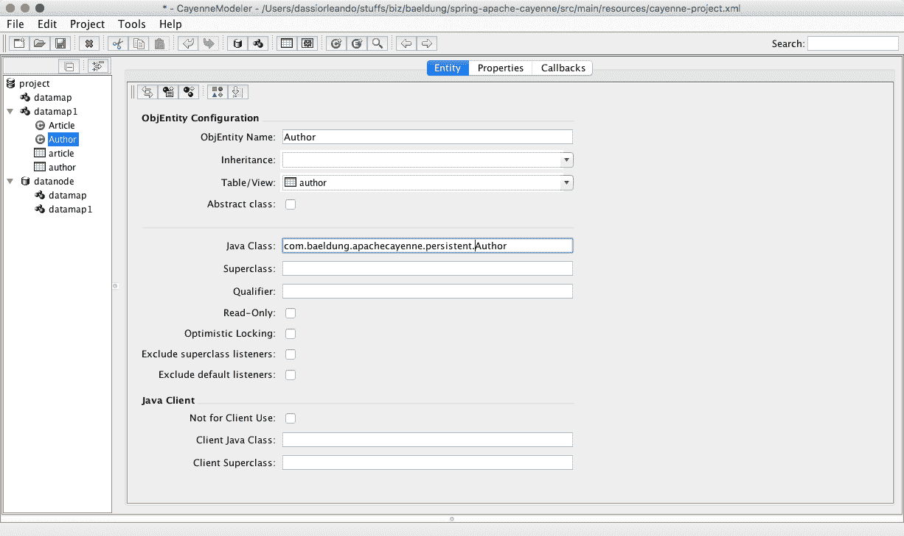

# Apache Cayenne ORM 简介

> 原文：<https://web.archive.org/web/20220930061024/https://www.baeldung.com/apache-cayenne-orm>

## **1。概述**

Apache Cayenne 是一个开源库，在 Apache 许可下发布，为本地持久化操作和远程服务提供建模工具、对象关系映射(也称为 ORM)等功能。

在下面几节中，我们将看到如何使用 Apache Cayenne ORM 与 MySQL 数据库进行交互。

## **2。Maven 依赖关系**

首先，我们只需添加以下依赖项，就可以将 Apache Cayenne 和 MySQL connector JDBC 驱动程序放在一起访问我们的`intro_cayenne`数据库:

```
<dependency>
    <groupId>org.apache.cayenne</groupId>
    <artifactId>cayenne-server</artifactId>
    <version>4.0.M5</version>
</dependency>
<dependency>
    <groupId>mysql</groupId>
    <artifactId>mysql-connector-java</artifactId>
    <version>5.1.44</version>
    <scope>runtime</scope>
</dependency>
```

让我们配置 Cayenne modeler 插件，该插件将用于设计或设置映射文件，该文件充当数据库模式和 Java 对象之间的桥梁:

```
<plugin>
    <groupId>org.apache.cayenne.plugins</groupId>
    <artifactId>maven-cayenne-modeler-plugin</artifactId>
    <version>4.0.M5</version>
</plugin>
```

不要手工构建 XML 映射文件(很少这样做)，建议使用 modeler，它是 Cayenne 发行版附带的一个非常高级的工具。

它可以从这个[归档](https://web.archive.org/web/20220701014653/https://cayenne.apache.org/download.html)下载，这取决于你的操作系统，或者只是使用作为 Maven 插件包含的跨平台版本(JAR)。

Maven 中央存储库托管着最新版本的 [Apache Cayenne](https://web.archive.org/web/20220701014653/https://search.maven.org/classic/#search%7Cga%7C1%7Ca%3A%22cayenne-server%22) 、 [his modeler](https://web.archive.org/web/20220701014653/https://search.maven.org/classic/#search%7Cga%7C1%7Ca%3A%22cayenne-modeler-maven-plugin%22) 和 [MySQL Connector](https://web.archive.org/web/20220701014653/https://search.maven.org/classic/#search%7Cgav%7C1%7Cg%3A%22mysql%22%20AND%20a%3A%22mysql-connector-java%22) 。

接下来，让我们用`mvn install`构建我们的项目，并使用命令`mvn cayenne-modeler:run`启动 modeler GUI，得到这个屏幕的输出:

[](/web/20220701014653/https://www.baeldung.com/wp-content/uploads/2017/09/Screen1.png)

## **3。设置**

为了让 Apache Cayenne 查找正确的本地数据库，我们只需要用正确的驱动程序、URL 和位于`resources`目录下的文件`cayenne-project.xml` 中的用户来填充他的配置文件:

```
<?xml version="1.0" encoding="utf-8"?>
<domain project-version="9">
    <node name="datanode"
          factory
      ="org.apache.cayenne.configuration.server.XMLPoolingDataSourceFactory"
          schema-update-strategy
      ="org.apache.cayenne.access.dbsync.CreateIfNoSchemaStrategy">
        <data-source>
            <driver value="com.mysql.jdbc.Driver"/>
            <url value
              ="jdbc:mysql://localhost:3306/intro_cayenne;create=true"/>
            <connectionPool min="1" max="1"/>
            <login userName="root" password="root"/>
        </data-source>
    </node>
</domain>
```

在这里我们可以看到:

*   本地数据库被命名为`intro_cayenne`
*   如果尚未创建，Cayenne 将为我们创建
*   我们将使用用户名`root`和密码`root`进行连接(根据您数据库管理系统中注册的用户进行更改)

在内部，`XMLPoolingDataSourceFactory`负责从与`DataNodeDescriptor`相关联的 XML 资源中加载 JDBC 连接信息。

请注意，这些参数是与数据库管理系统和 JDBC 驱动程序相关的，因为这个库可以支持许多不同的数据库。

在这个详细的[列表](https://web.archive.org/web/20220701014653/https://cayenne.apache.org/database-support.html)中，它们每个都有一个可用的适配器。请注意，4.0 版的完整文档尚不可用，因此我们在这里参考以前的版本。

## **4。映射&数据库设计**

### **4.1。建模**

现在让我们点击`“Open Project”`，导航到项目的 resources 文件夹并选择文件`cayenne-project.xml,` ,建模器将显示如下:

[](/web/20220701014653/https://www.baeldung.com/wp-content/uploads/2017/09/Capture-d’écran-2017-09-26-à-02.45.04.png)

这里，**我们可以选择从现有的数据库** **创建映射结构，或者手动继续。**本文将介绍如何使用建模器和现有数据库进入 Cayenne，并快速了解其工作原理。

让我们看一下我们的`intro_cayenne`数据库，它在两个表之间有一个`one-to-many`关系，因为一个作者可以发表或拥有许多文章:

*   `author: id (PK)` 和`name`
*   `article: id (PK), title, content`和 `author_id(FK)`

现在让我们转到“`Tools > Reengineer Database Schema`”，我们将自动填充所有映射配置。在提示屏幕上，只需填写`cayenne-project.xml`文件中可用的数据源配置，然后点击继续:

[](/web/20220701014653/https://www.baeldung.com/wp-content/uploads/2017/09/Capture-d’écran-2017-09-26-à-02.55.12.png)

在下一个屏幕上，我们需要检查“使用 Java 基本类型”，如下所示:

[](/web/20220701014653/https://www.baeldung.com/wp-content/uploads/2017/09/Capture-d’écran-2017-09-24-à-14.02.18.png)

我们还需要确保将`com.baeldung.apachecayenne.persistent` 作为 Java 包并保存它；我们将看到 XML 配置文件的`defaultPackage`属性已经更新，以匹配 Java 包:

[](/web/20220701014653/https://www.baeldung.com/wp-content/uploads/2017/09/Capture-d’écran-2017-09-26-à-02.58.41.png)

在每个`ObjEntity`中，我们必须为子类指定包，如下图所示，并再次点击`“save”`图标:

[](/web/20220701014653/https://www.baeldung.com/wp-content/uploads/2017/09/Screen5.png)

现在在`“Tools > Generate Classes”`菜单上，选择`Standard Persistent Objects`作为类型；在`“Classes”`选项卡上检查所有的类并点击`“generate”`。

让我们回到源代码，看看我们的持久化对象已经成功生成，说到`_Article.java`和`_Author.java`。

注意，所有这些配置都保存在文件`datamap.map.xml`中，该文件也位于`resources`文件夹中。

### **4.2。映射结构**

资源文件夹中显示的生成的 XML 映射文件使用了一些与 Apache Cayenne 相关的独特标记:

*   `DataNode(<node>)`–数据库的型号，其内容连接到数据库所需的所有信息(数据库名称、驱动程序和用户凭证)
*   这是一个包含持久实体及其关系的容器
*   `DbAttribute(<db-attribute>)`–表示数据库表格中的一列
*   `DbEntity(<db-entity>)`–单个数据库表或视图的模型，它可以有数据库属性和关系
*   `ObjEntity(<obj-entity>)`–单个持久 java 类的模型；由对应于实体类属性的 ObjAttributes 和具有另一个实体类型的属性 ObjRelationships 组成
*   `Embeddable(<embeddable>)`–Java 类的模型，作为对象的属性，但是对应于数据库中的多个列
*   `Procedure(<procedure>)`–在数据库中注册存储过程
*   `Query(<query>)`–查询的模型，用于在配置文件中映射查询，但不要忘记，我们也可以在代码中进行映射

以下是完整的[细节](https://web.archive.org/web/20220701014653/https://cayenne.apache.org/docs/3.1/cayenne-guide/cayenne-mapping-structure.html)。

## **5。Cayenne API**

剩下的唯一一步是使用 Cayenne API 通过生成的类来执行我们的数据库操作，要知道对我们的持久类进行子类化只是用于以后定制模型的最佳实践。

### **5.1。创建一个对象**

这里，我们只保存一个`Author`对象，稍后检查数据库中是否只有一个这种类型的记录:

```
@Test
public void whenInsert_thenWeGetOneRecordInTheDatabase() {
    Author author = context.newObject(Author.class);
    author.setName("Paul");

    context.commitChanges();

    long records = ObjectSelect.dataRowQuery(Author.class)
      .selectCount(context);

    assertEquals(1, records);
}
```

### 5.2。读取对象

在保存了一个`Author`之后，我们只需通过一个简单的查询，根据一个特定的属性从中挑选一个:

```
@Test
public void whenInsert_andQueryByFirstName_thenWeGetTheAuthor() {
    Author author = context.newObject(Author.class);
    author.setName("Paul");

    context.commitChanges();

    Author expectedAuthor = ObjectSelect.query(Author.class)
      .where(Author.NAME.eq("Paul"))
      .selectOne(context);

    assertEquals("Paul", expectedAuthor.getName());
}
```

### 5.3。检索一个类别的所有记录

我们将保存两个作者，并检索一组作者对象，以检查是否只保存了这两个作者:

```
@Test
public void whenInsert_andQueryAll_thenWeGetTwoAuthors() {
    Author firstAuthor = context.newObject(Author.class);
    firstAuthor.setName("Paul");

    Author secondAuthor = context.newObject(Author.class);
    secondAuthor.setName("Ludovic");

    context.commitChanges();

    List<Author> authors = ObjectSelect
      .query(Author.class)
      .select(context);

    assertEquals(2, authors.size());
}
```

### 5.4。更新一个对象

更新过程也很容易，但是在修改对象的属性并将其应用到数据库之前，我们首先需要拥有所需的对象:

```
@Test
public void whenUpdating_thenWeGetAnUpatedeAuthor() {
    Author author = context.newObject(Author.class);
    author.setName("Paul");
    context.commitChanges();

    Author expectedAuthor = ObjectSelect.query(Author.class)
      .where(Author.NAME.eq("Paul"))
      .selectOne(context);
    expectedAuthor.setName("Garcia");
    context.commitChanges();

    assertEquals(author.getName(), expectedAuthor.getName());
}
```

### **5.5。附着一个物体**

我们可以将一篇文章分配给一个作者:

```
@Test
public void whenAttachingToArticle_thenTheRelationIsMade() {
    Author author = context.newObject(Author.class);
    author.setName("Paul");

    Article article = context.newObject(Article.class);
    article.setTitle("My post title");
    article.setContent("The content");
    article.setAuthor(author);

    context.commitChanges();

    Author expectedAuthor = ObjectSelect.query(Author.class)
      .where(Author.NAME.eq("Smith"))
      .selectOne(context);

    Article expectedArticle = (expectedAuthor.getArticles()).get(0);

    assertEquals(article.getTitle(), expectedArticle.getTitle());
}
```

### 5.6。删除一个对象

删除保存的对象会将其从数据库中完全删除，此后我们将看到查询结果为`null`:

```
@Test
public void whenDeleting_thenWeLostHisDetails() {
    Author author = context.newObject(Author.class);
    author.setName("Paul");
    context.commitChanges();

    Author savedAuthor = ObjectSelect.query(Author.class)
      .where(Author.NAME.eq("Paul"))
      .selectOne(context);
    if(savedAuthor != null) {
        context.deleteObjects(author);
        context.commitChanges();
    }

    Author expectedAuthor = ObjectSelect.query(Author.class)
      .where(Author.NAME.eq("Paul"))
      .selectOne(context);

    assertNull(expectedAuthor);
}
```

### **5.7。删除一个类别的所有记录**

也可以使用`SQLTemplate`删除表中的所有记录，这里我们在每个测试方法之后都这样做，以便在每个测试开始之前总是有一个空数据库`:`

```
@After
public void deleteAllRecords() {
    SQLTemplate deleteArticles = new SQLTemplate(
      Article.class, "delete from article");
    SQLTemplate deleteAuthors = new SQLTemplate(
      Author.class, "delete from author");

    context.performGenericQuery(deleteArticles);
    context.performGenericQuery(deleteAuthors);
}
```

## **6。结论**

在本教程中，我们主要使用 Apache Cayenne ORM 来简单地演示如何使用`one-to-many`关系进行 CRUD 操作。

和往常一样，这篇文章的源代码可以在 GitHub 上找到[。](https://web.archive.org/web/20220701014653/https://github.com/eugenp/tutorials/tree/master/persistence-modules/apache-cayenne)