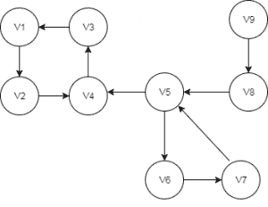
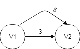
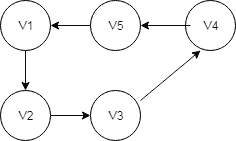
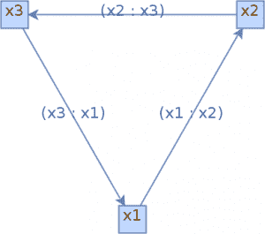

# JGraphT 简介

> 原文：<https://web.archive.org/web/20220930061024/https://www.baeldung.com/jgrapht>

## **1。概述**

大多数时候，当我们实现基于图的算法时，我们还需要实现一些效用函数。

JGraphT 是一个开源的 Java 类库，它不仅为我们提供了各种类型的图形，还提供了许多有用的算法来解决最常见的图形问题。

在本文中，我们将看到如何创建不同类型的图形，以及使用提供的实用程序有多方便。

## **2。Maven 依赖关系**

让我们从向 Maven 项目添加依赖项开始:

[PRE0]

最新版本可以在 [Maven Central](https://web.archive.org/web/20221208143830/https://search.maven.org/classic/#search%7Cga%7C1%7Cg%3A%22org.jgrapht%22) 找到。

## **3。创建图表**

JGraphT 支持各种类型的图形。

### **3.1。简单图形**

首先，让我们创建一个顶点类型为`String`的简单图形:

[PRE1]

### **3.2。有向/无向图**

它还允许我们创建有向/无向图。

在我们的示例中，我们将创建一个有向图，并使用它来演示其他效用函数和算法:

[PRE2]

### **3.3。完整图表**

同样，我们也可以生成一个完整的图形:

[PRE3]

### **3.4。多图表**

除了简单图，API 还为我们提供了多重图(在两个顶点之间有多条路径的图)。

此外，我们可以在任何图中拥有加权/未加权或用户定义的边。

让我们创建一个带加权边的多重图:

[PRE4]

除此之外，我们可以有不可修改(只读)和可列表(允许外部监听器跟踪修改)的图以及子图。此外，我们总是可以创建这些图形的所有组成。

更多 API 细节可以在[这里](https://web.archive.org/web/20221208143830/http://jgrapht.org/javadoc/)找到。

## **4。API 算法**

现在，我们已经有了完整的图形对象，让我们看看一些常见的问题及其解决方案。

### **4.1。图形迭代**

我们可以根据需要使用各种迭代器遍历图，比如`BreadthFirstIterator`、`DepthFirstIterator`、`ClosestFirstIterator`、`RandomWalkIterator`。
我们只需要通过传递图形对象来创建各自迭代器的实例:

[PRE5]

一旦我们得到迭代器对象，我们就可以使用`hasNext()`和`next()` 方法执行迭代。

### **4.2。寻找最短路径**

它在`org.jgrapht.alg.shortestpath`包中提供了各种算法的实现，如 [Dijkstra、Bellman-Ford、Astar 和 FloydWarshall](/web/20221208143830/https://www.baeldung.com/cs/prim-dijkstra-difference) 。

让我们使用 Dijkstra 的算法找到最短路径:

[PRE6]

同样，要使用贝尔曼-福特算法获得最短路径:

[PRE7]

### **4.3。寻找强连通子图**

在我们进入实现之前，让我们简单地看一下强连通子图是什么意思。只有当一个子图的每对顶点之间都有一条路时，这个子图才被称为强连通的。

在我们的例子中，{v1，v2，v3，v4}可以被认为是强连通子图，如果我们可以遍历任何顶点，而不管当前顶点是什么。

我们可以为上图所示的有向图列出四个这样的子图:
{v9}、{v8}、{v5、v6、v7}、{v1、v2、v3、v4}

列出所有强连通子图的实现:

[PRE8]

### 4.4。 **欧拉回路**

图 *G* 中的欧拉回路是包括 *G* 的所有顶点和边的回路。有它的图是欧拉图。

让我们看一下图表:

[PRE9]

现在，我们可以使用 API 测试一个图是否包含欧拉回路:

[PRE10]

### **4.5。哈密顿电路**

恰好访问每个顶点一次的`GraphPath`称为哈密尔顿路径。

哈密尔顿圈(或哈密尔顿回路)是哈密尔顿路径，使得从路径的最后一个顶点到第一个顶点存在边(在图中)。

用`HamiltonianCycle.getApproximateOptimalForCompleteGraph()` 方法可以找到完全图的最优哈密顿圈。

该方法将返回一个近似的最小旅行推销员行程(哈密尔顿循环)。最优解是 NP 完全的，因此这是一个在多项式时间内运行的合适的近似:

[PRE11]

### 4.6。周期检测器

我们还可以检查图中是否有循环。目前，`CycleDetector` 仅支持有向图:

[PRE12]

## **5。图形可视化**

**JGraphT 允许我们生成图形的可视化，并将它们保存为图像**，首先让我们从 Maven Central 添加 [jgrapht-ext](https://web.archive.org/web/20221208143830/https://search.maven.org/search?q=a:jgrapht-ext%20AND%20g:org.jgrapht) 扩展依赖:

[PRE13]

接下来，让我们创建一个具有 3 个顶点和 3 条边的简单有向图:

[PRE14]

我们现在可以看到这个图表:

[PRE15]

这里我们创建了一个`JGraphXAdapter`，它接收我们的图作为构造函数参数，我们对它应用了一个`mxCircleLayout `。这以一种循环的方式展示了可视化。

此外，我们使用一个`mxCellRenderer`来创建一个`BufferedImage`，然后将可视化结果写入一个 png 文件。

我们可以在浏览器或我们最喜欢的渲染器中看到最终的图像:

我们可以在[官方文档](https://web.archive.org/web/20221208143830/https://jgraph.github.io/mxgraph/docs/manual_javavis.html)中找到更多细节。

## **6。结论**

JGraphT 提供了几乎所有类型的图形和各种图形算法。我们讲述了如何使用一些流行的 API。但是，你总是可以在[官方页面](https://web.archive.org/web/20221208143830/http://jgrapht.org/)上探索图书馆。

所有这些例子和代码片段的实现都可以在 Github 上找到[。](https://web.archive.org/web/20221208143830/https://github.com/eugenp/tutorials/tree/master/algorithms-modules/algorithms-miscellaneous-2)