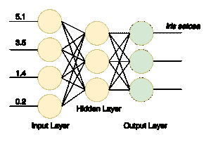

# 深度学习指南 4j

> 原文：<https://web.archive.org/web/20220930061024/https://www.baeldung.com/deeplearning4j>

## **1。简介**

在本文中，我们将使用 [deeplearning4j](https://web.archive.org/web/20220901123902/https://deeplearning4j.konduit.ai/) (dl4j)库创建一个简单的神经网络，这是一个用于机器学习的现代而强大的工具。

在我们开始之前，并不是说这个指南不需要一个扎实的 ML 工程师所必需的线性代数、统计学、机器学习理论和许多其他主题的深刻知识。

## **2。什么是深度学习？**

神经网络是由互连的节点层组成的计算模型。

节点是数字数据的神经元处理器。它们从输入端获取数据，对这些数据应用一些权重和函数，然后将结果发送到输出端。这种网络可以用源数据的一些例子来训练。

训练本质上是在节点中保存一些数字状态(权重),这些数字状态稍后会影响计算。训练示例可以包含具有特征的数据项以及这些项的某些已知类别(例如，“这组 16×16 像素包含手写字母“a”)。

训练完成后，**神经网络可以** **从新数据中获取信息，即使它在**之前没有见过这些特定的数据项。一个模型良好、训练有素的网络可以识别图像、手写信件、语音、处理统计数据以产生商业智能结果，等等。

近年来，随着高性能和并行计算的发展，深度神经网络成为可能。**这种网络不同于简单的神经网络，因为** **它们由多个中间(或[隐藏](/web/20220901123902/https://www.baeldung.com/cs/neural-networks-hidden-layers-criteria))层**组成。这种结构允许网络以更复杂的方式处理数据(以递归、循环、卷积等方式)。)，并从中提取更多的信息。

## **3。设置项目**

要使用该库，我们至少需要 Java 7。此外，由于一些本机组件，它只能与 64 位 JVM 版本一起工作。

在开始使用指南之前，让我们检查一下是否满足要求:

```
$ java -version
java version "1.8.0_131"
Java(TM) SE Runtime Environment (build 1.8.0_131-b11)
Java HotSpot(TM) 64-Bit Server VM (build 25.131-b11, mixed mode)
```

首先，让我们将所需的库添加到 Maven `pom.xml`文件中。我们将把库的版本提取到一个属性条目中(对于库的最新版本，请查看 [Maven Central](https://web.archive.org/web/20220901123902/https://search.maven.org/classic/#search%7Cga%7C1%7Cg%3A%22org.deeplearning4j%22) 库):

```
<properties>
    <dl4j.version>0.9.1</dl4j.version>
</properties>

<dependencies>

    <dependency>
        <groupId>org.nd4j</groupId>
        <artifactId>nd4j-native-platform</artifactId>
        <version>${dl4j.version}</version>
    </dependency>

    <dependency>
        <groupId>org.deeplearning4j</groupId>
        <artifactId>deeplearning4j-core</artifactId>
        <version>${dl4j.version}</version>
    </dependency>
</dependencies>
```

注意`nd4j-native-platform`依赖是几种可用的实现之一。

它依赖于可用于许多不同平台(macOS、Windows、Linux、Android 等)的本地库。).如果我们想在支持 CUDA 编程模型的显卡上执行计算，我们也可以将后端切换到`nd4j-cuda-8.0-platform`。

## **4。准备数据**

### **4.1。准备数据集文件**

我们将编写机器学习的“Hello World”——[鸢尾花数据集](https://web.archive.org/web/20220901123902/https://en.wikipedia.org/wiki/Iris_flower_data_set)的分类。这是一组从不同种类的花(`Iris setosa`、`Iris versicolor`和`Iris virginica`)中收集的数据。

这些种类在花瓣和萼片的长度和宽度上不同。很难编写一个精确的算法来对输入数据项进行分类(例如，确定特定的花属于哪个物种)。但是一个训练有素的神经网络可以快速分类，而且误差很小。

我们将使用该数据的 CSV 版本，其中第 0 列..3 包含物种的不同特征，第 4 列包含记录的类别或物种，用值 0、1 或 2 编码:

```
5.1,3.5,1.4,0.2,0
4.9,3.0,1.4,0.2,0
4.7,3.2,1.3,0.2,0
…
7.0,3.2,4.7,1.4,1
6.4,3.2,4.5,1.5,1
6.9,3.1,4.9,1.5,1
…
```

### **4.2。矢量化并读取数据**

我们用数字对类进行编码，因为神经网络与数字一起工作。**将现实世界的数据项转换成一系列数字(向量)被称为矢量化**–deep learning 4j 使用 [datavec](https://web.archive.org/web/20220901123902/https://github.com/deeplearning4j/deeplearning4j/tree/master/datavec) 库来完成这项工作。

首先，让我们使用这个库来输入带有矢量化数据的文件。当创建`CSVRecordReader`时，我们可以指定要跳过的行数(例如，如果文件有标题行)和分隔符(在我们的例子中是逗号):

```
try (RecordReader recordReader = new CSVRecordReader(0, ',')) {
    recordReader.initialize(new FileSplit(
      new ClassPathResource("iris.txt").getFile()));

    // …
}
```

为了迭代记录，我们可以使用`DataSetIterator`接口的多种实现中的任何一种。数据集可能非常庞大，分页或缓存值的能力可能会派上用场。

但是我们的小数据集只包含 150 条记录，所以让我们通过调用`iterator.next()`将所有数据一次性读入内存。

**我们还指定了类别列的索引**，在我们的例子中，它与特征计数(4) **和类别总数** (3)相同。

另外，请注意**我们需要打乱数据集，以消除原始文件中的类排序。**

我们指定一个常量随机种子(42)来代替默认的`System.currentTimeMillis()`调用，这样洗牌的结果总是相同的。这使得我们每次运行程序时都能获得稳定的结果:

```
DataSetIterator iterator = new RecordReaderDataSetIterator(
  recordReader, 150, FEATURES_COUNT, CLASSES_COUNT);
DataSet allData = iterator.next();
allData.shuffle(42);
```

### **4.3。规格化和拆分**

在训练之前，我们应该对数据做的另一件事是将其标准化。[标准化](/web/20220901123902/https://www.baeldung.com/cs/normalize-table-features)是一个两阶段的过程:

*   收集关于数据的一些统计数据(fit)
*   以某种方式改变(转换)数据，使其一致

**对于不同类型的数据，标准化可能有所不同。**

例如，如果我们想要处理各种尺寸的图像，我们应该首先收集尺寸统计，然后将图像缩放到统一的尺寸。

但对于数字来说，归一化通常意味着将其转化为所谓的正态分布。这个类可以帮助我们:

```
DataNormalization normalizer = new NormalizerStandardize();
normalizer.fit(allData);
normalizer.transform(allData);
```

既然数据已经准备好了，我们需要将集合分成两部分。

第一部分将用于培训课程。我们将使用数据的第二部分(网络根本看不到)来测试训练好的网络。

这将允许我们验证分类工作是否正确。我们将 65%的数据(0.65)用于训练，剩下的 35%用于测试:

```
SplitTestAndTrain testAndTrain = allData.splitTestAndTrain(0.65);
DataSet trainingData = testAndTrain.getTrain();
DataSet testData = testAndTrain.getTest();
```

## **5。准备网络配置**

### **5.1。流畅的配置生成器**

现在，我们可以用一个奇特的 fluent 构建器来构建我们的网络配置:

```
MultiLayerConfiguration configuration 
  = new NeuralNetConfiguration.Builder()
    .iterations(1000)
    .activation(Activation.TANH)
    .weightInit(WeightInit.XAVIER)
    .learningRate(0.1)
    .regularization(true).l2(0.0001)
    .list()
    .layer(0, new DenseLayer.Builder().nIn(FEATURES_COUNT).nOut(3).build())
    .layer(1, new DenseLayer.Builder().nIn(3).nOut(3).build())
    .layer(2, new OutputLayer.Builder(
      LossFunctions.LossFunction.NEGATIVELOGLIKELIHOOD)
        .activation(Activation.SOFTMAX)
        .nIn(3).nOut(CLASSES_COUNT).build())
    .backprop(true).pretrain(false)
    .build();
```

即使使用这种简化的流畅的方式来构建网络模型，也有很多东西需要消化，还有很多参数需要调整。让我们来分解这个模型。

### 5.2。设置网络参数

**`iterations()`构建器方法指定优化迭代的次数。**

迭代优化意味着在训练集上执行多次传递，直到网络收敛到好的结果。

通常，当在真实和大型数据集上训练时，我们使用多个时期(数据通过网络的完整传递)和每个时期的一次迭代。但是由于我们的初始数据集很小，我们将使用一个历元和多次迭代。

**`activation()`是一个在节点内部运行以确定其输出的函数。**

最简单的激活函数应该是线性的`f(x) = x.` ,但事实证明，只有非线性函数才允许网络通过使用几个节点来解决复杂的任务。

有许多不同的激活功能可用，我们可以在`org.nd4j.linalg.activations.Activation`枚举中查找。如果需要，我们也可以编写激活函数。但是我们将使用提供的双曲正切(tanh)函数。

**`weightInit()`方法指定了为网络设置初始权重的多种方法之一。**正确的初始权重会深刻影响训练的结果。不需要太多的数学知识，让我们把它设置成高斯分布的形式(`WeightInit.XAVIER`)，因为这通常是一个好的开始选择。

所有其他权重初始化方法可在`org.deeplearning4j.nn.weights.WeightInit`枚举中查找。

**学习速率**是深刻影响网络学习能力的关键参数。

在更复杂的情况下，我们可以花很多时间来调整这个参数。但是对于我们的简单任务，我们将使用一个非常重要的值 0.1，并用`learningRate()` builder 方法设置它。

**训练神经网络的一个问题是当网络“记忆”训练数据时会出现过拟合**的情况。

当网络为训练数据设置过高的权重并对任何其他数据产生不良结果时，就会发生这种情况。

**为了解决这个问题，我们将使用行`.regularization(true).l2(0.0001)`建立 l2 正则化**。正则化“惩罚”网络过大的权重，并防止过度拟合。

### 5.3。构建网络层

接下来，我们创建一个密集(也称为全连接)层的网络。

第一层应包含与训练数据中的列相同数量的节点(4)。

第二个密集层将包含三个节点。这是我们可以改变的值，但是前一层的输出数量必须相同。

最终输出层应包含与类的数量相匹配的节点数量(3)。网络的结构如图所示:

[](/web/20220901123902/https://www.baeldung.com/wp-content/uploads/2017/10/Untitled-Diagram.png)

训练成功后，我们将有一个网络，通过它的输入接收四个值，并向它的三个输出之一发送信号。这是一个简单的分类器。

最后，为了完成网络的构建，我们设置了反向传播(最有效的训练方法之一)，并使用行`.backprop(true).pretrain(false)`禁用预训练。

## **6。创建和训练网络**

现在让我们根据配置创建一个神经网络，初始化并运行它:

```
MultiLayerNetwork model = new MultiLayerNetwork(configuration);
model.init();
model.fit(trainingData);
```

现在，我们可以使用数据集的其余部分来测试已训练的模型，并使用三个类的评估指标来验证结果:

```
INDArray output = model.output(testData.getFeatureMatrix());
Evaluation eval = new Evaluation(3);
eval.eval(testData.getLabels(), output);
```

如果我们现在打印出`eval.stats()`，我们会看到我们的网络在分类鸢尾花方面做得很好，尽管它确实三次将类别 1 误认为类别 2。

```
Examples labeled as 0 classified by model as 0: 19 times
Examples labeled as 1 classified by model as 1: 16 times
Examples labeled as 1 classified by model as 2: 3 times
Examples labeled as 2 classified by model as 2: 15 times

==========================Scores========================================
# of classes: 3
Accuracy: 0.9434
Precision: 0.9444
Recall: 0.9474
F1 Score: 0.9411
Precision, recall & F1: macro-averaged (equally weighted avg. of 3 classes)
========================================================================
```

fluent configuration builder 允许我们快速添加或修改网络层，或者调整一些其他参数，看看我们的模型是否可以改进。

## 7 .**。结论**

在本文中，我们通过使用 deeplearning4j 库构建了一个简单而强大的神经网络。

和往常一样，这篇文章的源代码可以在 GitHub 的[上找到。](https://web.archive.org/web/20220901123902/https://github.com/eugenp/tutorials/tree/master/deeplearning4j)