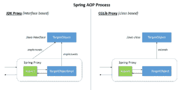

# 比较 Spring AOP 和 AspectJ

> 原文:[https://web . archive . org/web/20220930061024/https://www . bael dung . com/spring-AOP-vs-AspectJ](https://web.archive.org/web/20220930061024/https://www.baeldung.com/spring-aop-vs-aspectj)

## **1。简介**

现在有多种可用的 AOP 库，它们需要能够回答许多问题:

*   它与我现有的或新的应用程序兼容吗？
*   哪里可以实现 AOP？
*   它与我的应用程序集成的速度有多快？
*   性能开销是多少？

在本文中，我们将回答这些问题，并介绍 Spring AOP 和 AspectJ——两个最流行的 Java AOP 框架。

## **2。AOP 概念**

在我们开始之前，让我们快速回顾一下术语和核心概念:

*   方面——分散在应用程序中多个地方的标准代码/特性，通常不同于实际的业务逻辑(例如，事务管理)。每个方面都专注于一个特定的横切功能
*   连接点——它是程序执行过程中的一个特殊点，比如方法执行、构造函数调用或字段赋值
*   建议——特定连接点中方面采取的操作
*   切入点–匹配连接点的正则表达式。每当任何连接点匹配一个切入点时，就会执行与该切入点相关联的指定通知
*   编织——将方面与目标对象联系起来以创建建议对象的过程

## **3。Spring AOP 和 AspectJ**

现在，让我们从多个方面来讨论 Spring AOP 和 AspectJ 比如功能、目标、编织、内部结构、连接点和简单性。

### **3.1。能力和目标**

简单来说，Spring AOP 和 AspectJ 的目标不同。

Spring AOP 旨在跨 Spring IoC 提供一个简单的 AOP 实现，以解决程序员面临的最常见的问题。它并不是一个完整的 AOP 解决方案，它只能应用于由 Spring 容器管理的 beans。

另一方面， **AspectJ 是原始的 AOP 技术，旨在提供完整的 AOP 解决方案。**它比 Spring AOP 更健壮，但也明显更复杂。同样值得注意的是，AspectJ 可以跨所有域对象应用。

### **3.2。编织**

AspectJ 和 Spring AOP 都使用不同类型的编织，这影响了它们在性能和易用性方面的行为。

AspectJ 使用三种不同类型的编织:

1.  **编译时编织**:AspectJ 编译器将我们的方面和应用程序的源代码作为输入，并生成一个编织的类文件作为输出
2.  **编译后编织**:这也称为二进制编织。它用于将现有的类文件和 JAR 文件与我们的方面编织在一起
3.  加载时织入:这与之前的二进制织入完全一样，不同之处在于织入被推迟，直到类加载器将类文件加载到 JVM

关于 AspectJ 本身的更深入的信息，[请阅读本文](/web/20220628055136/https://www.baeldung.com/aspectj)。

由于 AspectJ 使用[编译时](/web/20220628055136/https://www.baeldung.com/cs/compile-load-execution-time)和类加载时编织， **Spring AOP 使用运行时编织**。

使用运行时编织，在应用程序执行期间使用目标对象的代理编织方面——使用 JDK 动态代理或 CGLIB 代理(将在下一点讨论):

### **3.3。内部结构和应用**

Spring AOP 是一个基于代理的 AOP 框架。这意味着为了实现目标对象的方面，它将创建该对象的代理。这可以通过以下两种方式实现:

1.  JDK 动态代理 Spring AOP 的首选方式。只要目标对象实现了一个接口，就会使用 JDK 动态代理
2.  CGLIB 代理–如果目标对象没有实现接口，那么可以使用 CGLIB 代理

我们可以从官方文档中了解更多关于 Spring AOP 代理机制的信息。

另一方面，AspectJ 在运行时不做任何事情，因为类是用方面直接编译的。

所以不像 Spring AOP，它不需要任何设计模式。为了将这些方面编织到代码中，它引入了名为 AspectJ compiler (ajc)的编译器，通过它我们可以编译我们的程序，然后通过提供一个小的(< 100K)运行时库来运行它。

### **3.4。连接点**

在 3.3 节中，我们展示了 Spring AOP 是基于代理模式的。因此，它需要对目标 Java 类进行子类化，并相应地应用横切关注点。

但是它有一个限制。我们不能跨“最终”类应用横切关注点(或方面),因为它们不能被覆盖，因此会导致运行时异常。

这同样适用于静态和最终方法。Spring 方面不能应用于它们，因为它们不能被覆盖。因此，由于这些限制，Spring AOP 只支持方法执行连接点。

然而， **AspectJ 在运行前将横切关注点直接编织到实际代码中。与 Spring AOP 不同，它不需要子类化目标对象，因此也支持许多其他连接点。以下是受支持连接点的摘要:**

| Joinpoint | 支持 Spring AOP | 支持 AspectJ |
| --- | --- | --- |
| 方法调用 | 不 | 是 |
| 方法执行 | 是 | 是 |
| 构造函数调用 | 不 | 是 |
| 构造函数执行 | 不 | 是 |
| 静态初始值设定项执行 | 不 | 是 |
| 对象初始化 | 不 | 是 |
| 字段参考 | 不 | 是 |
| 现场分配 | 不 | 是 |
| 处理程序执行 | 不 | 是 |
| 建议执行 | 不 | 是 |

同样值得注意的是，在 Spring AOP 中，方面不会应用于同一个类中调用的方法。

这显然是因为当我们在同一个类中调用一个方法时，我们并没有调用 Spring AOP 提供的代理的方法。如果我们需要这个功能，那么我们必须在不同的 beans 中定义一个单独的方法，或者使用 AspectJ。

### **3.5。简单性**

Spring AOP 显然更简单，因为它没有在我们的构建过程之间引入任何额外的编译器或织入器。它使用运行时编织，因此它与我们通常的构建过程无缝集成。虽然看起来很简单，但它只适用于 Spring 管理的 beans。

然而，要使用 AspectJ，我们需要引入 AspectJ 编译器(ajc)并重新打包我们所有的库(除非我们切换到后编译或加载时编织)。

当然，这比前者更复杂——因为它引入了 AspectJ Java 工具(包括编译器(ajc)、调试器(ajdb)、文档生成器(ajdoc)、程序结构浏览器(ajbrowser))，我们需要将这些工具与我们的 IDE 或构建工具集成。

### 3.6。性能

就性能而言，**编译时编织比运行时编织**快得多。Spring AOP 是一个基于代理的框架，所以在应用程序启动时就有代理的创建。此外，每个方面还会有更多的方法调用，这会对性能产生负面影响。

另一方面，与 Spring AOP 不同，AspectJ 在应用程序执行之前将方面编织到主代码中，因此没有额外的运行时开销。

出于这些原因，[基准测试](https://web.archive.org/web/20220628055136/https://web.archive.org/web/20150520175004/https://docs.codehaus.org/display/AW/AOP+Benchmark)表明 AspectJ 几乎比 Spring AOP 快 8 到 35 倍。

## **4。总结**

这个表格总结了 Spring AOP 和 AspectJ 之间的主要区别:

| 春季 AOP | AspectJ |
| --- | --- |
| 用纯 Java 实现 | 使用 Java 编程语言的扩展实现 |
| 不需要单独的编译过程 | 需要 AspectJ 编译器(ajc ),除非安装了 LTW |
| 只有运行时编织可用 | 运行时编织不可用。支持编译时、编译后和加载时编织 |
| 功能较弱——仅支持方法级编织 | 更强大——可以编织字段、方法、构造函数、静态初始化器、最终类/方法等… |
| 只能在由 Spring 容器管理的 beans 上实现 | 可以在所有域对象上实现 |
| 仅支持方法执行切入点 | 支持所有切入点 |
| 代理是由目标对象创建的，方面被应用到这些代理上 | 在执行应用程序之前(运行时之前)，方面被直接编织到代码中 |
| 比 AspectJ 慢多了 | 更好的性能 |
| 易于学习和应用 | 相对比 Spring AOP 更复杂 |

## **5。选择正确的框架**

如果我们分析本节中的所有论点，我们将开始理解一个框架并不比另一个框架更好。

简而言之，选择在很大程度上取决于我们的需求:

*   框架:如果应用程序不使用 Spring 框架，那么我们别无选择，只能放弃使用 Spring AOP 的想法，因为它不能管理 Spring 容器范围之外的任何东西。然而，如果我们的应用程序完全是使用 Spring framework 创建的，那么我们可以使用 Spring AOP，因为它很容易学习和应用
*   灵活性:考虑到有限的连接点支持，Spring AOP 不是一个完整的 AOP 解决方案，但是它解决了程序员面临的最常见的问题。尽管如果我们想更深入地挖掘并利用 AOP 的最大能力，并希望得到广泛的连接点的支持，那么 AspectJ 是最好的选择
*   性能:如果我们使用有限的方面，那么性能差异是微不足道的。但是有时一个应用程序有几万个方面。我们不希望在这种情况下使用运行时编织，所以选择 AspectJ 会更好。众所周知 AspectJ 比 Spring AOP 快 8 到 35 倍
*   两全其美:这两个框架彼此完全兼容。只要有可能，我们总是可以利用 Spring AOP，并且仍然使用 AspectJ 来获得前者不支持的连接点的支持

## **6。结论**

在本文中，我们在几个关键领域分析了 Spring AOP 和 AspectJ。

我们比较了这两种 AOP 方法的灵活性以及它们适合我们应用程序的难易程度。