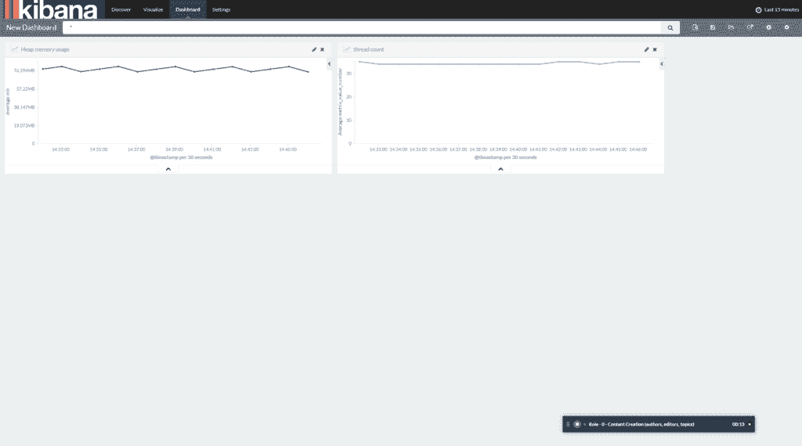

# JMX 数据到弹性堆栈(ELK)

> 原文:[https://web . archive . org/web/20220930061024/https://www . bael dung . com/Tomcat-JMX-elastic-stack](https://web.archive.org/web/20220930061024/https://www.baeldung.com/tomcat-jmx-elastic-stack)

## **1。概述**

在这个快速教程中，我们将看看如何将 JMX 数据从我们的 Tomcat 服务器发送到弹性堆栈(以前称为 ELK)。

我们将讨论如何配置 Logstash 从 JMX 读取数据并将其发送到 Elasticsearch。

## **2。安装弹性堆栈**

首先，我们需要安装弹性堆栈([Elastic search](https://web.archive.org/web/20221126232346/https://www.elastic.co/guide/en/elasticsearch/reference/current/install-elasticsearch.html)–[log stash](https://web.archive.org/web/20221126232346/https://www.elastic.co/guide/en/logstash/current/installing-logstash.html)–[Kibana](https://web.archive.org/web/20221126232346/https://www.elastic.co/guide/en/kibana/current/install.html))

然后，为了确保一切都已连接并正常工作，我们将把 JMX 数据发送到 Logstash，并在 Kibana 上可视化。

### **2.1。测试日志存储**

首先，我们将转到 Logstash 安装目录，该目录因操作系统而异(在我们的例子中是 Ubuntu):

```
cd /opt/logstash
```

我们可以从命令行设置一个简单的 Logstash 配置:

```
bin/logstash -e 'input { stdin { } } output { elasticsearch { hosts => ["localhost:9200"] } }'
```

然后，我们可以简单地在控制台中键入一些样本数据——并在完成后使用 CTRL-D 命令关闭管道。

### **2.2。测试弹性搜索**

添加样本数据后，Elasticsearch 上应该有一个 Logstash 索引，我们可以按如下方式进行检查:

```
curl -X GET 'http://localhost:9200/_cat/indices'
```

样本输出:

```
yellow open logstash-2017.11.10 5 1 3531 0 506.3kb 506.3kb 
yellow open .kibana             1 1    3 0   9.5kb   9.5kb 
yellow open logstash-2017.11.11 5 1 8671 0   1.4mb   1.4mb
```

### **2.3。测试基巴纳**

默认情况下，Kibana 在端口 5601 上运行，我们可以访问主页:

```
http://localhost:5601/app/kibana
```

我们应该能够使用模式“`logstash-*`”创建一个新的索引，并在那里看到我们的样本数据。

## **3。配置 Tomcat**

接下来，我们需要通过向`CATALINA_OPTS`添加以下内容来启用 JMX:

```
-Dcom.sun.management.jmxremote
  -Dcom.sun.management.jmxremote.port=9000
  -Dcom.sun.management.jmxremote.ssl=false
  -Dcom.sun.management.jmxremote.authenticate=false
```

请注意:

*   您可以通过修改`setenv.sh`来配置`CATALINA_OPTS`
*   对于 Ubuntu 用户来说`setenv.sh`可以在“/usr/share/tomcat8/bin”中找到

## **4。连接 JMX 和 Logstash**

现在，让我们将我们的 JMX 指标连接到 log stash——为此，我们需要在那里安装 JMX 输入插件(稍后将详细介绍)。

### **4.1。配置 JMX 指标**

首先，我们需要配置我们想要存储的 JMX 度量标准；我们将以 JSON 格式提供配置。

这是我们的`jmx_config.json`:

```
{
  "host" : "localhost",
  "port" : 9000,
  "alias" : "reddit.jmx.elasticsearch",
  "queries" : [
  {
    "object_name" : "java.lang:type=Memory",
    "object_alias" : "Memory"
  }, {
    "object_name" : "java.lang:type=Threading",
    "object_alias" : "Threading"
  }, {
    "object_name" : "java.lang:type=Runtime",
    "attributes" : [ "Uptime", "StartTime" ],
    "object_alias" : "Runtime"
  }]
}
```

请注意:

*   从`CATALINA_OPTS` 开始，我们对 JMX 使用同一个端口
*   我们可以提供任意多的配置文件，但是我们需要它们在同一个目录中(在我们的例子中，我们将`jmx_config.json` 保存在'/monitor/jmx/')

### **4.2。JMX 输入插件**

接下来，让我们通过在 Logstash 安装目录中运行以下命令来安装 JMX 输入插件:

```
bin/logstash-plugin install logstash-input-jmx
```

然后，我们需要创建一个 Logstash 配置文件(`jmx.conf`)，其中输入是 JMX 指标，输出指向 Elasticsearch:

```
input {
  jmx {
    path => "/monitor/jmx"
    polling_frequency => 60
    type => "jmx"
    nb_thread => 3
  }
}

output {
    elasticsearch {
        hosts => [ "localhost:9200" ]
    }
}
```

最后，我们需要运行 Logstash 并指定我们的配置文件:

```
bin/logstash -f jmx.conf
```

注意，我们的 Logstash 配置文件`jmx.conf`保存在 Logstash 主目录中(在我们的例子中是`/opt/logstash`)

## **5。可视化 JMX 指标**

最后，让我们在 Kibana 上创建一个简单的 JMX 度量数据的可视化。我们将创建一个简单的图表来监控堆内存的使用情况。

### **5.1。创建新搜索**

首先，我们将创建一个新的搜索来获取与堆内存使用相关的指标:

*   点击搜索栏中的“新搜索”图标
*   键入以下查询

    ```
    metric_path:reddit.jmx.elasticsearch.Memory.HeapMemoryUsage.used
    ```

*   按回车键
*   确保从侧边栏添加'`metric_path`'和'`metric_value_number`'字段
*   点击搜索栏中的“保存搜索”图标
*   将搜索命名为“已用内存”

如果侧边栏中的任何字段被标记为未编制索引，请转到“设置”选项卡并刷新“`logstash-*`”索引中的字段列表。

### 5.2。创建折线图

接下来，我们将创建一个简单的折线图来监控一段时间内堆内存的使用情况:

*   转到“可视化”选项卡
*   选择“折线图”
*   选择“从保存的搜索中”
*   选择我们之前创建的“已用内存”搜索

对于 Y 轴，确保选择:

*   聚集:平均值
*   字段:`metric_value_number`

对于 X 轴，选择“日期直方图”，然后保存可视化效果。

### 5.3。使用脚本字段

因为内存使用是以字节为单位的，所以可读性不是很好。我们可以通过在 Kibana 中添加一个脚本字段来转换指标类型和值:

*   从“设置”中，转到索引并选择“`logstash-*`”索引
*   转到“脚本字段”选项卡，然后单击“添加脚本字段”
*   名称:`metric_value_formatted`
*   格式:字节
*   对于脚本，我们将简单地使用'`metric_value_number`'的值:

    ```
    doc['metric_value_number'].value
    ```

现在，您可以更改您的搜索和可视化以使用字段'`metric_value_formatted`'而不是'`metric_value_number`'-数据将会正确显示。

这个非常简单的仪表板看起来是这样的:

[](/web/20221126232346/https://www.baeldung.com/wp-content/uploads/2017/11/kibana-tomcat-simple-example.png)

## **6。结论**

我们结束了。如您所见，配置并不特别困难，让 JMX 数据在 Kibana 中可见使我们能够做许多有趣的可视化工作，以创建一个奇妙的生产监控仪表板。