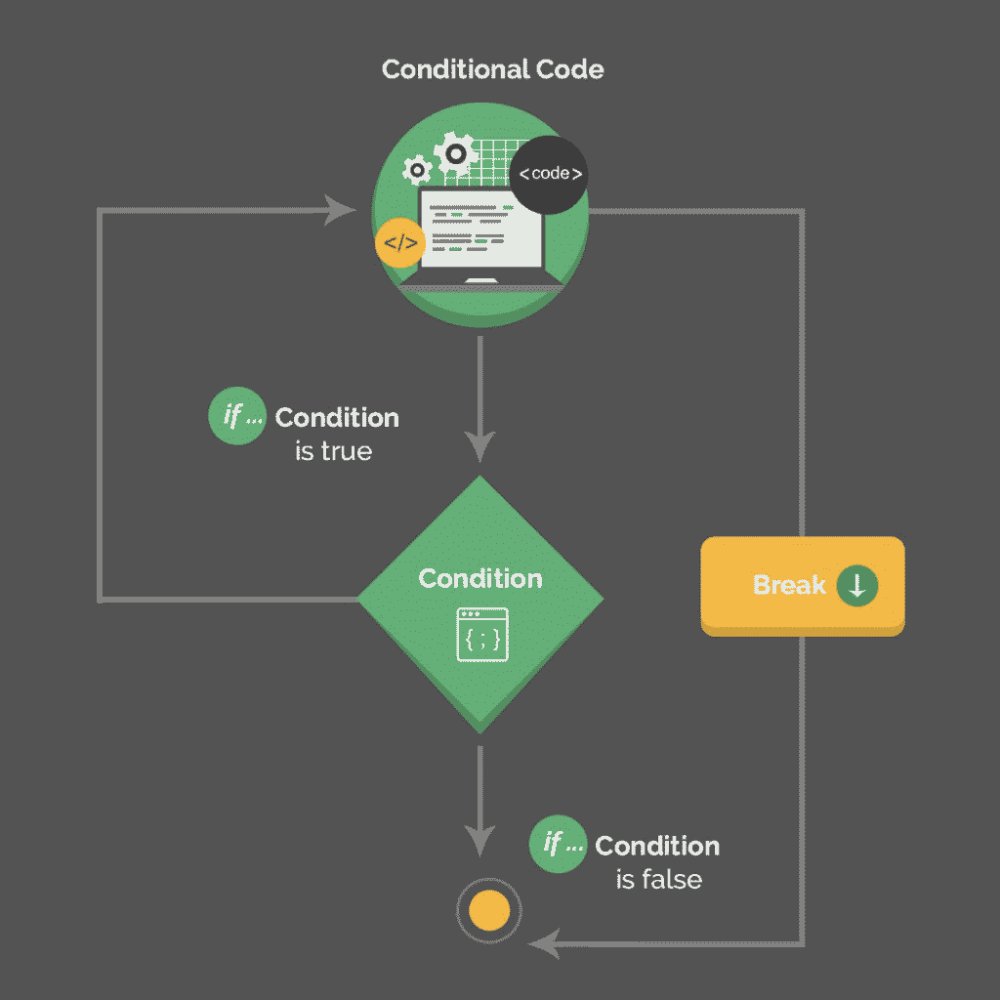
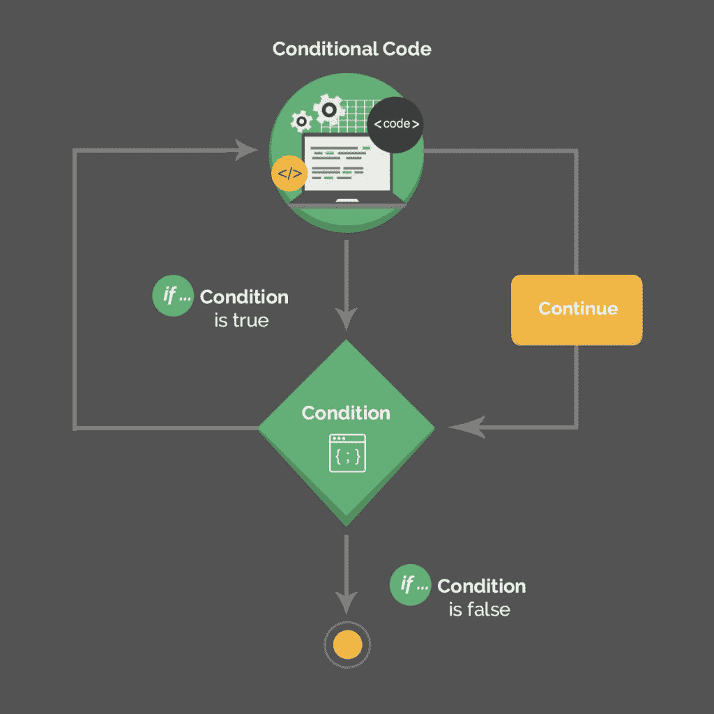

# Java continue 和 break 关键字

> 原文：<https://web.archive.org/web/20220930061024/https://www.baeldung.com/java-continue-and-break>

## **1。概述**

在这篇简短的文章中，我们将介绍`continue`和`break` Java 关键字，并重点介绍如何在实践中使用它们。

简单地说，这些语句的执行导致当前控制流的分支，并终止当前迭代中代码的执行。

## **2。`break`声明**

`break`语句有两种形式:无标签的和有标签的。

[](/web/20221205170605/https://www.baeldung.com/wp-content/uploads/2017/11/Illustration-1.jpg)

### **2.1。未标注`break`**

我们可以使用未标记的语句来终止`for`、`while`或`do-while`循环以及`switch-case`块:

```
for (int i = 0; i < 5; i++) {
    if (i == 3) {
        break;
    }
}
```

这个代码片段定义了一个`for`循环，该循环应该迭代五次。**但是当`counter`等于 3 时，`if`条件变为`true`，并且`break`语句终止循环。**这使得控制流程转移到`for`循环结束后的语句。

在嵌套循环的情况下，**一个未标记的`break`语句只终止它在**中的内部循环。外部循环继续执行:

```
for (int rowNum = 0; rowNum < 3; rowNum++) {
    for (int colNum = 0; colNum < 4; colNum++) {
        if (colNum == 3) {
            break;
        }
    }
}
```

这个代码片段嵌套了`for`循环。**当`colNum`等于 3 时，`if`条件评估为`true and``break`语句导致内部`for`循环终止。**然而，循环的外部*继续迭代。*

### **2.2。标注为`break`**

我们也可以使用带标签的`break`语句来终止`for`、`while`或`do-while`循环。**一个标记的`break`终止外循环**。

终止时，控制流会在外部循环结束后立即转移到语句:

```
compare: 
for (int rowNum = 0; rowNum < 3; rowNum++) {
    for (int colNum = 0; colNum < 4; colNum++) {
        if (rowNum == 1 && colNum == 3) {
            break compare;
        }
    }
}
```

在这个例子中，我们在外部循环之前引入了一个标签。当`rowNum`等于 1 并且`colNum`等于 3 时，`if`条件评估为`true`并且`break`语句终止外部循环。

然后，控制流转移到外部`for`循环结束后的语句。

## **3。`continue`声明**

`continue`语句也有两种形式:无标签的和有标签的。

[](/web/20221205170605/https://www.baeldung.com/wp-content/uploads/2017/11/Illustration-2.jpg)

### **3.1。未标注`continue`**

我们可以使用一个未标记的语句来绕过一个`for`、`while`或`do-while`循环的当前迭代中剩余语句的执行。**它跳到内部循环的末尾，继续循环**:

```
int counter = 0;
for (int rowNum = 0; rowNum < 3; rowNum++) {
    for (int colNum = 0; colNum < 4; colNum++) {
        if (colNum != 3) {
            continue;
        }
        counter++;
    }
}
```

在这个代码片段中，每当`colNum`不等于 3 时，未标记的`continue`语句跳过当前迭代，从而绕过该迭代中变量`counter`的增量。但是，外部的`for`循环继续迭代。因此，`counter`的增量仅在外部`for`循环的每次迭代中`colNum`等于 3 时发生。

### **3.2。标注为`continue`**

我们也可以使用**一个带标签的`continue`语句来跳过外部循环。**跳过后，控制流转移到外部循环的末尾，有效地继续外部循环的迭代:

```
int counter = 0;
compare: 
for (int rowNum = 0; rowNum < 3; rowNum++) {
    for (int colNum = 0; colNum < 4; colNum++) {
        if (colNum == 3) {
            counter++;
            continue compare;
        }
    }
}
```

我们在外部循环之前引入了一个标签。每当`colNum`等于 3 时，变量`counter`递增。带标签的`continue`语句导致外部`for`循环的迭代跳过。

控制流转移到外部`for`循环的末尾，继续下一次迭代。

## **4。结论**

在本教程中，我们看到了在 Java 中使用关键字`break`和`continue`作为分支语句的不同方式。

本文给出的完整代码可以在 GitHub 上的[处获得。](https://web.archive.org/web/20221205170605/https://github.com/eugenp/tutorials/tree/master/core-java-modules/core-java-lang)