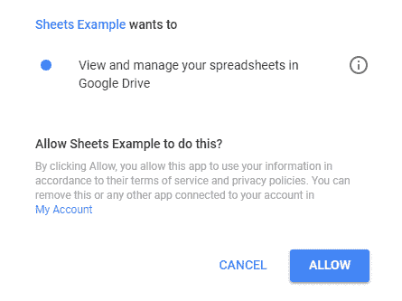

# 从 Java 与 Google Sheets 交互

> 原文：<https://web.archive.org/web/20220930061024/https://www.baeldung.com/google-sheets-java-client>

## **1。概述**

Google Sheets 提供了一种便捷的方式来存储和操作电子表格，并与他人就文档进行协作。

有时，从应用程序访问这些文档会很有用，比如说执行自动化操作。为此，Google 提供了开发者可以与之交互的 Google Sheets API。

在本文中，**我们将看看如何连接到 API 并在 Google Sheets 上执行操作。**

## **2。Maven 依赖关系**

为了连接到 API 并操作文档，我们需要添加 [google-api-client](https://web.archive.org/web/20221222154652/https://search.maven.org/classic/#search%7Cga%7C1%7Ca%3A%22google-api-client%22%20AND%20g%3A%22com.google.api-client%22) 、[Google-oauth-client-jetty](https://web.archive.org/web/20221222154652/https://search.maven.org/classic/#search%7Cga%7C1%7Cgoogle%20oauth%20client%20jetty)和[Google-API-services-sheets](https://web.archive.org/web/20221222154652/https://search.maven.org/classic/#search%7Cga%7C1%7Cgoogle%20api%20services%20sheets)依赖项:

[PRE0]

## **3。授权**

Google Sheets API 需要 OAuth 2.0 授权才能通过应用程序访问它。

首先，我们需要获得一组 OAuth 凭证，然后在我们的应用程序中使用它来提交授权请求。

### **3.1。获取 OAuth 2.0 证书**

为了获得凭证，我们需要在 [Google 开发者控制台](https://web.archive.org/web/20221222154652/https://console.developers.google.com/)中创建一个项目，然后为该项目启用 Google Sheets API。[谷歌快速入门](https://web.archive.org/web/20221222154652/https://developers.google.com/sheets/api/quickstart/java)指南中的第一步包含了如何做到这一点的详细信息。

一旦我们下载了带有凭证信息的 JSON 文件，让我们将内容复制到应用程序的`src/main/resources`目录下的`google-sheets-client-secret.json`文件中。

该文件的内容应该类似于以下内容:

[PRE1]

### **3.2。获得一个`Credential`对象**

**成功的授权返回一个`Credential`对象，我们可以用它与 Google Sheets API 进行交互。**

让我们创建一个带有静态`authorize()`方法的`GoogleAuthorizeUtil`类，该方法读取上面 JSON 文件的内容并构建一个`GoogleClientSecrets`对象。

然后，我们将创建一个`GoogleAuthorizationCodeFlow`并发送授权请求:

[PRE2]

在我们的示例中，我们设置了`SPREADSHEETS`范围，因为我们想要访问 Google Sheets，并使用内存中的`DataStoreFactory`来存储收到的凭证。另一种选择是使用一个`FileDataStoreFactory`将凭证存储在一个文件中。

查看`GoogleAuthorizeUtil` cla `ss,`的完整源代码，请查看[GitHub 项目](https://web.archive.org/web/20221222154652/https://github.com/eugenp/tutorials/tree/master/libraries-data-2)。

## **4。构建`Sheets` 服务实例**

为了与 Google Sheets 交互，我们需要**一个`Sheets`对象，它是通过 API** 读写的客户端。

让我们创建一个`SheetsServiceUtil`类，它使用上面的`Credential`对象来获得`Sheets:`的一个实例

[PRE3]

接下来，我们将看一看我们可以使用 API 执行的一些最常见的操作。

## **5。在工作表中写入数值**

与现有电子表格交互需要知道电子表格的 id，我们可以从它的 URL 中找到 id。

对于我们的示例，我们将使用一个名为“Expenses”的公共电子表格，位于:

[https://docs . Google . com/spreadsheets/d/1 siluxzunyl _ 7-mlnthjt 765 wshn 3 xs-pplfqye 4 dhi/edit # GID = 0](https://web.archive.org/web/20221222154652/https://docs.google.com/spreadsheets/d/1sILuxZUnyl_7-MlNThjt765oWshN3Xs-PPLfqYe4DhI/edit#gid=0)

基于这个 URL，我们可以将这个电子表格的 id 标识为“1 siluxzunyl _ 7-mlnthjt 765 owshn 3 xs-pplfqye 4 dhi”。

另外，**为了读取和写入值，我们将使用`spreadsheets.values`集合。**

这些值被表示为`ValueRange`对象，这些对象是对应于工作表中行或列的 Java 列表`Objects,`的列表。

让我们创建一个测试类，在其中初始化我们的`Sheets`服务对象和一个电子表格 ID 常量:

[PRE4]

然后，我们可以通过以下方式写入值:

*   写入单个范围
*   写入多个范围
*   在表格后追加数据

### **5.1。写入单个范围**

要将值写入工作表上的单个范围，我们将使用`spreadsheets().values().update()`方法:

[PRE5]

这里，我们首先创建一个包含多行的`ValueRange`对象，其中包含两个月的费用清单。

然后，我们使用`update()`方法构建一个请求，从“A1”单元格开始，用给定的 id 将值写入电子表格。

**为了发送请求，我们使用了`execute()`方法。**

如果我们希望我们的值集被认为是列而不是行，我们可以使用`setMajorDimension(“COLUMNS”)`方法。

“RAW”输入选项意味着值完全按照原样写入，而不是经过计算。

当执行这个 JUnit 测试时，**应用程序将使用系统的默认浏览器打开一个浏览器窗口，要求用户登录并允许我们的应用程序代表用户与 Google Sheets 交互:**

请注意，如果您有一个 [OAuth 服务帐户](https://web.archive.org/web/20221222154652/https://developers.google.com/identity/protocols/OAuth2ServiceAccount)，可以绕过这个手动步骤。

应用程序能够查看或编辑电子表格的一个要求是，已登录的用户拥有查看或编辑电子表格的权限。否则，请求将导致 403 错误。我们在示例中使用的电子表格被设置为公共编辑访问。

现在，如果我们检查电子表格，我们将看到范围“`A1:B6`”用我们的值集进行了更新。

让我们继续在单个请求中写入多个不同的范围。

### 5.2。写入多个范围

如果我们想更新工作表中的多个范围，我们可以使用`BatchUpdateValuesRequest`来获得更好的性能:

[PRE6]

在这个例子中，我们首先构建一个由两个单元格组成的`ValueRanges,`列表，这两个单元格分别代表月份名称和总支出。

然后，我们用**创建一个`BatchUpdateValuesRequest`，输入选项`“USER_ENTERED”,`与`“RAW”,`相反，这意味着单元格的值将根据公式**相加另外两个单元格来计算。

最后，我们创建并发送`batchUpdate`请求。因此，范围“`D1:E1`”和“`D4:E4`”将被更新。

### 5.3。在表格后追加数据

在工作表中写入值的另一种方式是将它们追加到表的末尾。

为此，我们可以使用`append()`方法:

[PRE7]

首先，我们构建包含我们想要添加的单元格值的`ValueRange`对象。

在我们的例子中，它包含一个单元格，其中包含两个月的总支出，我们通过将`“E1”`和`“E2”`单元格的值相加找到该单元格。

然后，我们创建一个请求，将数据追加到包含“`A1`”单元格的表格之后。

`INSERT_ROWS`选项意味着我们希望将数据添加到一个新行，而不是替换表后的任何现有数据。这意味着该示例将在第一次运行时写入范围“`A7:B7`”。

在随后的运行中，从`“A1”`单元格开始的表格现在将扩展到包含`“A7:B7”`行，因此新的一行将转到`“A8:B8”`行，依此类推。

如果我们想要验证对请求`.` 的响应，我们还需要将`includeValuesInResponse`属性设置为 true。结果，响应对象将包含更新的数据。

## **6。从工作表中读取数值**

让我们通过从工作表中读取值来验证我们的值是否写对了。

**我们可以通过使用`spreadsheets().values().get()`方法来读取单个范围或者使用`batchUpdate()`方法来读取多个范围:**

[PRE8]

这里，我们正在读取范围`“E1”`和`“E4”`并验证它们是否包含我们之前写的每个月的总数。

## **7。创建新的电子表格**

除了读取和更新值，我们还可以通过使用`spreadsheets()`和`spreadsheets().sheets()`集合来操作工作表或整个电子表格。

让我们看一个创建新电子表格的示例:

[PRE9]

这里，我们首先创建一个标题为“`My` `Spreadsheet”`的`Spreadsheet`对象，然后使用`create()`和`execute()`方法构建并发送一个请求。

新的电子表格将是私有的，放在登录用户的驱动器中。

## **8。其他更新操作**

**大多数其他操作都采用`Request`对象的形式，然后我们将它添加到一个列表中，并使用它来构建一个`BatchUpdateSpreadsheetRequest.`**

让我们看看如何发送两个请求来更改电子表格的标题，并将一组单元格从一个工作表复制粘贴到另一个工作表:

[PRE10]

这里，我们创建一个指定新标题的`UpdateSpreadSheetPropertiesRequest`对象，一个包含操作源和目的地的`CopyPasteRequest`对象，然后将这些对象添加到`Requests.`的`List`

然后，我们将这两个请求作为批量更新来执行。

许多其他类型的请求也可以以类似的方式使用。例如，我们可以用`AddSheetRequest`在电子表格中创建新的工作表，或者用`FindReplaceRequest.`改变数值

我们可以执行其他操作，如更改边框、添加过滤器或合并单元格。`Request`类型的完整列表可在[这里](https://web.archive.org/web/20221222154652/https://developers.google.com/sheets/api/reference/rest/v4/spreadsheets/request#request)获得。

## **9。结论**

在本文中，我们已经看到了如何从 Java 应用程序连接到 Google Sheets API，以及一些操作 Google Sheets 中存储的文档的例子。

这些例子的完整源代码可以在 GitHub 上找到[。](https://web.archive.org/web/20221222154652/https://github.com/eugenp/tutorials/tree/master/libraries-data-io)