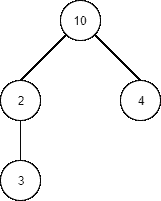
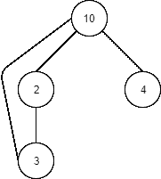

# Java 中的广度优先搜索算法

> 原文:[https://web . archive . org/web/20220930061024/https://www . bael dung . com/Java-width-first-search](https://web.archive.org/web/20220930061024/https://www.baeldung.com/java-breadth-first-search)

## 1.概观

在本教程中，我们将学习[广度优先搜索算法](/web/20220728143803/https://www.baeldung.com/cs/graph-algorithms-bfs-dijkstra)，它允许我们通过广度优先而不是深度优先遍历节点来搜索树或图中的节点。

首先，我们将介绍一些关于树和图的算法的理论。之后，我们将深入研究算法在 Java 中的实现。最后，我们将讨论它们的时间复杂性。

## 2.广度优先搜索算法

广度优先搜索(BFS)算法的基本方法是通过在搜索子节点之前搜索邻居来搜索树或图结构中的节点。

首先，我们将看看这个算法如何适用于树。之后，我们将把它应用到图中，图有特定的约束，有时包含循环。最后，我们将讨论该算法的性能。

### 2.1.树

树的 BFS 算法背后的想法是,**维护一个节点队列，确保遍历的顺序。**在算法开始时，队列只包含根节点。只要队列仍然包含一个或多个节点，我们就会重复这些步骤:

*   从队列中弹出第一个节点
*   如果那个节点是我们正在搜索的，那么搜索就结束了
*   否则，将该节点的子节点添加到队列的末尾，并重复这些步骤

没有循环确保了执行的终止。我们将在下一节看到如何管理周期。

### 2.2.图表

[在图的情况下，](https://web.archive.org/web/20220728143803/http://opendatastructures.org/versions/edition-0.1e/ods-java/12_3_Graph_Traversal.html#SECTION001531000000000000000)我们必须想到结构中可能存在的循环。如果我们简单地在一个有圈的图上应用前面的算法，它将永远循环下去。因此，**我们需要保存一个被访问节点的集合，并确保我们不会访问它们两次**:

*   从队列中弹出第一个节点
*   检查该节点是否已经被访问过，如果是，跳过它
*   如果那个节点是我们正在搜索的，那么搜索就结束了
*   否则，将其添加到已访问的节点中
*   将该节点的子节点添加到队列中，并重复这些步骤

## 3.用 Java 实现

既然已经介绍了理论，让我们开始编写代码，用 Java 实现这些算法吧！

### 3.1.树

首先，我们将实现树算法。让我们设计我们的`Tree`类，它由一个值和由其他`Tree`列表表示的子类组成:

```
public class Tree<T> {
    private T value;
    private List<Tree<T>> children;

    private Tree(T value) {
        this.value = value;
        this.children = new ArrayList<>();
    }

    public static <T> Tree<T> of(T value) {
        return new Tree<>(value);
    }

    public Tree<T> addChild(T value) {
        Tree<T> newChild = new Tree<>(value);
        children.add(newChild);
        return newChild;
    }
}
```

为了避免产生循环，子类是由类本身根据给定的值创建的。

之后，我们来提供一个`search()`方法:

```
public static <T> Optional<Tree<T>> search(T value, Tree<T> root) {
    //...
}
```

正如我们前面提到的，**BFS 算法使用一个队列来遍历节点**。首先，我们将`root`节点添加到这个队列中:

```
Queue<Tree<T>> queue = new ArrayDeque<>();
queue.add(root);
```

然后，我们必须在队列不为空时循环，每次从队列中弹出一个节点:

```
while(!queue.isEmpty()) {
    Tree<T> currentNode = queue.remove();
}
```

如果该节点是我们正在搜索的节点，我们返回它，否则我们将它的子节点添加到队列中:

```
if (currentNode.getValue().equals(value)) {
    return Optional.of(currentNode);
} else {
    queue.addAll(currentNode.getChildren());
}
```

最后，如果我们访问了所有节点，但没有找到我们要搜索的节点，我们将返回一个空结果:

```
return Optional.empty();
```

现在让我们想象一个示例树结构:

[](/web/20220728143803/https://www.baeldung.com/wp-content/uploads/2019/10/BFS-Tree-Example.png)

翻译成 Java 代码:

```
Tree<Integer> root = Tree.of(10);
Tree<Integer> rootFirstChild = root.addChild(2);
Tree<Integer> depthMostChild = rootFirstChild.addChild(3);
Tree<Integer> rootSecondChild = root.addChild(4);
```

然后，如果搜索值 4，我们期望算法遍历值为 10、2 和 4 的节点，顺序如下:

```
BreadthFirstSearchAlgorithm.search(4, root)
```

我们可以通过记录被访问节点的值来验证:

```
[main] DEBUG  c.b.a.b.BreadthFirstSearchAlgorithm - Visited node with value: 10
[main] DEBUG  c.b.a.b.BreadthFirstSearchAlgorithm - Visited node with value: 2 
[main] DEBUG  c.b.a.b.BreadthFirstSearchAlgorithm - Visited node with value: 4
```

### 3.2.图表

这就结束了树木的情况。现在让我们看看如何处理图形。与树相反，图可以包含圈。这意味着，正如我们在上一节中看到的，**我们必须记住我们访问过的节点，以避免无限循环**。我们一会儿将看到如何更新算法来考虑这个问题，但首先，让我们定义我们的图结构:

```
public class Node<T> {
    private T value;
    private Set<Node<T>> neighbors;

    public Node(T value) {
        this.value = value;
        this.neighbors = new HashSet<>();
    }

    public void connect(Node<T> node) {
        if (this == node) throw new IllegalArgumentException("Can't connect node to itself");
        this.neighbors.add(node);
        node.neighbors.add(this);
    }
}
```

现在，我们可以看到，与树相反，我们可以自由地将一个节点与另一个节点连接起来，给我们创造循环的可能性。唯一的例外是节点不能连接到自身。

同样值得注意的是，在这个表示中，没有根节点。这不是问题，因为我们也使节点之间的连接是双向的。这意味着我们可以从任何节点开始搜索整个图。

首先，让我们重新使用上面的算法，适应新的结构:

```
public static <T> Optional<Node<T>> search(T value, Node<T> start) {
    Queue<Node<T>> queue = new ArrayDeque<>();
    queue.add(start);

    Node<T> currentNode;

    while (!queue.isEmpty()) {
        currentNode = queue.remove();

        if (currentNode.getValue().equals(value)) {
            return Optional.of(currentNode);
        } else {
            queue.addAll(currentNode.getNeighbors());
        }
    }

    return Optional.empty();
}
```

我们不能这样运行算法，否则任何一个循环都会让它永远运行下去。因此，我们必须添加指令来处理已经访问过的节点:

```
while (!queue.isEmpty()) {
    currentNode = queue.remove();
    LOGGER.debug("Visited node with value: {}", currentNode.getValue());

    if (currentNode.getValue().equals(value)) {
        return Optional.of(currentNode);
    } else {
        alreadyVisited.add(currentNode);
        queue.addAll(currentNode.getNeighbors());
        queue.removeAll(alreadyVisited);
    }
}

return Optional.empty();
```

正如我们所看到的，我们首先初始化一个包含被访问节点的`Set`。

```
Set<Node<T>> alreadyVisited = new HashSet<>();
```

然后，**当值的比较失败时，我们将节点添加到已访问的节点中**:

```
alreadyVisited.add(currentNode);
```

最后，**在将节点的邻居添加到队列之后，我们从队列中移除已经访问过的节点**(这是检查当前节点在该集合中的存在的另一种方法):

```
queue.removeAll(alreadyVisited);
```

通过这样做，我们可以确保算法不会陷入无限循环。

让我们通过一个例子来看看它是如何工作的。首先，我们将定义一个图，带有一个循环:

[](/web/20220728143803/https://www.baeldung.com/wp-content/uploads/2019/10/BFS-Graph-Example.png)

Java 代码也是如此:

```
Node<Integer> start = new Node<>(10);
Node<Integer> firstNeighbor = new Node<>(2);
start.connect(firstNeighbor);

Node<Integer> firstNeighborNeighbor = new Node<>(3);
firstNeighbor.connect(firstNeighborNeighbor);
firstNeighborNeighbor.connect(start);

Node<Integer> secondNeighbor = new Node<>(4);
start.connect(secondNeighbor);
```

让我们再一次假设我们想要搜索值 4。由于没有根节点，我们可以从任何想要的节点开始搜索，我们将选择`firstNeighborNeighbor`:

```
BreadthFirstSearchAlgorithm.search(4, firstNeighborNeighbor);
```

同样，我们将添加一个日志来查看哪些节点被访问，我们期望它们是 3、2、10 和 4，每个节点只被访问一次，顺序如下:

```
[main] DEBUG c.b.a.b.BreadthFirstSearchAlgorithm - Visited node with value: 3 
[main] DEBUG c.b.a.b.BreadthFirstSearchAlgorithm - Visited node with value: 2 
[main] DEBUG c.b.a.b.BreadthFirstSearchAlgorithm - Visited node with value: 10 
[main] DEBUG c.b.a.b.BreadthFirstSearchAlgorithm - Visited node with value: 4
```

### 3.3.复杂性

既然我们已经在 Java 中介绍了这两种算法，那么让我们来谈谈它们的时间复杂度。我们将使用 [Big-O 符号](/web/20220728143803/https://www.baeldung.com/big-o-notation)来表示它们。

先说树算法。它最多将一个节点添加到队列中一次，因此也最多访问它一次。**这样，如果`n`是树中的节点数，那么算法的时间复杂度将是`O(n)`。**

现在，对于图形算法，事情有点复杂。我们最多遍历每个节点一次，但是为了这样做，我们将利用具有线性复杂度的操作，比如`addAll()`和`removeAll()`。

让我们考虑图的节点数和连接数。然后，在最坏的情况下(找不到节点)，我们可能会使用`addAll()`和`removeAll()`方法来添加和删除节点，达到连接的数量，给我们带来了这些操作的`O(c)`复杂性。**所以，假设`c > n`，整体算法的复杂度将为`O(c)`。不然就`O(n)`了。**这一般是[标注的`O(n + c)`](https://web.archive.org/web/20220728143803/https://www.khanacademy.org/computing/computer-science/algorithms/breadth-first-search/a/analysis-of-breadth-first-search) ，可以解释为依赖于`n`和 *c* 之间最大数的复杂度。

为什么我们的树搜索没有这个问题？因为树中的连接数受节点数的限制。由 `n`个节点组成的树中的连接数是`n – 1`。

## 4.结论

在本文中，我们学习了广度优先搜索算法以及如何用 Java 实现它。

在学习了一些理论之后，我们看到了该算法的 Java 实现，并讨论了它的复杂性。

像往常一样，代码可以在 GitHub 上的[处获得。](https://web.archive.org/web/20220728143803/https://github.com/eugenp/tutorials/tree/master/algorithms-modules/algorithms-searching)