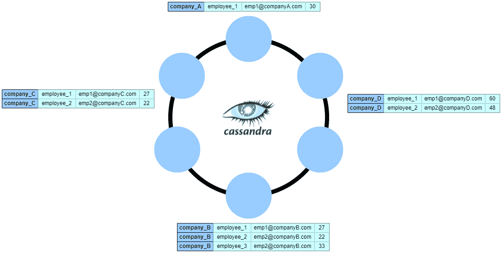

# Cassandra 中的二级索引

> 原文：<https://web.archive.org/web/20220930061024/https://www.baeldung.com/cassandra-secondary-indexes>

## 1.概观

在本教程中，我们将讨论如何在 [Apache Cassandra](/web/20220524055410/https://www.baeldung.com/tag/cassandra/) 中使用二级索引。

我们将了解数据在数据库中是如何分布的，并探索所有的索引类型。最后，我们将讨论一些使用二级索引的最佳实践和建议。

## 2.卡桑德拉建筑

Cassandra 是一个 NoSQL 分布式数据库，具有完全分散的通信模型。

它由多个具有相同职责的节点组成，提供高可用性。它可以在任何云提供商和内部运行，这使得它与云无关。

我们还可以跨多个云平台同时部署单个 Cassandra 集群。它最适合 OLTP(在线事务处理)查询，在这种情况下，响应速度至关重要，简单的查询很少改变。

### 2.1.主关键字

**主键是唯一标识数据记录**的最重要的数据建模选择。**它由至少一个分区键和零个或多个聚类列组成。**

分区键定义了我们如何在集群中分割数据。集群列对磁盘上的数据进行排序，以实现快速读取操作。

让我们看一个例子:

```
CREATE TABLE company (
    company_name text,
    employee_name text,
    employee_email text,
    employee_age int,
    PRIMARY KEY ((company_name), employee_email)
);
```

这里，我们将`company_name`定义为分区键，用于将表数据均匀地分布在各个节点上。接下来，由于我们已经将`employee_email`指定为一个聚集列，Cassandra 使用它在每个节点上以升序保存数据，以便高效地检索行。

### 2.2.集群拓扑

**Cassandra 提供与可用节点数量成正比的线性可扩展性和性能**。

这些节点被放置在一个环中，形成一个数据中心，通过连接多个地理上分散的数据中心，我们创建了一个集群。

Cassandra 自动对数据进行分区，无需人工干预，从而为大数据做好准备。

接下来，让我们看看 Cassandra 是如何通过`company_name`来划分我们的表的:

[](/web/20220524055410/https://www.baeldung.com/wp-content/uploads/2022/03/cassandra-topology.png)

正如我们所见，`company`表使用分区键`company_name`被分割成多个分区，并分布在各个节点上。我们可以注意到，Cassandra 将具有相同`company_name`值的行分组，并将它们存储在磁盘上相同的物理分区中。因此，我们可以用最小的 I/O 成本读取给定公司的所有数据。

此外，我们可以通过定义复制因子来跨数据中心复制数据。复制因子 N 将把每个数据行存储在集群中的 N 个不同节点上。

我们可以在数据中心级别而不是在群集级别指定副本的数量。因此，我们可以拥有一个包含多个数据中心的集群，每个数据中心都有不同的复制因子。

## 3.查询非主键

让我们使用之前定义的`company`表，并尝试通过`employee_age`进行搜索:

```
SELECT * FROM company WHERE employee_age = 30;

InvalidRequest: Error from server: code=2200 [Invalid query] message="Cannot execute this query as it might involve data filtering and thus may have unpredictable performance. If you want to execute this query despite the performance unpredictability, use ALLOW FILTERING"
```

我们得到这个错误消息是因为我们不能查询不属于主键的列，除非我们使用`ALLOW FILTERING`子句。

**然而，即使我们在技术上可以，我们也不应该在生产中使用它，因为`ALLOW FILTERING`昂贵且耗时**。这是因为，在后台，它在集群中的所有节点上启动全表扫描来获取结果，这对性能有负面影响。

然而，我们可以使用它的一个可接受的用例是当我们需要在单个分区上进行大量过滤时。在这种情况下，Cassandra 仍然执行表扫描，但是我们可以将其限制到单个节点:

```
SELECT * FROM company WHERE company_name = 'company_a' AND employee_age = 30 ALLOW FILTERING;
```

因为我们添加了`company_name`聚类列作为条件，Cassandra 使用它来标识保存所有公司数据的节点。因此，它只对特定节点上的表数据执行表扫描。

## 4.次要索引

Cassandra 中的二级索引解决了查询不属于主键的列的需要。

当我们插入数据时，Cassandra 使用一个名为`commitlog`的仅追加文件来存储更改，因此写入速度很快。同时，数据被写入名为`Memtable`的键/列值的内存缓存中。Cassandra 会定期将`Memtable`以不可变`SSTable`的形式刷新到磁盘。

接下来，让我们看看 Cassandra 中的三种不同的索引方法，并讨论其优缺点。

### 4.1.常规二级索引(2i)

常规二级索引是我们可以为在非主键列上执行查询而定义的最基本的索引。

让我们在`employee_age`列上定义一个二级索引:

```
CREATE INDEX IF NOT EXISTS ON company (employee_age);
```

准备就绪后，我们现在可以通过`employee_age`运行查询，而不会出现任何错误:

```
SELECT * FROM company WHERE employee_age = 30; 

company_name  | employee_email    | employee_age | employee_name 
--------------+-------------------+--------------+---------------
    company_A | [[email protected]](/web/20220524055410/https://www.baeldung.com/cdn-cgi/l/email-protection) |           30 |     employee_1
```

当我们建立索引时，Cassandra 会在后台创建一个隐藏表来存储索引数据:

```
CREATE TABLE company_by_employee_age_idx ( 
    employee_age int,
    company_name text,
    employee_email text,
    PRIMARY KEY ((employee_age), company_name, employee_email) 
);
```

与常规表不同，Cassandra 不使用集群范围的分割器来分发隐藏的索引表。索引数据与源数据位于同一节点上。

因此，当使用二级索引执行搜索查询时，Cassandra 从每个节点读取索引数据并收集所有结果。如果我们的集群有许多节点，这可能会导致数据传输增加和高延迟。

我们可能会问自己，为什么 Cassandra 不基于主键跨节点划分索引表。答案是将索引数据与源数据一起存储可以减少延迟。此外，因为索引更新是在本地执行的，而不是通过网络执行的，所以不会因为连接问题而丢失更新操作。此外，如果索引列数据不是均匀分布的，Cassandra 会避免创建宽分区。

当我们向一个附加了二级索引的表中插入数据时，Cassandra 同时写入索引和基索引`Memtable`。此外，两者同时刷新到`SSTable` s。因此，索引数据将拥有与源数据不同的生命周期。

当我们基于二级索引读取数据时，Cassandra 首先检索索引中所有匹配行的主键，然后使用它们从源表中获取所有数据。

### 4.2.附属于表的二级索引(SASI)

SASI 引入了将`SSTable`生命周期与指数绑定的新思路。执行内存索引，然后用`SSTable`将索引刷新到磁盘，这样可以减少磁盘使用量，节省 CPU 周期。

让我们看看如何定义 SASI 指数:

```
CREATE CUSTOM INDEX IF NOT EXISTS company_by_employee_age ON company (employee_age) USING 'org.apache.cassandra.index.sasi.SASIIndex';
```

SASI 的优点是标记化的文本搜索、快速范围扫描和内存索引。另一方面，缺点是它会生成很大的索引文件，尤其是在启用文本标记化时。

**最后，我们应该注意到**数据税务企业** (DSE)中的 SASI 指数是实验性的。DataStax 不支持生产的 SASI 索引。**

### 4.3.存储附加索引

存储附加索引是一种高度可伸缩的数据索引机制，可用于 DataStax Astra 和 DataStax Enterprise 数据库。我们可以在任何列上定义一个或多个 SAI 索引，然后使用范围查询(仅限数字)、语义和过滤查询。

SAI 为每一列存储单独的索引文件，并包含一个指向`SSTable`中源数据偏移量的指针。一旦我们将数据插入索引列，它将首先被写入内存。每当 Cassandra 将数据从内存刷新到磁盘时，它会将索引与数据表一起写入。

**与 2i 相比，这种方法通过减少写入开销将吞吐量提高了 43%，将延迟提高了 230%。与 SASI 和 2i 相比，它使用更少的磁盘空间进行索引，具有更少的故障点，并且具有更简化的体系结构。**

让我们使用 SAI 来定义我们的索引:

```
CREATE CUSTOM INDEX ON company (employee_age) USING 'StorageAttachedIndex' WITH OPTIONS = {'case_sensitive': false, 'normalize': false};
```

normalize 选项将特殊字符转换为其基本字符。例如，我们可以将德语字符`ö`规范化为常规的 o，这样就可以在不输入特殊字符的情况下进行查询匹配。例如，我们可以通过简单地使用“schon”作为条件来搜索术语“schn”。

### 4.4.最佳实践

首先，当我们在查询中使用二级索引时，建议添加分区键作为条件。**因此，我们可以将读取操作减少到单个节点**(以及取决于一致性级别的副本):

```
SELECT * FROM company WHERE employee_age = 30 AND company_name = "company_A";
```

**其次，我们可以将查询限制在分区键列表**中，并限制获取结果所涉及的节点数量:

```
SELECT * FROM company WHERE employee_age = 30 AND company_name IN ("company_A", "company_B", "company_C");
```

**第三，如果我们只需要结果的子集，我们可以给查询**添加一个限制。这也减少了读取路径中涉及的节点数量:

```
SELECT * FROM company WHERE employee_age = 30 LIMIT 10;
```

此外，**我们必须避免在基数很低的列上定义二级索引**(性别、真/假列等)。)因为它们会产生影响性能的非常宽的分区。

同样，**列具有高基数** **(社会安全号，邮箱等。)将产生具有非常细粒度分区的索引**，在最坏的情况下，这将迫使集群协调器命中所有主副本。

最后，我们必须避免在频繁更新的列上使用二级索引。这背后的基本原理是 Cassandra 使用不可变的数据结构，频繁的更新会增加磁盘上的写操作次数。

## 5.结论

在本文中，我们探讨了 Cassandra 如何跨数据中心对数据进行分区，并探讨了三种类型的二级索引。

在考虑二级索引之前，如果我们计划频繁访问它，我们应该考虑将我们的数据反规范化到二级表中，并使它与主表保持一致。

另一方面，如果数据访问是零星的，添加单独的表会增加不合理的复杂性。因此，引入二级指数是更好的选择。毫无疑问，存储连接索引是我们拥有的三个索引选项中的最佳选择，它提供了最佳的性能和简化的体系结构。