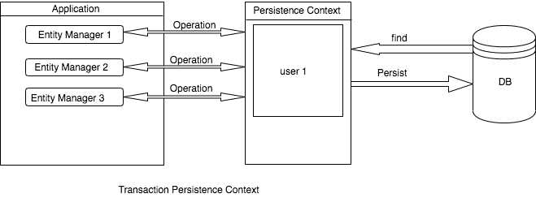
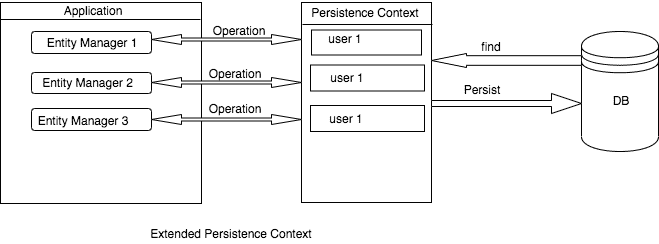

# JPA/Hibernate 持久性上下文

> 原文:[https://web . archive . org/web/20220930061024/https://www . bael dung . com/JPA-hibernate-persistence-context](https://web.archive.org/web/20220930061024/https://www.baeldung.com/jpa-hibernate-persistence-context)

## **1。概述**

Hibernate 等持久性提供者利用持久性上下文来管理应用程序中的实体生命周期。

在本教程中，我们将从持久性上下文的介绍开始，然后我们将了解它的重要性。最后，我们将通过例子来看看事务范围的持久化上下文和扩展范围的持久化上下文之间的区别。

## 2.持久性上下文

让我们来看看[持久性上下文](https://web.archive.org/web/20220625173634/https://docs.oracle.com/javaee/7/api/javax/persistence/EntityManager.html)的官方定义:

> EntityManager 实例与一个持久性上下文相关联。持久性上下文是一组实体实例，其中任何持久性实体标识都有一个唯一的实体实例。在持久性上下文中，管理实体实例及其生命周期。EntityManager API 用于创建和删除持久实体实例，通过实体的主键查找实体，以及查询实体。

上面的陈述现在看起来可能有点复杂，但是随着我们的继续，它将是完全有意义的。**持久性上下文是一级缓存，所有实体都从数据库中取出或保存到数据库中**。它位于我们的应用程序和持久存储之间。

持久性上下文跟踪对托管实体所做的任何更改。如果在事务期间有任何变化，那么该实体被标记为脏的。当事务完成时，这些更改被刷新到持久存储中。

`EntityManager`是让我们与持久性上下文交互的接口。每当我们使用`EntityManager`时，我们实际上是在与持久性上下文`.`进行交互

如果实体中的每一个变化都调用持久存储，我们可以想象会有多少次调用。这将导致性能影响，因为持久存储调用的成本很高。

## 3.持久性上下文类型

持久性上下文有两种类型:

*   事务范围的持久性上下文
*   扩展范围的持久性上下文

让我们来看看每一个。

### 3.1。事务范围的持久性上下文

事务持久性上下文被绑定到事务。一旦事务完成，持久性上下文中存在的实体将被刷新到持久性存储中。

[](/web/20220625173634/https://www.baeldung.com/wp-content/uploads/2019/11/transition-persistence-context.png)

当我们在事务内部执行任何操作时，`EntityManager`会检查一个持久化上下文`.` ,如果存在，那么它将被使用。否则，它将创建一个持久性上下文。

**默认持久上下文类型 `is` `PersistenceContextType.TRANSACTION`。**为了告诉`EntityManager`使用事务持久性上下文，我们简单地用`@PersistenceContext`对其进行注释:

```
@PersistenceContext
private EntityManager entityManager;
```

### 3.2。扩展作用域的持久性上下文

扩展的持久性上下文可以跨越多个事务。我们可以在没有事务的情况下持久化实体，但是在没有事务的情况下不能刷新它。

[](/web/20220625173634/https://www.baeldung.com/wp-content/uploads/2019/11/extended-persistence-context.png)

为了告诉`EntityManager`使用扩展范围的持久性上下文，我们需要应用`@PersistenceContext`的`type`属性:

```
@PersistenceContext(type = PersistenceContextType.EXTENDED)
private EntityManager entityManager;
```

在无状态会话 bean 中，一个组件中的**扩展持久性上下文完全不知道另一个组件** `.` 的任何持久性上下文，即使两者在同一个事务中也是如此。

假设我们在运行于事务中的组件`A`的方法中持久化了某个实体。然后我们调用组件的一些方法`B`。在组件 `B's`方法持久化上下文中，我们将找不到之前在组件 `A`的方法中持久化的实体。

## 4.持久性上下文示例

既然我们已经对持久性上下文有了足够的了解，是时候深入一个例子了。我们将用事务持久化上下文和扩展持久化上下文来制作不同的用例。

首先，让我们创建我们的服务类，`TransctionPersistenceContextUserService`:

```
@Component
public class TransctionPersistenceContextUserService {

    @PersistenceContext
    private EntityManager entityManager;

    @Transactional
    public User insertWithTransaction(User user) {
        entityManager.persist(user);
        return user;
    }

    public User insertWithoutTransaction(User user) {
        entityManager.persist(user);
        return user;
    }

    public User find(long id) {
        return entityManager.find(User.class, id);
    }
}
```

下一个类`ExtendedPersistenceContextUserService`与上面的非常相似，除了`@PersistenceContext` 注释。这次我们将`PersistenceContextType.EXTENDED` 传递到其`@PersistenceContext`注释的`type`参数中:

```
@Component
public class ExtendedPersistenceContextUserService {

    @PersistenceContext(type = PersistenceContextType.EXTENDED)
    private EntityManager entityManager;

    // Remaining code same as above
}
```

## 5.测试案例

既然我们已经设置了服务类，那么是时候用事务持久化上下文和扩展持久化上下文来创建不同的用例了。

### 5.1。测试事务持久性上下文

让我们使用事务范围的持久化上下文来持久化一个`User`实体。实体将被保存在永久存储器中。然后，我们通过使用扩展持久性上下文的`EntityManager`进行 find 调用来进行验证:

```
User user = new User(121L, "Devender", "admin");
transctionPersistenceContext.insertWithTransaction(user);

User userFromTransctionPersistenceContext = transctionPersistenceContext
  .find(user.getId());
assertNotNull(userFromTransctionPersistenceContext);

User userFromExtendedPersistenceContext = extendedPersistenceContext
  .find(user.getId());
assertNotNull(userFromExtendedPersistenceContext);
```

当我们试图插入一个没有事务的`User`实体时，那么`TransactionRequiredException` 将被抛出:

```
@Test(expected = TransactionRequiredException.class)
public void testThatUserSaveWithoutTransactionThrowException() {
    User user = new User(122L, "Devender", "admin");
    transctionPersistenceContext.insertWithoutTransaction(user);
}
```

### 5.2。测试扩展持久性上下文

接下来，让我们用扩展的持久化上下文持久化用户，并且不使用事务。`User`实体将保存在持久上下文(缓存)中，但不保存在持久存储中:

```
User user = new User(123L, "Devender", "admin");
extendedPersistenceContext.insertWithoutTransaction(user);

User userFromExtendedPersistenceContext = extendedPersistenceContext
  .find(user.getId());
assertNotNull(userFromExtendedPersistenceContext);

User userFromTransctionPersistenceContext = transctionPersistenceContext
  .find(user.getId());
assertNull(userFromTransctionPersistenceContext);
```

在任何持久性实体标识的持久性上下文中，都有一个唯一的实体实例。如果我们试图持久化另一个具有相同标识符的实体:

```
@Test(expected = EntityExistsException.class)
public void testThatPersistUserWithSameIdentifierThrowException() {
    User user1 = new User(126L, "Devender", "admin");
    User user2 = new User(126L, "Devender", "admin");
    extendedPersistenceContext.insertWithoutTransaction(user1);
    extendedPersistenceContext.insertWithoutTransaction(user2);
}
```

我们会看到`EntityExistsException`:

```
javax.persistence.EntityExistsException: 
A different object with the same identifier value
was already associated with the session
```

事务中的扩展持久性上下文在事务结束时将实体保存在持久性存储中:

```
User user = new User(127L, "Devender", "admin");
extendedPersistenceContext.insertWithTransaction(user);

User userFromDB = transctionPersistenceContext.find(user.getId());
assertNotNull(userFromDB);
```

当在事务中使用时，扩展持久上下文**将缓存的实体刷新到持久存储中。首先，我们在没有事务的情况下持久化实体。接下来，我们在事务中持久化另一个实体:**

```
User user1 = new User(124L, "Devender", "admin");
extendedPersistenceContext.insertWithoutTransaction(user1);

User user2 = new User(125L, "Devender", "admin");
extendedPersistenceContext.insertWithTransaction(user2);

User user1FromTransctionPersistenceContext = transctionPersistenceContext
  .find(user1.getId());
assertNotNull(user1FromTransctionPersistenceContext);

User user2FromTransctionPersistenceContext = transctionPersistenceContext
  .find(user2.getId());
assertNotNull(user2FromTransctionPersistenceContext);
```

## **6。结论**

在本教程中，我们对持久性上下文有了很好的理解。

首先，我们看了事务持久性上下文，它存在于事务的整个生命周期中。然后，我们查看了扩展的持久性上下文，它可以跨多个事务。

与往常一样，GitHub 上的示例代码[可用。](https://web.archive.org/web/20220625173634/https://github.com/eugenp/tutorials/tree/master/persistence-modules/hibernate-jpa)