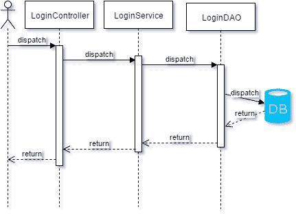

# Mockito vs EasyMock vs JMockit

> 原文：<https://web.archive.org/web/20220930061024/https://www.baeldung.com/mockito-vs-easymock-vs-jmockit>

## 1。简介

### 1.1。概述

在这篇文章中，我们将讨论 **mocking** :它是什么，为什么使用它，以及如何使用一些最常用的 Java mocking 库来模拟同一个测试用例的几个例子。

我们将从嘲讽概念的一些正式/半正式定义开始；然后，我们将展示测试中的案例，接着是每个库的例子，最后是一些结论。选择的库是 [Mockito](https://web.archive.org/web/20220712060126/http://mockito.org/) 、 [EasyMock](https://web.archive.org/web/20220712060126/http://easymock.org/) 和 [JMockit](https://web.archive.org/web/20220712060126/https://jmockit.github.io/) 。

如果你觉得你已经知道了嘲讽的基本知识，也许你可以直接跳到第二点，而不用看后面的三点。

### 1.2。使用模拟的理由

我们将开始假设你已经遵循一些以测试为中心的驱动开发方法学(TDD、ATDD 或 BDD)编码。或者简单地说，您想要为一个依赖依赖项来实现其功能的现有类创建一个测试。

在任何情况下，当对一个类进行单元测试时，我们希望**只测试它的功能，而不是它的依赖项**(或者因为我们信任它们的实现，或者因为我们将自己测试它)。

为了实现这一点，我们需要向被测对象提供一个替换，我们可以控制它的依赖性。通过这种方式，我们可以强制极端返回值、异常抛出或者简单地将耗时的方法减少到一个固定的返回值。

这个受控的替换是**模拟**，它将帮助您简化测试编码并减少测试执行时间。

### 1.3。模拟概念和定义

让我们看看 Martin Fowler 写的一篇文章中的四个定义，这篇文章总结了每个人都应该知道的关于模仿的基本知识:

*   虚拟对象被传递，但从未真正使用过。通常，它们只是用来填充参数列表。
*   **假的**对象有工作的实现，但是通常采取一些快捷方式，这使得它们不适合生产(内存数据库就是一个很好的例子)。
*   存根(Stubs)为测试期间拨打的电话提供固定答案，通常对测试程序之外的任何事情都不作回应。存根还可以记录有关呼叫的信息，例如电子邮件网关存根可以记住它“发送”的消息，或者可能只记住它“发送”了多少消息。
*   我们在这里谈论的是模仿:用期望预先编程的对象，这些期望形成了它们被期望接收的调用的规范。

### 1.4。嘲笑还是不嘲笑:这是个问题

不是所有的事情都必须被嘲笑。有时做一个集成测试会更好，因为嘲笑方法/特性只会产生很少的实际利益。在我们的测试用例中(这将在下一点中显示)，将测试`LoginDao`。

`LoginDao` 将使用一些第三方库来访问数据库，模仿它只是为了确保已经为调用准备好了参数，但是我们仍然需要测试调用是否返回了我们想要的数据。

由于这个原因，它将不包括在这个例子中(尽管我们可以为第三方库调用编写带有模拟调用的单元测试，并为测试第三方库的实际性能编写带有 DBUnit 的集成测试)。

## 2。测试用例

记住上一节中的所有内容，让我们提出一个非常典型的测试用例，以及我们将如何使用模拟来测试它(当使用模拟有意义时)。这将帮助我们有一个共同的场景，以便以后能够比较不同的模仿库。

### 2.1。提议案例

提议的测试用例将是分层架构应用程序中的登录过程。

登录请求将由一个控制器处理，该控制器使用一个服务，该服务使用一个 DAO(在 DB 上寻找用户凭证)。我们不会对每一层的实现做太多的深入研究，而会更加关注每一层的组件之间的**交互。**

这样，我们将有一个`LoginController`、一个`LoginService`和一个`LoginDAO`。让我们看一张图来说明一下:

[](/web/20220712060126/https://www.baeldung.com/wp-content/uploads/2016/07/Test-case-1.png)

### 2.2。实施

我们现在将跟随测试用例所使用的实现，这样我们就可以理解测试中发生了什么(或者应该发生什么)。

我们将从用于所有操作的模型`UserForm`开始，它将只保存用户名和密码(为了简化，我们使用公共访问修饰符)和一个用于`username`字段的 getter 方法，以允许模拟该属性:

```
public class UserForm {
    public String password;
    public String username;
    public String getUsername(){
        return username;
    }
}
```

让我们接着看`LoginDAO`，它将没有功能，因为我们只希望它的方法在那里，这样我们可以在需要时模仿它们:

```
public class LoginDao {
    public int login(UserForm userForm){
        return 0;
    }
}
```

`LoginDao`将被`LoginService`在其`login`方法中使用。`LoginService`也将有一个`setCurrentUser`方法返回`void`来测试这个嘲讽。

```
public class LoginService {
    private LoginDao loginDao;
    private String currentUser;

    public boolean login(UserForm userForm) {
        assert null != userForm;
        int loginResults = loginDao.login(userForm);
        switch (loginResults){
            case 1:
                return true;
            default:
                return false;
        }
    }

    public void setCurrentUser(String username) {
        if(null != username){
            this.currentUser = username;
        }
    }
}
```

最后，`LoginController`将使用`LoginService`作为它的`login`方法。这将包括:

*   在这种情况下，不会调用被模仿的服务。
*   只调用一个方法的情况。
*   所有方法都会被调用的情况。
*   将测试异常抛出的情况。

```
public class LoginController {
    public LoginService loginService;

    public String login(UserForm userForm){
        if(null == userForm){
            return "ERROR";
        }else{
            boolean logged;

            try {
                logged = loginService.login(userForm);
            } catch (Exception e) {
                return "ERROR";
            }

            if(logged){
                loginService.setCurrentUser(userForm.getUsername());
                return "OK";
            }else{
                return "KO";
            }
        }
    }
}
```

现在我们已经看到了我们要测试的是什么，让我们看看如何用每个库来模拟它。

## 3。测试设置

### 3.1\. Mockito

对于 Mockito，我们将使用版本 [2.8.9](https://web.archive.org/web/20220712060126/https://www.javadoc.io/doc/org.mockito/mockito-core/2.8.9) 。

创建和使用模拟最简单的方法是通过`@Mock`和`@InjectMocks`注释。第一个将为用于定义字段的类创建一个模拟，第二个将尝试将所创建的模拟注入到带注释的模拟中。

还有更多像`@Spy`这样的注释，可以让您创建一个部分模拟(一个在非模拟方法中使用普通实现的模拟)。

也就是说，您需要在执行任何测试之前调用`MockitoAnnotations.initMocks(this)`,这些测试将使用这些模拟来让所有这些“魔法”发挥作用。这通常在一个`@Before`带注释的方法中完成。你也可以使用`MockitoJUnitRunner`。

```
public class LoginControllerTest {

    @Mock
    private LoginDao loginDao;

    @Spy
    @InjectMocks
    private LoginService spiedLoginService;

    @Mock
    private LoginService loginService;

    @InjectMocks
    private LoginController loginController;

    @Before
    public void setUp() {
        loginController = new LoginController();
        MockitoAnnotations.initMocks(this);
    }
}
```

### 3.2。EasyMock

对于 EasyMock，我们将使用版本 [3.4](https://web.archive.org/web/20220712060126/https://mvnrepository.com/artifact/org.easymock/easymock/3.4) ( [Javadoc](https://web.archive.org/web/20220712060126/http://easymock.org/api/) )。注意，对于 EasyMock，为了让模拟开始“工作”,您必须在每个测试方法上调用`EasyMock.replay(mock)`,否则您将会收到一个异常。

模拟和测试类也可以通过注释来定义，但是在这种情况下，我们将对测试类使用`EasyMockRunner`,而不是调用静态方法。

用`@Mock`注释创建模拟，用`@TestSubject`注释创建测试对象(从创建的模拟中注入依赖关系)。被测试的对象必须以内联方式创建。

```
@RunWith(EasyMockRunner.class)
public class LoginControllerTest {

    @Mock
    private LoginDao loginDao;

    @Mock
    private LoginService loginService;

    @TestSubject
    private LoginController loginController = new LoginController();
}
```

### 3.3\. JMockit

对于 JMockit，我们将使用版本 [1.24](https://web.archive.org/web/20220712060126/https://jmockit.github.io/changes.html#1.24) ( [Javadoc](https://web.archive.org/web/20220712060126/https://jmockit.github.io/) )因为版本 1.25 还没有发布(至少在我写这篇文章的时候)。

JMockit 的设置和 Mockito 一样简单，除了没有针对部分 mocks 的特定注释(实际上也不需要),并且您必须使用`JMockit`作为测试运行器。

使用`@Injectable` 注释(这将只创建一个模拟实例)或者使用`@Mocked`注释(这将为带注释字段的类的每个实例创建模拟)来定义模拟。

使用`@Tested`注释创建被测试的实例(并注入其模拟的依赖项)。

```
@RunWith(JMockit.class)
public class LoginControllerTest {

    @Injectable
    private LoginDao loginDao;

    @Injectable
    private LoginService loginService;

    @Tested
    private LoginController loginController;
}
```

## 4。验证没有要模仿的调用

### 4.1\. Mockito

为了验证 mock 在 Mockito 中没有接收到调用，您有一个接受 mock 的方法`verifyNoInteractions()`。

```
@Test
public void assertThatNoMethodHasBeenCalled() {
    loginController.login(null);
    Mockito.verifyNoInteractions(loginService);
}
```

### 4.2。EasyMock

为了验证一个模拟没有收到调用，您不需要指定行为，您重放模拟，最后，您验证它。

```
@Test
public void assertThatNoMethodHasBeenCalled() {
    EasyMock.replay(loginService);
    loginController.login(null);
    EasyMock.verify(loginService);
}
```

### 4.3\. JMockit

为了验证一个 mock 没有收到调用，您只需简单地不指定对该 mock 的期望，并对该 mock 执行一个`FullVerifications(mock)`。

```
@Test
public void assertThatNoMethodHasBeenCalled() {
    loginController.login(null);
    new FullVerifications(loginService) {};
}
```

## 5。定义模仿的方法调用并验证对模仿的调用

### 5.1\. Mockito

对于**嘲讽方法调用**，可以使用`Mockito.when(mock.method(args)).thenReturn(value)`。在这里，您可以为多个调用返回不同的值，只需将它们添加为更多的参数:`thenReturn(value1, value2, value-n, …)`。

注意，不能用这种语法模仿 void 返回方法。在上述情况下，您将使用上述方法的验证(如第 11 行所示)。

对于**,验证对模拟的调用**,你可以使用`Mockito.verify(mock).method(args)`,你也可以使用`verifyNoMoreInteractions(mock)`验证对模拟的调用不再发生。

对于**验证参数**，你可以传递特定的值或者使用预定义的匹配器，比如`any()`、`anyString()`、`anyInt().`还有很多这样的匹配器，甚至可以定义你的匹配器，我们将在下面的例子中看到。

```
@Test
public void assertTwoMethodsHaveBeenCalled() {
    UserForm userForm = new UserForm();
    userForm.username = "foo";
    Mockito.when(loginService.login(userForm)).thenReturn(true);

    String login = loginController.login(userForm);

    Assert.assertEquals("OK", login);
    Mockito.verify(loginService).login(userForm);
    Mockito.verify(loginService).setCurrentUser("foo");
}

@Test
public void assertOnlyOneMethodHasBeenCalled() {
    UserForm userForm = new UserForm();
    userForm.username = "foo";
    Mockito.when(loginService.login(userForm)).thenReturn(false);

    String login = loginController.login(userForm);

    Assert.assertEquals("KO", login);
    Mockito.verify(loginService).login(userForm);
    Mockito.verifyNoMoreInteractions(loginService);
}
```

### 5.2。EasyMock

对于**嘲讽方法调用**，你使用`EasyMock.expect(mock.method(args)).andReturn(value)`。

对于**验证调用**到模拟，可以使用`EasyMock` `.verify(mock)`，但是必须在调用`EasyMock.replay(mock)`之后再调用**。**

对于验证参数的**，你可以传递特定的值，或者你有预定义的匹配器，比如 isA `(Class.class)`、`anyString()`、`anyInt()`，以及更多的匹配器[、](https://web.archive.org/web/20220712060126/http://easymock.org/user-guide.html#verification-expectations)，也可以定义你的匹配器。**

```
@Test
public void assertTwoMethodsHaveBeenCalled() {
    UserForm userForm = new UserForm();
    userForm.username = "foo";
    EasyMock.expect(loginService.login(userForm)).andReturn(true);
    loginService.setCurrentUser("foo");
    EasyMock.replay(loginService);

    String login = loginController.login(userForm);

    Assert.assertEquals("OK", login);
    EasyMock.verify(loginService);
}

@Test
public void assertOnlyOneMethodHasBeenCalled() {
    UserForm userForm = new UserForm();
    userForm.username = "foo";
    EasyMock.expect(loginService.login(userForm)).andReturn(false);
    EasyMock.replay(loginService);

    String login = loginController.login(userForm);

    Assert.assertEquals("KO", login);
    EasyMock.verify(loginService);
}
```

### 5.3\. JMockit

使用 JMockit，您已经为测试定义了[步骤](https://web.archive.org/web/20220712060126/https://jmockit.github.io/tutorial/Mocking.html#model):记录、重放和验证。

**记录**是在一个新的 `Expectations(){{}}`块中完成的(在这个块中，你可以为几个模拟定义动作)；**重放**是通过调用被测试类的一个方法(这个方法应该调用一些模拟对象)完成的，而**验证**是在一个新的`Verifications(){{}}`块中完成的(在这个块中，你可以为几个模拟定义验证)。

对于**嘲讽方法调用**，你可以在任何`Expectations`块内使用`mock.method(args); result = value;`。在这里，您可以使用`returns(value1, value2, …, valuen);`而不是`result = value;`为多个调用返回不同的值。

对于对模拟的 [**验证调用**](https://web.archive.org/web/20220712060126/https://jmockit.github.io/tutorial/Mocking.html#verification) ，您可以使用新的验证`(){{mock.call(value)}}`或`new Verifications(mock){{}}`来验证之前定义的每个预期调用。

对于**验证参数**，你可以传递特定的值，或者你有[预定义的值](https://web.archive.org/web/20220712060126/https://jmockit.github.io/tutorial/Mocking.html#argumentMatching)，比如`any`、`anyString`、`anyLong`，以及更多类似的特殊值，也可以定义你的匹配器(必须是 Hamcrest 匹配器)。

```
@Test
public void assertTwoMethodsHaveBeenCalled() {
    UserForm userForm = new UserForm();
    userForm.username = "foo";
    new Expectations() {{
        loginService.login(userForm); result = true;
        loginService.setCurrentUser("foo");
    }};

    String login = loginController.login(userForm);

    Assert.assertEquals("OK", login);
    new FullVerifications(loginService) {};
}

@Test
public void assertOnlyOneMethodHasBeenCalled() {
    UserForm userForm = new UserForm();
    userForm.username = "foo";
    new Expectations() {{
        loginService.login(userForm); result = false;
        // no expectation for setCurrentUser
    }};

    String login = loginController.login(userForm);

    Assert.assertEquals("KO", login);
    new FullVerifications(loginService) {};
}
```

## 6。模拟异常抛出

### 6.1\. Mockito

在`Mockito.when(mock.method(args))`之后使用`.thenThrow(ExceptionClass.class)`可以模拟异常抛出。

```
@Test
public void mockExceptionThrowing() {
    UserForm userForm = new UserForm();
    Mockito.when(loginService.login(userForm)).thenThrow(IllegalArgumentException.class);

    String login = loginController.login(userForm);

    Assert.assertEquals("ERROR", login);
    Mockito.verify(loginService).login(userForm);
    Mockito.verifyNoInteractions(loginService);
}
```

### 6.2。EasyMock

在调用`EasyMock.expect(…)`之后，可以使用`.andThrow(new ExceptionClass())`来模拟异常抛出。

```
@Test
public void mockExceptionThrowing() {
    UserForm userForm = new UserForm();
    EasyMock.expect(loginService.login(userForm)).andThrow(new IllegalArgumentException());
    EasyMock.replay(loginService);

    String login = loginController.login(userForm);

    Assert.assertEquals("ERROR", login);
    EasyMock.verify(loginService);
}
```

### 6.3\. JMockit

用 JMockito 模拟异常抛出特别容易。只是作为模拟方法调用的结果返回一个异常，而不是“正常”的返回。

```
@Test
public void mockExceptionThrowing() {
    UserForm userForm = new UserForm();
    new Expectations() {{
        loginService.login(userForm); result = new IllegalArgumentException();
        // no expectation for setCurrentUser
    }};

    String login = loginController.login(userForm);

    Assert.assertEquals("ERROR", login);
    new FullVerifications(loginService) {};
}
```

## 7。模仿一个物体四处传递

### 7.1\. Mockito

您还可以创建一个模拟来作为方法调用的参数传递。有了 Mockito，您可以用一行程序做到这一点。

```
@Test
public void mockAnObjectToPassAround() {
    UserForm userForm = Mockito.when(Mockito.mock(UserForm.class).getUsername())
      .thenReturn("foo").getMock();
    Mockito.when(loginService.login(userForm)).thenReturn(true);

    String login = loginController.login(userForm);

    Assert.assertEquals("OK", login);
    Mockito.verify(loginService).login(userForm);
    Mockito.verify(loginService).setCurrentUser("foo");
}
```

### 7.2。EasyMock

可以使用`EasyMock.mock(Class.class)`在线创建模拟。之后，你可以使用`EasyMock.expect(mock.method())`来准备它的执行，记住在使用它之前要调用`EasyMock.replay(mock)`。

```
@Test
public void mockAnObjectToPassAround() {
    UserForm userForm = EasyMock.mock(UserForm.class);
    EasyMock.expect(userForm.getUsername()).andReturn("foo");
    EasyMock.expect(loginService.login(userForm)).andReturn(true);
    loginService.setCurrentUser("foo");
    EasyMock.replay(userForm);
    EasyMock.replay(loginService);

    String login = loginController.login(userForm);

    Assert.assertEquals("OK", login);
    EasyMock.verify(userForm);
    EasyMock.verify(loginService);
}
```

### 7.3\. JMockit

要仅模拟一个方法的对象，可以简单地将它作为参数传递给测试方法。然后你可以像其他模拟一样创造期望。

```
@Test
public void mockAnObjectToPassAround(@Mocked UserForm userForm) {
    new Expectations() {{
        userForm.getUsername(); result = "foo";
        loginService.login(userForm); result = true;
        loginService.setCurrentUser("foo");
    }};

    String login = loginController.login(userForm);

    Assert.assertEquals("OK", login);
    new FullVerifications(loginService) {};
    new FullVerifications(userForm) {};
}
```

## 8。自定义参数匹配

### 8.1\. Mockito

有时，模拟调用的参数匹配需要比固定值或`anyString()`更复杂一些。对于这种情况，Mockito 有自己的 matcher 类，用于`argThat(ArgumentMatcher<>)`。

```
@Test
public void argumentMatching() {
    UserForm userForm = new UserForm();
    userForm.username = "foo";
    // default matcher
    Mockito.when(loginService.login(Mockito.any(UserForm.class))).thenReturn(true);

    String login = loginController.login(userForm);

    Assert.assertEquals("OK", login);
    Mockito.verify(loginService).login(userForm);
    // complex matcher
    Mockito.verify(loginService).setCurrentUser(ArgumentMatchers.argThat(
        new ArgumentMatcher<String>() {
            @Override
            public boolean matches(String argument) {
                return argument.startsWith("foo");
            }
        }
    ));
}
```

### 8.2。EasyMock

使用 EasyMock 定制参数匹配稍微复杂一点，因为您需要创建一个静态方法，在该方法中您创建实际的匹配器，然后用`EasyMock.reportMatcher(IArgumentMatcher)`报告它。

一旦创建了这个方法，您就可以通过调用这个方法在您的模拟期望中使用它(如行中的例子所示)。

```
@Test
public void argumentMatching() {
    UserForm userForm = new UserForm();
    userForm.username = "foo";
    // default matcher
    EasyMock.expect(loginService.login(EasyMock.isA(UserForm.class))).andReturn(true);
    // complex matcher
    loginService.setCurrentUser(specificArgumentMatching("foo"));
    EasyMock.replay(loginService);

    String login = loginController.login(userForm);

    Assert.assertEquals("OK", login);
    EasyMock.verify(loginService);
}

private static String specificArgumentMatching(String expected) {
    EasyMock.reportMatcher(new IArgumentMatcher() {
        @Override
        public boolean matches(Object argument) {
            return argument instanceof String 
              && ((String) argument).startsWith(expected);
        }

        @Override
        public void appendTo(StringBuffer buffer) {
            //NOOP
        }
    });
    return null;
}
```

### 8.3\. JMockit

与 JMockit 匹配的自定义参数是通过特殊的`withArgThat(Matcher)`方法完成的(该方法接收 [Hamcrest](https://web.archive.org/web/20220712060126/http://hamcrest.org/) 的`Matcher`对象)。

```
@Test
public void argumentMatching() {
    UserForm userForm = new UserForm();
    userForm.username = "foo";
    // default matcher
    new Expectations() {{
        loginService.login((UserForm) any);
        result = true;
        // complex matcher
        loginService.setCurrentUser(withArgThat(new BaseMatcher<String>() {
            @Override
            public boolean matches(Object item) {
                return item instanceof String && ((String) item).startsWith("foo");
            }

            @Override
            public void describeTo(Description description) {
                //NOOP
            }
        }));
    }};

    String login = loginController.login(userForm);

    Assert.assertEquals("OK", login);
    new FullVerifications(loginService) {};
}
```

## 9。部分嘲讽

### 9.1\. Mockito

Mockito 以两种方式允许部分模仿(一种模仿，使用真实的实现，而不是在它的一些方法中模仿方法调用)。

您可以在普通的模拟方法调用定义中使用`.thenCallRealMethod()`，或者您可以创建一个**间谍**来代替模拟，在这种情况下，默认行为将是在所有非模拟方法中调用真正的实现。

```
@Test
public void partialMocking() {
    // use partial mock
    loginController.loginService = spiedLoginService;
    UserForm userForm = new UserForm();
    userForm.username = "foo";
    // let service's login use implementation so let's mock DAO call
    Mockito.when(loginDao.login(userForm)).thenReturn(1);

    String login = loginController.login(userForm);

    Assert.assertEquals("OK", login);
    // verify mocked call
    Mockito.verify(spiedLoginService).setCurrentUser("foo");
}
```

### 9.2。EasyMock

EasyMock 的部分模拟也变得有点复杂，因为您需要定义在创建模拟时将模拟哪些方法。

这是用`EasyMock.partialMockBuilder(Class.class).addMockedMethod(“methodName”).createMock()`完成的。一旦完成，您就可以像使用任何其他非部分模拟一样使用模拟。

```
@Test
public void partialMocking() {
    UserForm userForm = new UserForm();
    userForm.username = "foo";
    // use partial mock
    LoginService loginServicePartial = EasyMock.partialMockBuilder(LoginService.class)
      .addMockedMethod("setCurrentUser").createMock();
    loginServicePartial.setCurrentUser("foo");
    // let service's login use implementation so let's mock DAO call
    EasyMock.expect(loginDao.login(userForm)).andReturn(1);

    loginServicePartial.setLoginDao(loginDao);
    loginController.loginService = loginServicePartial;

    EasyMock.replay(loginDao);
    EasyMock.replay(loginServicePartial);

    String login = loginController.login(userForm);

    Assert.assertEquals("OK", login);
    // verify mocked call
    EasyMock.verify(loginServicePartial);
    EasyMock.verify(loginDao);
}
```

### 9.3\. JMockit

用 JMockit 进行部分嘲讽特别容易。在`Expectations(){{}}`中没有定义模仿行为的每个方法调用都使用**“真正的”实现**。

现在让我们想象我们想要部分模拟`LoginService`类来模拟`setCurrentUser()`方法，同时使用`login()`方法的实际实现。

为此，我们首先创建一个实例`LoginService`并将其传递给期望块。然后，我们只记录对`setCurrentUser()`方法的期望:

```
@Test
public void partialMocking() {
    LoginService partialLoginService = new LoginService();
    partialLoginService.setLoginDao(loginDao);
    loginController.loginService = partialLoginService;

    UserForm userForm = new UserForm();
    userForm.username = "foo";

    new Expectations(partialLoginService) {{
        // let's mock DAO call
        loginDao.login(userForm); result = 1;

        // no expectation for login method so that real implementation is used

        // mock setCurrentUser call
        partialLoginService.setCurrentUser("foo");
    }};

    String login = loginController.login(userForm);

    Assert.assertEquals("OK", login);
    // verify mocked call
    new Verifications() {{
        partialLoginService.setCurrentUser("foo");
    }};     
}
```

## 10。结论

在这篇文章中，我们比较了三个 Java 模拟库，每一个都有其优点和缺点。

*   所有这三个都很容易配置**和注释**来帮助你定义模拟和被测对象，运行器使模拟注入尽可能的无痛。
    *   我们会说 Mockito 在这里会赢，因为它有一个针对部分 mocks 的特殊注释，但 JMockit 甚至不需要它，所以让我们说它是这两者之间的纽带。
*   这三种方法或多或少都遵循**记录-重放-验证模式**，但是在我们看来，最好的方法是 JMockit，因为它强迫你在块中使用这些方法，所以测试变得更加结构化。
*   易用性很重要，所以你可以尽可能少地定义你的测试。JMockit 因其固定的、始终不变的结构而成为首选。
*   莫奇托或多或少是最知名的，因此**社区**会更大。
*   每次想要使用 mock 时都必须调用`replay`显然是不允许的**，所以我们将为 EasyMock 加一个-1。**
***   一致性/简单性对我来说也很重要。我们喜欢 JMockit 返回结果的方式，这种方式对于“正常”结果和异常结果是一样的。**

 **尽管如此，我们还是会选择 **JMockit** 作为赢家，尽管到目前为止我们一直在使用 **Mockito** ，因为我们已经被它的简单性和固定结构所吸引，并将从现在开始尝试使用它。

本教程的**完整实现**可以在[的 GitHub 项目](https://web.archive.org/web/20220712060126/https://github.com/eugenp/tutorials/tree/master/testing-modules/mocks)上找到，所以可以随意下载并使用它。**