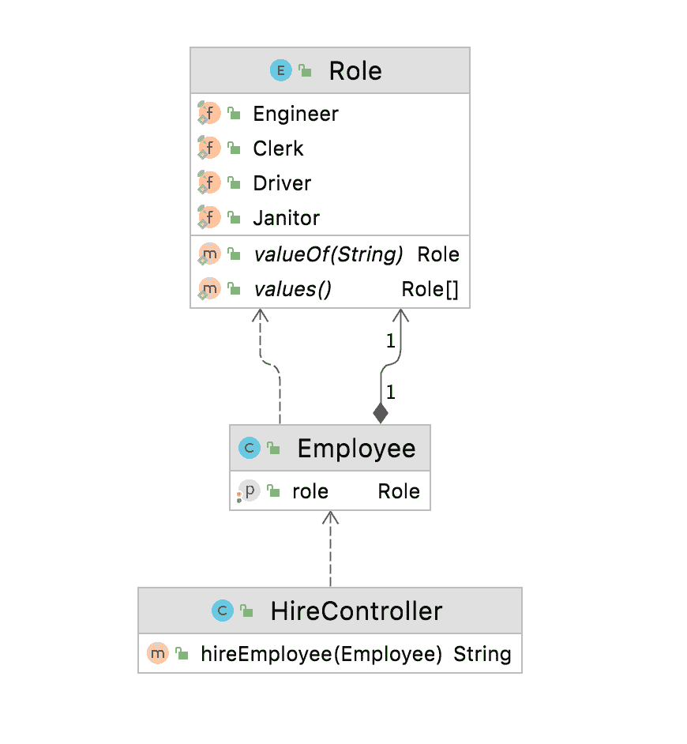
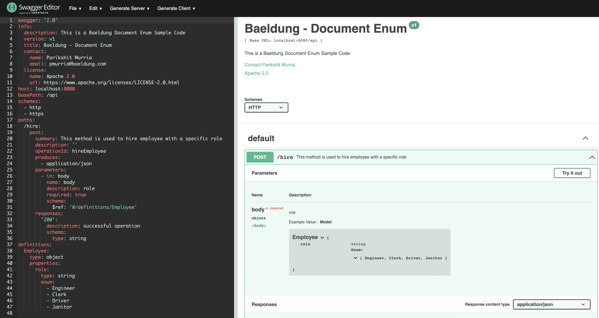

# 大摇大摆地记录枚举

> 原文：<https://web.archive.org/web/20220930061024/https://www.baeldung.com/swagger-enum>

## 1.概观

在本教程中，我们将学习如何使用 [`swagger-maven-plugin`](https://web.archive.org/web/20220716222627/https://search.maven.org/search?q=a:swagger-maven-plugin%20AND%20g:io.swagger.core.v3) 在 swagger 中记录 enum，并在 Swagger 编辑器中验证生成的 JSON 文档。

## 2。什么是霸气？

A [Swagger](/web/20220716222627/https://www.baeldung.com/spring-boot-rest-client-swagger-codegen) 是一个用于定义基于 rest 的 API 的开源工具。在当今世界，大多数组织都在朝着微服务和 API 优先的方法发展。Swagger 对于设计和记录 API 来说非常方便。它还提供了各种工具，如 Swagger Editor、Swagger UI 和 Swagger CodeGen，来帮助 API 开发。

**同样，Swagger 是`OpenAPI`规范或`OAS`、**的实现，它定义了 rest API 开发的一套标准；因此，它帮助全球的组织标准化编写 API 的过程。

我们的应用程序生成的 JSON 文件也将遵循`OpenAPI`规范。

让我们试着理解一下 [Enum](/web/20220716222627/https://www.baeldung.com/a-guide-to-java-enums) 在 Swagger 中的重要性。一些 API 需要用户坚持使用一组特定的预定义值。这些预定义的常数值称为 enum。类似地，当 Swagger 公开 API 时，我们希望确保用户从这个预定义的集合中选择一个值，而不是自由文本。**换句话说，我们需要在我们的`swagger.json`文件中记录枚举，以便用户知道可能的值。**

## 3.履行

让我们以 REST API 为例，直接跳到实现。**我们将实现一个 POST API 来为一个组织雇佣特定角色的员工。但是，角色只能是下列之一:`Engineer`、`Clerk`、`Driver`或`Janitor`。**

我们将用 employee role 的所有可能值创建一个名为`Role`的枚举，并创建一个将 role 作为其属性之一的类`Employee`。让我们看一下 UML 图，以便更好地理解这些类及其关系:

为了在 Swagger 中记录这一点，首先，我们将在我们的应用程序中导入并配置 [`swagger-maven-plugin`](https://web.archive.org/web/20220716222627/https://search.maven.org/search?q=a:swagger-maven-plugin%20AND%20g:io.swagger.core.v3) 。其次，我们将在代码中添加所需的注释，最后，我们将构建项目并在 swagger 编辑器中验证生成的 swagger 文档或`swagger.json`。

### 3.1.导入和配置插件

我们将使用 [`swagger-maven-plugin`](https://web.archive.org/web/20220716222627/https://search.maven.org/search?q=a:swagger-maven-plugin%20AND%20g:io.swagger.core.v3) ，，并且我们需要将它作为依赖项添加到我们的应用程序的`pom.xml`中:

[PRE0]

此外，为了配置和启用这个插件，我们将把它添加到`pom.xml`的插件部分:

*   `locations`:这个标签指定了包含由分号分隔的`@Api`的包或类
*   `info`:这个标签为 API 提供元数据。Swagger-ui 使用这些数据来显示信息
*   `swaggerDirectory`:该标签定义了`swagger.json`文件的路径

[PRE1]

### 3.2.记录枚举

为了在 Swagger 中记录一个枚举，**我们需要使用注释`@ApiModel.`** 来声明模型

在这个例子中，我们创建了一个具有四个可能值的枚举`Role`—`Engineer, Clerk, Driver, and Janitor`。因为我们需要记录这个枚举，我们将把`@ApiModel`添加到枚举`Role`中。换句话说，这会让大摇大摆的人知道模特的存在。在`Employee`类中，我们将用`@ApiModel`注释`Employee`，用`@ApiModelProperty`注释`Role`。

我们的`Employee,` `Role,` 和`HireController`会是什么样子:

[PRE2]

[PRE3]

接下来，我们将创建一个将`@Path`作为`“/hire”`的 API，并使用`Employee`模型作为`hireEmployee`方法的输入参数。我们必须将`@Api`添加到我们的`HireController`中，以便 [`swagger-maven-plugin`](https://web.archive.org/web/20220716222627/https://search.maven.org/search?q=a:swagger-maven-plugin%20AND%20g:io.swagger.core.v3) 知道并应该考虑它来记录:

[PRE4]

### 3.3.生成 Swagger 文档

要构建我们的项目并生成 swagger 文档，请运行以下命令:

`mvn clean install`

一旦构建完成，插件将在`generated/swagger-ui`或插件中配置的位置生成`swagger.json`文件。在定义下，我们会看到 employee 属性中记录的枚举`Role`及其所有可能的值。

[PRE5]

现在，我们将使用[在线 swagger 编辑器](https://web.archive.org/web/20220716222627/https://editor.swagger.io/)可视化生成的 JSON，并寻找 enum `Role`:

## 

## 4.结论

在本教程中，我们讨论了什么是 Swagger，并了解了`OpenAPI`规范及其在组织的 API 开发中的重要性。此外，我们使用 [`swagger-maven-plugin`](https://web.archive.org/web/20220716222627/https://search.maven.org/search?q=a:swagger-maven-plugin%20AND%20g:io.swagger.core.v3) 创建并记录了包含 enum 的示例 API。最后，为了验证输出，我们使用 swagger 编辑器来可视化生成的 JSON 文档。

这个实现可以在 GitHub 上找到。