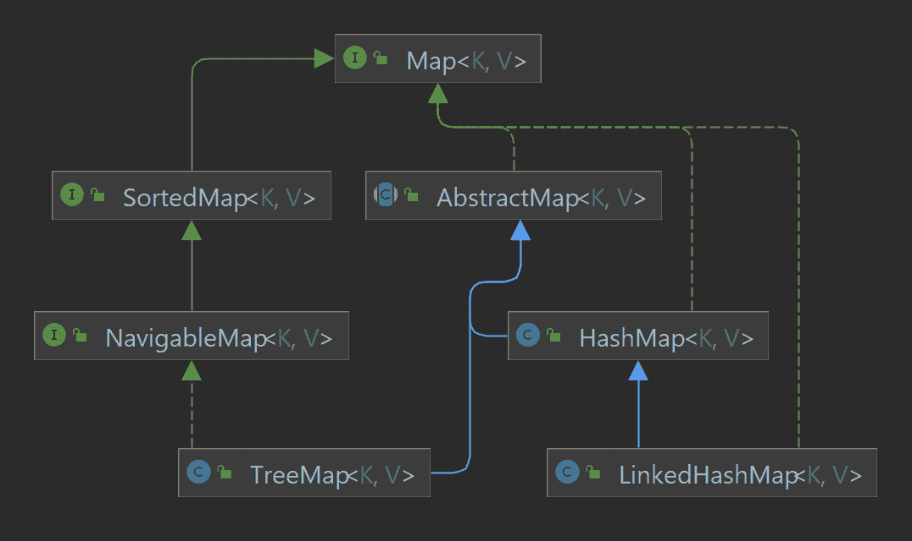

# Java 中 Map 和 HashMap 的区别

> 原文：<https://web.archive.org/web/20220930061024/https://www.baeldung.com/java-map-vs-hashmap>

## 1.概观

**`Map `和 [`HashMap`](/web/20221208143854/https://www.baeldung.com/java-hashmap) 的区别在于，第一个是接口，第二个是实现**。然而，在这篇文章中，我们将更深入地挖掘并解释为什么接口是有用的。此外，我们将学习如何通过接口使代码更加灵活，以及为什么我们对同一个接口有不同的实现。

## 2.接口的用途

接口是只定义行为的契约。每个实现特定接口的类都应该履行这个契约。为了更好地理解它，我们可以从现实生活中举个例子。想象一辆车。每个人心中都会有不同的形象。汽车这个词暗示了一些品质和行为。任何具有这些品质的物体都可以称为汽车。这就是为什么我们每个人都想象出不同的汽车。

接口的工作原理是一样的。`Map `是定义某些品质和行为的抽象概念。只有具备所有这些品质的类才能成为`Map.`

## 3.不同的实现

出于同样的原因，我们有不同的汽车型号，我们有不同的`Map`接口实现。所有的实现都有不同的目的。**不可能找到总体上最好的实现。对于某种目的，只有最好的实现。**尽管跑车速度快，看起来也很酷，但它并不是家庭野餐或去家具店旅行的最佳选择。

[`HashMap`](/web/20221208143854/https://www.baeldung.com/java-hashmap) 是`Map`接口最简单的实现，提供基本功能。大多数情况下，这种实现涵盖了所有的需求。另外两个广泛使用的实现是 [`TreeMap`](/web/20221208143854/https://www.baeldung.com/java-treemap) ，以及 [`LinkedHashMap`](/web/20221208143854/https://www.baeldung.com/java-linked-hashmap) 提供了额外的特性。

下面是一个更详细但不完整的层次结构:

## 4.编程实现

假设我们希望[在控制台中打印](/web/20221208143854/https://www.baeldung.com/java-iterate-map)`[HashMap](/web/20221208143854/https://www.baeldung.com/java-hashmap) `的键和值:

[PRE0]

这是一个完成这项工作的小班。然而，它包含一个问题。它将只能与`[HashMap](/web/20221208143854/https://www.baeldung.com/java-hashmap).`一起工作，因此任何传入由`Map `引用的方法 [`TreeMap `甚至`HashMap`](/web/20221208143854/https://www.baeldung.com/java-treemap-vs-hashmap) 的尝试都将导致编译错误:

[PRE1]

让我们试着理解为什么会这样。在这两种情况下，编译器都不能确定在这个方法内部，不会有任何对 [`HashMap`](/web/20221208143854/https://www.baeldung.com/java-hashmap) 特定方法的调用。

`[TreeMap](/web/20221208143854/https://www.baeldung.com/java-treemap) `在`Map `实现的不同分支上(没有双关的意思)，因此它可能缺少一些在`[HashMap](/web/20221208143854/https://www.baeldung.com/java-hashmap). `中定义的方法

在第二种情况下，尽管类型为`[HashMap](/web/20221208143854/https://www.baeldung.com/java-hashmap),` 的真实底层对象被`Map`接口引用。因此，这个对象只能公开在`Map` 中定义的方法，而不能公开在`[HashMap](/web/20221208143854/https://www.baeldung.com/java-hashmap).`中定义的方法

**因此，尽管我们的`HashMapPrinter`是一个相当简单的类，但它太具体了**。使用这种方法，需要我们为每个`Map `实现创建一个特定的`Printer`。

## 5.接口编程

初学者经常会对“面向接口编程”或“面向接口编码”这种表达方式的含义感到困惑。让我们考虑下面的例子，这将使它更清楚一点。我们将把参数的类型改成最通用的类型，也就是`Map:`

[PRE2]

正如我们所见，实际的实现保持不变，唯一的变化是参数的类型。这说明这个方法没有使用 [`HashMap`](/web/20221208143854/https://www.baeldung.com/java-hashmap) 的任何具体方法。所有需要的功能都已经在`Map`接口中定义好了，即方法 [`entrySet()`](/web/20221208143854/https://www.baeldung.com/java-map-entries-methods) 。

结果，这个微小的变化产生了巨大的差异。现在，这个类可以与任何`Map`实现一起工作:

[PRE3]

**编码到接口帮助我们创建了一个通用的类，它可以与`Map` 接口的任何实现一起工作。**这种方法可以消除代码重复，确保我们的类和方法有明确的用途。

## 6.在哪里使用接口

总的来说，参数应该是尽可能通用的类型。在前面的例子中，我们看到了一个简单的方法签名的改变是如何改进我们的代码的。我们应该使用相同方法的另一个地方是构造函数:

[PRE4]

这个类可以处理任何`Map, `的实现，因为我们在构造函数中使用了正确的类型。

## 7.结论

总之，在本教程中，我们讨论了为什么接口是抽象和定义契约的好方法。尽可能使用最通用的类型将使代码易于重用和阅读。同时，这种方法减少了代码量，这总是简化代码库的好方法。

和往常一样，代码可以在 GitHub 的[上获得。](https://web.archive.org/web/20221208143854/https://github.com/eugenp/tutorials/tree/master/core-java-modules/core-java-collections-maps-4)