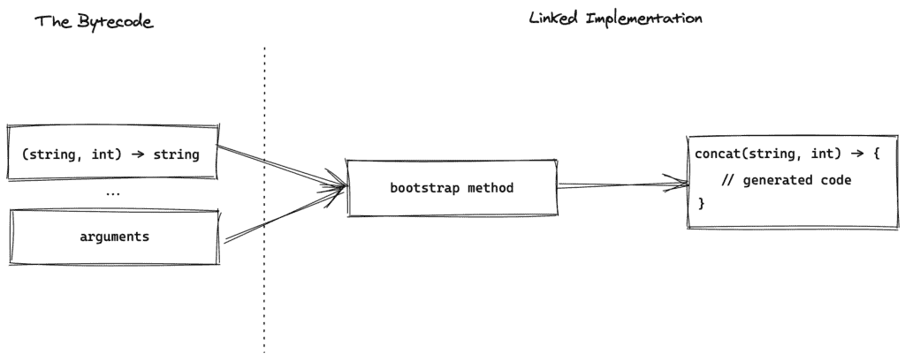
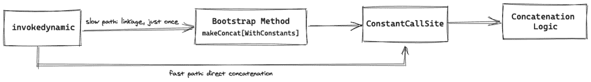

# 调用动态字符串连接

> 原文：<https://web.archive.org/web/20220930061024/https://www.baeldung.com/java-string-concatenation-invoke-dynamic>

## 1.概观

编译器和运行库倾向于优化一切，甚至是最小的和看起来不太重要的部分。谈到这类优化，JVM 和 Java 有很多可以提供的。

在本文中，我们将评估这些相对较新的优化之一:[字符串串联](/web/20220815061512/https://www.baeldung.com/java-strings-concatenation)和`invokedynamic`。

## 2.Java 9 之前

在 Java 9 之前，重要的字符串连接是使用`[StringBuilder](/web/20220815061512/https://www.baeldung.com/java-string-builder-string-buffer)`实现的。例如，让我们考虑下面的方法:

```
String concat(String s, int i) {
    return s + i;
}
```

这个简单代码的字节码如下所示(带有`javap -c`):

```
java.lang.String concat(java.lang.String, int);
  Code:
     0: new           #2      // class StringBuilder
     3: dup
     4: invokespecial #3      // Method StringBuilder."<init>":()V
     7: aload_0
     8: invokevirtual #4      // Method StringBuilder.append:(LString;)LStringBuilder;
    11: iload_1
    12: invokevirtual #5      // Method StringBuilder.append:(I)LStringBuilder;
    15: invokevirtual #6      // Method StringBuilder.toString:()LString;
```

这里，Java 8 编译器使用`StringBuilder`连接方法输入，`e`，尽管我们在代码中没有使用`StringBuilder `。

公平地说，**使用`StringBuilder`连接字符串是非常高效和精心设计的。**

让我们看看 Java 9 是如何改变这种实现的，以及这种改变的动机是什么。

## 3.调用动态

从 Java 9 开始，作为 [JEP 280](https://web.archive.org/web/20220815061512/https://openjdk.java.net/jeps/280) 的一部分，字符串连接现在使用`[invokedynamic](/web/20220815061512/https://www.baeldung.com/java-invoke-dynamic)`。

**变革背后的主要动机是实现更动态的实施**。也就是说，可以在不改变字节码的情况下改变连接策略。这样，即使不需要重新编译，客户也可以从新的优化策略中受益。

还有其他的优势。例如，`invokedynamic`的字节码更优雅，不那么脆弱，也更小。

### 3.1.特种宽银幕电影

在深入研究这种新方法如何工作的细节之前，让我们从更广泛的角度来看它。

举个例子，假设我们要通过将另一个`String `和一个`int`连接起来来创建一个新的`String `。**我们可以认为这是一个接受一个`String`和一个`int`然后返回连接的`String`的函数。**

下面是这个例子中新方法的工作原理:

*   准备描述连接的函数签名。例如，`(String, int) -> String`
*   准备连接的实际参数。例如，如果我们要连接`“The answer is “`和 42，那么这些值就是参数
*   调用 bootstrap 方法，并将函数签名、参数和一些其他参数传递给它
*   为该函数签名生成实际的实现，并将其封装在一个`MethodHandle`中
*   调用生成的函数来创建最终的连接字符串

[](/web/20220815061512/https://www.baeldung.com/wp-content/uploads/2020/06/Untitled-2020-05-22-0432-2.png)

简单地说，字节码在编译时定义了一个规范。然后，bootstrap 方法在运行时将实现链接到该规范。反过来，这将使得在不接触字节码的情况下改变实现成为可能。

在本文中，我们将揭示与每个步骤相关的细节。

首先，让我们看看与 bootstrap 方法的联系是如何工作的。

## 4.联动

让我们看看 Java 9+编译器如何为相同的方法生成字节码:

```
java.lang.String concat(java.lang.String, int);
  Code:
     0: aload_0
     1: iload_1
     2: invokedynamic #7,  0   // InvokeDynamic #0:makeConcatWithConstants:(LString;I)LString;
     7: areturn
```

**与天真的`StringBuilder`方法相反，这种方法使用了数量少得多的指令**。

在这个字节码中，`(LString;I)LString`签名相当有趣。它接受一个`String`和一个`int`(`I`代表`int`)并返回连接起来的字符串。这是因为该方法将一个`String `和一个`int `连接在一起。

与其他调用动态实现类似，许多逻辑从编译时移到运行时。

为了查看运行时逻辑，让我们检查引导方法表(用`javap -c -v`):

```
BootstrapMethods:
  0: #25 REF_invokeStatic java/lang/invoke/StringConcatFactory.makeConcatWithConstants:
    (Ljava/lang/invoke/MethodHandles$Lookup;
     Ljava/lang/String;
     Ljava/lang/invoke/MethodType;
     Ljava/lang/String;
     [Ljava/lang/Object;)Ljava/lang/invoke/CallSite;
    Method arguments:
      #31 \u0001\u0001 
```

在这种情况下，当 JVM 第一次看到`invokedynamic`指令时，它调用`[makeConcatWithConstants](https://web.archive.org/web/20220815061512/https://github.com/openjdk/jdk14u/blob/8c9ab998b758a18e65e2a1cebcc608860ae43931/src/java.base/share/classes/java/lang/invoke/StringConcatFactory.java#L593)` bootstrap 方法。bootstrap 方法将依次返回一个`[ConstantCallSite](https://web.archive.org/web/20220815061512/https://github.com/openjdk/jdk14u/blob/master/src/java.base/share/classes/java/lang/invoke/ConstantCallSite.java)`，它指向连接逻辑。

[](/web/20220815061512/https://www.baeldung.com/wp-content/uploads/2020/06/Untitled-2020-05-22-0432-1.png)

在传递给 bootstrap 方法的参数中，有两个非常突出:

*   `Ljava/lang/invoke/MethodType`表示字符串串联签名。在这种情况下，它是`(LString;I)LString`，因为我们将一个整数与一个`String`组合在一起
*   `\u0001\u0001`是构造字符串的方法(稍后会详细介绍)

## 5.方法

为了更好地理解食谱的作用，让我们考虑一个简单的数据类:

```
public class Person {

    private String firstName;
    private String lastName;

    // constructor

    @Override
    public String toString() {
        return "Person{" +
          "firstName='" + firstName + '\'' +
          ", lastName='" + lastName + '\'' +
          '}';
    }
}
```

为了生成一个`String`表示，JVM 将`firstName`和`lastName`字段作为参数传递给`invokedynamic`指令:

```
 0: aload_0
 1: getfield      #7        // Field firstName:LString;
 4: aload_0
 5: getfield      #13       // Field lastName:LString;
 8: invokedynamic #16,  0   // InvokeDynamic #0:makeConcatWithConstants:(LString;LString;)L/String;
 13: areturn
```

这一次，引导方法表看起来有点不同:

```
BootstrapMethods:
  0: #28 REF_invokeStatic StringConcatFactory.makeConcatWithConstants // truncated
    Method arguments:
      #34 Person{firstName=\'\u0001\', lastName=\'\u0001\'} // The recipe
```

如上图，**菜谱代表了串联**的基本结构`**String**`。例如，前面的配方包括:

*   常量字符串如“`Person`”`.` 这些文字值将按原样出现在串联的字符串中
*   两个`\u0001 `标签代表普通的参数。它们将被替换为实际的参数，如`firstName`

我们可以把菜谱想象成一个包含静态部分和可变占位符的模板`String`。

使用 recipe 可以显著减少传递给 bootstrap 方法的参数数量，因为我们只需要传递所有动态参数和一个 recipe。

## 6.字节码风格

新的串联方法有两种字节码风格。到目前为止，我们熟悉一种风格:调用`makeConcatWithConstants ` bootstrap 方法并传递一个食谱。这种风格被称为 indy with constants，是 Java 9 的默认风格。

第二种风格不使用食谱，而是将所有东西作为参数传递。也就是说，它不区分常量和动态部分，而是将它们都作为参数传递。

**要使用第二种风格，我们应该将`-XDstringConcat=indy`选项传递给 Java 编译器**。例如，如果我们用这个标志编译同一个`Person`类，那么编译器会生成下面的字节码:

```
public java.lang.String toString();
    Code:
       0: ldc           #16      // String Person{firstName=\'
       2: aload_0
       3: getfield      #7       // Field firstName:LString;
       6: bipush        39
       8: ldc           #18      // String , lastName=\'
      10: aload_0
      11: getfield      #13      // Field lastName:LString;
      14: bipush        39
      16: bipush        125
      18: invokedynamic #20,  0  // InvokeDynamic #0:makeConcat:(LString;LString;CLString;LString;CC)LString;
      23: areturn
```

这一次，自举方法是`[makeConcat](https://web.archive.org/web/20220815061512/https://github.com/openjdk/jdk14u/blob/8c9ab998b758a18e65e2a1cebcc608860ae43931/src/java.base/share/classes/java/lang/invoke/StringConcatFactory.java#L472)`。此外，串联签名接受七个参数。每个参数代表`toString`中的一部分:

*   第一个参数表示在`firstName`变量之前的部分，即 `“Person{firstName=\'” `文字
*   第二个参数是`firstName `字段的值
*   第三个参数是单引号字符
*   第四个参数是下一个变量之前的部分— `“, lastName=\'”`
*   第五个参数是`lastName`字段
*   第六个参数是单引号字符
*   最后一个参数是右花括号

这样，bootstrap 方法就有足够的信息来链接适当的串联逻辑。

非常有趣的是**，也有可能回到 Java 9 之前的世界，使用带有`-XDstringConcat=inline`编译器选项的`StringBuilder`。**

## 7.战略

**bootstrap 方法最终提供了一个`MethodHandle`，它指向实际的串联逻辑**。在撰写本文时，有六种不同的[策略](https://web.archive.org/web/20220815061512/https://github.com/openjdk/jdk14u/blob/8c9ab998b758a18e65e2a1cebcc608860ae43931/src/java.base/share/classes/java/lang/invoke/StringConcatFactory.java#L136)来生成这个逻辑:

*   `BC_SB`或“字节码`StringBuilder`”策略在运行时生成相同的`StringBuilder`字节码。然后，它通过`Unsafe.defineAnonymousClass`方法加载生成的字节码
*   `BC_SB_SIZED`策略将尝试猜测`StringBuilder`的必要容量。除此之外，它与前面的方法相同。猜测容量可能有助于`StringBuilder`在不调整底层`byte[]`大小的情况下执行拼接
*   `BC_SB_SIZED_EXACT`是一个基于`StringBuilder`的字节码生成器，它精确计算所需的存储空间。为了计算准确的大小，首先，它将所有参数转换为`String`
*   `MH_SB_SIZED`基于`MethodHandle` s 并最终调用`StringBuilder` API 进行拼接。该策略还对所需容量进行了有根据的猜测
*   `MH_SB_SIZED_EXACT`与前一个类似，只是它完全准确地计算了所需的容量
*   `MH_INLINE_SIZE_EXACT`预先计算所需的存储，并直接维护其`byte[]`以存储拼接结果`.`该策略是内联的，因为它在内部复制了`StringBuilder`所做的事情

**默认策略是`MH_INLINE_SIZE_EXACT`。然而，我们可以使用`-Djava.lang.invoke.stringConcat=<strategyName>`系统属性来改变这个策略。**

## 8.结论

在这篇详细的文章中，我们研究了新的`String `连接是如何实现的，以及使用这种方法的优点。

对于更详细的讨论，查看一下[实验笔记](https://web.archive.org/web/20220815061512/https://cr.openjdk.java.net/~shade/8085796/notes.txt)甚至[源代码](https://web.archive.org/web/20220815061512/https://github.com/openjdk/jdk14u/blob/master/src/java.base/share/classes/java/lang/invoke/StringConcatFactory.java)是个好主意。