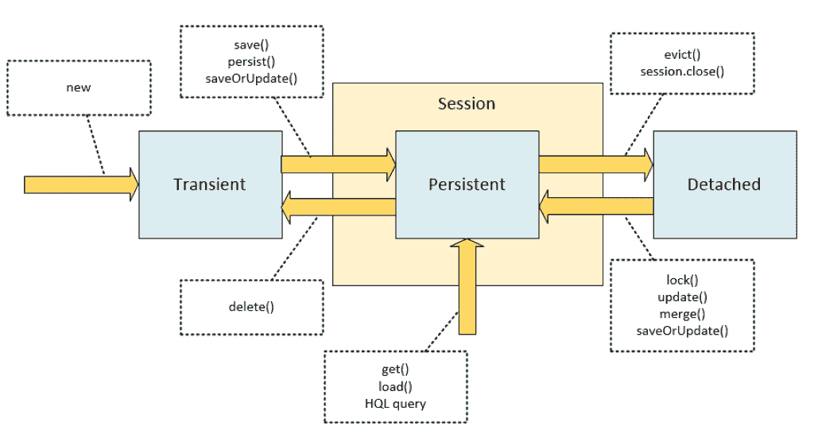

# 休眠:保存、持久化、更新、合并、保存或更新

> 原文：<https://web.archive.org/web/20220930061024/https://www.baeldung.com/hibernate-save-persist-update-merge-saveorupdate>

## **1。简介**

在本教程中，我们将讨论`Session`接口的几种方法之间的区别:`save`、`persist`、`update`、`merge`和`saveOrUpdate`。

这不是对 Hibernate 的介绍，我们应该已经了解了配置、对象关系映射和使用实体实例的基础知识。关于 Hibernate 的介绍文章，请访问我们的教程 [Hibernate 4 with Spring](/web/20220906161752/https://www.baeldung.com/hibernate-4-spring) 。

## 延伸阅读:

## [用 Hibernate 删除对象](/web/20220906161752/https://www.baeldung.com/delete-with-hibernate)

Quick guide to deleting an entity in Hibernate.[Read more](/web/20220906161752/https://www.baeldung.com/delete-with-hibernate) →

## [带休眠的存储过程](/web/20220906161752/https://www.baeldung.com/stored-procedures-with-hibernate-tutorial)

This article shortly discusses how to call store procedures from Hibernate.[Read more](/web/20220906161752/https://www.baeldung.com/stored-procedures-with-hibernate-tutorial) →

## [Hibernate/JPA 中标识符的概述](/web/20220906161752/https://www.baeldung.com/hibernate-identifiers)

Learn how to map entity identifiers with Hibernate.[Read more](/web/20220906161752/https://www.baeldung.com/hibernate-identifiers) →

## **2。会话作为持久性上下文实现**

`[Session](https://web.archive.org/web/20220906161752/http://docs.jboss.org/hibernate/orm/5.2/javadocs/org/hibernate/Session.html)`接口有几种方法最终导致数据保存到数据库:`[persist](https://web.archive.org/web/20220906161752/http://docs.jboss.org/hibernate/orm/5.2/javadocs/org/hibernate/Session.html#persist-java.lang.Object-)`、`[save](https://web.archive.org/web/20220906161752/http://docs.jboss.org/hibernate/orm/5.2/javadocs/org/hibernate/Session.html#save-java.lang.Object-)`、`[update](https://web.archive.org/web/20220906161752/http://docs.jboss.org/hibernate/orm/5.2/javadocs/org/hibernate/Session.html#update-java.lang.Object-)`、`[merge](https://web.archive.org/web/20220906161752/http://docs.jboss.org/hibernate/orm/5.2/javadocs/org/hibernate/Session.html#merge-java.lang.Object-)`和`[saveOrUpdate](https://web.archive.org/web/20220906161752/http://docs.jboss.org/hibernate/orm/5.2/javadocs/org/hibernate/Session.html#saveOrUpdate-java.lang.Object-)`。为了理解这些方法之间的区别，我们必须首先讨论`Session`作为持久性上下文的目的，以及与`Session`相关的实体实例的状态之间的区别。

我们还应该了解 Hibernate 的发展历史，它导致了一些部分重复的 API 方法。

### **2.1。管理实体实例**

除了对象关系映射本身，Hibernate 解决的一个问题是在运行时管理实体。“持久性上下文”的概念是 Hibernate 对这个问题的解决方案。我们可以将持久性上下文视为一个容器或一级缓存，用于存储我们在会话期间加载或保存到数据库中的所有对象。

会话是一个逻辑事务，其边界由应用程序的业务逻辑定义。当我们通过一个持久化上下文使用数据库，并且我们的所有实体实例都附加到这个上下文时，我们应该总是为我们在会话期间交互的每个数据库记录拥有一个实体实例。

在 Hibernate 中，持久性上下文由`[org.hibernate.Session](https://web.archive.org/web/20220906161752/http://docs.jboss.org/hibernate/orm/5.2/javadocs/org/hibernate/Session.html)`实例表示。对于 JPA 来说，就是`[javax.persistence.EntityManager](https://web.archive.org/web/20220906161752/https://docs.oracle.com/javaee/7/api/javax/persistence/EntityManager.html)`。当我们使用 Hibernate 作为 JPA 提供者，并通过`EntityManager`接口操作时，这个接口的实现基本上包装了底层的`Session`对象。然而，Hibernate `Session`提供了更丰富的接口，有更多的可能性，所以有时候直接使用`Session` 会很有用。

### **2.2。实体实例的状态**

我们的应用程序中的任何实体实例都以与`Session`持久性上下文相关的三种主要状态之一出现:

*   `transient` —该实例没有、也从来没有附加到`Session.` 上。该实例在数据库中没有相应的行。它通常只是我们创建的一个新对象，用来保存到数据库中。
*   `persistent` —该实例与唯一的`Session`对象相关联。将`Session`刷新到数据库后，保证该实体在数据库中有一个相应的一致记录。
*   `detached` —这个实例曾经附属于一个`Session`(处于`persistent`状态)，但现在不是了。如果我们将实例从上下文中逐出，清除或关闭会话，或者对实例进行序列化/反序列化处理，实例就会进入这种状态。

下面是一个简化的状态图，带有对使状态转换发生的`Session`方法的注释:

[](/web/20220906161752/https://www.baeldung.com/wp-content/uploads/2016/07/2016-07-11_13-38-11-1024x551.png)

当实体实例处于`persistent`状态时，我们对该实例的映射字段所做的所有更改将在刷新`Session`时应用于相应的数据库记录和字段。`persistent`实例处于“在线”状态，而`detached`实例处于“离线”状态，并且没有被监控更改。

这意味着当我们改变一个`persistent`对象的字段时，我们不需要调用`save`、`update,`或任何这些方法来获得对数据库的这些改变。我们需要做的就是提交事务、刷新会话或关闭会话。

### **2.3。符合 JPA 规范**

Hibernate 是最成功的 Java ORM 实现。因此，Hibernate API 极大地影响了 Java 持久性 API (JPA)的规范。不幸的是，也有许多分歧，有些是重大的，有些更微妙。

为了作为 JPA 标准的实现，Hibernate APIs 必须被修改。为了匹配`EntityManager`接口，向`Session`接口添加了几个方法。这些方法与原始方法的目的相同，但是符合规范，因此有一些不同。

## **3。操作之间的差异**

重要的是从一开始就要明白，所有的方法(`persist`、`save`、`update`、`merge`、`saveOrUpdate`)并不会立即产生相应的 SQL `UPDATE`或`INSERT`语句。在提交事务或刷新`Session`时，数据实际保存到数据库。

上述方法基本上是通过在生命周期的不同状态之间转换来管理实体实例的状态。

作为一个例子，我们将使用一个简单的注释映射实体，`Person`:

```
@Entity
public class Person {

    @Id
    @GeneratedValue
    private Long id;

    private String name;

    // ... getters and setters

}
```

### **3.1。`Persist`**

`persist`方法旨在向持久性上下文添加一个新的实体实例，即将一个实例从`transient`状态转换到`persistent`状态。

我们通常在想要向数据库添加记录时调用它(持久化一个实体实例):

```
Person person = new Person();
person.setName("John");
session.persist(person);
```

我们调用了`persist`方法后会发生什么？`person`对象已经从`transient`状态转换到`persistent`状态。该对象现在位于持久性上下文中，但尚未保存到数据库中。只有在提交事务、刷新或关闭会话时，才会生成`INSERT`语句。

注意，`persist`方法有一个`void`返回类型。它“就地”对传递的对象进行操作，改变其状态。`person`变量引用实际的持久化对象。

这个方法是后来添加到`Session`接口中的。这种方法的主要区别特征是它符合 JSR-220 规范(EJB 持久性)。我们在规范中严格定义了这个方法的语义，基本上是说一个`transient`实例变成了`persistent`(并且操作级联到它与`cascade=PERSIST`或`cascade=ALL`的所有关系):

*   如果一个实例已经是`persistent`，那么这个调用对这个特定的实例没有影响(但是它仍然级联到它与`cascade=PERSIST`或`cascade=ALL`的关系)。
*   如果一个实例是`detached`，我们将得到一个异常，要么在调用这个方法时，要么在提交或刷新会话时。

请注意，这里没有涉及到实例的标识符。该规范没有说明不管 id 生成策略如何，id 都会立即生成。`persist`方法的规范允许实现在提交或刷新时发出生成 id 的语句。在我们调用这个方法之后，id 不一定非空，所以我们不应该依赖它。

我们可以在一个已经`persistent`的实例上调用这个方法，但是什么也没有发生。但是如果我们试图持久化一个`detached`实例，实现将抛出一个异常。在下面的例子中，我们将`persist`实体，从上下文中`evict`它，所以它变成`detached`，然后再次尝试`persist`。对`session.persist()`的第二次调用导致了一个异常，所以下面的代码不起作用:

```
Person person = new Person();
person.setName("John");
session.persist(person);

session.evict(person);

session.persist(person); // PersistenceException!
```

### **3.2。`Save`**

`save`方法是不符合 JPA 规范的“原始”Hibernate 方法。

其目的与`persist`基本相同，只是实现细节不同。该方法的文档严格说明了它持久化实例，“首先分配一个生成的标识符。”该方法将返回该标识符的`Serializable`值:

```
Person person = new Person();
person.setName("John");
Long id = (Long) session.save(person);
```

保存一个已经持久化的实例的效果与使用`persist`相同。当我们试图保存一个`detached`实例时，差异就出现了:

```
Person person = new Person();
person.setName("John");
Long id1 = (Long) session.save(person);

session.evict(person);
Long id2 = (Long) session.save(person);
```

`id2`变量将不同于`id1`。对一个`detached`实例的保存调用创建了一个新的`persistent`实例，并为其分配了一个新的标识符，这导致在提交或刷新时数据库中出现一个重复的记录。

### **3.3。`Merge`**

`merge`方法的主要目的是用来自`detached`实体实例的新字段值更新`persistent`实体实例。

例如，假设我们有一个 RESTful 接口，它有一个方法，用于通过调用者的 id 检索 JSON 序列化的对象，还有一个方法从调用者那里接收这个对象的更新版本。通过这种序列化/反序列化的实体将出现在`detached`状态。

在对这个实体实例进行反序列化之后，我们需要从一个持久性上下文中获取一个`persistent`实体实例，并用这个`detached`实例中的新值更新它的字段。所以`merge`方法就是这么做的:

*   通过从传递的对象中获取的 id 查找实体实例(从持久性上下文中检索现有的实体实例，或者从数据库中加载新的实例)
*   将字段从传递的对象复制到此实例
*   返回新更新的实例

在下面的例子中，我们从上下文中`evict`(分离)保存的实体，更改`name`字段，然后`merge`该`detached`实体:

```
Person person = new Person(); 
person.setName("John"); 
session.save(person);

session.evict(person);
person.setName("Mary");

Person mergedPerson = (Person) session.merge(person);
```

注意，`merge`方法返回一个对象。它是我们加载到持久性上下文并更新的`mergedPerson`对象，而不是我们作为参数传递的`person`对象。它们是两个不同的对象，我们通常需要丢弃`person`对象。

与`persist`方法一样，`merge`方法被 JSR-220 指定为具有我们可以依赖的某些语义:

*   如果实体是`detached`，它将复制现有的`persistent`实体。
*   如果实体是`transient`，它将复制一个新创建的`persistent`实体。
*   该操作对所有带有`cascade=MERGE`或`cascade=ALL`映射的关系进行级联。
*   如果实体是`persistent`，那么这个方法调用对它没有影响(但是层叠仍然发生)。

### **3.4。`Update`**

与`persist`和`save`一样，`update`方法是一个“原始的”休眠方法。它的语义在几个关键点上有所不同:

*   它作用于传递的对象(其返回类型是`void`)。`update`方法将传递的对象从`detached`状态转换到`persistent`状态。
*   如果我们将一个`transient`实体传递给这个方法，它会抛出一个异常。

在下面的例子中，我们`save`对象，`evict`(从上下文中分离)它，然后改变它的`name`并调用`update`。注意，我们没有将`update`操作的结果放在单独的变量中，因为`update`发生在 `person`对象本身上。基本上，我们将现有的实体实例重新附加到持久性上下文，这是 JPA 规范不允许我们做的:

```
Person person = new Person();
person.setName("John");
session.save(person);
session.evict(person);

person.setName("Mary");
session.update(person);
```

试图在`transient`实例上调用`update`将导致异常。以下内容不起作用:

```
Person person = new Person();
person.setName("John");
session.update(person); // PersistenceException!
```

### **3.5。`SaveOrUpdate`**

这个方法只出现在 Hibernate API 中，没有标准化的对应方法。类似于`update`，我们也可以用它来重新附加实例。

实际上，处理`update`方法的内部`DefaultUpdateEventListener`类是`DefaultSaveOrUpdateListener`的子类，只是覆盖了一些功能。`saveOrUpdate`方法的主要区别在于，当应用于`transient`实例时，它不抛出异常，而是生成这个`transient`实例`persistent`。下面的代码将保存一个新创建的`Person`实例:

```
Person person = new Person();
person.setName("John");
session.saveOrUpdate(person);
```

我们可以将这种方法视为一种通用工具，用于制作一个对象`persistent`，不管它的状态如何，是`transient`还是`detached`。

## **4。用什么？**

如果我们没有任何特殊要求，我们应该坚持使用`persist`和`merge`方法，因为它们是标准化的，并且符合 JPA 规范。

它们也是可移植的，以防我们决定切换到另一个持久性提供者；然而，它们有时似乎不如“原始的”休眠方法`save`、`update,`和`saveOrUpdate`有用。

## **5。结论**

在本文中，我们讨论了与运行时管理持久实体相关的不同 Hibernate 会话方法的目的。我们学习了这些方法如何在它们的生命周期中转换实体实例，以及为什么其中一些方法具有重复的功能。

文章的源代码是 GitHub 上的[。](https://web.archive.org/web/20220906161752/https://github.com/eugenp/tutorials/tree/master/persistence-modules/hibernate-enterprise)