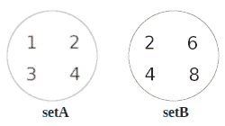
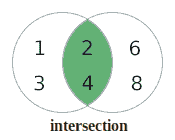
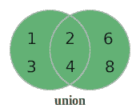

# Java 中的集合操作

> 原文:[https://web . archive . org/web/20220930061024/https://www . bael dung . com/Java-set-operations](https://web.archive.org/web/20220930061024/https://www.baeldung.com/java-set-operations)

## **1。简介**

集合是表示唯一的项目集合的简便方法。

在本教程中，我们将学习更多关于它的含义以及如何在 Java 中使用它。

## 2.一点集合论

### **2.1。什么是集合？**

集合就是一组独特的东西。所以，**任何集合的一个显著特征就是它不包含重复的**。

我们可以把任何我们喜欢的东西放入一个集合中。然而，我们通常使用集合来将具有共同特征的事物组合在一起。例如，我们可以有一组交通工具或一组动物。

让我们用两组整数作为一个简单的例子:

```
setA : {1, 2, 3, 4}

setB : {2, 4, 6, 8}
```

我们可以通过简单地将值放入圆圈来将集合显示为图表:
[](/web/20220926182433/https://www.baeldung.com/wp-content/uploads/2019/04/SetASetB-2.png)

像这样的图被称为文氏图，它给了我们一个有用的方法来显示集合之间的相互作用，我们将在后面看到。

### **2.2。集合的交集**

术语 **`intersection`表示不同集合**的公共值。

我们可以看到整数 2 和 4 在两个集合中都存在。所以 setA 和 setB 的交集是 2 和 4，因为这是我们两个集合共有的值。

```
setA intersection setB = {2, 4}
```

为了在图中显示交集，我们合并两个集合，并突出显示两个集合共有的区域:
[](/web/20220926182433/https://www.baeldung.com/wp-content/uploads/2019/04/interesection-1.png)

### **2.3。集合的并集**

术语 **`union`表示组合不同集合**的值。

因此，让我们创建一个新的集合，它是我们的示例集合的并集。我们已经知道在一个集合中不能有重复的值。但是，我们的集合有一些重复的值(2 和 4)。因此，当我们合并两个集合的内容时，我们需要确保删除重复的内容。所以我们得到了 1，2，3，4，6 和 8。

```
setA union setB = {1, 2, 3, 4, 6, 8}
```

同样，我们可以用图表来表示这种结合。因此，让我们合并我们的两个集合，并突出显示代表联合的区域:
[](/web/20220926182433/https://www.baeldung.com/wp-content/uploads/2019/04/union-2.png)

### **2.4。集合的相对补集**

术语 **`relative complement`表示一个集合中的值不在另一个**中。它也被称为集差。

现在让我们创建新的集合，它们是`setA`和`setB`的相对补充。

```
relative complement of setA in setB = {6, 8}

relative complement of setB in setA = {1, 3}
```

现在，让我们突出显示`setA`中不属于`setB`的区域。这就给了我们`setA` :
[](/web/20220926182433/https://www.baeldung.com/wp-content/uploads/2019/04/relativecomplement-1.png) 中`setB`的相对补语

### **2.5。子集和超集**

子集只是更大集合的一部分，更大的集合称为超集。当我们有子集和超集时，两者的并集等于超集，交集等于子集。

## **3。用`java.util.Set`** 实现集合运算

为了了解我们如何在 Java 中执行集合操作，我们将以集合为例，实现交集、并集和相对补集。让我们从创建整数样本集开始:

```
private Set<Integer> setA = setOf(1,2,3,4);
private Set<Integer> setB = setOf(2,4,6,8);

private static Set<Integer> setOf(Integer... values) {
    return new HashSet<Integer>(Arrays.asList(values));
}
```

### **3.1。十字路口**

首先，我们将使用`retainAll`方法来**创建我们的样本集**的交集。因为`retainAll`直接修改集合，我们将制作一个名为`intersectSet.`的`setA`的副本，然后我们将使用`retainAll`方法来保存`setB`中的值:

```
Set<Integer> intersectSet = new HashSet<>(setA);
intersectSet.retainAll(setB);
assertEquals(setOf(2,4), intersectSet);
```

### **3.2。工会**

现在让我们使用`addAll`方法来**创建样本集**的并集。`addAll`方法将提供的集合的所有成员相加。同样，由于`addAll`直接更新设置，我们将复制一个名为`unionSet`的`setA`，然后添加`setB`:

```
Set<Integer> unionSet = new HashSet<>(setA);
unionSet.addAll(setB);
assertEquals(setOf(1,2,3,4,6,8), unionSet);
```

### **3.3。相对补语**

最后，我们将使用`removeAll`方法来**创建`setA`** 中`setB`的相对补码。我们知道我们想要的是`setA`中不存在于`setB`中的值。所以我们只需要从`setA`中移除所有也在`setB`中的元素:

```
Set<Integer> differenceSet = new HashSet<>(setA);
differenceSet.removeAll(setB);
assertEquals(setOf(1,3), differenceSet);
```

## 4.用`Stream` s 实现集合运算

### **4.1。十字路口**

让我们使用`Streams`创建集合的交集。

首先，我们将把来自`setA`的值放到一个流中。**然后我们将过滤该流，以保留所有也在`setB`中的值。**最后，我们将把结果收集到一个新的`Set`中:

```
Set<Integer> intersectSet = setA.stream()
    .filter(setB::contains)
    .collect(Collectors.toSet());
assertEquals(setOf(2,4), intersectSet);
```

### **4.2。工会**

现在让我们使用静态方法`Streams.concat`将集合的值添加到一个单独的`stream`中。

为了从集合的连接中得到并集，我们需要删除任何重复的集合。我们将简单地将结果收集到一个`Set`中:

```
Set<Integer> unionSet = Stream.concat(setA.stream(), setB.stream())
    .collect(Collectors.toSet());
assertEquals(setOf(1,2,3,4,6,8), unionSet);
```

### **4.3。相对补语**

最后，我们将在`setA`中创建`setB`的相对补码。

正如我们在交集示例中所做的那样，我们将首先把来自`setA`的值放入一个流中。这一次，我们将过滤流，删除也在`setB`中的任何值。然后，我们会把结果收集到一个新的`Set`:

```
Set<Integer> differenceSet = setA.stream()
    .filter(val -> !setB.contains(val))
    .collect(Collectors.toSet());
assertEquals(setOf(1,3), differenceSet);
```

## **5。用于集合操作的实用程序库**

现在我们已经看到了如何用纯 Java 执行基本的 set 操作，让我们使用几个实用程序库来执行相同的操作。使用这些库的一个好处是方法名清楚地告诉我们正在执行什么操作。

### **5.1。依赖性**

为了使用[番石榴`Sets`](https://web.archive.org/web/20220926182433/https://search.maven.org/search?q=g:com.google.guava%20AND%20a:guava) 和[阿帕奇公地集合`SetUtils`](https://web.archive.org/web/20220926182433/https://search.maven.org/search?q=g:org.apache.commons%20AND%20a:commons-collections4) ，我们需要添加它们的依赖关系:

```
<dependency>
    <groupId>com.google.guava</groupId>
    <artifactId>guava</artifactId>
    <version>31.0.1-jre</version>
</dependency>
<dependency>
    <groupId>org.apache.commons</groupId>
    <artifactId>commons-collections4</artifactId>
    <version>4.3</version>
</dependency>
```

### 5.2。番石榴套装

让我们使用 Guava `Sets`类在我们的示例集上执行`intersection`和`union`。为了做到这一点，我们可以简单地使用`Sets`类的静态方法`union`和`intersection`:

```
Set<Integer> intersectSet = Sets.intersection(setA, setB);
assertEquals(setOf(2,4), intersectSet);

Set<Integer> unionSet = Sets.union(setA, setB);
assertEquals(setOf(1,2,3,4,6,8), unionSet);
```

看看我们的[番石榴系列文章](/web/20220926182433/https://www.baeldung.com/guava-sets)了解更多信息。

### 5.3。Apache Commons Collections

现在让我们使用 Apache Commons 集合中的`SetUtils`类的`intersection`和`union`静态方法:

```
Set<Integer> intersectSet = SetUtils.intersection(setA, setB);
assertEquals(setOf(2,4), intersectSet);

Set<Integer> unionSet = SetUtils.union(setA, setB);
assertEquals(setOf(1,2,3,4,6,8), unionSet);
```

看看我们的 [Apache Commons Collections `SetUtils` 教程](/web/20220926182433/https://www.baeldung.com/apache-commons-setutils)了解更多。

## **6。结论**

我们已经看到了如何对集合执行一些基本操作的概述，以及如何以多种不同方式实现这些操作的细节。

所有的代码示例都可以在 GitHub 上找到[。](https://web.archive.org/web/20220926182433/https://github.com/eugenp/tutorials/tree/master/core-java-modules/core-java-collections-set)