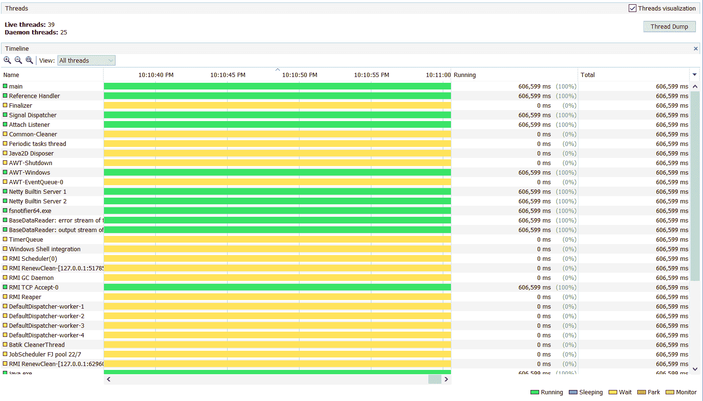

# 如何获得 Java 进程中的线程数

> 原文：<https://web.archive.org/web/20220930061024/https://www.baeldung.com/java-get-number-of-threads>

## 1.概观

线程是 Java 中[并发](/web/20221208143921/https://www.baeldung.com/java-concurrency)的基本单位。在大多数情况下，当创建多个线程来并行执行任务时，应用程序的吞吐量会增加。

然而，总有一个饱和点。毕竟，应用程序的吞吐量取决于 CPU 和内存资源。**达到一定限制后，增加线程数量会导致内存过高、线程上下文切换等。**

因此，在排除 Java 应用程序中的高内存问题时，一个很好的起点是监控线程的数量。在本教程中，我们将研究一些检查 Java 进程创建的线程数量的方法。

## 2.图形化 Java 监控工具

查看 Java 中线程数量的最简单方法是使用类似 [Java VisualVM](/web/20221208143921/https://www.baeldung.com/java-profilers) 的图形工具。**除了应用程序线程，Java VisualVM 还列出了应用程序使用的 GC 或任何其他线程，如 JMX 线程**。

此外，它还显示线程状态及其持续时间等统计信息:

[](/web/20221208143921/https://www.baeldung.com/wp-content/uploads/2021/06/JvisualVM.png)

监控线程数量是 Java VisualVM 中最基本的特性。一般来说，图形工具更先进，允许对应用程序进行实时监控。例如，Java VisualVM 允许我们对 CPU 堆栈跟踪进行采样，从而找到可能导致 CPU 瓶颈的类或方法。

Java VisualVM 随 Windows 机器上的 JDK 安装一起分发。对于部署在 Linux 上的应用程序，我们需要远程连接到应用程序。这需要 [JMX](/web/20221208143921/https://www.baeldung.com/java-management-extensions) VM 的论证。

因此，如果应用程序已经在没有这些参数的情况下运行，这样的工具将不起作用。在后面的部分中，我们将看到如何使用命令行工具来获得线程的数量。

## 3.Java APIs

在某些用例中，我们可能希望找到应用程序本身的线程数量。例如，在监控仪表板上显示或在日志中显示。

在这种情况下，我们依靠 Java APIs 来获得线程数。谢天谢地，在`Thread `类中有一个 *activeCount()* API:

```
public class FindNumberofThreads {
    public static void main(String[] args) {
        System.out.println("Number of threads " + Thread.activeCount());
    }
}
```

输出将是:

```
Number of threads 2
```

值得注意的是，如果我们看到 Java VisualVM 中的线程数量，我们将看到同一应用程序有更多的线程。**这是因为`activeCount()`只返回同一个** `**ThreadGroup**. `中的线程数量，Java 把所有的线程分成组以便于管理。

在本例中，我们只有父节点`ThreadGroup,`，即`main:`

```
public static void main(String[] args) {
    System.out.println("Current Thread Group - " + Thread.currentThread().getThreadGroup().getName());
}
```

```
Current Thread Group - main
```

如果一个 Java 应用程序中有许多线程组，`activeCount()` 不会给出正确的输出。例如，它不会返回 GC 线程的数量。

在这种情况下，我们可以使用 JMX API :

```
public static void main(String[] args) {
    System.out.println("Total Number of threads " + ManagementFactory.getThreadMXBean().getThreadCount());
} 
```

这个 API 返回所有线程组、GC、JMX 等的线程总数。：

```
Total Number of threads 6
```

事实上，像 Java VisualVM 这样的 JMX 图形工具对它们的数据使用相同的 API。

## 4.命令行工具

之前，我们讨论了 Java VisualVM，这是一个用于分析应用程序中活动线程的图形化工具。尽管这是一个很好的线程实时可视化工具，但它对应用程序性能的影响很小。**因此不建议在生产环境中使用**。

此外，正如我们所讨论的，Java VisualVM 需要 Linux 中的远程连接。事实上，在某些情况下，它需要额外的配置。例如，在 Docker 或 Kubernetes 中运行的应用程序需要额外的服务和端口配置。

在这种情况下，我们必须依靠主机环境中的命令行工具来获得线程数。

**幸运的是，Java 提供了几个命令来执行[线程转储](/web/20221208143921/https://www.baeldung.com/java-thread-dump)** 。我们可以将线程转储作为文本文件进行分析，或者使用线程转储分析器工具来检查线程的数量及其状态。

阿里巴巴阿尔萨斯是另一个伟大的命令行工具，不需要远程连接或任何特殊配置。

此外，我们还可以从一些 Linux 命令中获得关于线程的信息。**例如，我们可以使用 [top](/web/20221208143921/https://www.baeldung.com/linux/top-command) 命令来显示任何 Java 应用程序的所有线程**:

```
top -H -p 1
```

这里，`-H `是一个命令行选项，用于显示 Java 进程中的每个线程。如果没有这个标志，`top`命令将显示进程中所有线程的综合统计数据。`-p `选项根据目标应用程序的进程 id 过滤输出:

```
top - 15:59:44 up 7 days, 19:23,  0 users,  load average: 0.52, 0.41, 0.36
Threads:  37 total,   0 running,  37 sleeping,   0 stopped,   0 zombie
%Cpu(s):  3.2 us,  2.2 sy,  0.0 ni, 93.4 id,  0.8 wa,  0.0 hi,  0.3 si,  0.0 st
MiB Mem :   1989.2 total,    110.2 free,   1183.1 used,    695.8 buff/cache
MiB Swap:   1024.0 total,    993.0 free,     31.0 used.    838.8 avail Mem

  PID USER      PR  NI    VIRT    RES    SHR S  %CPU  %MEM     TIME+ COMMAND
   1 flink     20   0 2612160 304084  29784 S   0.0  14.9   0:00.07 java
  275 flink     20   0 2612160 304084  29784 S   0.0  14.9   0:02.87 java
  276 flink     20   0 2612160 304084  29784 S   0.0  14.9   0:00.37 VM Thread
  277 flink     20   0 2612160 304084  29784 S   0.0  14.9   0:00.00 Reference Handl
  278 flink     20   0 2612160 304084  29784 S   0.0  14.9   0:00.00 Finalizer
  279 flink     20   0 2612160 304084  29784 S   0.0  14.9   0:00.00 Signal Dispatch 
```

如上所示，它显示了线程 id，即`PID `和每个线程的 CPU 和内存利用率。与 Java VisualVM 类似，top 命令将列出所有线程，包括 GC、JMX 或任何其他子进程。

为了找到我们在上面的命令中用作参数的进程 ID，我们可以使用`[ps](/web/20221208143921/https://www.baeldung.com/linux/ps-command) `命令:

```
ps -ef | grep java
```

**事实上，我们也可以使用`ps `命令来列出线程:**

```
ps -e -T | grep 1
```

`-T `选项告诉`ps `命令列出应用程序启动的所有线程:

```
1     1 ?        00:00:00 java
1   275 ?        00:00:02 java
1   276 ?        00:00:00 VM Thread
1   277 ?        00:00:00 Reference Handl
1   278 ?        00:00:00 Finalizer
1   279 ?        00:00:00 Signal Dispatch
1   280 ?        00:00:03 C2 CompilerThre
1   281 ?        00:00:01 C1 CompilerThre
```

这里，第一列是 PID，第二列显示每个线程的 Linux 线程 ID。

## 5.结论

在本文中，我们看到有各种方法可以找到 Java 应用程序中的线程数量。**在大多数情况下，使用像`top `或`ps `命令这样的命令行选项应该是首选方式**。

然而，在某些情况下，我们可能还需要像 Java VisualVM 这样的图形工具。所有代码示例都可以在 GitHub 上的[处获得。](https://web.archive.org/web/20221208143921/https://github.com/eugenp/tutorials/tree/master/core-java-modules/core-java-concurrency-basic-2)