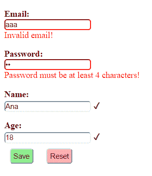

# 用 AngularJS 和 Spring MVC 进行表单验证

> 原文：<https://web.archive.org/web/20220930061024/https://www.baeldung.com/validation-angularjs-spring-mvc>

## 1。概述

验证永远不会像我们预期的那样简单。当然，验证用户输入到应用程序中的值对于保持数据的完整性非常重要。

在 web 应用程序的上下文中，数据输入通常使用 HTML 表单完成，并且需要客户端和服务器端的验证。

在本教程中，我们将看看**使用 AngularJS 实现表单输入的客户端验证，以及使用 Spring MVC 框架**实现服务器端验证。

本文主要关注 Spring MVC。我们的文章[Spring Boot 验证](/web/20221126234945/https://www.baeldung.com/spring-boot-bean-validation)描述了如何在 Spring Boot 进行验证。

## 2。Maven 依赖关系

首先，让我们添加以下依赖项:

```
<dependency>
    <groupId>org.springframework</groupId>
    <artifactId>spring-webmvc</artifactId>
    <version>4.3.7.RELEASE</version>
</dependency>
<dependency>
    <groupId>org.hibernate</groupId>
    <artifactId>hibernate-validator</artifactId>
    <version>5.4.0.Final</version>
</dependency>
<dependency>
    <groupId>com.fasterxml.jackson.core</groupId>
    <artifactId>jackson-databind</artifactId>
    <version>2.13.0</version>
</dependency>
```

最新版本的 [spring-webmvc](https://web.archive.org/web/20221126234945/https://search.maven.org/classic/#search%7Cga%7C1%7Ca%3A%22spring-webmvc%22) 、 [hibernate-validator](https://web.archive.org/web/20221126234945/https://search.maven.org/classic/#search%7Cga%7C1%7Ca%3A%22hibernate-validator%22) 和 [jackson-databind](https://web.archive.org/web/20221126234945/https://search.maven.org/classic/#search%7Cga%7C1%7Ca%3A%22jackson-databind%22) 可以从 Maven Central 下载。

## 3。使用 Spring MVC 进行验证

应用程序不应该仅仅依赖客户端验证，因为这很容易被绕过。为了防止保存不正确或恶意的值或导致应用程序逻辑的不正确执行，在服务器端验证输入值也很重要。

Spring MVC 通过使用`JSR 349 Bean Validation`规范注释提供了对服务器端验证的支持。对于这个例子，我们将使用规范的参考实现，即`hibernate-validator`。

### 3.1。数据模型

让我们创建一个`User`类，它的属性用适当的验证注释进行了注释:

```
public class User {

    @NotNull
    @Email
    private String email;

    @NotNull
    @Size(min = 4, max = 15)
    private String password;

    @NotBlank
    private String name;

    @Min(18)
    @Digits(integer = 2, fraction = 0)
    private int age;

    // standard constructor, getters, setters
}
```

上面使用的注释属于`JSR 349`规范，除了`@Email`和`@NotBlank`是特定于`hibernate-validator`库的。

### 3.2。弹簧 MVC 控制器

让我们创建一个定义了一个`/user`端点的控制器类，它将被用来保存一个新的`User`对象到一个`List`。

为了能够验证通过请求参数接收到的`User`对象，声明之前必须有`@Valid`注释，验证错误将保存在`BindingResult`实例中。

要确定对象是否包含无效值，我们可以使用`BindingResult`的`hasErrors()`方法。

如果`hasErrors()`返回`true`，我们可以返回一个`JSON array`，其中包含与没有通过的验证相关的错误消息。否则，我们会将对象添加到列表中:

```
@PostMapping(value = "/user")
@ResponseBody
public ResponseEntity<Object> saveUser(@Valid User user, 
  BindingResult result, Model model) {
    if (result.hasErrors()) {
        List<String> errors = result.getAllErrors().stream()
          .map(DefaultMessageSourceResolvable::getDefaultMessage)
          .collect(Collectors.toList());
        return new ResponseEntity<>(errors, HttpStatus.OK);
    } else {
        if (users.stream().anyMatch(it -> user.getEmail().equals(it.getEmail()))) {
            return new ResponseEntity<>(
              Collections.singletonList("Email already exists!"), 
              HttpStatus.CONFLICT);
        } else {
            users.add(user);
            return new ResponseEntity<>(HttpStatus.CREATED);
        }
    }
}
```

如您所见，**服务器端验证增加了一个优势，即能够执行客户端无法执行的额外检查。**

在我们的例子中，我们可以验证是否已经存在一个具有相同电子邮件的用户——如果是这样的话，就返回 409 冲突状态。

我们还需要定义用户列表，并用几个值对其进行初始化:

```
private List<User> users = Arrays.asList(
  new User("[[email protected]](/web/20221126234945/https://www.baeldung.com/cdn-cgi/l/email-protection)", "pass", "Ana", 20),
  new User("[[email protected]](/web/20221126234945/https://www.baeldung.com/cdn-cgi/l/email-protection)", "pass", "Bob", 30),
  new User("[[email protected]](/web/20221126234945/https://www.baeldung.com/cdn-cgi/l/email-protection)", "pass", "John", 40),
  new User("[[email protected]](/web/20221126234945/https://www.baeldung.com/cdn-cgi/l/email-protection)", "pass", "Mary", 30));
```

让我们还添加一个映射，以 JSON 对象的形式检索用户列表:

```
@GetMapping(value = "/users")
@ResponseBody
public List<User> getUsers() {
    return users;
}
```

我们在 Spring MVC 控制器中需要的最后一项是返回应用程序主页的映射:

```
@GetMapping("/userPage")
public String getUserProfilePage() {
    return "user";
}
```

我们将在 AngularJS 部分更详细地查看 `user.html`页面。

### 3.3。Spring MVC 配置

让我们为应用程序添加一个基本的 MVC 配置:

```
@Configuration
@EnableWebMvc
@ComponentScan(basePackages = "com.baeldung.springmvcforms")
class ApplicationConfiguration implements WebMvcConfigurer {

    @Override
    public void configureDefaultServletHandling(
      DefaultServletHandlerConfigurer configurer) {
        configurer.enable();
    }

    @Bean
    public InternalResourceViewResolver htmlViewResolver() {
        InternalResourceViewResolver bean = new InternalResourceViewResolver();
        bean.setPrefix("/WEB-INF/html/");
        bean.setSuffix(".html");
        return bean;
    }
}
```

### 3.4。初始化应用程序

让我们创建一个实现`WebApplicationInitializer`接口的类来运行我们的应用程序:

```
public class WebInitializer implements WebApplicationInitializer {

    public void onStartup(ServletContext container) throws ServletException {

        AnnotationConfigWebApplicationContext ctx
          = new AnnotationConfigWebApplicationContext();
        ctx.register(ApplicationConfiguration.class);
        ctx.setServletContext(container);
        container.addListener(new ContextLoaderListener(ctx));

        ServletRegistration.Dynamic servlet 
          = container.addServlet("dispatcher", new DispatcherServlet(ctx));
        servlet.setLoadOnStartup(1);
        servlet.addMapping("/");
    }
}
```

### 3.5。使用 Curl 测试 Spring Mvc 验证

在我们实现 AngularJS 客户端部分之前，我们可以使用 cURL 命令测试我们的 API:

```
curl -i -X POST -H "Accept:application/json" 
  "localhost:8080/spring-mvc-forms/user?email=aaa&password;=12&age;=12"
```

响应是一个包含默认错误消息的数组:

```
[
    "not a well-formed email address",
    "size must be between 4 and 15",
    "may not be empty",
    "must be greater than or equal to 18"
]
```

## 4。角度验证

客户端验证有助于创建更好的用户体验，因为它为用户提供了如何成功提交有效数据的信息，并使他们能够继续与应用程序进行交互。

AngularJS 库非常支持在表单字段上添加验证需求、处理错误消息以及设计有效和无效表单的样式。

首先，让我们创建一个 AngularJS 模块，它注入了用于验证消息的`ngMessages`模块:

```
var app = angular.module('app', ['ngMessages']);
```

接下来，让我们创建一个 AngularJS 服务和控制器，它将使用上一节中构建的 API。

### 4.1。AngularJS 服务

我们的服务将有两个调用 MVC 控制器方法的方法——一个保存用户，一个检索用户列表:

```
app.service('UserService',['$http', function ($http) {

    this.saveUser = function saveUser(user){
        return $http({
          method: 'POST',
          url: 'user',
          params: {email:user.email, password:user.password, 
            name:user.name, age:user.age},
          headers: 'Accept:application/json'
        });
    }

    this.getUsers = function getUsers(){
        return $http({
          method: 'GET',
          url: 'users',
          headers:'Accept:application/json'
        }).then( function(response){
        	return response.data;
        } );
    }

}]);
```

### 4.2。角度控制器

`UserCtrl`控制器注入`UserService`，调用服务方法，处理响应和错误消息:

```
app.controller('UserCtrl', ['$scope','UserService', function ($scope,UserService) {

	$scope.submitted = false;

	$scope.getUsers = function() {
		   UserService.getUsers().then(function(data) {
		       $scope.users = data;
	       });
	   }

    $scope.saveUser = function() {
    	$scope.submitted = true;
    	  if ($scope.userForm.$valid) {
            UserService.saveUser($scope.user)
              .then (function success(response) {
                  $scope.message = 'User added!';
                  $scope.errorMessage = '';
                  $scope.getUsers();
                  $scope.user = null;
                  $scope.submitted = false;
              },
              function error(response) {
                  if (response.status == 409) {
                    $scope.errorMessage = response.data.message;
            	  }
            	  else {
                    $scope.errorMessage = 'Error adding user!';
            	  }
                  $scope.message = '';
            });
    	  }
    }

   $scope.getUsers();
}]);
```

我们可以在上面的例子中看到，只有当`userForm`的`$valid`属性为真时，才会调用服务方法。尽管如此，在这种情况下，有额外的检查重复的电子邮件，这只能在服务器上完成，并在`error()`功能中单独处理。

另外，注意这里定义了一个`submitted`变量，它将告诉我们表单是否已经提交。

最初，这个变量是`false`，在调用`saveUser()`方法时，它变成了`true`。如果我们不希望在用户提交表单之前显示验证消息，我们可以使用`submitted`变量来防止这种情况。

### 4.3。使用 AngularJS 验证的表单

为了利用 AngularJS 库和我们的 AngularJS 模块，我们需要将脚本添加到我们的`user.html`页面:

```
<script src="https://ajax.googleapis.com/ajax/libs/angularjs/1.5.6/angular.min.js">
</script>
<script src="https://ajax.googleapis.com/ajax/libs/angularjs/1.4.0/angular-messages.js">
</script>
<script src="js/app.js"></script>
```

然后我们可以通过设置`ng-app`和`ng-controller`属性来使用我们的模块和控制器:

```
<body ng-app="app" ng-controller="UserCtrl">
```

让我们创建我们的 HTML 表单:

```
<form name="userForm" method="POST" novalidate 
  ng-class="{'form-error':submitted}" ng-submit="saveUser()" >
...
</form>
```

**注意，我们必须在表单上设置`novalidate`属性，以防止默认的 HTML5 验证，并用我们自己的属性替换它。**

如果`submitted`变量的值为`true`，那么`ng-class`属性会将`form-error` CSS 类动态添加到表单中。

属性定义了提交表单时将被调用的 AngularJS 控制器函数。使用`ng-submit`而不是`ng-click`的好处是它也可以响应使用回车键提交的表单。

现在让我们为用户属性添加四个输入字段:

```
<label class="form-label">Email:</label>
<input type="email" name="email" required ng-model="user.email" class="form-input"/>

<label class="form-label">Password:</label>
<input type="password" name="password" required ng-model="user.password" 
  ng-minlength="4" ng-maxlength="15" class="form-input"/>

<label class="form-label">Name:</label>
<input type="text" name="name" ng-model="user.name" ng-trim="true" 
  required class="form-input" />

<label class="form-label">Age:</label>
<input type="number" name="age" ng-model="user.age" ng-min="18"
  class="form-input" required/>
```

每个输入字段都通过`ng-model`属性绑定到`user`变量的属性。

**为了设置验证规则**，我们使用了 HTML5 `required`属性和几个 AngularJS 特有的属性:`ng-minglength, ng-maxlength, ng-min,` 和 `ng-trim`。

对于`email`字段，我们还使用值为`email`的`type`属性进行客户端电子邮件验证。

**为了添加对应于每个字段**的错误消息，AngularJS 提供了`ng-messages`指令，该指令循环遍历输入的`$errors`对象，并根据每个验证规则显示消息。

让我们在输入定义之后添加针对`email`字段的指令:

```
<div ng-messages="userForm.email.$error" 
  ng-show="submitted && userForm.email.$invalid" class="error-messages">
    <p ng-message="email">Invalid email!</p>
    <p ng-message="required">Email is required!</p>
</div>
```

可以为其他输入字段添加类似的错误消息。

**我们可以使用带有布尔表达式的`ng-show`属性来控制何时为`email`字段显示指令**。在我们的例子中，当字段具有无效值时，我们显示该指令，这意味着`$invalid`属性是`true`，并且`submitted`变量也是`true`。

对于一个字段，一次只会显示一条错误消息。

根据`$valid`属性，我们还可以在输入字段后添加一个复选标记(用十六进制代码字符\003;表示),以防该字段有效:

```
<div class="check" ng-show="userForm.email.$valid">✓</div>
```

AngularJS 验证还支持使用 CSS 类如`ng-valid` 和 `ng-invalid`或更具体的如`ng-invalid-required` 和 `ng-invalid-minlength`进行样式化。

让我们为表单的`form-error`类中的无效输入添加 CSS 属性`border-color:red`:

```
.form-error input.ng-invalid {
    border-color:red;
}
```

我们还可以使用 CSS 类以红色显示错误消息:

```
.error-messages {
    color:red;
}
```

把所有的东西放在一起之后，让我们看一个例子，看看我们的客户端表单验证在混合了有效值和无效值的情况下会是什么样子:

[](/web/20221126234945/https://www.baeldung.com/wp-content/uploads/2017/03/angularjs-form-validation.png)

## 5。结论

在本教程中，我们展示了如何使用 AngularJS 和 Spring MVC 结合客户端和服务器端验证。

和往常一样，例子的完整源代码可以在 GitHub 上找到[。](https://web.archive.org/web/20221126234945/https://github.com/eugenp/tutorials/tree/master/spring-web-modules/spring-mvc-forms-jsp)

要查看应用程序，请在运行后访问`/userPage` URL。