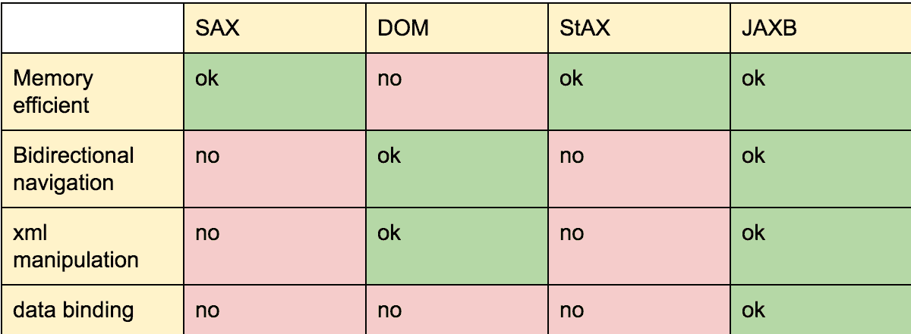

# Java 中的 XML 库支持

> 原文：<https://web.archive.org/web/20220930061024/https://www.baeldung.com/java-xml-libraries>

## **1。简介**

在本文中，我们将比较 Java XML 库和 API。

这是关于 Java 对 XML 支持的系列文章中的第二篇，如果你想更深入地了解 Java 中的 XPath 支持，可以看看上一篇文章。

## **2。概述**

现在，我们将深入挖掘 XML 世界的支持，为此，我们将从尽可能简单地解释所有与主题相关的首字母开始。

在 Java XML 支持中，我们可以找到很少的 API 定义，每一个都有其优点和缺点。

SAX :这是一个基于事件的解析 API，它提供了一个低层次的访问，比 DOM 更高效，更快，因为它不在内存中加载整个文档树，但它不像 XPath 那样提供导航支持，尽管它更高效，但也更难使用。

DOM:它是一个基于模型的解析器，在内存中加载一个树形结构的文档，所以我们有原始的元素顺序，我们可以双向浏览我们的文档，它提供了一个用于读写的 API，它提供了 XML 操作，它非常容易使用，尽管它的价格对内存资源造成了很大的压力。

StAX :它提供了 DOM 的易用性和 SAX 的效率，但是它缺少 DOM 提供的一些功能，比如 XML 操作，它只允许我们向前浏览文档。

JAXB :它允许我们双向浏览文档，比 DOM 更高效，允许从 XML 到 java 类型的转换，支持 XML 操作，但只能解析有效的 XML 文档。

你仍然可以找到一些关于 JAXP 的参考资料，但是这个项目的最后一次发布是在 2013 年 3 月，它实际上已经死了。

XML APIs 表

## **3。XML**

在这一节中，我们将看到最流行的实现，这样我们就可以测试真实的工作样本，并检查它们之间的差异。

在以下示例中，我们将使用一个简单的 XML 文件，其结构如下:

[PRE0]

## **4。DOM4J**

我们将从看看我们可以用`DOM4J` 做什么开始，对于这个例子，我们需要添加这个[依赖](https://web.archive.org/web/20220812054829/https://mvnrepository.com/artifact/dom4j/dom4j)的最后版本。

这是处理`XML`文件最流行的库之一，因为它允许我们进行双向阅读，创建新文档和更新现有文档。

`DOM4J`可以和`DOM`、`SAX`、`XPath`、`XLST`一起工作。`SAX`由`JAXP`支持。

让我们看一下，例如，我们如何通过给定的 id 选择元素过滤。

[PRE1]

`SAXReader` 类负责从`SAX`解析事件中创建一个`DOM4J`树。一旦我们有了一个`org.dom4j.Document` ，我们只需要调用必要的方法，并将`XPath`表达式作为`String.`传递给它

我们可以加载现有的文档，对其内容进行更改，然后更新原始文件。

[PRE2]

在上面的例子中，我们改变了每个标题的内容并创建了一个新文件。

请注意，通过调用`elementIterator`并传递`node.`的名字，获得列表中每个标题的`node`是多么简单

一旦我们修改了内容，我们将使用`XMLWriter`获取一个`DOM4J`树并将其格式化为一个流作为`XML`。

从头开始创建一个新文档就像我们下面看到的一样简单。

[PRE3]

`DocumentHelper` 给了我们一个由`DOM4J`使用的方法集合，比如`createDocument`创建一个空文档来开始使用它。

我们可以用`DOM4J`提供的方法创建任意多的属性或元素，一旦我们完成了我们的文档，我们只需将它写到一个文件中，就像我们之前在更新案例中所做的那样。

## **5。JDOM**

为了与`JDOM,`一起工作，我们必须将这个[依赖项](https://web.archive.org/web/20220812054829/https://search.maven.org/classic/#search|gav|1|g%3A%22org.jdom%22)添加到我们的 pom 中。

`JDOM's`工作方式与`DOM4J's`非常相似，所以我们只看几个例子:

[PRE4]

在上面的例子中，我们以一种非常简单的方式从根元素中检索所有元素，就像我们可以用`DOM4J:` 做的那样

[PRE5]

同样，在上面的代码中，我们有一个从给定文件创建一个实例的`SAXBuilder`。我们通过向由`JDOM2.`提供的`XPathFactory`传递一个`XPath`表达式，根据元素的`tutId`属性来检索元素

## **6。StAX**

现在，我们将看看如何使用`Stax API`从根元素中检索所有元素。从 Java 6 开始，`Stax`就包含在`JDK`中，所以不需要添加任何依赖项。

首先，我们需要创建一个`Tutorial`类:

[PRE6]

然后我们准备跟进:

[PRE7]

在上面的例子中，为了帮助我们检索信息，我们需要创建一个类来存储检索到的数据。

为了阅读文档，我们声明了所谓的事件处理程序，并使用它们来导航我们的文档。记住，SAX 实现不提供双向导航。正如您在这里看到的，仅仅检索一个简单的元素列表就需要做大量的工作。

## **7 号。JAXB【% 1】**

`JAXB`包含在`JDK`中，还有 Xerces，se 对于这个不需要任何额外的依赖。

使用`JAXB`从`XML`文件加载、创建和操作信息非常简单。

我们只需要创建正确的 java 实体来绑定`XML`就行了。

[PRE8]

在上面的例子中，我们将`XML`文件加载到我们的对象中，从那里我们可以像普通的 Java 结构一样处理一切；

要创建一个新的文档，就像阅读它一样简单，但是反过来做，如下面的代码所示。

首先，我们将修改我们的`Tutorial`类，为`getters`和`setters`添加`JAXB`注释:

[PRE9]

使用`@XmlRootElement`我们定义什么对象将代表我们文档的根节点，然后我们使用`@XmlAttribute`或`@XmlElement`来定义该属性是代表节点的属性还是文档的元素。

那么我们可以接着说:

[PRE10]

如您所见，将 XML 文件绑定到 Java 对象是处理这类文件的最简单方法。

## **8。XPath 表达式支持**

要创建复杂的 XPath 表达式，我们可以使用 Jaxen。这是一个开源的 XPath 库，适用于许多不同的对象模型，包括`DOM`、`XOM`、*、DOM4J* 和`JDOM.`

我们可以创建 XPath 表达式，并根据许多受支持的文档编译它们。

[PRE11]

为了让它工作，我们需要将这个[依赖关系](https://web.archive.org/web/20220812054829/https://mvnrepository.com/artifact/jaxen/jaxen/1.1.6)添加到我们的项目中。

## **9。结论**

正如你所看到的，使用`XML`有很多选择，取决于你的应用程序的需求，你可以使用其中任何一个，或者你必须在效率和简单性之间做出选择。

您可以在我们的 git 资源库[这里](https://web.archive.org/web/20220812054829/https://github.com/eugenp/tutorials/tree/master/xml)找到本文的完整工作示例。