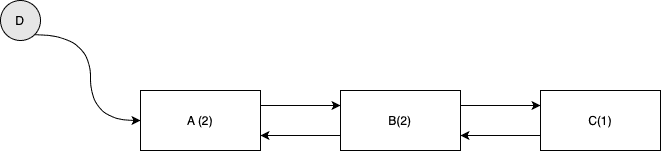
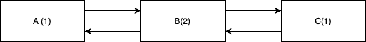
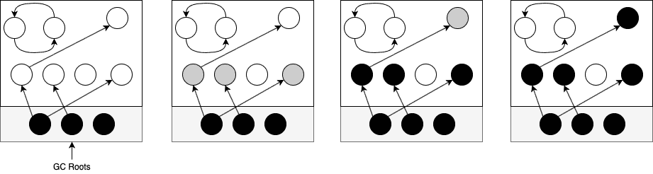

# Java 中的垃圾收集和循环引用

> 原文:[https://web . archive . org/web/20220930061024/https://www . bael dung . com/Java-GC-cyclic-references](https://web.archive.org/web/20220930061024/https://www.baeldung.com/java-gc-cyclic-references)

## 1.概观

在这篇简短的文章中，我们将看到 JVM 如何确保收集不可及但循环的引用。

首先，我们将探索不同类型的 GC 算法。之后，我们将看到循环引用在 JVM 中是如何处理的。

同样值得一提的是，GC 不是 JVM 规范的一部分，而是留给实现者来决定。因此，每个 JVM 实现可能有不同的 GC 策略，或者根本没有。

在本文中，我们将重点关注一个特定的 JVM 实现:HotSpot JVM。在整篇文章中，我们也可能会互换使用 JVM 和 HotSpot JVM 这两个术语。

## 2.引用计数

引用计数 GC 算法将引用计数与每个对象相关联。这些算法认为一个对象是活的，只要对该对象的引用数大于零。通常，运行库将引用计数存储在对象头中。

在一个非常简单的实现中，每个对对象的新引用都应该触发原子引用计数递增。同样，每个新的解引用都应该触发原子减量。

Swift 编程语言使用一种引用计数的形式进行内存管理。此外，JVM 中没有基于引用计数的 GC 算法。

### 2.1.利弊

从好的方面来看，引用计数可以在整个应用程序生命周期中分配内存管理成本，因为(几乎)没有周期性的 GC 中断。此外，一旦对象的引用计数达到零，它就有可能破坏对象并成为垃圾。

引用计数也不是免费的午餐。在简单的实现中，更新引用计数可能是低效的，因为我们需要自动地增加或减少它。在这方面，很少有优化可以使引用计数更有效，例如延迟或缓冲引用计数方法。

然而，引用计数仍然有一个严重的问题:**它不能回收循环引用**。

例如，假设对象`A `引用对象`B `，反之亦然。即使`A `和`B `从对象图的其余部分变得不可达，它们的引用计数也永远不会达到零。这是因为它们仍然相互引用。

事实证明，这种循环引用在计算机科学中非常普遍。例如，让我们考虑下面的双向链表。首先，另一个对象有一个对列表的引用:

链表可以从对象`D, `到达，所以它不应该被收集，引用计数与这个期望一致。现在，假设对象`D `本身变得不可及:

即使链表现在也是不可访问的，它的组件的引用计数也不止一个。所以，**用这种幼稚的引用计数实现，运行时不会把这个链表当成垃圾，即使它是**。

## 3.跟踪 GC

**跟踪收集器将通过从一组根对象(称为 GC 根**)中跟踪对象来确定对象的可达性。如果一个对象可以从一个根对象直接或间接到达，那么它将被认为是活的。其他的是不可及的和收集的候选者:

下面是一个简单的跟踪收集器的工作原理。从 GC 根开始，它递归地遍历对象图，直到不再有灰色对象需要访问。最后，它认为所有的白色物体都是不可到达的，并且是收集的候选者。这是三色标记算法的简单描述。

**我们可以把 GC 根看作是我们确信是活的对象**。例如，以下是 Java 和 JVM 中的一些 GC 根:

*   局部变量或堆栈帧现在引用的任何东西。这些变量被当前正在执行的方法使用，所以我们不想收集它们
*   活动线程
*   静态变量
*   由系统类加载器加载的类
*   JNI 本地人和全球人

与引用计数收集器不同，跟踪收集器将定期执行收集过程。因此，在大多数情况下，分配和赋值应该很快。然而，当 GC 开始时，可能会有一些小问题。

从好的方面来看，这些 GC 算法不会受到循环引用的影响。它们不是计算对每个对象的引用，而是从 GC 根开始遍历对象图。因此，即使有一些循环引用，只要对象是不可达的，就会被收集，如上图所示。

非常有趣的是，使用备份跟踪收集器和引用计数 GC 是修复引用计数中循环引用的传统方法之一。

### 3.1.热点 JVM

**在撰写本文时，HotSpot JVM 中的所有 [GC 实现](/web/20220922115456/https://www.baeldung.com/jvm-garbage-collectors)都在追踪收集器，包括 CMS、G1、 [ZGC](/web/20220922115456/https://www.baeldung.com/jvm-zgc-garbage-collector) 、T5。因此，JVM 不会受到循环引用问题的困扰。这是本文的关键要点！**

## 4.结论

在这篇简短的文章中，我们看到了 JVM 如何处理循环引用。

关于垃圾收集的更详细的处理，强烈推荐查阅[垃圾收集手册](https://web.archive.org/web/20220922115456/https://learning.oreilly.com/library/view/the-garbage-collection/9781315388007/)。