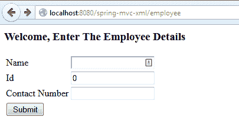
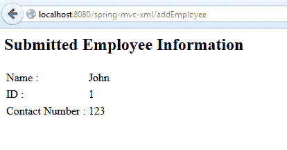

# Spring MVC 中的表单入门

> 原文：<https://web.archive.org/web/20220930061024/https://www.baeldung.com/spring-mvc-form-tutorial>

## **1。概述**

在本文中，我们将讨论 Spring 表单和绑定到控制器的数据。另外，我们还会看到 **Spring MVC** 中的一个主要注释，即 **`@ModelAttribute`** 。

当然，Spring MVC 是一个复杂的主题，你需要理解很多东西来充分发挥它的潜力，所以[一定要在这里](/web/20221109182850/https://www.baeldung.com/category/spring-mvc/)更深入地挖掘这个框架。

## 延伸阅读:

## [探索 SpringMVC 的表单标签库](/web/20221109182850/https://www.baeldung.com/spring-mvc-form-tags)

A quick and to the point tutorial about the various tags that Spring MVC provides to help us create and validate forms.[Read more](/web/20221109182850/https://www.baeldung.com/spring-mvc-form-tags) →

## [Spring MVC 中使用 FreeMarker 的介绍](/web/20221109182850/https://www.baeldung.com/freemarker-in-spring-mvc-tutorial)

FreeMarker is a Java based template engine from the Apache Software Foundation. This tutorial illustrates how to configure FreeMarker for use in Spring MVC.[Read more](/web/20221109182850/https://www.baeldung.com/freemarker-in-spring-mvc-tutorial) →

## [春季使用百里香叶简介](/web/20221109182850/https://www.baeldung.com/thymeleaf-in-spring-mvc)

Thymeleaf is a templating language with excellent integration with Spring. This article provides an introduction to using Thymeleaf in a Spring MVC application.[Read more](/web/20221109182850/https://www.baeldung.com/thymeleaf-in-spring-mvc) →

## **2。**的型号

首先——让我们定义一个简单的实体**,我们将显示它并将其绑定到表单上:**

```
public class Employee {
    private String name;
    private long id;
    private String contactNumber;

    // standard getters and setters
}
```

这将是我们的表单支持对象。

## **3。**的景色

接下来——让我们定义**实际的表单**，当然，还有包含它的 HTML 文件。我们将使用一个创建/注册新员工的页面: 

```
<%@ taglib prefix="form" uri="http://www.springframework.org/tags/form"%>
<html>
    <head>
    </head>
    <body>
        <h3>Welcome, Enter The Employee Details</h3>
        <form:form method="POST" 
          action="/spring-mvc-xml/addEmployee" modelAttribute="employee">
             <table>
                <tr>
                    <td><form:label path="name">Name</form:label></td>
                    <td><form:input path="name"/></td>
                </tr>
                <tr>
                    <td><form:label path="id">Id</form:label></td>
                    <td><form:input path="id"/></td>
                </tr>
                <tr>
                    <td><form:label path="contactNumber">
                      Contact Number</form:label></td>
                    <td><form:input path="contactNumber"/></td>
                </tr>
                <tr>
                    <td><input type="submit" value="Submit"/></td>
                </tr>
            </table>
        </form:form>
    </body>
</html>
```

首先——注意我们在 JSP 页面中包含了一个标记库—`form`taglib——来帮助定义表单。

接下来——`<form:form>`标签在这里扮演着重要的角色；它非常类似于常规的 HTLM `<form>`标记，但是`modelAttribute` 属性是指定支持该表单的模型对象名称的关键:

```
<form:form method="POST" 
  action="/SpringMVCFormExample/addEmployee" modelAttribute="employee">
```

这将对应于控制器中稍后的`@ModelAttribute`。

接下来——每个输入字段都使用了 Spring 表单 taglib 中的另一个有用的标签—`form: prefix`。这些字段中的每一个都指定了**一个`path`属性**——这必须对应于模型属性的 getter/setter(在本例中，是 Employee 类)。加载页面时，输入字段由 Spring 填充，Spring 调用绑定到输入字段的每个字段的 getter。当提交表单时，调用 setters 将表单的值保存到对象中。

最后——当**提交表单**时，控制器中的 POST 处理程序被调用，表单自动绑定到我们传入的`employee`参数。

[](/web/20221109182850/https://www.baeldung.com/wp-content/uploads/2014/08/Basic-Forms-with-Spring-MVC.jpg)

## **4。控制器**

现在，让我们看看**控制器**，它将处理后端:

```
@Controller
public class EmployeeController {

    @RequestMapping(value = "/employee", method = RequestMethod.GET)
    public ModelAndView showForm() {
        return new ModelAndView("employeeHome", "employee", new Employee());
    }

    @RequestMapping(value = "/addEmployee", method = RequestMethod.POST)
    public String submit(@Valid @ModelAttribute("employee")Employee employee, 
      BindingResult result, ModelMap model) {
        if (result.hasErrors()) {
            return "error";
        }
        model.addAttribute("name", employee.getName());
        model.addAttribute("contactNumber", employee.getContactNumber());
        model.addAttribute("id", employee.getId());
        return "employeeView";
    }
}
```

控制器定义了两个简单的操作 GET 用于在表单中显示数据，POST 用于创建操作，通过表单的提交。

还要注意，如果没有将名为“employee”的对象添加到模型中，那么当我们试图访问 JSP 时，Spring 会报错，因为 JSP 将被设置为将表单绑定到“employee”模型属性:

```
java.lang.IllegalStateException: 
  Neither BindingResult nor plain target object 
    for bean name 'employee' available as request attribute
  at o.s.w.s.s.BindStatus.<init>(BindStatus.java:141) 
```

为了访问我们的表单支持对象，我们需要通过`@ModelAttribute`注释注入它。

方法参数上的`<em>@ModelAttribute </em>`表示该参数将从模型中检索。如果模型中不存在，参数将首先被实例化，然后添加到模型中。

## **5。处理绑定错误**

默认情况下，当请求绑定过程中出现错误时，Spring MVC 会抛出异常。这通常不是我们想要的，相反，我们应该向用户呈现这些错误。我们将使用一个`BindingResult`作为我们的控制器方法的参数: 

```
public String submit(
  @Valid @ModelAttribute("employee") Employee employee,
  BindingResult result,
  ModelMap model)
```

`BindingResult`参数需要放在表单支持对象之后——这是方法参数的顺序很重要的极少数情况之一。否则，我们会遇到下面的异常:

```
java.lang.IllegalStateException: 
  Errors/BindingResult argument declared without preceding model attribute. 
    Check your handler method signature!
```

现在——不再抛出异常；相反，错误将被记录在传递给`submit`方法的`BindingResult`上。此时，我们可以用多种方式处理这些错误——例如，可以取消操作: 

```
@RequestMapping(value = "/addEmployee", method = RequestMethod.POST)
public String submit(@Valid @ModelAttribute("employee")Employee employee, 
  BindingResult result,  ModelMap model) {
    if (result.hasErrors()) {
        return "error";
    }

    //Do Something
    return "employeeView";
}
```

请注意，在结果包含错误的情况下，我们如何向用户返回另一个视图，以便正确显示这些错误。让我们来看看那个视图——`error.jsp`:

```
<html>
    <head>
    </head>

    <body>
        <h3>Please enter the correct details</h3>
        <table>
            <tr>
                <td><a href="employee">Retry</a></td>
            </tr>
        </table>
    </body>

</html>
```

## **6。显示员工T3**

最后，除了创建新员工之外，我们还可以简单地显示一个员工，下面是快速查看代码:

```
<body>
    <h2>Submitted Employee Information</h2>
    <table>
        <tr>
            <td>Name :</td>
            <td>${name}</td>
        </tr>
        <tr>
            <td>ID :</td>
            <td>${id}</td>
        </tr>
        <tr>
            <td>Contact Number :</td>
            <td>${contactNumber}</td>
        </tr>
    </table>
</body>
```

JSP 页面只是使用 EL 表达式来显示模型中 Employee 对象的属性值。

## **7。测试应用**

这个简单的应用程序可以在本地部署和访问:

T2`http://localhost:8080/spring-mvc-xml/employee`

这是包含主表单的视图–在提交操作之前: 

[](/web/20221109182850/https://www.baeldung.com/wp-content/uploads/2014/08/spring-mvc-form-create.png)

Spring MVC 表单示例–提交

提交后，显示数据:

[](/web/20221109182850/https://www.baeldung.com/wp-content/uploads/2014/08/spring-mvc-form-view.png)

Spring MVC 表单示例–视图

就是这样——**一个使用 Spring MVC 的简单表单的工作示例，带有验证**。 

这个 Spring MVC 教程的实现可以在[GitHub 项目](https://web.archive.org/web/20221109182850/https://github.com/eugenp/tutorials/tree/master/spring-web-modules/spring-mvc-forms-jsp "The Example Project covered in this article on github")中找到——这是一个基于 Maven 的项目，所以它应该很容易导入和运行。

最后，正如我在文章开头所说的，你应该[深入挖掘 Spring MVC](/web/20221109182850/https://www.baeldung.com/category/spring-mvc/) 。