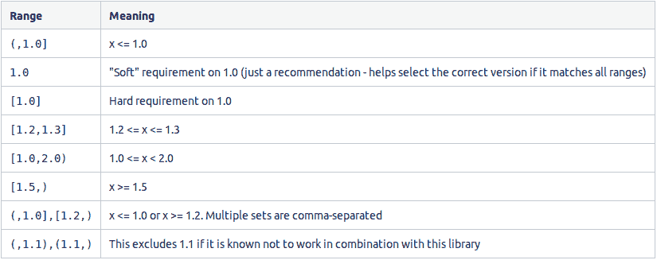
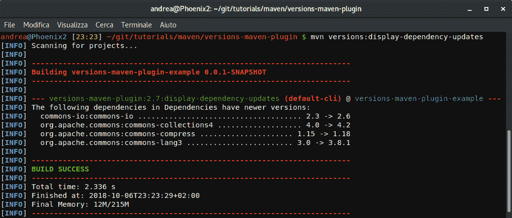
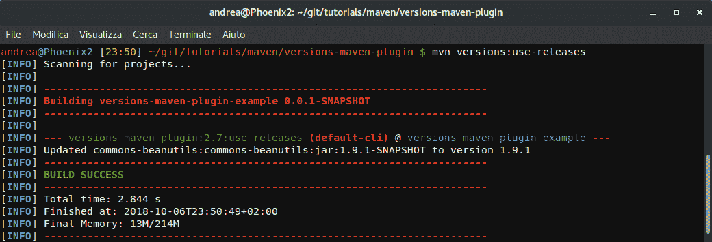
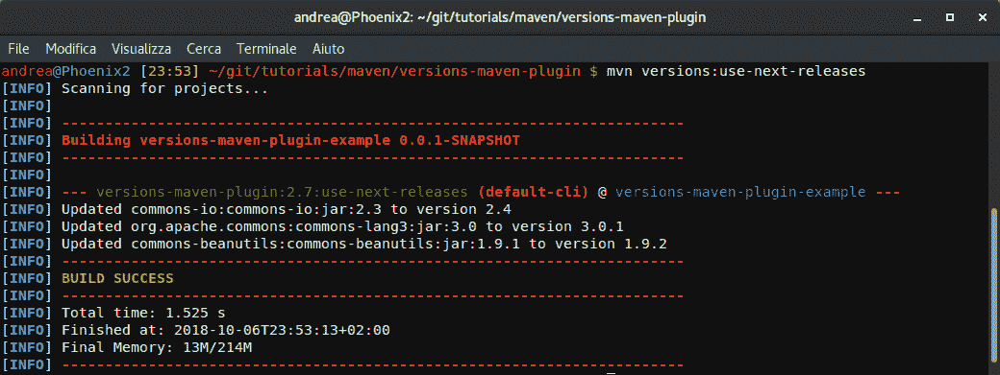
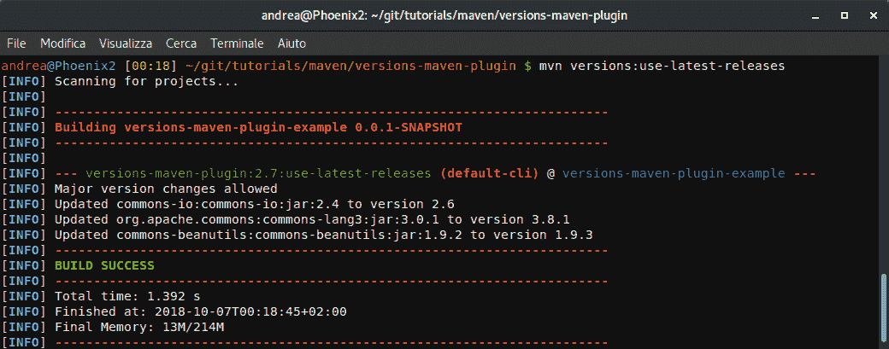

# 在 Maven 中使用最新版本的依赖项

> 原文：<https://web.archive.org/web/20220930061024/https://www.baeldung.com/maven-dependency-latest-version>

## **1。概述**

手动升级 Maven 依赖项一直是一项繁琐的工作，尤其是在有大量库频繁发布的项目中。

在本教程中，我们将学习**如何利用版本 Maven 插件来保持我们的依赖关系最新**。

最重要的是，这在实现持续集成管道时非常有用，这些管道可以自动升级依赖项，测试一切是否仍然正常工作，以及提交或回滚结果，无论哪种情况都是适当的。

## **2。Maven 版本范围语法**

回到 Maven2 时代，开发人员可以指定版本范围，在此范围内工件将被升级，而不需要人工干预。

这种语法仍然有效，在一些项目中使用，因此值得了解:

尽管如此，在可能的情况下，我们应该避免使用 Versions Maven 插件，因为从外部推进具体的版本无疑比让 Maven 自己处理整个操作给了我们更多的控制。

### **2.1。不推荐使用的语法**

Maven2 还提供了两个特殊的元版本值来实现这个结果:`LATEST`和`RELEASE`。

*最新*寻找最新的可能版本，而*发布*瞄准最新的非快照版本。

实际上，它们对于常规依赖关系解析仍然绝对**有效。**

但是，这种传统的升级方法导致了不可预测性，而 CI 需要再现性。因此，[插件依赖](https://web.archive.org/web/20220627184603/https://cwiki.apache.org/confluence/display/MAVEN/Maven+3.x+Compatibility+Notes#Maven3.xCompatibilityNotes-PluginMetaversionResolution)解决方案不赞成使用它们。

## **3。版本 Maven 插件**

版本 Maven 插件是当今处理版本管理的事实上的标准方式。

从远程存储库之间的高级比较到快照版本的低级时间戳锁定，其庞大的目标列表允许我们关注项目中涉及依赖关系的每个方面。

虽然其中许多超出了本教程的范围，但是让我们更仔细地看看在升级过程中对我们有帮助的那些。

### **3.1。测试用例**

在开始之前，让我们定义我们的测试用例:

*   带有硬编码版本的三个版本
*   一个带有属性版本的版本，以及
*   一张快照

[PRE0]

最后，让我们在定义插件时从过程中排除一个工件:

[PRE1]

## **4。显示可用更新**

首先，**为了简单地知道我们是否以及如何更新我们的项目，适合这项工作的工具是 [`versions:display-dependency-updates`](https://web.archive.org/web/20220627184603/https://www.mojohaus.org/versions-maven-plugin/display-dependency-updates-mojo.html)** :

[PRE2]

正如我们所看到的，**这个过程包括了每一个发布版本。它甚至包括`commons-collections4` ，因为配置中的排除是指更新过程，而不是发现过程。**

相比之下，它忽略了快照，原因是它是一个开发版本，自动更新通常不安全。

## **5。更新依赖关系**

第一次运行更新时，插件会创建一个名为`pom.xml.versionsBackup`的`pom.xml`的备份。

虽然每次迭代都会改变`pom.xml`，但是备份文件会保存项目的原始状态，直到用户提交(通过`mvn` )或者恢复(通过`mvn` )整个过程。

### **5.1。将快照转换为版本**

有时一个项目会包含一个快照(一个仍在大量开发中的版本)。

我们可以使用 [`versions:use-releases`](https://web.archive.org/web/20220627184603/https://www.mojohaus.org/versions-maven-plugin/use-releases-mojo.html) 来检查相应的新闻稿是否已经发布，甚至可以同时将我们的快照转换为该新闻稿:

[PRE3]

### 5.2。更新到下一版本

**我们可以用 [`versions:use-next-releases`](https://web.archive.org/web/20220627184603/https://www.mojohaus.org/versions-maven-plugin/use-next-releases-mojo.html) 将每个非快照依赖项移植到其最近的版本**:

[PRE4]

我们可以清楚地看到，插件将`commons-io`、`commons-lang3`，甚至不再是快照的`commons-beanutils`更新到了他们的下一个版本。

**最重要的是，它忽略了`c` `ommons-collections4`，它被排除在插件配置之外，还有`commons-compress`，它有一个通过属性动态指定的版本号。**

### 5.3。更新至最新版本

将每个非快照依赖项更新到其最新版本的工作方式相同，只需将目标更改为 [`versions:use-latest-releases`](https://web.archive.org/web/20220627184603/https://www.mojohaus.org/versions-maven-plugin/use-latest-releases-mojo.html) :

[PRE5]

## **6。过滤掉不想要的版本**

**如果我们想忽略某些版本，[插件配置可以调整为](https://web.archive.org/web/20220627184603/https://www.mojohaus.org/versions-maven-plugin/version-rules.html#Ignoring_certain_versions)** 从外部文件动态加载规则:

[PRE6]

最值得注意的是，`<rulesUri>`还可以引用一个本地文件:

[PRE7]

### **6.1。全局忽略版本**

我们可以配置我们的规则文件，使**忽略匹配特定正则表达式**的版本:

[PRE8]

### 6.2。基于每个规则忽略版本

最后，如果我们的需求更具体，我们可以建立一套规则:

[PRE9]

## **7。结论**

我们已经看到了如何以一种安全、自动且符合 Maven3 的方式检查和更新项目的依赖关系。

与往常一样，GitHub 上的[提供了源代码，还有一个脚本来帮助一步一步地展示一切，而且不复杂。](https://web.archive.org/web/20220627184603/https://github.com/eugenp/tutorials/tree/master/maven-modules/versions-maven-plugin)

要查看它的运行情况，只需下载项目并在终端中运行(如果使用 Windows，则在 Git Bash 中运行):

[PRE10]