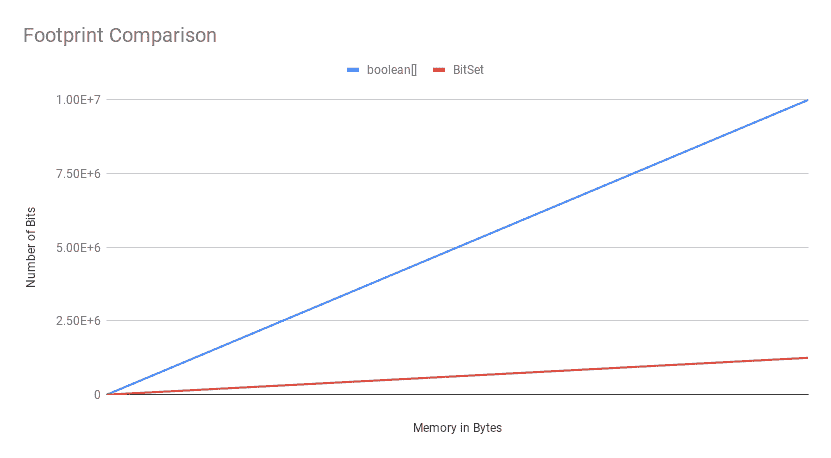
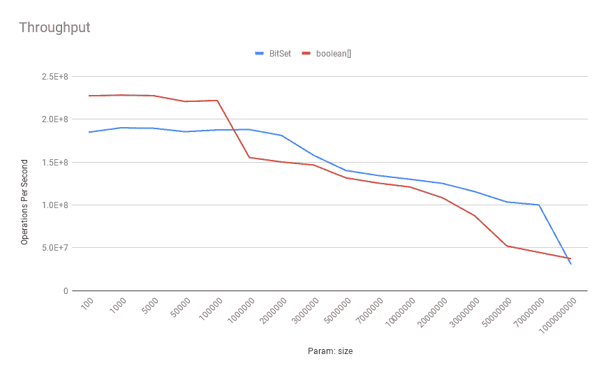
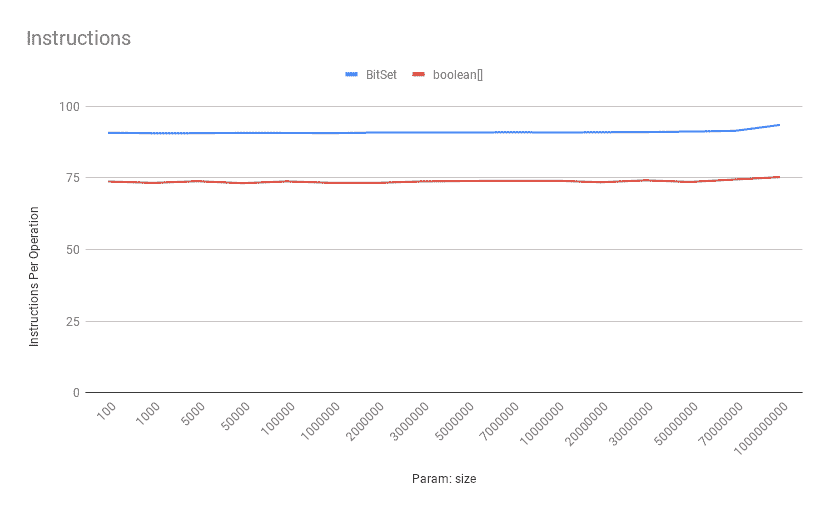
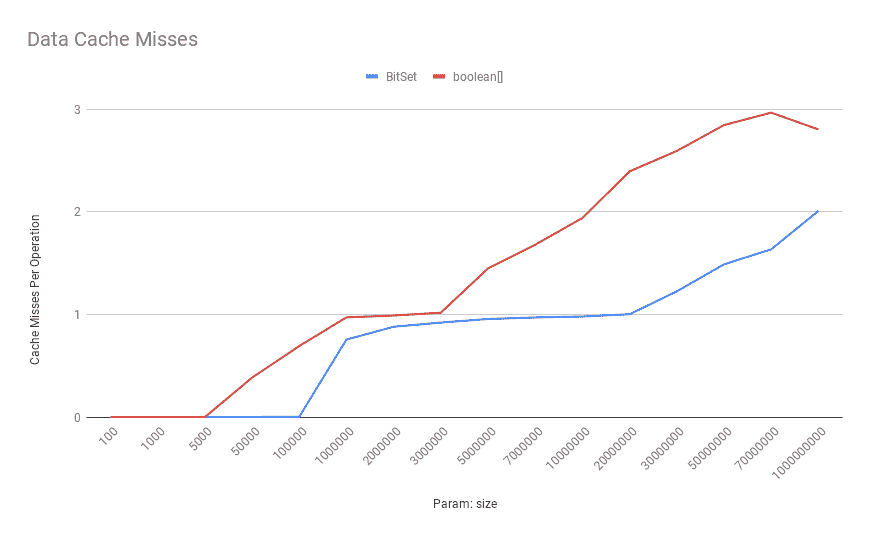
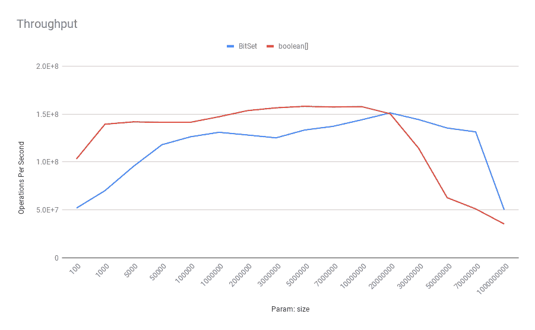
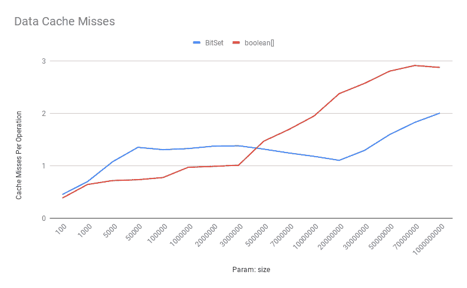
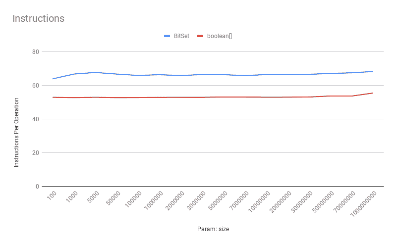
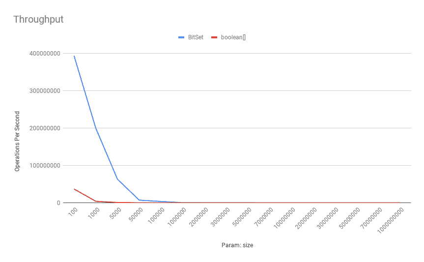
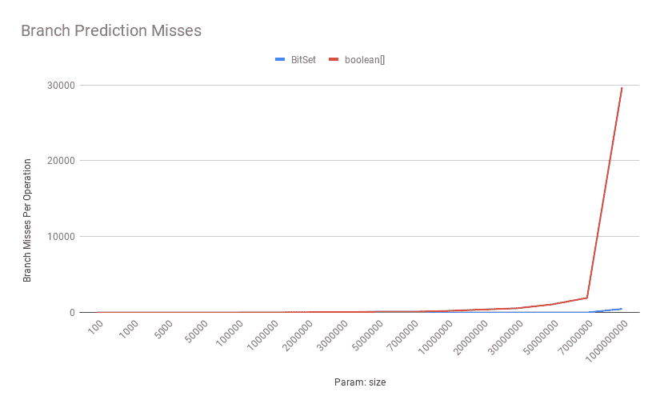

# 布尔[]与位集的性能比较

> 原文：<https://web.archive.org/web/20220930061024/https://www.baeldung.com/java-boolean-array-bitset-performance>

## 1.概观

在本文中，我们将比较 [`BitSet` s](/web/20220625224428/https://www.baeldung.com/java-bitset) 和`boolean[] `在不同场景下的性能。

我们通常很随意地使用术语“性能”,并考虑到不同的含义。因此，我们将从查看术语“性能”的各种定义开始。

然后，我们将使用两个不同的性能指标作为基准:内存占用和吞吐量。为了测试吞吐量，我们将比较位向量上的一些常见操作。

## 2.性能的定义

性能是一个非常笼统的术语，用来指代与“性能”相关的各种概念！

有时我们用这个术语来谈论一个特定应用程序的启动速度；也就是说，应用程序在能够响应其第一个请求之前所花费的时间。

除了启动速度，**当我们谈论性能**时，我们可能会想到内存使用。所以内存占用是这个术语的另一个方面。

**可以将“性能”解释为我们的代码工作有多“快”**。因此，延迟是另一个性能方面。

对于某些应用程序来说，了解每秒操作数的系统容量非常重要。**因此吞吐量可以是性能的另一个方面**。

一些应用程序只有在响应了几个请求并在技术上“预热”之后，才能以其最高的性能水平运行。因此， **t** **ime 达到巅峰的表现是另一个方面**。

可能的定义不胜枚举！然而，在本文中，我们将只关注两个性能指标: **m** **内存占用和吞吐量**。

## 3.内存占用

虽然我们可能期望*布尔*只消耗一位，但是`boolean[] `中的**每个`boolean `消耗[一个字节的内存](/web/20220625224428/https://www.baeldung.com/jvm-boolean-memory-layout)** 。这主要是为了避免[字撕裂和可访问性问题](/web/20220625224428/https://www.baeldung.com/jvm-boolean-memory-layout)。因此，如果我们需要一个位的向量，`boolean[] `将会有相当大的内存占用。

更具体地说，我们可以使用 [Java Object Layout (JOL)](https://web.archive.org/web/20220625224428/https://search.maven.org/artifact/org.openjdk.jol/jol-core) 来检查一个有 10，000 个元素的`boolean[] `的内存布局:

```
boolean[] ba = new boolean[10_000];
System.out.println(ClassLayout.parseInstance(ba).toPrintable());
```

这将打印内存布局:

```
[Z object internals:
 OFFSET  SIZE      TYPE DESCRIPTION               VALUE
      0     4           (object header)           01 00 00 00 (1)
      4     4           (object header)           00 00 00 00 (0)
      8     4           (object header)           05 00 00 f8 (-134217723)
     12     4           (object header)           10 27 00 00 (10000)
     16 10000   boolean [Z.                       N/A
Instance size: 10016 bytes
```

如上图所示，这个`boolean[] `消耗了大约 10 KB 的内存。

另一方面， **`BitSet `使用原始数据类型(特别是`long`)和[位操作](/web/20220625224428/https://www.baeldung.com/java-bitwise-operators)的组合来实现每个标志占用一位**。因此，与同样大小的`boolean[] `相比，10，000 位的`BitSet `将消耗更少的内存:

```
BitSet bitSet = new BitSet(10_000);
System.out.println(GraphLayout.parseInstance(bitSet).toPrintable());
```

类似地，这将打印出`BitSet`的内存布局:

```
[[email protected]](/web/20220625224428/https://www.baeldung.com/cdn-cgi/l/email-protection) object externals:
          ADDRESS       SIZE TYPE             PATH      
        76beb8190         24 java.util.BitSet           
        76beb81a8       1272 [J               .words 
```

和预期一样，同样位数的`BitSet `消耗 1 KB 左右，远小于`boolean[]`。

我们还可以比较不同位数的内存占用:

```
Path path = Paths.get("footprint.csv");
try (BufferedWriter stream = Files.newBufferedWriter(path, StandardOpenOption.CREATE)) {
    stream.write("bits,bool,bitset\n");

    for (int i = 0; i <= 10_000_000; i += 500) {
        System.out.println("Number of bits => " + i);

        boolean[] ba = new boolean[i];
        BitSet bitSet = new BitSet(i);

        long baSize = ClassLayout.parseInstance(ba).instanceSize();
        long bitSetSize = GraphLayout.parseInstance(bitSet).totalSize();

        stream.write((i + "," + baSize + "," + bitSetSize + "\n"));

        if (i % 10_000 == 0) {
            stream.flush();
        }
    }
}
```

上面的代码将计算两种不同长度的位向量的对象大小。然后，它将大小比较写入并刷新到一个 CSV 文件中。

现在，如果我们绘制这个 CSV 文件，我们会看到**内存占用的绝对差异随着位数的增加而增加**:

[](/web/20220625224428/https://www.baeldung.com/wp-content/uploads/2020/08/Footprint-Comparison.png)

**这里的关键是，`BitSet `在内存占用方面胜过`boolean[] `，除了最少的位数。**

## 4.吞吐量

为了相互比较`BitSet `和`boolean[] `的吞吐量，我们将基于三种不同但日常的位向量操作进行三项基准测试:

*   获取特定位的值
*   设置或清除特定位的值
*   计数设置位的数量

这是我们用来比较不同长度的位向量吞吐量的常用设置:

```
@State(Scope.Benchmark)
@BenchmarkMode(Mode.Throughput)
public class VectorOfBitsBenchmark {

    private boolean[] array;
    private BitSet bitSet;

    @Param({"100", "1000", "5000", "50000", "100000", "1000000", "2000000", "3000000",
      "5000000", "7000000", "10000000", "20000000", "30000000", "50000000", "70000000", "1000000000"})
    public int size;

    @Setup(Level.Trial)
    public void setUp() {
        array = new boolean[size];
        for (int i = 0; i < array.length; i++) {
            array[i] = ThreadLocalRandom.current().nextBoolean();
        }

        bitSet = new BitSet(size);
        for (int i = 0; i < size; i++) {
            bitSet.set(i, ThreadLocalRandom.current().nextBoolean());
        }
    }

    // omitted benchmarks
}
```

如上所示，我们正在创建长度在 100-1，000，000，000 范围内的`boolean[]`和`BitSet`。此外，在设置过程中设置一些位之后，我们将对`boolean[] `和`BitSet`执行不同的操作

### 4.1.变得有点

**乍一看，`boolean[] `中的直接内存访问似乎比在`BitSet` s (左移加一个`and `操作)中每`get`执行[两个位运算更高效。](/web/20220625224428/https://www.baeldung.com/java-bitset#internals)**另一方面，`BitSet`的内存紧凑性允许它们在一个高速缓存行中容纳更多的值。

让我们看看哪一个赢了！以下是 [JMH](/web/20220625224428/https://www.baeldung.com/java-microbenchmark-harness) 每次使用不同的`size `状态值运行的基准:

```
@Benchmark
public boolean getBoolArray() {
    return array[ThreadLocalRandom.current().nextInt(size)];
}

@Benchmark
public boolean getBitSet() {
    return bitSet.get(ThreadLocalRandom.current().nextInt(size));
}
```

### 4.2.获得一点:吞吐量

我们将使用以下命令运行基准测试:

```
$ java -jar jmh-1.0-SNAPSHOT.jar -f2 -t4 -prof perfnorm -rff get.csv getBitSet getBoolArray
```

**这将使用四个线程和两个分支运行 get 相关的基准测试，使用 Linux 上的 perf 工具分析它们的执行状态，并将结果输出到`bench-` `get.csv`文件**。`“-prof perfnorm” `将使用 Linux 上的 [perf](https://web.archive.org/web/20220625224428/https://perf.wiki.kernel.org/index.php/Main_Page) 工具对基准进行分析，并根据操作次数对性能计数器进行标准化。

由于命令结果非常冗长，我们将只在这里绘制它们。在此之前，让我们看看每个基准测试结果的基本结构:

```
"Benchmark","Mode","Threads","Samples","Score","Score Error (99.9%)","Unit","Param: size"
"getBitSet","thrpt",4,40,184790139.562014,2667066.521846,"ops/s",100
"getBitSet:L1-dcache-load-misses","thrpt",4,2,0.002467,NaN,"#/op",100
"getBitSet:L1-dcache-loads","thrpt",4,2,19.050243,NaN,"#/op",100
"getBitSet:L1-dcache-stores","thrpt",4,2,6.042285,NaN,"#/op",100
"getBitSet:L1-icache-load-misses","thrpt",4,2,0.002206,NaN,"#/op",100
"getBitSet:branch-misses","thrpt",4,2,0.000451,NaN,"#/op",100
"getBitSet:branches","thrpt",4,2,12.985709,NaN,"#/op",100
"getBitSet:dTLB-load-misses","thrpt",4,2,0.000194,NaN,"#/op",100
"getBitSet:dTLB-loads","thrpt",4,2,19.132320,NaN,"#/op",100
"getBitSet:dTLB-store-misses","thrpt",4,2,0.000034,NaN,"#/op",100
"getBitSet:dTLB-stores","thrpt",4,2,6.035930,NaN,"#/op",100
"getBitSet:iTLB-load-misses","thrpt",4,2,0.000246,NaN,"#/op",100
"getBitSet:iTLB-loads","thrpt",4,2,0.000417,NaN,"#/op",100
"getBitSet:instructions","thrpt",4,2,90.781944,NaN,"#/op",100
```

如上所示，结果是一个逗号分隔的字段列表，每个字段代表一个指标。例如，`“thrpt” `表示吞吐量，`“L1-dcache-load-misses” `是一级数据高速缓存的高速缓存未命中数，`“L1-icache-load-misses” `是一级指令高速缓存的高速缓存未命中数，`“instructions” `表示每个基准的 CPU 指令数。另外，最后一个字段表示位数，第一个字段表示基准方法名。

这是典型的 Digitial Ocean droplet 吞吐量的基准测试结果，采用 4 核英特尔至强 2.20 GHz CPU:

[](/web/20220625224428/https://www.baeldung.com/wp-content/uploads/2020/08/Throughput.png)

如上图所示，**`boolean[] `在较小的尺寸上有更好的吞吐量。当位数增加时，`BitSet `在吞吐量**方面优于`boolean[] `。更具体地说，在 100，000 位之后，`BitSet `显示出优越的性能。

### 4.3.获取一点:每个操作的指令

正如我们所料，`boolean[] `上的**get 操作在每个操作**中的指令更少:

[](/web/20220625224428/https://www.baeldung.com/wp-content/uploads/2020/08/Instructions.png)

### 4.4.获取位:数据缓存未命中

现在，让我们看看数据缓存未命中是如何寻找这些位向量的:

[](/web/20220625224428/https://www.baeldung.com/wp-content/uploads/2020/08/Data-Cache-Misses.png)

如上所示，`boolean[]`的数据缓存未命中次数随着位数的增加而增加。

**所以高速缓存未命中比在这里执行更多指令要昂贵得多**。因此，在这个场景中,`BitSet ` API 在大多数时候都优于`boolean[] `。

### 4.5.设置一点

为了比较 set 操作的吞吐量，我们将使用以下基准:

```
@Benchmark
public void setBoolArray() {
    int index = ThreadLocalRandom.current().nextInt(size);
    array[index] = true;
}

@Benchmark
public void setBitSet() {
    int index = ThreadLocalRandom.current().nextInt(size);
    bitSet.set(index);
}
```

基本上，我们选择一个随机的位索引，并将其设置为`true`。类似地，我们可以使用以下命令运行这些基准:

```
$ java -jar jmh-1.0-SNAPSHOT.jar -f2 -t4 -prof perfnorm -rff set.csv setBitSet setBoolArray
```

让我们看看这些操作在吞吐量方面的基准测试结果:

[](/web/20220625224428/https://www.baeldung.com/wp-content/uploads/2020/08/Throughput-3.png)

**这次`boolean[] `除了尺寸非常大的**之外，大部分时间都胜过`BitSet `。由于我们可以在缓存行中有更多的`BitSet `位，缓存未命中和[错误共享](/web/20220625224428/https://www.baeldung.com/java-false-sharing-contended)的影响在`BitSet `实例中会更加显著。

以下是数据缓存未命中比较:

[](/web/20220625224428/https://www.baeldung.com/wp-content/uploads/2020/08/Data-Cache-Misses-2.png)

如上所示，`boolean[] `的数据缓存未命中对于低到中等数量的位来说是相当低的。同样，当位数增加时，`boolean[] `会遇到更多的缓存未命中。

类似地，`boolean[] `的每次操作指令合理地少于`BitSet`:

[](/web/20220625224428/https://www.baeldung.com/wp-content/uploads/2020/08/Instructions-2.png)

### 4.6.基数

这种位向量中的另一个常见操作是计算置位位数。这次我们将运行这些基准测试:

```
@Benchmark
public int cardinalityBoolArray() {
    int sum = 0;
    for (boolean b : array) {
        if (b) sum++;
    }

    return sum;
}

@Benchmark
public int cardinalityBitSet() {
    return bitSet.cardinality();
}
```

同样，我们可以使用以下命令运行这些基准:

```
$ java -jar jmh-1.0-SNAPSHOT.jar -f2 -t4 -prof perfnorm -rff cardinal.csv cardinalityBitSet cardinalityBoolArray
```

以下是这些基准测试的吞吐量:

[](/web/20220625224428/https://www.baeldung.com/wp-content/uploads/2020/08/Throughput-4.png)

**就基数吞吐量而言，`BitSet ` API 几乎总是优于`boolean[] `，因为它的迭代次数少得多**。更具体地说，`BitSet `只需要迭代它的内部`long[] `，与相应的`boolean[]`相比，它的元素数量要少得多。

此外，由于我们的位向量中设置位的这条线和随机分布:

```
if (b) {
    sum++;
}
```

分支预测失误的成本也是决定性的:

[](/web/20220625224428/https://www.baeldung.com/wp-content/uploads/2020/08/Branch-Prediction-Misses.png)

如上所示，随着位数的增加，`boolean[] `的误预测数量也显著增加。

## 5.结论

在本文中，我们从三个常见操作的角度比较了`BitSet `和`boolean[]`的吞吐量:获取一个位、设置一个位和计算基数。除了吞吐量，我们看到`BitSet `比同样大小的`boolean[]`使用更少的内存。

概括地说，在单位读取量大的情况下，`boolean[]`在较小的尺寸上胜过`BitSet `。然而，当比特数增加时，`BitSet `具有更高的吞吐量。

此外，在单个位写入繁重的情况下，`boolean[] `几乎在所有时间都表现出出色的吞吐量，除了非常大量的位。同样，在批量读取场景中，`BitSet ` API 完全控制了`boolean[] `方法。

我们使用 JMH-性能集成来捕获低级 CPU 指标，如 L1 数据缓存未命中或未命中分支预测。从 Linux 2.6.31 开始， [perf](https://web.archive.org/web/20220625224428/https://github.com/torvalds/linux/tree/master/tools/perf) 是标准的 Linux 分析器，能够暴露有用的`Performance Monitoring Counters`或`PMCs. `，也可以单独使用这个工具。要查看这种独立使用的一些例子，强烈推荐阅读[布兰登·格雷戈](https://web.archive.org/web/20220625224428/http://www.brendangregg.com/perf.html)的博客。

像往常一样，所有的例子都可以在 GitHub 上找到[。此外，所有基准测试的 CSV 结果也可以在 GitHub](https://web.archive.org/web/20220625224428/https://github.com/eugenp/tutorials/tree/master/jmh) 上访问[。](https://web.archive.org/web/20220625224428/https://github.com/eugenp/tutorials/tree/master/jmh/src/main/resources/bitset)